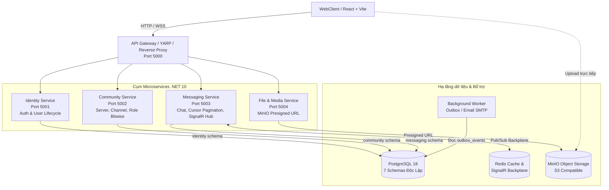

# SCDC - Nền tảng giao tiếp thời gian thực (Real-time Communication Platform)

[](https://dotnet.microsoft.com/)
[](https://www.postgresql.org/)
[](https://react.dev/)
[](https://dotnet.microsoft.com/apps/aspnet/signalr)
[](https://www.docker.com/)

**SCDC** là nền tảng giao tiếp thời gian thực (lấy cảm hứng từ Discord/Slack), hỗ trợ trò chuyện trực tiếp (DM), chat nhóm (Group Chat), không gian cộng đồng (Server/Guild & Channel), phân quyền ma trận Bitwise, tương tác tin nhắn, lưu trữ tệp phân tán và thoại/video thời gian thực.

Dự án được thiết kế theo chiến lược **Monolith First** (Martin Fowler): giai đoạn đầu phát triển dưới dạng **Modular Monolith** sạch trên **.NET 10** và chuẩn bị sẵn sàng bóc tách thành cụm **Microservices** phân tán độc lập định tuyến qua **API Gateway (YARP)**.

---

## 📌 Mục lục tài liệu

| Tài liệu | Mô tả |
|---|---|
| 📖 [Tổng quan kiến trúc (Overview)](docs/architecture/overview.md) | Tài liệu kiến trúc hệ thống, Bounded Context, luồng dữ liệu và lộ trình chuyển đổi Microservices. |
| 🛡️ [Đặc tả Identity v1](docs/identity/identity-v1.md) | Vòng đời tài khoản, JWT, Refresh Token Rotation chống reuse, Security Stamp và Session. |
| ⚠️ [Quy ước xử lý lỗi API](docs/api/error-handling.md) | Chuẩn hóa `Result<T>`, mã lỗi nghiệp vụ và RFC 7807 `ProblemDetails`. |
| 👥 [Phân công & Lộ trình nhóm](docs/team-task-allocation.md) | Bảng phân công 3 thành viên, mô hình Tam Giác Vàng, WBS và Git Workflow. |
| 🗄️ [Đặc tả CSDL PostgreSQL](database/postgres/README.md) | Thiết kế 7 Schema, danh sách bảng, view quan sát và seed data. |

---

## 🏛️ Kiến trúc tổng thể

### 1. Sơ đồ hệ thống



### 2. Nguyên tắc tổ chức mã nguồn (Modular Monolith $\rightarrow$ Microservices)

```text
services/
├── SCDC.Api                 # Composition Root (Host, Middleware, Swagger, YARP Gateway)
├── SCDC.BuildingBlocks      # Kiểu dùng chung (Result<T>, Error, IModuleDescriptor)
├── SCDC.Contracts           # Interfaces giao tiếp giữa các module (IUserDirectory, IChannelAccessChecker)
└── Modules/
    ├── Identity             # ĐÃ XONG V1: Quản lý tài khoản, JWT, Session, Password Lifecycle
    ├── Community            # Server, Channel, Category, Role Permissions Bitwise
    ├── Messaging            # Chat Engine, Cursor Pagination, Reactions, SignalR Hub
    └── FileStorage          # MinIO Presigned URL & Worker nén ảnh thumbnail
```

- **Quy tắc phụ thuộc:** Các module nghiệp vụ **không tham chiếu trực tiếp nhau** mà chỉ giao tiếp thông qua abstractions tại `SCDC.Contracts`.
- **Database Schema Ownership:** Mỗi module toàn quyền sở hữu schema tương ứng trong PostgreSQL (`identity`, `community`, `messaging`), không truy vấn chéo schema.

---

## 🚀 Trạng thái phát triển hiện tại

| Thành phần | Trạng thái | Chi tiết triển khai |
|---|:---:|---|
| **Hạ tầng & CSDL** | ✅ Hoàn thiện | Schema PostgreSQL 7 domain ([schema.sql](database/postgres/schema.sql)), Docker Compose, Seed data. |
| **Identity v1** | ✅ Hoàn thiện | Đăng ký, xác thực email, đăng nhập, JWT access token, Refresh Token Rotation chống reuse, logout mọi thiết bị, đổi/quên mật khẩu, lockout sau 5 lần sai. |
| **API Response & Error** | ✅ Hoàn thiện | `Result<T>`, RFC 7807 `ProblemDetails`, Global Exception Handler giấu stack trace. |
| **Community** | ⏳ Đang làm | Đã có schema DB và Foundation registration; đang triển khai Server/Channel/Role Bitwise. |
| **Messaging & Realtime** | ⏳ Đang làm | Đã có schema DB và Foundation registration; chuẩn bị triển khai Cursor Pagination & SignalR Hub. |
| **File Service (MinIO)** | 📋 Kế hoạch | Tạo Presigned URL upload trực tiếp, worker nén ảnh thumbnail. |
| **WebClient** | 🎨 UI Khung | Giao diện React hoàn chỉnh (phỏng theo Discord), đang đấu nối API Auth thật. |

---

## 💻 Cài đặt & Chạy ứng dụng

### Yêu cầu môi trường
- [.NET 10 SDK](https://dotnet.microsoft.com/download)
- [Docker](https://docs.docker.com/get-docker/) hoặc [Podman](https://podman.io/) (kèm Compose)
- [Node.js 20+](https://nodejs.org/) (nếu chạy WebClient độc lập)

### 1. Khởi chạy bằng Docker / Podman Compose (Khuyến nghị)

Chỉ với 1 câu lệnh để khởi động toàn bộ hệ thống gồm PostgreSQL, Backend API và React WebClient:

```bash
# Sử dụng Docker Compose
docker compose up -d --build

# Hoặc sử dụng Podman Compose
podman compose up -d --build
```

**Các cổng dịch vụ:**
- **Web Client (React):** `http://localhost:3000`
- **Backend API & Swagger:** `http://localhost:5026/swagger`
- **Health Check Endpoint:** `http://localhost:5026/api/v1/health`
- **PostgreSQL Database:** `localhost:5432` (Database: `scdc_chat`, User: `scdc`, Pass: `scdc_dev`)

---

### 2. Chạy Backend Local (Debug C#)

Nếu muốn chạy trực tiếp backend bằng .NET SDK:

```bash
# 1. Khởi động PostgreSQL trước
docker compose up -d postgres

# 2. Restore và Build solution
dotnet restore SCDC.slnx
dotnet build SCDC.slnx --no-restore

# 3. Chạy API host
dotnet run --project services/SCDC.Api/SCDC.Api.csproj --launch-profile http
```

API sẽ lắng nghe tại `http://localhost:5026`.

---

### 3. Chạy Kiểm thử (Tests)

Bộ kiểm thử tự động sử dụng xUnit:

```bash
dotnet test SCDC.slnx --configuration Release
```

*Lưu ý: Bộ test tích hợp `IdentityV1FlowTests` yêu cầu CSDL PostgreSQL đang chạy trên cổng 5432 để kiểm tra trọn vẹn luồng từ HTTP xuống CSDL thật.*

---

## 🗄️ Kết nối Cơ sở dữ liệu (DBeaver / DataGrip)

```text
Host:      localhost
Port:      5432
Database:  scdc_chat
Username:  scdc
Password:  scdc_dev
SSL Mode:  disable
```

Các Schema nghiệp vụ: `identity`, `community`, `messaging`, `moderation`, `audit`, `integration`, `common`.

---

## 👥 Đội ngũ phát triển (Nhóm 3 thành viên)

| Thành viên | Vai trò | Phạm vi phụ trách chính |
|---|---|---|
| **Member 1 (Lead)** | Cloud-Native & Core Lead | Kiến trúc hệ thống, Docker/K8s, CI/CD, Module Identity & Community, SignalR Core Hub. |
| **Member 2** | Performance & Data Specialist | Module Messaging (Chat Core), Thuật toán Cursor-based Pagination, Caching Redis, Benchmark k6. |
| **Member 3** | Frontend & Satellite Services | Toàn bộ React WebClient, MinIO File Service (Presigned URL), Voice LiveKit WebRTC, Outbox Email Worker. |

Chi tiết kế hoạch xem tại: [docs/team-task-allocation.md](docs/team-task-allocation.md).
