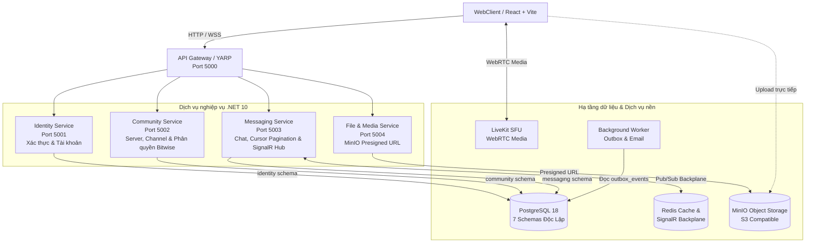

# SCDC - Nền tảng giao tiếp thời gian thực (Real-time Communication Platform)

[](https://dotnet.microsoft.com/)
[](https://www.postgresql.org/)
[](https://react.dev/)
[](https://dotnet.microsoft.com/apps/aspnet/signalr)
[](https://www.docker.com/)

SCDC là nền tảng giao tiếp thời gian thực hỗ trợ trò chuyện trực tiếp (DM 1-1), kênh cộng đồng (Server & Channel), phân quyền ma trận Bitwise RBAC, lưu trữ tệp phân tán và điều phối cuộc gọi thoại/video.

Hệ thống được xây dựng theo chiến lược **Monolith First**: Giai đoạn đầu vận hành dưới dạng **Modular Monolith** trên .NET 10 với các ranh giới module độc lập và schema CSDL PostgreSQL riêng biệt, sẵn sàng bóc tách thành cụm **Microservices** phân tán định tuyến qua **API Gateway (YARP)**.

---

## 1. Khởi chạy nhanh (Quickstart)

### Khởi chạy bằng Docker / Podman Compose

Chạy toàn bộ hệ thống gồm PostgreSQL 18, Backend API (.NET 10) và WebClient (React) với 1 câu lệnh:

```bash
docker compose up -d --build
```

**Các cổng dịch vụ:**
- **Web Client (React):** `http://localhost:3000`
- **Backend API & Swagger:** `http://localhost:5026/swagger`
- **Health Check Endpoint:** `http://localhost:5026/api/v1/health`
- **PostgreSQL Database:** `localhost:5432` (Database: `scdc_chat`, User: `scdc`, Password: `scdc_dev`)

### Khởi chạy Backend Local để Debug

```bash
# 1. Khởi động CSDL PostgreSQL
docker compose up -d postgres

# 2. Build solution
dotnet restore SCDC.slnx
dotnet build SCDC.slnx --no-restore

# 3. Khởi chạy Backend API
dotnet run --project services/SCDC.Api/SCDC.Api.csproj --launch-profile http
```

API sẽ lắng nghe tại `http://localhost:5026`.

### Kiểm thử tự động

```bash
dotnet test SCDC.slnx --configuration Release
```

---

## 2. Kiến trúc hệ thống


```mermaid
flowchart TD
    Client[WebClient / React + Vite]
    Gateway[API Gateway / YARP\nPort 5000]

    subgraph CoreServices[Dịch vụ nghiệp vụ .NET 10]
        Identity[Identity Service\nPort 5001\nXác thực & Tài khoản]
        Community[Community Service\nPort 5002\nServer, Channel & Phân quyền Bitwise]
        Messaging[Messaging Service\nPort 5003\nChat, Cursor Pagination & SignalR Hub]
        FileService[File & Media Service\nPort 5004\nMinIO Presigned URL]
    end

    subgraph Infrastructure[Hạ tầng dữ liệu & Dịch vụ nền]
        Postgres[(PostgreSQL 18\n7 Schemas Độc Lập)]
        Redis[(Redis Cache &\nSignalR Backplane)]
        MinIO[(MinIO Object Storage\nS3 Compatible)]
        LiveKit[LiveKit SFU\nWebRTC Media]
        Worker[Background Worker\nOutbox & Email]
    end

    Client -->|HTTP / WSS| Gateway
    Gateway --> Identity
    Gateway --> Community
    Gateway --> Messaging
    Gateway --> FileService

    Identity -->|identity schema| Postgres
    Community -->|community schema| Postgres
    Messaging -->|messaging schema| Postgres
    Messaging <-->|Pub/Sub Backplane| Redis
    FileService -->|Presigned URL| MinIO
    Client -.->|Upload trực tiếp| MinIO
    Client <-->|WebRTC Media| LiveKit
    Worker -->|Đọc outbox_events| Postgres
```

### Ranh giới Module nghiệp vụ

| Module | Schema CSDL | Trách nhiệm chính | Trạng thái hiện tại |
|---|---|---|:---:|
| **Identity** | `identity` | Tài khoản, JWT, Refresh Token rotation chống reuse, Session đa thiết bị, Account Lockout. | Hoàn thành v1 |
| **Community** | `community` | Quản lý Server, Channel, Category, Thành viên, Phân quyền ma trận Bitwise RBAC. | Đang hoàn thiện |
| **Messaging** | `messaging` | Chat DM 1-1, Channel chat, phân trang con trỏ (Cursor Pagination), chống trùng tin, SignalR Hub. | Đang hoàn thiện |
| **File Storage** | `messaging.attachments` | MinIO Presigned URL upload trực tiếp, worker nén ảnh thumbnail. | Kế hoạch |
| **Calls & Media** | `calls` | Điều phối phòng thoại, cuộc gọi và chia sẻ màn hình qua LiveKit SFU (WebRTC). | Kế hoạch |

---

## 3. Tài liệu kỹ thuật

Dự án duy trì các tài liệu kỹ thuật cốt lõi:

| Tài liệu | Nội dung chính |
|---|---|
| [Kiến trúc hệ thống](docs/architecture.md) | Thiết kế Modular Monolith sang Microservices, ranh giới dữ liệu, SignalR và thuật toán Cursor Pagination. |
| [Đặc tả CSDL PostgreSQL](database/postgres/README.md) | Cấu trúc 7 schema, views quan sát dữ liệu và kịch bản nạp dữ liệu mẫu (seed data). |
| [Hướng dẫn phát triển](docs/development.md) | Phân công trách nhiệm 3 thành viên, quy chuẩn code C#, xử lý lỗi `Result<T>` và quy trình Git. |
| [Hồ sơ lưu trữ dự án](docs/archive/project-specs/README.md) | Toàn bộ hồ sơ quy trình phát triển phần mềm (7 giai đoạn từ Khởi tạo đến Kiểm thử). |

---

## 4. Kết nối Cơ sở dữ liệu

```text
Host:      localhost
Port:      5432
Database:  scdc_chat
Username:  scdc
Password:  scdc_dev
SSL Mode:  disable
```

Các schema nghiệp vụ: `identity`, `community`, `messaging`, `moderation`, `audit`, `integration`, `common`.
