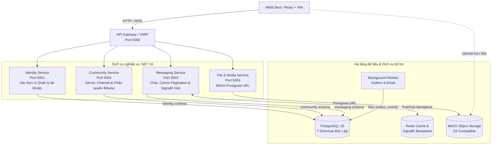

# SCDC - Nền tảng giao tiếp thời gian thực (Real-time Communication Platform)

[](https://dotnet.microsoft.com/)
[](https://www.postgresql.org/)
[](https://react.dev/)
[](https://dotnet.microsoft.com/apps/aspnet/signalr)
[](https://www.docker.com/)

SCDC là nền tảng giao tiếp thời gian thực hỗ trợ trò chuyện trực tiếp (DM 1-1), trò chuyện nhóm (Group Chat), không gian cộng đồng (Server & Channel), phân quyền ma trận Bitwise RBAC, lưu trữ tệp phân tán và điều phối thoại/video thời gian thực.

Hệ thống được thiết kế theo chiến lược **Monolith First**: Giai đoạn đầu phát triển dưới dạng **Modular Monolith** trên nền tảng .NET 10 với các ranh giới module độc lập và phân chia schema CSDL PostgreSQL riêng biệt, sẵn sàng bóc tách thành cụm **Microservices** phân tán định tuyến qua **API Gateway (YARP)**.

---

## 1. Mục lục tài liệu

| Tài liệu | Mô tả |
|---|---|
| [Danh mục tài liệu kỹ thuật](docs/README.md) | Cổng điều hướng tập trung toàn bộ tài liệu kỹ thuật, kiến trúc, API và vận hành. |
| [Tổng quan kiến trúc](docs/architecture/overview.md) | Mô hình hệ thống, Bounded Context, luồng dữ liệu và lộ trình chuyển đổi Microservices. |
| [Bản thiết kế luồng dịch vụ](docs/architecture/service-blueprint.md) | Đặc tả 16 phần chi tiết về luồng gọi giữa các dịch vụ, ranh giới dữ liệu và xử lý outbox. |
| [Đặc tả Module Identity](docs/modules/identity.md) | Vòng đời tài khoản, JWT, Refresh Token Rotation, Session đa thiết bị và Account Lockout. |
| [Quy ước xử lý lỗi API](docs/development/error-handling.md) | Chuẩn hóa mô hình `Result<T>`, mã lỗi nghiệp vụ và phản hồi RFC 7807 ProblemDetails. |
| [Phân công trách nhiệm nhóm](docs/development/team-allocation.md) | Ma trận phân công trách nhiệm 3 thành viên, kế hoạch công việc và lộ trình 5 tuần. |
| [Đặc tả CSDL PostgreSQL](database/postgres/README.md) | Thiết kế 7 Schemas độc lập, danh sách bảng, view quan sát và seed data. |
| [Hồ sơ quản lý dự án](docs/project/README.md) | Toàn bộ hồ sơ quy trình phát triển phần mềm chuẩn mực (7 giai đoạn từ Khởi tạo đến Kiểm thử). |

---

## 2. Kiến trúc tổng thể

### 2.1. Sơ đồ hệ thống


```mermaid
flowchart TD
    Client[WebClient / React + Vite]
    Gateway[API Gateway / YARP\nPort 5000]

    subgraph CoreServices[Dịch vụ nghiệp vụ .NET 10]
        Identity[Identity Service\nPort 5001\nXác thực & Quản lý tài khoản]
        Community[Community Service\nPort 5002\nServer, Channel & Phân quyền Bitwise]
        Messaging[Messaging Service\nPort 5003\nChat, Cursor Pagination & SignalR Hub]
        FileService[File & Media Service\nPort 5004\nMinIO Presigned URL]
    end

    subgraph Infrastructure[Hạ tầng dữ liệu & Dịch vụ bổ trợ]
        Postgres[(PostgreSQL 18\n7 Schemas Độc Lập)]
        Redis[(Redis Cache &\nSignalR Backplane)]
        MinIO[(MinIO Object Storage\nS3 Compatible)]
        OutboxWorker[Background Worker\nOutbox & Email]
    end

    Client -->|HTTP / WSS| Gateway
    Gateway --> Identity
    Gateway --> Community
    Gateway --> Messaging
    Gateway --> FileService

    Identity -->|identity schema| Postgres
    Community -->|community schema| Postgres
    Messaging -->|messaging schema| Postgres
    Messaging <-->|Pub/Sub Backplane| Redis
    FileService -->|Presigned URL| MinIO
    Client -.->|Upload trực tiếp| MinIO
    OutboxWorker -->|Đọc outbox_events| Postgres
```

### 2.2. Tổ chức mã nguồn (Modular Monolith sang Microservices)

```text
services/
├── SCDC.Api                 # Composition Root (Host, Middleware, Swagger, YARP Gateway)
├── SCDC.BuildingBlocks      # Kiểu dữ liệu dùng chung (Result<T>, Error, IModuleDescriptor)
├── SCDC.Contracts           # Interfaces giao tiếp giữa các module (IUserDirectory, IChannelAccessChecker)
└── Modules/
    ├── Identity             # Đã hoàn thành v1: Quản lý tài khoản, JWT, Session, Password Lifecycle
    ├── Community            # Server, Channel, Category, Phân quyền Bitwise RBAC
    ├── Messaging            # Chat Engine, Cursor Pagination, Reactions, SignalR Hub
    └── FileStorage          # MinIO Presigned URL & Worker nén ảnh thumbnail
```

- **Quy tắc phụ thuộc:** Các module nghiệp vụ tuyệt đối không tham chiếu trực tiếp nhau, chỉ giao tiếp thông qua abstractions tại `SCDC.Contracts`.
- **Quyền sở hữu dữ liệu:** Mỗi module toàn quyền sở hữu schema tương ứng trong PostgreSQL (`identity`, `community`, `messaging`), không truy vấn chéo schema.

---

## 3. Trạng thái phát triển hiện tại

| Thành phần | Trạng thái | Chi tiết triển khai |
|---|:---:|---|
| **Hạ tầng & CSDL** | Hoàn thiện | Schema PostgreSQL 7 domain ([schema.sql](database/postgres/schema.sql)), Docker Compose, Seed data. |
| **Identity v1** | Hoàn thiện | Đăng ký, xác thực email, đăng nhập, JWT access token, Refresh Token Rotation chống reuse, logout mọi thiết bị, đổi/quên mật khẩu, lockout sau 5 lần sai. |
| **Phản hồi API & Lỗi** | Hoàn thiện | `Result<T>`, RFC 7807 `ProblemDetails`, Global Exception Handler giấu stack trace. |
| **Community** | Đang thực hiện | Đã có schema DB và Foundation registration; đang triển khai Server/Channel/Role Bitwise. |
| **Messaging & Realtime** | Đang thực hiện | Đã có schema DB và Foundation registration; đang triển khai Cursor Pagination & SignalR Hub. |
| **File Service (MinIO)** | Kế hoạch | Tạo Presigned URL upload trực tiếp, worker nén ảnh thumbnail. |
| **WebClient** | Khung giao diện | Giao diện React hoàn chỉnh, đang kết nối API Auth thật và chuẩn bị chat realtime. |

---

## 4. Cài đặt và Khởi chạy ứng dụng

### 4.1. Yêu cầu môi trường
- [.NET 10 SDK](https://dotnet.microsoft.com/download)
- [Docker](https://docs.docker.com/get-docker/) hoặc [Podman](https://podman.io/) (kèm Compose)
- [Node.js 20+](https://nodejs.org/) (nếu chạy WebClient độc lập)

### 4.2. Khởi chạy bằng Docker / Podman Compose

Khởi động toàn bộ hệ thống gồm PostgreSQL, Backend API và React WebClient:

```bash
# Sử dụng Docker Compose
docker compose up -d --build

# Hoặc sử dụng Podman Compose
podman compose up -d --build
```

**Các cổng dịch vụ mặc định:**
- **Web Client (React):** `http://localhost:3000`
- **Backend API & Swagger:** `http://localhost:5026/swagger`
- **Health Check Endpoint:** `http://localhost:5026/api/v1/health`
- **PostgreSQL Database:** `localhost:5432` (Database: `scdc_chat`, User: `scdc`, Password: `scdc_dev`)

### 4.3. Khởi chạy Backend Local để Debug

```bash
# 1. Khởi động PostgreSQL
docker compose up -d postgres

# 2. Khôi phục dependencies và build solution
dotnet restore SCDC.slnx
dotnet build SCDC.slnx --no-restore

# 3. Chạy API host
dotnet run --project services/SCDC.Api/SCDC.Api.csproj --launch-profile http
```

API sẽ lắng nghe tại `http://localhost:5026`.

### 4.4. Kiểm thử tự động (Tests)

Thực thi bộ kiểm thử tự động với xUnit:

```bash
dotnet test SCDC.slnx --configuration Release
```

*Lưu ý: Bộ kiểm thử tích hợp `IdentityV1FlowTests` yêu cầu PostgreSQL đang chạy trên cổng 5432.*

---

## 5. Kết nối Cơ sở dữ liệu

```text
Host:      localhost
Port:      5432
Database:  scdc_chat
Username:  scdc
Password:  scdc_dev
SSL Mode:  disable
```

Các Schema nghiệp vụ: `identity`, `community`, `messaging`, `moderation`, `audit`, `integration`, `common`.

---

## 6. Đội ngũ phát triển

| Thành viên | Vai trò | Phạm vi phụ trách chính |
|---|---|---|
| **Thành viên 1** | Trưởng nhóm & Kỹ sư Cloud/DevOps | Kiến trúc hệ thống, Docker/K8s, CI/CD, Module Identity & Community, SignalR Core Hub. |
| **Thành viên 2** | Kỹ sư Backend & Hiệu năng | Module Messaging (Chat Core), Thuật toán Cursor-based Pagination, Caching Redis, Benchmark k6. |
| **Thành viên 3** | Kỹ sư Frontend & Dịch vụ vệ tinh | Toàn bộ React WebClient, MinIO File Service (Presigned URL), Voice LiveKit WebRTC, Outbox Email Worker. |

Chi tiết kế hoạch xem tại: [docs/development/team-allocation.md](docs/development/team-allocation.md).
