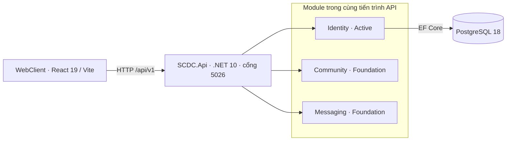
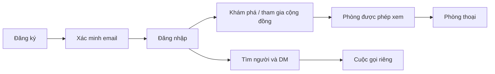

# SCDC — Kiến trúc và quy ước tích hợp

Cập nhật: 2026-10-04. MVP dùng Modular Monolith theo DEC-060. Các quyết định sản phẩm được quản lý ở decisions.md.

Kiến trúc hiện tại được đối chiếu từ source và compose.yaml. REST/SignalR và quy ước ID/cursor cho DM đã chọn DEC-081; phân quyền/media còn thiết kế cần kiểm chứng; microservices thuộc đợt sau.

## Mục lục

- [Hệ thống hiện tại](#current)
- [Ranh giới module và dữ liệu](#boundaries)
- [Hợp đồng và lỗi chung](#contracts)
- [Hành trình xuyên tính năng](#journeys)
- [Định hướng đợt sau](#future)
- [Điều kiện rà soát](#review)

<a id="current"></a>

## 1. Hệ thống hiện tại



Compose hiện có ba service: `web-client` (cổng 3000), `chat-service` (5026) và `postgres` (5432). Không có Gateway, Redis, MinIO, LiveKit hoặc worker đang chạy trong compose.

`SCDC.Api` đăng ký ba module và map controllers. Identity có endpoint và implementation. Community/Messaging đăng ký mô tả module; chưa có API nghiệp vụ hoặc SignalR Hub. Giao diện chat/cộng đồng có dữ liệu mẫu, không chứng minh backend các tính năng đã hoạt động.

Nguồn đối chiếu: [Program.cs](../services/SCDC.Api/Program.cs), [compose.yaml](../compose.yaml), [package.json](../clients/WebClient/package.json), [CommunityModule](../services/Modules/Community/CommunityModule.cs), [MessagingModule](../services/Modules/Messaging/MessagingModule.cs).

Health endpoint `/api/v1/health` trả trạng thái module và thời điểm; hiện không truy vấn DB, nên không dùng riêng endpoint này làm bằng chứng database hoặc toàn bộ hành trình đã sẵn sàng.

<a id="boundaries"></a>

## 2. Ranh giới module và dữ liệu

| Thành phần | Trách nhiệm | Dữ liệu / hợp đồng | Tình trạng |
|---|---|---|---|
| Identity | Tài khoản, mật khẩu, xác minh, phiên, hồ sơ | `identity`; `IUserDirectory` | Có implementation và test tự động |
| Community | Cộng đồng, thành viên, phòng, lời mời và quyền | `community`; `IChannelAccessChecker` | Nền module; thuật toán quyền trong đặc tả Community |
| Messaging | DM, tin phòng, lịch sử, thử lại và cập nhật | `messaging`; `IRealtimeAccessRevoker` | Nền module; hợp đồng DM đề xuất |
| WebClient | Giao diện, điều hướng và trạng thái phiên | `clients/WebClient`; Identity gọi API thật, phần chat dùng dữ liệu mẫu | Có code frontend; cần tích hợp các tính năng còn lại |
| PostgreSQL | Lưu trữ nghiệp vụ | `identity`, `community`, `messaging`, `moderation`, `audit`, `integration`, `common` | Có schema/seed; có bảng không đồng nghĩa đã có tính năng |

Mỗi module sở hữu dữ liệu của mình; giao tiếp qua interfaces trong `SCDC.Contracts`, không tham chiếu trực tiếp implementation của module khác. Mã ứng dụng không đọc/JOIN bảng của module khác. Các view quan sát trong SQL phục vụ kiểm tra dữ liệu và không thay thế hợp đồng nghiệp vụ.

Identity có `IdentityDbContext`; không mô tả Community/Messaging như đã có DbContext hoặc implementation chưa tồn tại. Các interface `IMessagingService`, `IFileStorageService`, `ICallCoordinator`, `IOutboxDispatcher` trong docs cũ là định hướng, chưa phải hợp đồng đã tồn tại trong source.

Schema SQL: [schema.sql](../database/postgres/schema.sql). Dữ liệu mẫu: [seed.sql](../database/postgres/seed.sql). Mô hình và ràng buộc logic của DM nằm trong [đặc tả DM](features/direct-messaging.md#contracts); quyền xem và thứ tự vai trò/cá nhân nằm trong [đặc tả Community](features/community.md#permissions).

Identity hiện ghi sự kiện outbox vào `integration.outbox_events`. Chưa có worker gửi email trong repo; payload tham chiếu token đã băm chưa tự đủ để dựng lại liên kết email. Cần hoàn thiện cơ chế cung cấp liên kết cho worker trước phát hành. [Đối chiếu Identity](features/accounts.md#implementation-review) ghi các chênh lệch source và coverage test ngày 2026-10-04; đặc biệt chưa cấp token reset cho tài khoản chưa xác minh dù yêu cầu cho phép.

<a id="contracts"></a>

## 3. Hợp đồng và lỗi chung

API hiện tại dùng prefix `/api/v1`. ID dùng định danh ổn định; actor lấy từ phiên xác thực. Thời điểm truyền theo UTC. Hợp đồng DM đề xuất truyền `sequence`/`version` dưới dạng chuỗi số nguyên để client xử lý chính xác.

Theo DEC-061, lỗi dùng `application/problem+json` với các trường `type`, `title`, `status`, `detail`, `instance`, `errorCode`, `traceId`; lỗi validation có thêm `errors`. Các trường mở rộng xuất hiện ở cấp ngoài cùng, không nằm trong object `extensions`.

```json
{
  "type": "https://scdc.dev/problems/validation",
  "title": "Validation failed.",
  "status": 400,
  "detail": "One or more validation errors occurred.",
  "instance": "/api/v1/auth/register",
  "errorCode": "Common.ValidationFailed",
  "traceId": "example-trace-id",
  "errors": { "username": ["Username is required."] }
}
```

| HTTP | Ý nghĩa và cách dùng |
|---|---|
| 400 | Validation đầu vào theo `ErrorType.Validation` hiện tại |
| 401 | Thiếu hoặc không còn phiên hợp lệ; cần xác thực lại |
| 403 | Không đủ quyền/điều kiện cho thao tác được phép biết |
| 404 | Không tồn tại; hợp đồng DM đề xuất cũng dùng cho tài nguyên người gọi không được biết |
| 409 | Xung đột dữ liệu, phiên bản hoặc khóa thao tác |
| 429 | Vượt giới hạn / bị khóa tạm; chi tiết retry của endpoint tương lai cần đặc tả |
| 503 | Phụ thuộc tạm không đáp ứng |

Hợp đồng đề xuất DM áp dụng cùng ánh xạ validation 400 này; các mã lỗi DM còn cần rà soát trước triển khai. Client xử lý theo `errorCode` và `errors`, không phụ thuộc câu chữ `detail`. Không đưa stack trace, mật khẩu, token hoặc nội dung chat vào response lỗi hay log.

OpenAPI cho endpoint đã triển khai được sinh từ source: `/swagger/v1/swagger.json` trong môi trường Development; UI tại `/swagger`. Hợp đồng tương lai vẫn được đánh dấu đề xuất trong đặc tả tính năng, chưa coi là endpoint có thể gọi. Thay đổi schema phải cập nhật frontend, backend, mock, docs và dữ liệu thử liên quan.

Nguồn: [ApiProblemDetails](../services/SCDC.Api/Errors/ApiProblemDetails.cs), [ApiErrorMapper](../services/SCDC.Api/Errors/ApiErrorMapper.cs), [ApiErrorDefaults](../services/SCDC.Api/Errors/ApiErrorDefaults.cs).

<a id="journeys"></a>

## 4. Hành trình xuyên tính năng



Sơ đồ thể hiện phạm vi sản phẩm, gồm các tính năng chưa triển khai. Luồng tài khoản hiện có code; DM/cộng đồng/media đọc chi tiết trong đặc tả tương ứng. Quyền được kiểm tra phía máy chủ khi đọc, ghi và nhận cập nhật; thay đổi quyền/phiên phải có cơ chế thu hồi kết nối, không chỉ ẩn giao diện.

Gửi tin phải lưu bền trước khi hiển thị “Đã gửi”. Realtime bổ sung thông báo cho người đang online; lịch sử đã lưu là nguồn khôi phục khi mở lại. Ràng buộc transaction, idempotency, commit order và reconnect được quản lý tập trung trong [đặc tả DM](features/direct-messaging.md#contracts).

<a id="future"></a>

## 5. Định hướng đợt sau

Theo DEC-060, MVP không bắt buộc có Gateway hoặc dịch vụ độc lập. Việc tách module thành microservices cần quyết định riêng về thời điểm, tải, công sức và vận hành.

| Phương án từng được nêu | Tình trạng |
|---|---|
| YARP Gateway, gRPC/HTTP và RabbitMQ | Định hướng tách dịch vụ; chưa có triển khai hoặc lịch được xác nhận |
| SignalR | Đã chọn cho DM/tin phòng theo DEC-081; chưa có Hub trong backend hiện tại |
| Redis Backplane | Dành cho scale-out khi có quyết định; không cần tự đưa Redis vào MVP một API instance |
| MinIO / presigned upload | Phương án file ở đợt sau; chưa có lựa chọn triển khai được duyệt |
| LiveKit SFU tự host | Đã chọn DEC-084; cần admission/thu hồi token và thử nghiệm; chưa có service/manifest |
| Kubernetes và k6 | Công cụ từng được đề xuất; chưa có manifest hoặc kịch bản tải trong repo |

Không dùng cổng 5000–5004 hoặc các schema `files`/`calls` trong sơ đồ hiện tại như hạ tầng đã tồn tại. LiveKit tự host và giới hạn media đã chọn DEC-079/084; admission, chi phí và chất lượng vẫn cần thử nghiệm. Mở rộng ngang và ngưỡng hiệu năng phải có phép đo cụ thể.

<a id="review"></a>

## 6. Điều kiện rà soát kỹ thuật

Vg/Sáng rà soát ranh giới module, quyền sở hữu dữ liệu, hợp đồng, giao dịch, thu hồi phiên/quyền và cách quan sát. Thái đối chiếu trạng thái UI với lỗi API và ca kiểm thử. Những lựa chọn chưa chốt tiếp tục thuộc OQ-008.

Một gói được bàn giao khi có hành vi rõ, thiết kế thống nhất, người phụ trách và phương pháp kiểm chứng. Các bằng chứng cần có được quản lý tại [bảng sẵn sàng](project.md#readiness). Thiết kế DM có thể tiến hành độc lập với việc thử nghiệm tích hợp media còn thiếu.
