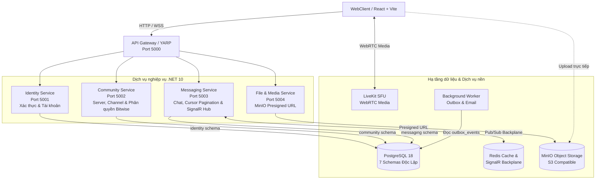

# Kiến trúc hệ thống SCDC

Tài liệu này mô tả thiết kế kiến trúc tổng thể, ranh giới các module nghiệp vụ, luồng dữ liệu và cơ chế thời gian thực của nền tảng giao tiếp SCDC.

---

## 1. Chiến lược kiến trúc: Monolith First

Hệ thống áp dụng chiến lược **Monolith First** (Martin Fowler) để tối ưu hóa tốc độ phát triển và kiểm soát ranh giới nghiệp vụ:

- **Giai đoạn 1 (Modular Monolith):** Toàn bộ nghiệp vụ được đóng gói trong cùng một giải pháp phần mềm trên nền tảng .NET 10. Các domain được tách biệt thành các Class Library riêng biệt (`SCDC.Identity`, `SCDC.Community`, `SCDC.Messaging`), sở hữu schema CSDL độc lập trong PostgreSQL và chỉ giao tiếp với nhau qua abstractions tại `SCDC.Contracts`. Toàn bộ chạy chung trong một tiến trình host tại `SCDC.Api` (cổng 5026).
- **Giai đoạn 2 (Microservices Migration):** Bóc tách các module thành các dịch vụ phân tán độc lập (chạy trên các cổng riêng biệt 5001–5004), định tuyến qua API Gateway (YARP), giao tiếp liên dịch vụ qua gRPC/HTTP và xử lý sự kiện qua RabbitMQ / Transactional Outbox.

---

## 2. Sơ đồ kiến trúc hệ thống



---

## 3. Ranh giới Module và Phân quyền Cơ sở dữ liệu

Nguyên tắc bắt buộc: Mỗi module toàn quyền sở hữu schema tương ứng trong PostgreSQL. Tuyệt đối không cho phép truy vấn trực tiếp (`JOIN` hoặc `SELECT`) xuyên schema từ mã nguồn ứng dụng. Mọi tương tác phải thông qua các interface tại `SCDC.Contracts`.

| Module | Schema CSDL | Trách nhiệm chính | Giao diện nội bộ (`SCDC.Contracts`) |
|---|---|---|---|
| **Identity** | `identity` | Quản lý tài khoản, hồ sơ, mật khẩu, JWT, Refresh Token rotation, đa phiên (Session), lockout sau 5 lần sai. | `IUserDirectory` |
| **Community** | `community` | Quản lý Server, Channel, Category, Thành viên, Lời mời và ma trận phân quyền Bitwise RBAC. | `IChannelAccessChecker` |
| **Messaging** | `messaging` | Lõi trò chuyện (DM 1-1, Channel chat), phân trang Cursor-based Pagination, SignalR Hub, Reaction, Pin. | `IMessagingService` |
| **File Storage** | `messaging.attachments` / `files` | Cấp MinIO Presigned URL cho client upload trực tiếp, worker nén ảnh và tạo thumbnail. | `IFileStorageService` |
| **Calls & Media** | `calls` | Điều phối phòng thoại, cuộc gọi 1-1, cấp LiveKit Room Token cho kết nối WebRTC. | `ICallCoordinator` |
| **Integration** | `integration` | Quản lý sự kiện bất đồng bộ qua Transactional Outbox và Inbox Idempotency. | `IOutboxDispatcher` |

---

## 4. Các giải pháp kỹ thuật cốt lõi

### 4.1. Phân quyền ma trận Bitwise RBAC (Community)
Quyền trong máy chủ cộng đồng được mã hóa dưới dạng mặt nạ bit 64-bit (`long`).
- **Chủ sở hữu (Server Owner):** Toàn quyền tuyệt đối trên mọi kênh.
- **Quyền theo vai trò (Role Permissions):** Hợp (`OR`) các bit quyền của các vai trò mà người dùng đang nắm giữ.
- **Ghi đè theo kênh (Channel Overrides):** Áp dụng quyền từ chối (`DENY`) trước, sau đó áp dụng quyền cho phép (`ALLOW`) theo vai trò hoặc theo từng cá nhân cụ thể.

### 4.2. Phân trang con trỏ (Cursor-based Pagination trong Messaging)
Thay vì sử dụng `OFFSET / LIMIT` truyền thống (gây chậm dần khi bảng tin nhắn đạt hàng triệu bản ghi), hệ thống sử dụng con trỏ cặp `(sequence_no, id)` kết hợp Composite Index:

```sql
SELECT id, space_id, sender_id, content, sequence_no, created_at
FROM messaging.messages
WHERE space_id = @spaceId
  AND sequence_no < @cursorSequenceNo
ORDER BY sequence_no DESC
LIMIT @limit;
```
- Độ trễ truy vấn ổn định dưới 10ms bất kể số lượng dữ liệu trong CSDL.
- Không bị nhảy tin nhắn hoặc sót tin khi có tin mới gửi vào trong lúc người dùng đang cuộn màn hình.

### 4.3. Chống trùng lặp tin nhắn (Idempotency)
Client tự sinh `clientMessageId` (UUID v4) khi gửi tin nhắn. Bảng `messaging.messages` có ràng buộc duy nhất trên cặp `(space_id, client_message_id)`. Nếu xảy ra mất mạng khiến client gửi lại yêu cầu, server sẽ nhận diện được khóa trùng và trả về tin nhắn cũ mà không nhân đôi dữ liệu.

### 4.4. Cơ chế thời gian thực (SignalR Hub & Redis Backplane)
- **Endpoint:** `/hubs/chat`
- **Xác thực:** Bearer Token truyền qua query parameter `access_token` khi bắt tay WebSocket.
- **Phân vùng phòng:** Mỗi hội thoại hoặc kênh tương ứng với một `spaceId`. Client tham gia lắng nghe thông qua phương thức `JoinSpace(spaceId)`. Server phát tin nhắn đến nhóm bằng `Clients.Group(spaceId).SendAsync("ReceiveMessage", message)`.
- **Mở rộng ngang:** Tích hợp Redis Backplane (`AddStackExchangeRedis`) cho phép nhiều node server đồng bộ các sự kiện realtime mà không bị giới hạn trên một máy vật lý.
