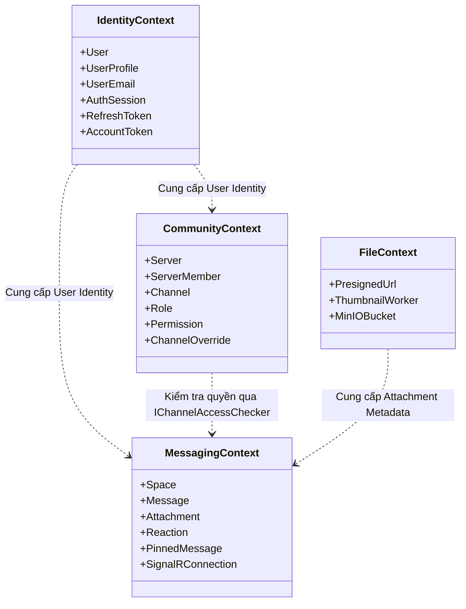
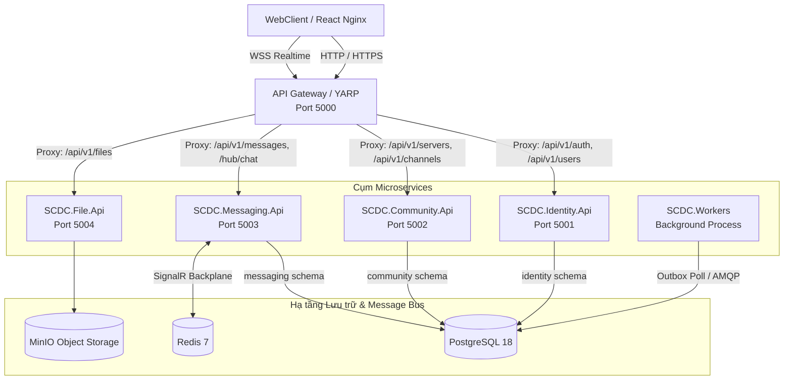
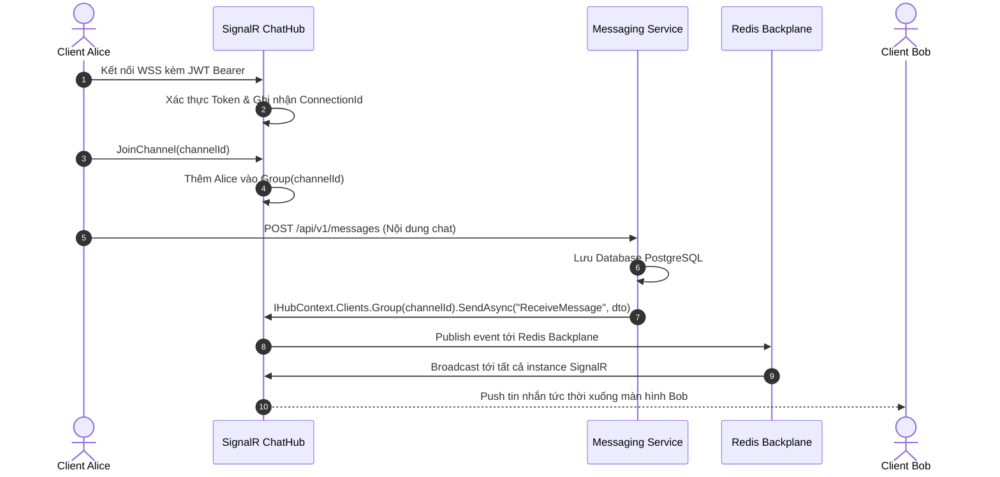
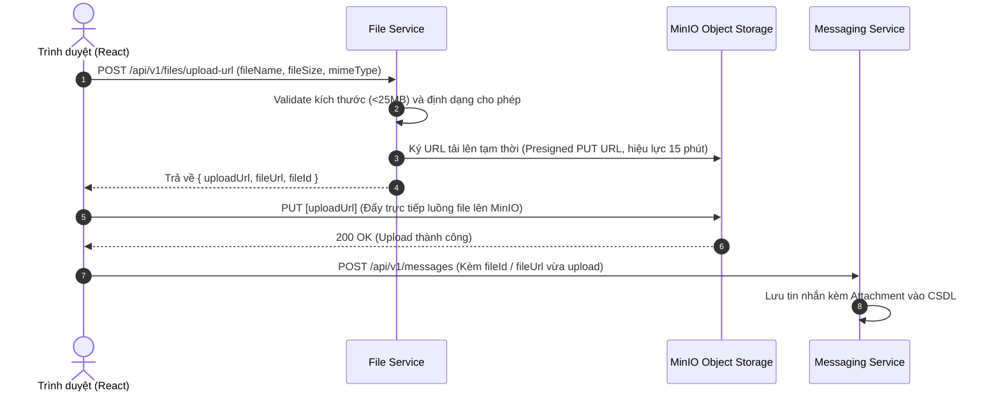

# Tổng quan & Thiết kế Kiến trúc Hệ thống SCDC

Tài liệu này mô tả chi tiết tầm nhìn sản phẩm, nguyên lý kiến trúc, ranh giới miền nghiệp vụ (Bounded Contexts), thiết kế dữ liệu, luồng xử lý và lộ trình chuyển đổi từ **Modular Monolith** sang **Microservices** của nền tảng **SCDC**.

---

## 1. Tổng quan sản phẩm

**SCDC** là một nền tảng giao tiếp thời gian thực (Real-time Communication Platform) đa nền tảng, lấy cảm hứng từ Discord và Slack, phục vụ nhu cầu trao đổi thông tin, xây dựng cộng đồng và làm việc nhóm.

### Các năng lực nghiệp vụ cốt lõi:
- **Xác thực & Danh tính (Identity):** Đăng ký, xác thực email, đăng nhập bảo mật với JWT, quản lý phiên đăng nhập đa thiết bị, cơ chế xoay vòng Refresh Token chống chiếm đoạt phiên, tự động khóa tài khoản khi đăng nhập sai nhiều lần.
- **Không gian Cộng đồng (Community):** Mô hình Server/Guild, phân loại kênh (Text Channel, Voice Channel, Category), hệ thống phân quyền ma trận Bitwise (Role Permissions) và cơ chế ghi đè quyền linh hoạt theo kênh (Channel Overrides).
- **Hệ thống Tin nhắn (Messaging):** Nhắn tin trực tiếp (DM 1-1), trò chuyện nhóm (Group Chat) và trò chuyện trong kênh cộng đồng. Hỗ trợ đầy đủ tương tác: sửa/xóa tin nhắn, ghim tin nhắn (Pin), thả biểu cảm (Reaction), luồng thảo luận phụ (Thread).
- **Truy xuất hiệu năng cao:** Phân trang lịch sử tin nhắn bằng con trỏ (**Cursor-based Pagination**) đảm bảo phản hồi tức thì với cơ sở dữ liệu hàng chục triệu bản ghi.
- **Giao tiếp Thời gian thực (Real-time):** Truyền tải tin nhắn, chỉ báo đang gõ (typing), trạng thái online/offline (Presence) tức thì thông qua **ASP.NET Core SignalR** kết hợp **Redis Backplane**.
- **Lưu trữ tệp phân tán:** Cơ chế tải lên trực tiếp thông qua **MinIO / S3 Presigned URL**, kết hợp worker nền tự động nén ảnh và sinh thumbnail.
- **Thoại & Video nhóm:** Điều phối phòng thoại WebRTC thông qua **LiveKit SFU Server**.
- **Bảo mật & Kiểm toán:** Ghi nhật ký bảo mật (Security Audit) bất biến (Append-only) và đảm bảo tính nhất quán dữ liệu bằng mẫu **Transactional Outbox**.

---

## 2. Chiến lược kiến trúc: "Monolith First"

Dự án áp dụng triệt để nguyên lý kiến trúc kinh điển **Monolith First** do *Martin Fowler* khởi xướng:

```text
GIAI ĐOẠN 1: MODULAR MONOLITH                       GIAI ĐOẠN 2: DISTRIBUTED MICROSERVICES
(Phát triển nhanh - Ranh giới chặt chẽ)             (Bóc tách độc lập - Scaleout ngang)

       ┌─────────────────────────┐               ┌──────────────────────────────────────┐
       │        SCDC.Api         │               │      API Gateway (YARP / Reverse)    │
       │ ┌──────────┬──────────┐ │               └───┬──────────────┬────────────────┬──┘
       │ │ Identity │Community │ │                   │              │                │
       │ ├──────────┴──────────┤ │      ───►         ▼              ▼                ▼
       │ │      Messaging      │ │           ┌──────────────┐┌──────────────┐┌──────────────┐
       │ └─────────────────────┘ │           │ Identity.Api ││Community.Api ││Messaging.Api │
       └─────────────────────────┘           └──────────────┘└──────────────┘└──────────────┘
```

### Tại sao chọn Monolith First?
1. **Kiểm soát ranh giới trước khi phân tán:** Xây dựng hệ thống phân tán ngay từ đầu khi chưa hiểu rõ ràng ranh giới nghiệp vụ rất dễ tạo ra "Monolith phân tán" (Distributed Monolith) — biến thể kiến trúc tồi tệ nhất, gánh toàn bộ nhược điểm của cả hai mô hình.
2. **Tối ưu tốc độ phát triển:** Ở giai đoạn đầu, các thành viên phát triển nghiệp vụ trong cùng một solution, debug in-memory trực tiếp, không bị cản trở bởi lỗi mạng, độ trễ RPC, hay lỗi cấu hình hạ tầng.
3. **Sẵn sàng bóc tách 100%:** Mã nguồn được tổ chức thành các Class Library độc lập, database được phân chia schema riêng biệt, giao tiếp chéo chỉ đi qua interface tại `SCDC.Contracts`. Việc bóc tách sang Microservices độc lập chỉ là bài toán cấu hình host và đổi tầng vận chuyển (Transport Layer) mà không phải sửa logic nghiệp vụ.

---

## 3. Ranh giới miền nghiệp vụ (Bounded Contexts)

Hệ thống được phân chia thành các Bounded Context độc lập, mỗi context sở hữu toàn bộ logic nghiệp vụ và dữ liệu của riêng mình:



### 3.1. Identity Context (Schema: `identity`)
- **Trách nhiệm:** Vòng đời tài khoản người dùng, chứng thực danh tính, phiên làm việc (Session) và bảo mật.
- **Thực thể chính:** `User`, `UserProfile`, `UserEmail`, `PasswordCredential`, `UserSecurityState`, `AuthSession`, `RefreshToken`, `AccountToken`.
- **Hợp đồng xuất bản:** `IUserDirectory` (cho phép các module khác tra cứu thông tin cơ bản của User theo ID).
- **Trạng thái:** Đã hoàn thành phiên bản v1 (đầy đủ JWT, Refresh rotation chống reuse, Lockout, Password recovery).

### 3.2. Community Context (Schema: `community`)
- **Trách nhiệm:** Quản lý không gian máy chủ, cấu trúc phòng ban, thành viên và ủy quyền (Authorization).
- **Thực thể chính:** `Server`, `ServerMember`, `Channel`, `Role`, `Permission`, `RolePermission`, `MemberRole`, `ChannelRoleOverride`, `ChannelUserOverride`, `Invite`, `Ban`.
- **Hợp đồng xuất bản:** `IChannelAccessChecker` (kiểm tra quyền của user đối với một channel cụ thể dựa trên ma trận Role và Overrides).

### 3.3. Messaging Context (Schema: `messaging`)
- **Trách nhiệm:** Quản lý nội dung hội thoại, lịch sử tin nhắn và phân phối sự kiện thời gian thực.
- **Thực thể chính:** `Space` (DM, Group, Channel Space), `Message`, `MessageEdit`, `Attachment`, `Reaction`, `Mention`, `Receipt`, `PinnedMessage`, `UserBlock`.
- **Hợp đồng xuất bản:** `IRealtimeAccessRevoker` (yêu cầu ngắt kết nối realtime của user khi bị ban/kick khỏi server).

### 3.4. File & Media Context (MinIO / S3)
- **Trách nhiệm:** Tiếp nhận tệp tin, hình ảnh, tài liệu và xử lý hậu kỳ (nén ảnh, sinh thumbnail) mà không gây tải cho API chính.
- **Cơ chế:** Sử dụng mô hình **Presigned URL** trực tiếp với kho lưu trữ đối tượng MinIO.

### 3.5. Hạ tầng chéo (Cross-cutting Concerns)
- **`audit.security_events`:** Nhật ký bảo mật bất biến (Append-only), ghi vết các hành vi nhạy cảm (đổi pass, login thất bại, phát hiện token reuse).
- **`integration.outbox_events`:** Transactional Outbox ghi nhận các sự kiện cần phát đi bất đồng bộ (gửi email, push notification).
- **`integration.inbox_events`:** Idempotent Consumer đảm bảo không xử lý lặp sự kiện khi tích hợp message broker.

---

## 4. Kiến trúc Microservices mục tiêu

Sau khi các module hoàn tất logic nghiệp vụ, hệ thống được cấu hình thành cụm Microservices độc lập:



### 4.1. API Gateway (YARP - Yet Another Reverse Proxy)
- **Vị trí:** Đóng vai trò cổng đón traffic Internet duy nhất tại cổng `5000`.
- **Trách nhiệm:**
  - Định tuyến (Routing) đường dẫn request tới các Microservice tương ứng.
  - Quản lý CORS tập trung, tránh lỗi cross-origin giữa các service nội bộ.
  - Chuyển tiếp kết nối WebSocket (`Upgrade: websocket`) tới Messaging Service an toàn.
  - Giới hạn tốc độ truy cập (Rate Limiting) bảo vệ các service phía sau.

### 4.2. Giao tiếp giữa các Dịch vụ (Inter-service Communication)
- **Đồng bộ (Synchronous):** Khi Messaging Service cần kiểm tra quyền truy cập channel của một user, nó gọi sang Community Service.
  - Trong Modular Monolith: Gọi in-memory qua interface `IChannelAccessChecker`.
  - Trong Microservices: Cài đặt `ChannelAccessCheckerHttpClient : IChannelAccessChecker` gọi qua HTTP nội bộ `http://community-service:5002`. Code nghiệp vụ của Messaging không hề thay đổi.
- **Bất đồng bộ (Asynchronous):** Sự kiện cần xử lý ngầm (gửi email xác thực, tạo thumbnail) được ghi vào `integration.outbox_events` trong cùng một Database Transaction, sau đó Worker nền sẽ đọc và xử lý, đảm bảo tính nhất quán cuối cùng (Eventual Consistency).

---

## 5. Kiến trúc Real-time & SignalR

Hệ thống sử dụng **ASP.NET Core SignalR** làm giải pháp giao tiếp hai chiều thời gian thực:



### Các ưu điểm vượt trội:
1. **Quản lý nhóm tự động (Group Management):** SignalR cung cấp sẵn khái niệm `Group`, mỗi `channel_id` là một group riêng. Tin nhắn chỉ gửi tới những client đang mở kênh đó.
2. **Khả năng Scale-out với Redis Backplane:** Khi hệ thống có nhiều instance `Messaging Service`, Redis Pub/Sub đóng vai trò cầu nối chuyển tiếp tin nhắn giữa các máy chủ để client kết nối ở server nào cũng nhận được tin nhắn.
3. **Quản lý kết nối & Heartbeat:** Tự động gửi ping định kỳ để phát hiện ngắt kết nối và hỗ trợ client tự động kết nối lại (Auto-reconnect).

---

## 6. Kiến trúc Lưu trữ Tệp (Presigned URL Pattern)

Để tránh tình trạng server backend bị nghẽn băng thông và I/O khi người dùng tải lên hình ảnh hoặc tài liệu dung lượng lớn, SCDC áp dụng mô hình **MinIO Presigned URL**:



---

## 7. Thiết kế Cơ sở dữ liệu (PostgreSQL 18)

CSDL `scdc_chat` tuân thủ nguyên tắc **Database Schema-per-Service**:

| Schema | Phạm vi sở hữu | Bảng tiêu biểu |
|---|---|---|
| `identity` | Identity Service | `users`, `user_profiles`, `user_emails`, `password_credentials`, `user_security_states`, `auth_sessions`, `refresh_tokens`, `account_tokens` |
| `community` | Community Service | `servers`, `server_members`, `channels`, `roles`, `permissions`, `role_permissions`, `member_roles`, `channel_role_overrides`, `channel_user_overrides`, `invites`, `bans` |
| `messaging` | Messaging Service | `spaces`, `direct_conversations`, `group_conversations`, `messages`, `message_edits`, `attachments`, `reactions`, `mentions`, `receipts`, `pinned_messages`, `user_blocks` |
| `moderation` | Moderation Service | `message_reports`, `actions` |
| `audit` | Toàn hệ thống | `security_events` (Append-only audit log) |
| `integration` | Hạ tầng tích hợp | `outbox_events` (Transactional Outbox), `inbox_events` (Idempotent Consumer) |
| `common` | Dùng chung | Các trigger cập nhật `updated_at`, hàm tiện ích CSDL |

File [database/postgres/schema.sql](../../database/postgres/schema.sql) là **Single Source of Truth** của toàn bộ CSDL.

---

## 8. Quy chuẩn API & Xử lý lỗi

Hệ thống áp dụng chuẩn công nghiệp nghiêm ngặt cho toàn bộ giao tiếp HTTP:
1. **Result Pattern:** Tầng Application trả về kiểu `Result` hoặc `Result<T>` thay vì ném ngoại lệ (`throw Exception`) đối với các lỗi nghiệp vụ dự kiến (sai mật khẩu, không tìm thấy tài nguyên, trùng email).
2. **RFC 7807 ProblemDetails:** Toàn bộ response lỗi trả về định dạng `application/problem+json` với:
   - `errorCode`: Mã lỗi ổn định dạng `{Module}.{ErrorName}` (ví dụ: `Identity.InvalidCredentials`).
   - `traceId`: Mã định danh đối soát log backend.
   - `errors`: Danh sách chi tiết lỗi validation theo từng trường.
3. **Bảo mật phản hồi lỗi:** Tuyệt đối không trả về stack trace, SQL query hay connection string cho client. Lỗi bất thường `500` được chặn và chuẩn hóa bởi `GlobalExceptionHandler`.

---

## 9. Chiến lược Kiểm thử & Đảm bảo chất lượng

| Cấp độ | Mục tiêu kiểm thử | Công cụ |
|---|---|---|
| **Unit Test** | Kiểm tra logic nghiệp vụ, tính toán ma trận phân quyền Bitwise, xử lý `Result<T>`. | xUnit, FluentAssertions |
| **Integration Test** | Kiểm tra toàn bộ vòng đời tài khoản Identity v1 từ HTTP Endpoint xuống PostgreSQL thật. | `Microsoft.AspNetCore.Mvc.Testing`, Npgsql |
| **Load Testing (Stress Test)** | Giả lập 1.000 - 5.000 người dùng đồng thời gửi tin nhắn để đo đạc Throughput và độ trễ P99. | k6, Grafana |
| **Contract Verification** | Kiểm tra tương thích DTO và Interface giữa các module. | .NET Roslyn Analyzers |

---

## 10. Triển khai & Vận hành (DevOps)

### 10.1. Môi trường Local Development
Được quản lý thông qua [compose.yaml](../../compose.yaml) với cấu hình đồng bộ:
- `postgres`: PostgreSQL 18-alpine, cấu hình sẵn healthcheck và volume dữ liệu.
- `chat-service`: API Host build đa tầng (Multi-stage build) trên nền .NET 10.
- `web-client`: Ứng dụng React build tĩnh và phục vụ qua máy chủ Nginx.

### 10.2. Lộ trình Mở rộng Cloud-Native (Kubernetes)
Hệ thống sẵn sàng đóng gói thành các manifest Kubernetes:
- **Deployments & Pods:** Mỗi Microservice chạy trong một Deployment riêng, hỗ trợ cấu hình Replicas và Horizontal Pod Autoscaler (HPA).
- **ConfigMaps & Secrets:** Tách biệt cấu hình môi trường và chuỗi kết nối nhạy cảm.
- **Ingress-NGINX:** Đóng vai trò Ingress Controller điều hướng traffic bên ngoài vào cụm Pods.
- **CI/CD Pipeline:** Tự động hóa kiểm thử và đóng gói Docker image qua GitHub Actions mỗi khi có Pull Request được merge vào nhánh `main`.
