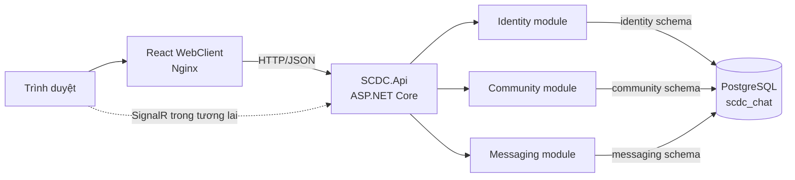
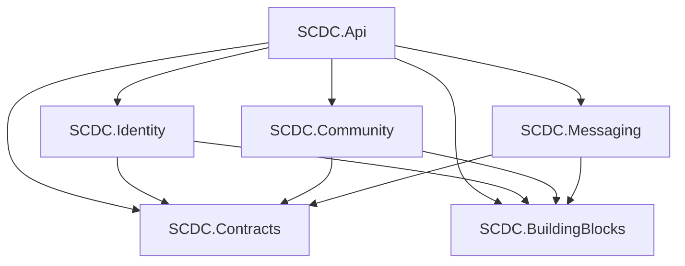
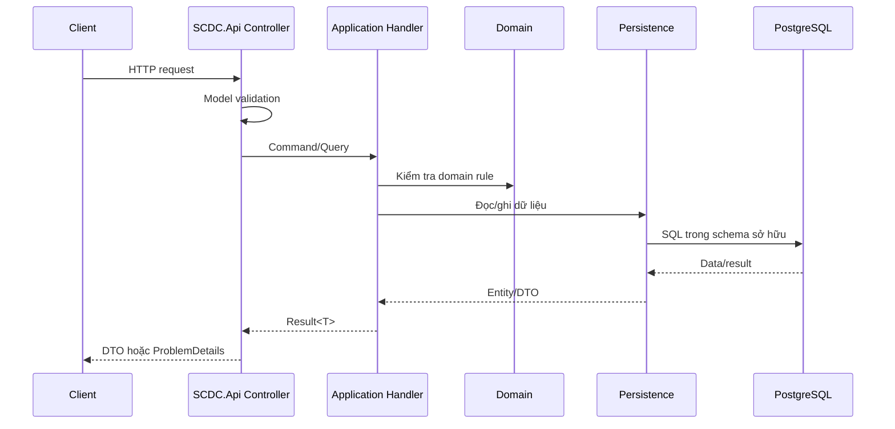

# Tổng quan và kiến trúc dự án SCDC

Tài liệu này mô tả mục tiêu, cách tổ chức source code, ranh giới module, thiết kế
dữ liệu và luồng xử lý của SCDC. Nội dung phân biệt rõ phần **đã có** và phần
**dự kiến triển khai**, để kiến trúc mục tiêu không bị nhầm với trạng thái hiện
tại của ứng dụng.

## 1. Tổng quan sản phẩm

SCDC là nền tảng giao tiếp thời gian thực, hướng tới các chức năng chính:

- Đăng ký, xác thực và quản lý tài khoản người dùng.
- Tạo server, quản lý thành viên, channel, role và permission.
- Trò chuyện trực tiếp, trò chuyện nhóm và trò chuyện trong channel.
- Tin nhắn, attachment, reaction, mention và trạng thái đã đọc.
- Realtime bằng SignalR.
- Moderation, audit bảo mật và phát sự kiện tin cậy.

Backend đang được xây mới theo kiến trúc **modular monolith**. Database
PostgreSQL đã được thiết kế hoàn chỉnh trước để quan sát luồng dữ liệu; code
nghiệp vụ sẽ được triển khai dần theo từng vertical slice.

## 2. Trạng thái hiện tại

Phần đã có:

- Solution .NET 10 gồm API host, BuildingBlocks, Contracts và ba module lõi.
- Module registration cho Identity, Community và Messaging.
- Health endpoint và Swagger UI trong môi trường Development.
- Quy ước `Result<T>`, `ProblemDetails` và global exception handling.
- Identity v1 persistence, JWT authentication và authorization middleware.
- API register/verify/login/refresh/logout, profile, session và password lifecycle.
- PostgreSQL schema, constraint, index, trigger, view và seed data.
- React WebClient cơ bản, được phục vụ qua Nginx.
- Dockerfile và Podman/Docker Compose cho API, WebClient và PostgreSQL.
- Integration test cho response foundation, Swagger và Identity lifecycle trên PostgreSQL.

Phần chưa có:

- API server, membership, channel và permission.
- API tin nhắn và SignalR Hub.
- Worker xử lý outbox và các integration event.
- MFA, external login và email delivery worker.

Swagger hiện có endpoint Identity v1. Community và Messaging mới chỉ đăng ký
module nên chưa có endpoint nghiệp vụ.

## 3. Mục tiêu thiết kế

Kiến trúc hướng tới các mục tiêu sau:

1. Ranh giới nghiệp vụ rõ ràng giữa tài khoản, cộng đồng và chat.
2. Một ứng dụng dễ chạy và debug trong giai đoạn phát triển.
3. Module không phụ thuộc trực tiếp vào implementation của module khác.
4. Luồng dữ liệu có transaction và constraint đáng tin cậy.
5. API nhất quán, dễ quan sát và dễ kiểm thử.
6. Có đường nâng cấp sang service độc lập nếu quy mô thực sự yêu cầu.

Các nguyên tắc được ưu tiên:

- Bắt đầu đơn giản với một deployable backend.
- Tách theo business capability, không tách theo controller/service/repository ở
  cấp toàn solution.
- Chỉ tạo abstraction khi có ranh giới hoặc nhu cầu sử dụng thực tế.
- Mỗi tính năng được hoàn thiện xuyên suốt thay vì tạo hàng loạt class rỗng.
- Database constraint bảo vệ tính toàn vẹn dữ liệu, không chỉ dựa vào code.

## 4. Sơ đồ hệ thống



Trong môi trường local, ba tiến trình chính được quản lý bởi
[`compose.yaml`](../../compose.yaml):

| Thành phần | Cổng host | Vai trò |
|---|---:|---|
| WebClient | `3000` | Giao diện React được Nginx phục vụ |
| SCDC.Api | `5026` | HTTP API, Swagger và sau này là SignalR |
| PostgreSQL | `5432` | Database `scdc_chat` |

## 5. Cấu trúc repository

```text
SCDC/
├── clients/
│   └── WebClient/                 React, Vite, Nginx
├── database/
│   └── postgres/                  schema.sql, seed.sql, tài liệu database
├── docs/
│   ├── api/                       Quy ước HTTP/API
│   └── architecture/              Tài liệu kiến trúc
├── services/
│   ├── SCDC.Api/                  Executable và HTTP adapter
│   ├── SCDC.BuildingBlocks/       Primitive dùng chung
│   ├── SCDC.Contracts/            Contract giao tiếp giữa module
│   └── Modules/
│       ├── Identity/
│       ├── Community/
│       └── Messaging/
├── tests/
│   └── SCDC.Api.Tests/            Unit và HTTP integration test
├── compose.yaml
└── SCDC.slnx
```

## 6. Kiến trúc backend

Backend là một modular monolith: ba module nghiệp vụ chạy trong cùng process và
được build thành cùng một API image, nhưng vẫn có ranh giới source code và data
ownership riêng.



Quy tắc dependency:

- `SCDC.Api` được phép tham chiếu tất cả module để lắp ráp ứng dụng.
- Module chỉ tham chiếu `SCDC.BuildingBlocks` và `SCDC.Contracts`.
- Identity, Community và Messaging không tham chiếu trực tiếp lẫn nhau.
- Contracts không tham chiếu implementation của bất kỳ module nào.
- BuildingBlocks không chứa business rule riêng của một module.

### 6.1. SCDC.Api

[`SCDC.Api`](../../services/SCDC.Api) là executable duy nhất và là composition
root của backend.

Trách nhiệm:

- Khởi tạo ASP.NET Core và dependency injection.
- Nạp Identity, Community và Messaging.
- Cấu hình controller, CORS, Swagger và middleware.
- Chuyển `Result<T>` thành HTTP response.
- Chuẩn hóa validation và `ProblemDetails`.
- Bắt exception ngoài dự kiến.
- Chứa HTTP adapter/controller mỏng cho các use case.

API không nên chứa business rule hoặc truy vấn SQL. Controller chỉ nhận request,
gọi application handler và ánh xạ kết quả sang HTTP.

### 6.2. SCDC.BuildingBlocks

[`SCDC.BuildingBlocks`](../../services/SCDC.BuildingBlocks) chứa primitive kỹ
thuật nhỏ, ổn định và thực sự dùng chung.

Hiện có:

- `IModuleDescriptor` để health endpoint quan sát module đã nạp.
- `Result`, `Result<T>`, `Error`, `ValidationError` và `ErrorType`.

Có thể bổ sung sau khi phát sinh nhu cầu thực tế:

- Base entity hoặc aggregate root.
- Domain event abstraction.
- Clock/current-user abstraction.
- Transaction abstraction.

Không đưa entity như `User`, `Server`, `Channel` hoặc `Message` vào project này.

### 6.3. SCDC.Contracts

[`SCDC.Contracts`](../../services/SCDC.Contracts) là bề mặt giao tiếp ổn định
giữa các module.

Contract đã chuẩn bị:

| Contract | Module cung cấp dự kiến | Mục đích |
|---|---|---|
| `IUserDirectory` | Identity | Tra cứu user summary theo ID/username |
| `IChannelAccessChecker` | Community | Kiểm tra quyền đọc/gửi trong channel |
| `IRealtimeAccessRevoker` | Messaging | Thu hồi quyền truy cập realtime |

Contract chỉ chứa interface và DTO tối thiểu. Không đưa EF entity, DbContext,
HTTP type hoặc implementation vào đây.

### 6.4. Identity module

Identity sở hữu vòng đời tài khoản:

- User, profile và email.
- Password credential và external identity.
- Xác thực email, reset password và account token.
- Session, refresh-token rotation và logout.
- MFA và security state.

Identity sở hữu schema `identity` và cung cấp `IUserDirectory` cho các module
khác.

Identity v1 đã có register, verify email, login, refresh rotation/reuse
detection, logout/session management, current user/profile và password recovery.
MFA và external login thuộc Identity v2.

### 6.5. Community module

Community sở hữu cấu trúc cộng đồng và authorization trong server:

- Server và member.
- Invite và ban.
- Channel metadata.
- Role, permission và member role.
- Permission override theo role hoặc user.

Community sở hữu schema `community` và dự kiến cung cấp
`IChannelAccessChecker`.

### 6.6. Messaging module

Messaging sở hữu nội dung và trạng thái trò chuyện:

- Chat space, direct conversation và group conversation.
- Membership/state riêng của conversation.
- Message, edit, attachment, reaction và mention.
- Receipt, pin, block và lịch sử tin nhắn.
- SignalR connection và realtime delivery trong tương lai.

Messaging sở hữu schema `messaging` và dự kiến cung cấp
`IRealtimeAccessRevoker`.

## 7. Cấu trúc bên trong một module

Thư mục chỉ được tạo khi có source thực tế. Cấu trúc mục tiêu của một module:

```text
Modules/Identity/
├── Domain/
│   └── Users/                     Entity, value object, domain rule
├── Application/
│   └── Authentication/
│       └── Register/              Command, handler, validation, DTO
├── Infrastructure/
│   ├── Persistence/               DbContext mapping, repository
│   └── Security/                  Password hashing, token implementation
├── IdentityModule.cs              Dependency registration
└── SCDC.Identity.csproj
```

HTTP controller nằm trong `SCDC.Api`, được tổ chức theo module tương ứng. Cách
này giữ module nghiệp vụ không phụ thuộc vào ASP.NET presentation và phù hợp với
hướng dependency hiện tại.

Ví dụ một vertical slice hoàn chỉnh:

```text
API contract
→ request validation
→ application handler
→ domain rule
→ persistence
→ Result<T>
→ HTTP response
→ integration test
```

Không tạo toàn bộ entity, repository hoặc CRUD trước. Mỗi slice phải chạy được
từ request tới database và có test trước khi chuyển sang slice tiếp theo.

## 8. Luồng xử lý request



Nguyên tắc:

- Controller không quyết định business rule.
- Handler không biết HTTP status code.
- Domain không biết database hoặc framework.
- Infrastructure triển khai persistence và external service.
- API host là nơi duy nhất ánh xạ lỗi nghiệp vụ sang HTTP.

Chi tiết response và error handling nằm tại
[`docs/api/error-handling.md`](../api/error-handling.md).

## 9. Kiến trúc database

SCDC sử dụng một PostgreSQL database `scdc_chat`, chia schema theo domain.

| Schema | Owner/phạm vi |
|---|---|
| `identity` | Identity: account, credential, session, token, MFA |
| `community` | Community: server, member, channel, role, permission |
| `messaging` | Messaging: conversation, message và read state |
| `moderation` | Report và moderation action; module sẽ bổ sung sau |
| `audit` | Security event append-only |
| `integration` | Outbox và inbox idempotency |
| `common` | Function/trigger dùng chung ở mức database |

[`database/postgres/schema.sql`](../../database/postgres/schema.sql) là source
of truth hiện tại. Backend không tự chạy EF migration. Script tạo schema chỉ tự
động chạy khi PostgreSQL khởi tạo data volume mới.

### 9.1. Schema ownership

- Module được phép đọc/ghi trực tiếp schema mà nó sở hữu.
- Dữ liệu của module khác được truy cập qua contract khi đi qua application
  code.
- View phục vụ quan sát và vận hành, không trở thành dependency nghiệp vụ ngầm.
- Audit và integration là hạ tầng chéo, chỉ được ghi theo quy ước riêng.

Database hiện có cross-schema foreign key để bảo vệ tính toàn vẹn dữ liệu. Đây
là lựa chọn có chủ ý cho modular monolith: transaction và constraint mạnh hơn,
đổi lại việc tách thành database/service độc lập sau này sẽ cần migration dữ
liệu và thay foreign key bằng contract/event.

### 9.2. Giao tiếp đồng bộ và bất đồng bộ

Giao tiếp đồng bộ trong cùng process đi qua interface tại `SCDC.Contracts`.
Ví dụ Messaging tra cứu user thông qua `IUserDirectory` thay vì tham chiếu
Identity repository.

Các tác vụ không cần hoàn thành trong request sẽ dùng transactional outbox:

```text
Business transaction
    ├── cập nhật bảng nghiệp vụ
    └── ghi integration.outbox_events
             ↓
        background worker
             ↓
        integration handler / realtime delivery
```

`integration.inbox_events` được dùng để chống xử lý event lặp. Worker và event
handler chưa được triển khai ở trạng thái hiện tại.

## 10. API và xử lý lỗi

Response thành công trả DTO đúng kiểu:

- `200` khi trả dữ liệu.
- `201` khi tạo resource.
- `204` khi không cần body.

Response lỗi sử dụng `application/problem+json`, có `errorCode` ổn định và
`traceId`. Application trả `Result<T>` và không phụ thuộc vào HTTP. Exception
ngoài dự kiến được xử lý tập trung, ghi log và trả `500` không chứa thông tin
nhạy cảm.

Controller nghiệp vụ sẽ kế thừa `ApiControllerBase` để dùng cùng response
convention trong runtime và Swagger.

## 11. Security boundary

Security được đặt chủ yếu trong Identity nhưng authorization cần sự phối hợp:

- Identity xác định user/session hợp lệ.
- Community xác định quyền trong server/channel.
- Messaging chỉ gửi hoặc đọc message sau khi quyền đã được xác nhận.
- Khi session, membership hoặc permission bị thu hồi, realtime access cũng phải
  được thu hồi.

Password và token chỉ lưu dạng hash phù hợp; dữ liệu mẫu trong `seed.sql` chỉ để
quan sát quan hệ và không dùng để đăng nhập. Secret không được ghi vào log hoặc
trả trong `ProblemDetails`.

Chi tiết authentication, token transport và authorization policy sẽ được chốt
khi triển khai vertical slice Identity; tài liệu này không giả định những phần
chưa được code.

## 12. Kiểm thử

Chiến lược kiểm thử dự kiến:

| Loại test | Phạm vi |
|---|---|
| Unit test | Domain rule, value object, `Result` và handler độc lập |
| Application test | Use case với dependency được thay thế có kiểm soát |
| API integration test | Routing, model binding, status, JSON và middleware |
| Database integration test | Mapping, constraint, transaction và query thật |
| Architecture test | Ngăn module tham chiếu trực tiếp lẫn nhau |

Bộ test hiện có tại [`tests/SCDC.Api.Tests`](../../tests/SCDC.Api.Tests) kiểm tra
response foundation, Swagger và toàn bộ Identity v1 lifecycle trên PostgreSQL.

## 13. Deployment và cấu hình

Một backend image chứa toàn bộ ba module. Đây là một deployment unit, không phải
ba microservice.

```text
scdc-web-client     React/Nginx
scdc-chat-service   SCDC.Api + các module
scdc-postgres       PostgreSQL
```

Cấu hình thay đổi theo môi trường được truyền qua `appsettings` và environment
variable. Connection string trong Compose dành cho local development; môi
trường production phải sử dụng secret management thay vì commit credential.

Swagger chỉ được bật khi `ASPNETCORE_ENVIRONMENT=Development`. Health endpoint
có thể dùng để kiểm tra API host đã nạp đủ module.

## 14. Vì sao chọn modular monolith

Ưu điểm ở giai đoạn hiện tại:

- Một lệnh build và một backend container.
- Debug luồng xuyên module đơn giản.
- Transaction PostgreSQL trực tiếp và nhất quán.
- Không cần message broker hoặc distributed tracing ngay từ đầu.
- Ranh giới module vẫn rõ để kiểm soát độ phức tạp.

Trade-off:

- Tất cả module scale và deploy cùng nhau.
- Bug hoặc tải cao ở một module có thể ảnh hưởng process chung.
- Shared database và cross-schema foreign key làm việc tách service tốn công.

Chỉ cân nhắc tách service khi có bằng chứng vận hành cụ thể như nhu cầu scale độc
lập, ownership theo team, isolation hoặc deployment cadence khác nhau. Không tách
chỉ vì số lượng bảng hoặc class tăng.

## 15. Thứ tự triển khai tiếp theo

```text
1. Email delivery/outbox worker và hardening Identity
2. Community server/membership/channel
3. Messaging send/history
4. SignalR delivery
5. Moderation, audit consumer và hardening
```

Mỗi bước phải bao gồm contract, rule, handler, persistence, endpoint, Swagger và
test. Identity v1 đã hoàn tất luồng backend trong môi trường Development; bước
tiếp theo là email delivery hoặc bắt đầu Community tùy ưu tiên sản phẩm.

## 16. Quy tắc khi mở rộng dự án

Trước khi merge một tính năng mới, kiểm tra:

- Tính năng đã được đặt đúng module chưa?
- Module có tham chiếu trực tiếp module khác không?
- Business rule có bị đặt trong controller hoặc repository không?
- Truy cập dữ liệu có tuân theo schema ownership không?
- Handler có trả `Result<T>` cho lỗi nghiệp vụ dự kiến không?
- Response lỗi có đúng `ProblemDetails` và error code convention không?
- Swagger có mô tả đủ success/error response không?
- Transaction, idempotency và concurrency đã được cân nhắc chưa?
- Có test ở mức phù hợp với rủi ro của thay đổi không?
- Tài liệu kiến trúc hoặc API có cần cập nhật không?
