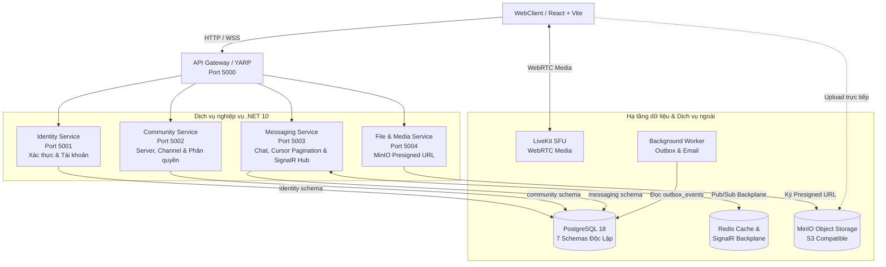

# Kiến trúc hệ thống SCDC

## 1. Mục tiêu kiến trúc

SCDC (Real-time Communication Platform) được thiết kế với mục tiêu xây dựng một nền tảng giao tiếp thời gian thực có tính sẵn sàng cao, hỗ trợ nhắn tin văn bản, truyền thông đa phương tiện và điều phối phòng thoại/video.

Hệ thống tuân thủ chiến lược **Monolith First** (Martin Fowler):
- **Giai đoạn 1 (Modular Monolith):** Tập trung phát triển nghiệp vụ lõi trong cùng một giải pháp phần mềm (.NET 10). Các domain nghiệp vụ được phân tách độc lập thành các Class Library riêng biệt (`Identity`, `Community`, `Messaging`, `FileStorage`), sở hữu schema cơ sở dữ liệu riêng trong PostgreSQL, giao tiếp nội bộ qua interface abstractions tại `SCDC.Contracts`.
- **Giai đoạn 2 (Microservices Migration):** Bóc tách các module thành các dịch vụ phân tán độc lập, định tuyến tập trung qua API Gateway (YARP), giao tiếp liên dịch vụ qua gRPC/HTTP và xử lý sự kiện bất đồng bộ qua RabbitMQ và Transactional Outbox pattern.

---

## 2. Sơ đồ kiến trúc tổng thể

```mermaid
flowchart TD
    Client[WebClient / React + Vite]
    Gateway[API Gateway / YARP\nPort 5000]

    subgraph CoreServices[Dịch vụ nghiệp vụ .NET 10]
        Identity[Identity Service\nPort 5001\nXác thực & Tài khoản]
        Community[Community Service\nPort 5002\nServer, Channel & Phân quyền]
        Messaging[Messaging Service\nPort 5003\nChat, Cursor Pagination & SignalR Hub]
        FileService[File & Media Service\nPort 5004\nMinIO Presigned URL]
    end

    subgraph Infrastructure[Hạ tầng dữ liệu & Dịch vụ ngoài]
        Postgres[(PostgreSQL 18\n7 Schemas Độc Lập)]
        Redis[(Redis Cache &\nSignalR Backplane)]
        MinIO[(MinIO Object Storage\nS3 Compatible)]
        LiveKit[LiveKit SFU\nWebRTC Media]
        Worker[Background Worker\nOutbox & Email]
    end

    Client -->|HTTP / WSS| Gateway
    Gateway --> Identity
    Gateway --> Community
    Gateway --> Messaging
    Gateway --> FileService

    Identity -->|identity schema| Postgres
    Community -->|community schema| Postgres
    Messaging -->|messaging schema| Postgres
    Messaging <-->|Pub/Sub Backplane| Redis
    FileService -->|Ký Presigned URL| MinIO
    Client -.->|Upload trực tiếp| MinIO
    Client <-->|WebRTC Media| LiveKit
    Worker -->|Đọc outbox_events| Postgres
```

---

## 3. Ranh giới dịch vụ và quyền sở hữu dữ liệu

Nguyên tắc bắt buộc: Mỗi module chỉ đọc và ghi dữ liệu vào schema mà nó sở hữu. Không truy vấn trực tiếp bảng của module khác.

| Bounded Context | Trách nhiệm chính | Schema sở hữu | Giao diện nội bộ (Contracts) |
|---|---|---|---|
| **Identity** | Tài khoản, xác thực, JWT, Refresh Token, Session | `identity` | `IUserDirectory` |
| **Community** | Server, Channel, Category, Phân quyền Bitwise RBAC | `community` | `IChannelAccessChecker` |
| **Messaging** | Tin nhắn DM, Channel, Ghim, Reaction, Cursor Pagination | `messaging` | `IMessagingService` |
| **File Storage** | Quản lý tệp, cấp Presigned URL, tạo thumbnail | `messaging.attachments` / `files` | `IFileStorageService` |
| **Calls & Media** | Điều phối phòng thoại, cấp LiveKit Room Token | `calls` | `ICallCoordinator` |
| **Integration** | Sự kiện bất đồng bộ (Outbox / Inbox) | `integration` | `IOutboxDispatcher` |

---

## 4. Tài liệu tham chiếu chi tiết

- Thiết kế luồng tương tác chi tiết: [service-blueprint.md](service-blueprint.md)
- Thiết kế cơ sở dữ liệu: [../../database/postgres/README.md](../../database/postgres/README.md)
