# SCDC — Sơ đồ luồng service và kế hoạch triển khai từng phần

Tài liệu này chuyển [kiến trúc tổng quan](overview.md) thành các phần có thể giao
cho từng người triển khai và chạy thử độc lập. Điểm bắt đầu là **hai tài khoản
nhắn tin trực tiếp được với nhau**, sau đó bổ sung cộng đồng, tệp và cuộc gọi.

**Trạng thái tài liệu:** bản thiết kế đề xuất, đối chiếu với code trong repository.
Chỉ những mục ghi **ĐÃ CÓ** mới mô tả chức năng đã triển khai. Các API, event,
interface, bảng và cấu hình ghi **ĐỀ XUẤT** cần được xây dựng; tài liệu này không
tự thêm chúng vào ứng dụng. “Service” trước hết là ranh giới trách nhiệm; các
service có thể cùng chạy trong `SCDC.Api` trước khi tách thành tiến trình riêng.

## 1. Đọc tài liệu theo công việc

Mỗi sơ đồ có mã cố định để các thành viên dùng khi trao đổi, ví dụ “phần M2 gọi
sang W1”. Mũi tên có nhãn mô tả dữ liệu hoặc hành động. Trong sequence diagram,
đọc từ trên xuống; mũi tên nét đứt là phản hồi. Trong flowchart, nét đứt biểu thị
event hoặc bước mở rộng và luôn có nhãn. Các khối Mermaid xem được trên trình
đọc Markdown hỗ trợ Mermaid; phần chữ và bảng bên cạnh giải thích cùng một luồng.

| Bạn muốn hiểu/làm gì? | Đọc theo thứ tự |
|---|---|
| Nắm toàn hệ thống | [Hiện trạng](#baseline) → [S1: bản đồ hệ thống](#system) → [P1: các mốc triển khai](#phases) |
| Làm Identity | [I1: đăng nhập và xác thực](#identity) → [W2: email](#email) → [R1: thu hồi truy cập](#revocation) |
| Bắt đầu làm chat ngay | [Hợp đồng chung](#contracts) → [M1: tạo DM](#dm) → [M2: gửi tin](#message) → [M3: realtime](#realtime) |
| Làm Community | [C1: server/channel](#community) → [C2: quyền](#permissions) → [R1: ban/kick](#revocation) |
| Làm tệp đính kèm | [F1: upload/download](#files) → [M2: gắn tệp vào tin nhắn](#message) |
| Làm gọi điện/share màn hình | [L1: cuộc gọi](#calls) → [L2: trạng thái](#call-state) → [R1: thu hồi](#revocation) |
| Làm hạ tầng hoặc tách service | [W1: outbox](#workers) → [D1: triển khai](#deployment) → [P1: nghiệm thu](#phases) |

### Từ vựng dùng xuyên suốt

| Tên | Nghĩa trong SCDC |
|---|---|
| `userId` | UUID của một tài khoản do Identity quản lý. Lấy người đang thao tác từ JWT, không tin `userId` do client tự nhận. |
| `sessionId` / `sid` | Một phiên đăng nhập của user trên thiết bị; một user có thể có nhiều phiên. |
| `serverId` | Một cộng đồng/guild. Không phải máy chủ vật lý. |
| `spaceId` | Một nơi chứa tin nhắn: DM, nhóm hoặc channel của server. Đây là ID dùng chung cho API chat và nhóm SignalR. |
| `messageId`, `clientMessageId` | ID tin nhắn do backend quản lý; ID yêu cầu gửi do client tạo và giữ nguyên khi retry. |
| `sequenceNo` | Số thứ tự toàn cục trong bảng messages, dùng để sắp xếp/lấy lịch sử trong từng space. Không phải số lượng tin. |
| `callId`, `roomName` | Call là nghiệp vụ của SCDC; room là phòng media bên LiveKit. Calls giữ ánh xạ giữa hai bên. |
| Outbox | Bản ghi “cần phát sự kiện” được lưu cùng transaction với dữ liệu nghiệp vụ. |
| Inbox | Bản ghi consumer đã xử lý event nào, dùng tránh áp dụng một thay đổi nhiều lần. |
| SFU / TURN | LiveKit SFU chuyển tiếp các luồng media; TURN là đường chuyển tiếp dự phòng khi kết nối mạng cần nó. |

## 2. Điểm xuất phát thật trong repository

| Thành phần | Trạng thái | Bằng chứng và phần còn thiếu |
|---|---|---|
| API host | **ĐÃ CÓ** | [Program.cs](../../services/SCDC.Api/Program.cs) đăng ký ba module; hiện chỉ map controller, chưa map hub. |
| Identity v1 | **ĐÃ CÓ** | [AuthController](../../services/SCDC.Api/Controllers/Identity/AuthController.cs), [UsersController](../../services/SCDC.Api/Controllers/Identity/UsersController.cs), [luồng Identity v1](../identity/identity-v1.md). |
| Tra cứu user nội bộ | **ĐÃ CÓ** | `IUserDirectory` có implementation; tìm theo ID, username hoặc nhiều ID. Chưa có HTTP API tìm user cho giao diện. |
| Community | **KHUNG** | [CommunityModule](../../services/Modules/Community/CommunityModule.cs) đăng ký descriptor; schema đã có, chưa có use case/API/permission checker. |
| Messaging | **KHUNG** | [MessagingModule](../../services/Modules/Messaging/MessagingModule.cs) đăng ký descriptor; schema đã có, chưa có DM API, message API hoặc SignalR Hub. |
| Outbox/inbox | **MỘT PHẦN** | Bảng đã có; Identity có ghi outbox. Chưa có dispatcher/consumer hoặc SMTP sender. |
| File, Calls, LiveKit, Redis, gateway | **ĐỀ XUẤT** | Chưa nằm trong runtime hiện tại; thêm theo từng mốc phía cuối tài liệu. |
| Chạy local | **ĐÃ CÓ** | [compose.yaml](../../compose.yaml): WebClient `3000`, API `5026`, PostgreSQL `5432`. Tên container `chat-service` hiện là toàn bộ `SCDC.Api`. |

Schema chuẩn hiện tại: [schema.sql](../../database/postgres/schema.sql). Việc có
bảng không đồng nghĩa đã có tính năng. Đặc biệt, schema đang lưu quyền bằng
`permission_code` và các bảng liên kết, **chưa có bitmask quyền**; `channels`
chưa có loại voice/category hoặc quan hệ category cha.

## 3. S1 — Bản đồ trách nhiệm và đường đi của dữ liệu

Sơ đồ này là đích chức năng. Ở mốc đầu, các hộp API cùng ở trong `SCDC.Api` và
client gọi trực tiếp host; gateway chỉ xuất hiện khi cần định tuyến nhiều host.

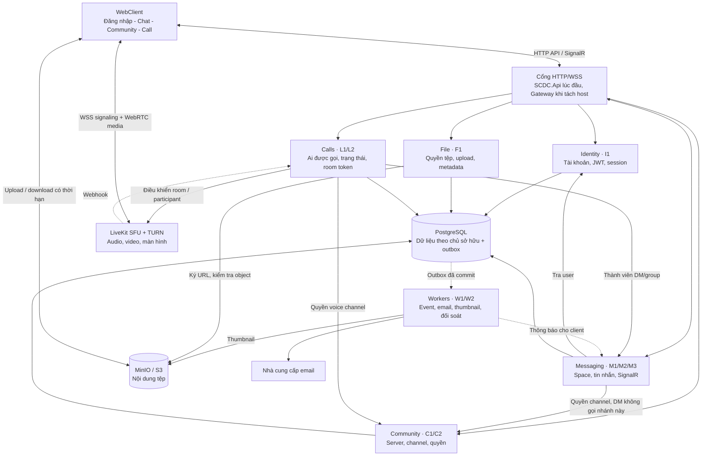

Ba đường của client có mục đích khác nhau: HTTP/SignalR cho nghiệp vụ; LiveKit
cho gọi điện; MinIO cho byte của tệp. PostgreSQL giữ lịch sử chat. LiveKit không
thay kho tin nhắn, còn SignalR không vận chuyển video trong thiết kế này.

### Dữ liệu nào do ai sửa?

| Chủ sở hữu | Bảng hiện có | Bổ sung đề xuất |
|---|---|---|
| Identity | `identity.users`, profiles, emails, credentials, security states, sessions, tokens | Cơ chế chuyển token cho email worker; event thu hồi session. |
| Messaging | `messaging.spaces`, direct/group conversations, space members/user states, messages, edits, attachments, reactions, mentions, receipts, pins, blocks | Code nghiệp vụ, truy vấn, hub và dispatcher tin nhắn. |
| Community | `community.servers`, members, channels, roles, permissions, overrides, invites, bans | Loại channel, voice/category, quy tắc tính quyền và cấp phát channel space. |
| File | `messaging.attachments` hiện chỉ mô tả tệp **đã gắn vào tin** | `files.uploads`, `files.objects`: chủ sở hữu, object key/version, trạng thái xử lý, hạn upload. Messaging vẫn sở hữu quan hệ attachment–message. |
| Calls | Chưa có bảng nghiệp vụ gọi điện | `calls.calls`, `calls.participants`: target, state/version, room, user/session/participant mapping. |
| Workers | `integration.outbox_events`, `integration.inbox_events` | Lease hoặc hàng đợi giao việc, retry/dead-letter, consumer cho từng loại event. |
| Moderation | `moderation.message_reports`, `moderation.actions` | API báo cáo/duyệt ở mốc mở rộng; tác động xóa tin/ban qua chủ sở hữu Messaging/Community. Chưa cần một host riêng. |

Các tên bảng `files.*`, `calls.*` ở trên **chưa tồn tại**. Không cho service khác
sửa trực tiếp bảng của chủ sở hữu. Database hiện có nhiều khóa ngoại xuyên
schema; kế hoạch tách database phải xử lý chúng tại [D1](#deployment).

## 4. S2 — Cấu trúc bên trong và hợp đồng nối các sơ đồ

Mọi service dùng cùng cách đọc dưới đây. Một request thành công phải phân biệt
“dữ liệu đã commit” với “người nhận đã nhận sự kiện”. Hai thời điểm này khác nhau.

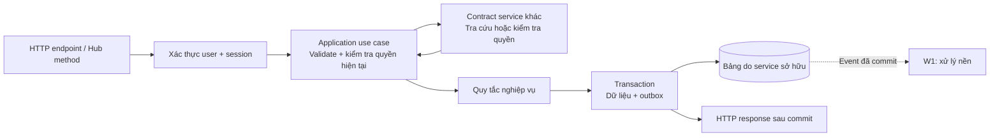

Các lời gọi mạng kiểm tra quyền có timeout; lỗi phụ thuộc không được biến thành
“cho phép”. Tránh giữ transaction DB khi gọi SMTP, LiveKit hoặc upload tệp.
Khi cần chống tranh chấp với ban/kick, phải chốt version quyền hoặc cơ chế đồng
bộ ở chủ sở hữu, không mặc định một lần kiểm tra trước transaction có hiệu lực mãi.

### 4.1. Contracts hiện có và cần bổ sung

| Hợp đồng | Bên cung cấp → bên dùng | Trạng thái và ý nghĩa |
|---|---|---|
| [`IUserDirectory`](../../services/SCDC.Contracts/Identity/IUserDirectory.cs) | Identity → Messaging, Community | **ĐÃ CÓ** `FindByIdAsync`, `FindByUsernameAsync`, `FindByIdsAsync`; trả `Id, Username, DisplayName` cho user active. |
| [`IChannelAccessChecker`](../../services/SCDC.Contracts/Community/IChannelAccessChecker.cs) | Community → Messaging | **CHỈ INTERFACE** `CheckAsync(userId, spaceId, ct)` → `CanRead, CanSend`. |
| [`IRealtimeAccessRevoker`](../../services/SCDC.Contracts/Messaging/IRealtimeAccessRevoker.cs) | Messaging ← Community | **CHỈ INTERFACE** `RevokeAsync(userId, spaceIds, ct)`; phạm vi space, chưa biểu đạt thu hồi theo session. |
| `ISpaceAccessChecker` | Messaging → Calls, File | **ĐỀ XUẤT** kiểm tra read/send/call của user trong DM/group; không chỉ kiểm tra user tồn tại. |
| `IChannelSpaceProvisioner` | Messaging → Community | **ĐỀ XUẤT** tạo/lấy space loại channel bằng request ID ổn định, dùng ở C1. |
| `IVoiceAccessChecker` | Community → Calls | **ĐỀ XUẤT** quyền join/speak/video/screen share theo channel; interface hiện tại không đủ. |
| `IFileAccessService` | File → Messaging | **ĐỀ XUẤT** xác minh object sẵn sàng, chủ sở hữu và binding tới message. Không truyền URL tùy ý. |
| `IMessageAccessChecker` | Messaging → File | **ĐỀ XUẤT** xác minh user đọc được message và file thực sự thuộc message đó trước khi cấp download URL. |
| `ISessionAccessValidator` | Identity → các host khi tách | **ĐỀ XUẤT** kiểm tra session/security stamp mà không đọc chéo DB Identity. |
| `ISessionConnectionRevoker` | Messaging/Calls ← Identity | **ĐỀ XUẤT** thu hồi theo `sid` hoặc toàn user; khác contract revoke theo space ở trên. |

Trong monolith, adapter gọi interface in-process. Khi tách host, adapter dùng
API nội bộ có xác thực hoặc event; không cho browser gọi API nội bộ. Phía triển
khai phải có DTO và kiểm thử hợp đồng trước khi đổi transport.

### 4.2. Quy ước API/event đề xuất

- API nghiệp vụ có prefix `/api/v1`; riêng hub là `/hubs/chat`.
- UUID truyền dạng chuỗi. `sequenceNo` là PostgreSQL `bigint`; truyền chuỗi
  thập phân trong JSON để JavaScript không mất độ chính xác.
- Lỗi theo [ProblemDetails hiện có](../api/error-handling.md). Dùng `401` cho
  token/session không hợp lệ; lỗi quyền không tiết lộ tài nguyên private; lỗi
  phụ thuộc dùng lỗi tạm thời, không giả thành “không tồn tại”.
- Mutation có thể retry phải có khóa idempotency. Cùng khóa nhưng payload khác
  trả conflict. Event gồm `eventId`, `eventType`, `schemaVersion`, `aggregateId`,
  `aggregateVersion`, `occurredAt`, `correlationId`, `payload`.
- Envelope là **hợp đồng transport đề xuất**; các cột outbox hiện tại chưa ánh
  xạ đủ mọi trường. Cần adapter/migration; không đổi ngầm payload Identity cũ.

| Event đề xuất | Producer → consumer | Dùng ở đâu? |
|---|---|---|
| `Messaging.MessageCreated.v1` | Messaging → realtime handler | [M2](#message), [W1](#workers); DTO cho client không chứa dữ liệu nội bộ. |
| `Messaging.MessageUpdated/Deleted.v1` | Messaging → realtime handler | Đồng bộ sửa/xóa; client so `messageId` và version. |
| `Community.AccessChanged.v1` | Community → Messaging, Calls | [C2](#permissions), [R1](#revocation). |
| `Identity.SessionRevoked.v1` | Identity → Messaging, Calls | [R1](#revocation); **chưa được phát bởi logout hiện tại**. |
| `Files.ObjectReady.v1` | File worker → File | [F1](#files); trạng thái object chỉ do File cập nhật. |
| `Calls.StateChanged.v1` | Calls → Messaging/realtime | [L1](#calls); chỉ định recipients bằng dữ liệu đã kiểm tra. |

Các event Identity đang có như `Identity.EmailVerificationRequested`,
`Identity.PasswordResetRequested`, `Identity.PasswordChanged` giữ tương thích
cho tới khi có kế hoạch version hóa riêng.

## 5. I1 — Identity: từ tài khoản tới quyền gọi API

**Đầu vào:** đăng ký, xác thực email, đăng nhập hoặc refresh.
**Đầu ra:** access token, refresh token và user; session nằm trong Identity DB.
**Điểm bàn giao cho chat:** hai user active + JWT thật + `IUserDirectory`.

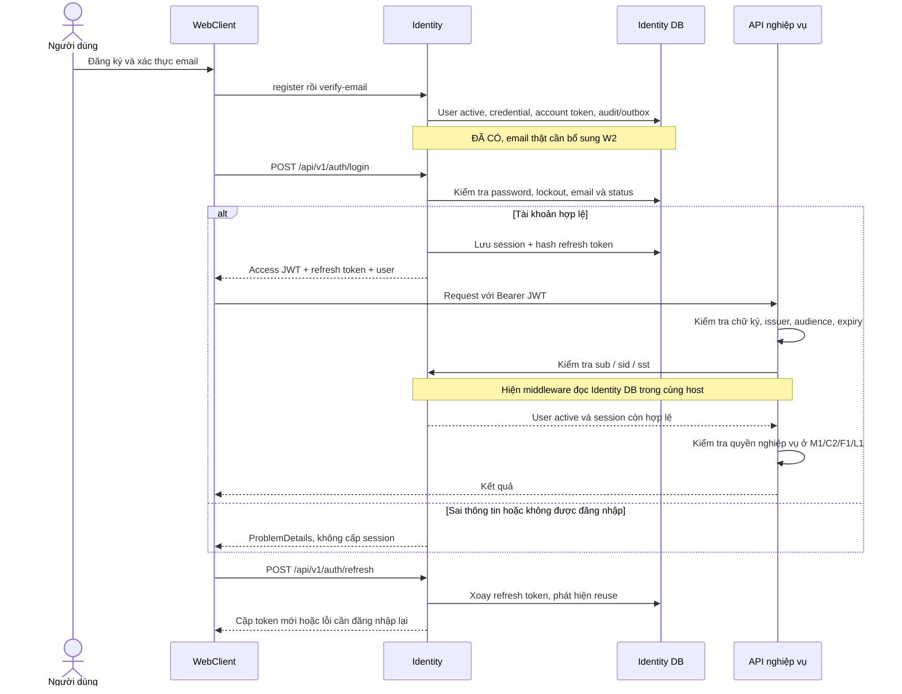

Các endpoint **ĐÃ CÓ**: register, verify-email, login, refresh, logout,
logout-all, forgot/reset/change-password, GET sessions, DELETE một session,
GET/PATCH `/users/me`. Xem chi tiết request/response tại
[Identity v1](../identity/identity-v1.md).

JWT hiện ký HS256, có `sub=userId`, `sid=sessionId`, `sst=securityStamp`;
không chứa role của từng cộng đồng. Identity kiểm tra trạng thái session từ DB
khi xác thực HTTP. Cơ chế này chưa tự cắt một WebSocket đang mở.

**Phần cần thêm trước khi bàn giao trải nghiệm DM:** API tra user theo username
để UI chọn người nhận, ví dụ `GET /api/v1/users/lookup?username=...` (**ĐỀ XUẤT**,
bảo vệ bằng JWT, giới hạn tần suất, chỉ trả UserSummary). Nhập userId từ Swagger
là đủ cho smoke test đầu tiên, không cần chờ tính năng tìm kiếm hoàn chỉnh.

**Nghiệm thu I1:** hai user đăng ký/xác thực/login được; token bị revoke bị từ
chối ở request kế tiếp; directory không trả email/password; các use case chat
không truy vấn trực tiếp bảng credential/session của Identity.

## 6. M1 — Messaging: mở cuộc trò chuyện hai người

**API đề xuất:** `POST /api/v1/dms { peerUserId }` → `{ spaceId, participants }`;
`GET /api/v1/spaces` → các hội thoại user được phép thấy.
Luồng này chỉ cần Identity và Messaging; không gọi Community.

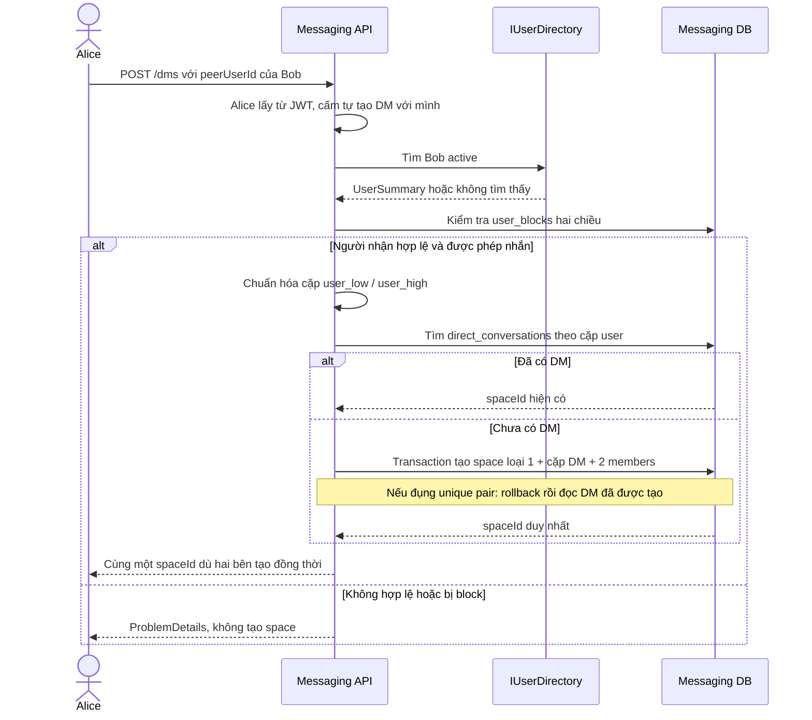

DB đã có unique `(user_low_id, user_high_id)` và điều kiện low < high. Ứng dụng
phải dùng cùng quy tắc so UUID với PostgreSQL, tạo đúng hai `space_members` còn
hoạt động và không để lại space mồ côi khi transaction thua tranh chấp.

**Chính sách đề xuất khi block:** không gửi tin hoặc bắt đầu cuộc gọi mới giữa
hai user; lịch sử cũ vẫn được đọc bởi người từng có quyền. Chính sách này phải
được kiểm tra lại ở M2/L1, không chỉ lúc tạo DM. Với group, kiểm tra membership
và quyền gửi của group; không áp điều kiện “đúng hai người” của DM.

**Nghiệm thu M1:** Alice→Bob và Bob→Alice cùng nhận một space; Charlie không
đọc được space này; hai request tạo đồng thời không tạo hai DM; Community chưa
triển khai vẫn không ảnh hưởng các ca trên.

## 7. M2 — Messaging: gửi, lưu, lấy lịch sử và cập nhật tin

| API đề xuất | Quyền/đầu ra |
|---|---|
| `POST /spaces/{spaceId}/messages` | Body `clientMessageId, content, fileIds`; trả DTO tin đã commit. |
| `GET /spaces/{spaceId}/messages?beforeSequence=...&limit=...` | Lịch sử cũ theo cursor, có giới hạn page size. |
| `GET /spaces/{spaceId}/messages?afterSequence=...&limit=...` | Bù tin mới khi reconnect; lấy hết các trang trước khi đánh dấu đồng bộ xong. |
| `PATCH /spaces/{spaceId}/messages/{messageId}` | Tác giả hoặc quyền quản lý; optimistic concurrency bằng version. |
| `DELETE /spaces/{spaceId}/messages/{messageId}` | Soft delete theo chính sách; lưu tombstone/version để đồng bộ client. |
| `PUT /spaces/{spaceId}/read-state` | Chỉ cập nhật tiến tới một sequence hợp lệ trong space đã được phép đọc. |

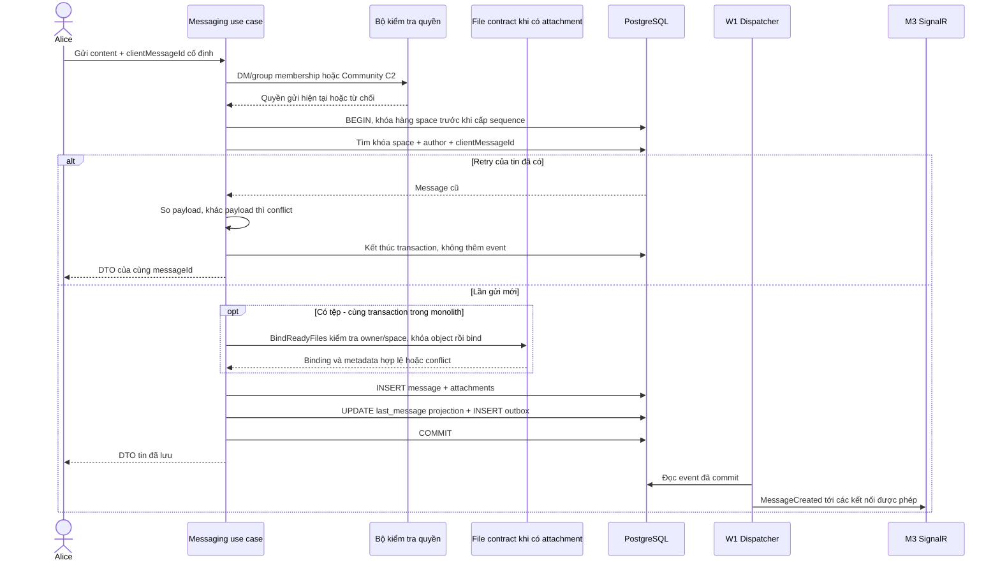

`MessageDto` đề xuất: `id, spaceId, author, clientMessageId, sequenceNo,
content, attachments, version, createdAt, editedAt, deletedAt`. Actor lấy từ JWT,
không lấy từ `authorUserId` trong body. Khi response bị mất, client retry cùng
`clientMessageId`; DB đã có unique `(space_id, author_user_id, client_message_id)`.

`fileIds` là ID upload/object do File cấp; `attachmentId` do Messaging tạo sau
khi gắn vào message. MVP dùng `message_type=1` cho text không rỗng; có tệp thì
dùng type `3` với ít nhất một file hợp lệ, caption có thể rỗng. Type `2` chỉ do
backend tạo system message. Không nhận `message_type` tùy ý từ client.

**Thứ tự và cursor:** `sequence_no` hiện là identity **toàn cục**, có khoảng
trống và không tự bảo đảm thứ tự commit. Thiết kế MVP chọn khóa hàng `spaces`
trước INSERT message, giữ tới commit, áp dụng cho **mọi** writer kể cả system
message. Nhờ đó các message trong cùng space không commit ngược sequence. Đây
là quy tắc mới cần code và kiểm thử; không suy ra từ index hiện có.

Hợp đồng phân trang đề xuất: `beforeSequence` trả trang theo DESC; catch-up
`afterSequence` trả ASC. Response có `items`, `nextCursor`, `hasMore` và
`snapshotHighWaterSequence`. Lần đầu chốt high-water đã commit của space; các
trang catch-up giữ nguyên mốc đó và lọc `after < sequence <= highWater`. Cursor
chỉ tiến sau khi merge trang thành công; tới high-water khi đã lấy hết trang.
Mốc này cố định tập tin mới cần bù, không đóng băng các edit/delete đang diễn ra.

Response/history sắp xếp theo sequence; realtime có thể đến trễ, trùng hoặc
khác thứ tự. Client merge theo `messageId`, chỉ áp dụng version mới hơn. Không
dùng `max(sequenceNo đã thấy realtime)` làm cursor xác nhận đã đồng bộ: giữ
cursor theo snapshot HTTP đã lấy đủ trang, trong lúc đó buffer rồi merge event.
Không dùng hiệu hai sequence làm unread count vì sequence có khoảng trống và
dùng chung toàn bảng.

Sửa/xóa tin cũ không làm tăng sequence tạo tin. MVP phải tải lại cửa sổ lịch sử
đang xem khi reconnect để cập nhật edit/delete; muốn đồng bộ đầy đủ lịch sử
offline cần thêm change feed/cursor theo thay đổi. Reaction, pin, mention và
thread dùng cùng bước kiểm tra quyền → transaction → outbox; reply/thread phải
trỏ tới tin cùng space. `last_read_sequence` cập nhật đơn điệu và không vượt
tin mà user được phép truy cập.

**Nghiệm thu M2:** retry không tạo tin trùng; DB rollback không phát event;
gửi đồng thời không làm cursor bỏ sót tin; mất realtime vẫn đọc được lịch sử;
user ngoài space bị từ chối; sửa/xóa từ client cũ bị xử lý conflict rõ ràng.

## 8. M3 — SignalR: kết nối, nhận tin và khôi phục sau mất mạng

**ĐỀ XUẤT:** hub `/hubs/chat`, methods `JoinSpace`, `LeaveSpace`, `Typing`;
events `MessageCreated/Updated/Deleted`, `TypingChanged`, `CallStateChanged`,
`AccessChanged`. Mutation tin nhắn đi qua HTTP M2; hub phụ trách subscription
và tín hiệu ngắn hạn để chỉ có một đường ghi tin.

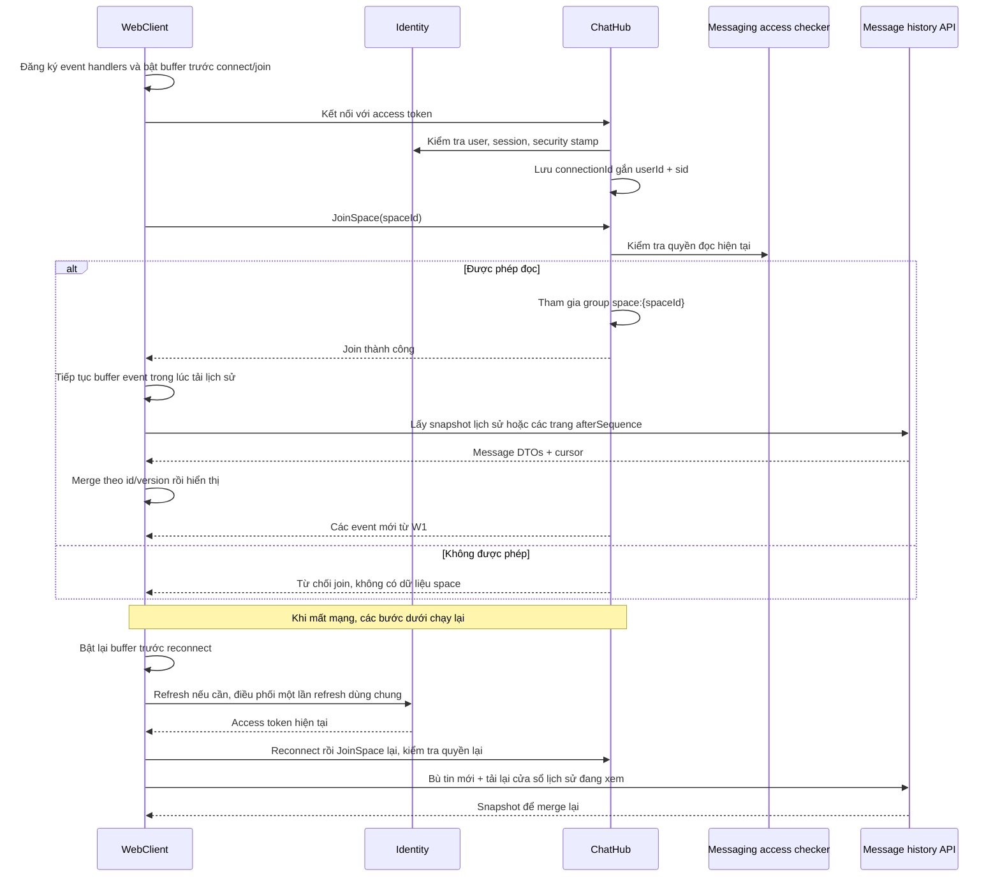

Việc tích hợp phải cấu hình `IUserIdProvider` lấy claim `sub`, vì Identity đang
`MapInboundClaims=false`. Browser dùng `accessTokenFactory`; nếu nhận token
qua query string thì chỉ xử lý trên đường dẫn hub và tránh ghi token vào log.
Bật `CloseOnAuthenticationExpiration` rồi reconnect với token mới; hub method
vẫn cần kiểm tra quyền/session hiện tại. Đóng khi hết hạn không thay thế revoke
session trước hạn. [Nguồn: SignalR authentication](https://learn.microsoft.com/en-us/aspnet/core/signalr/authn-and-authz?view=aspnetcore-10.0).

Nhóm SignalR là tập connection, không phải quyền nghiệp vụ. Lưu ánh xạ
`userId → sid → connectionId → spaceIds`; R1 dùng nó để loại connection đã bị
thu hồi. Một node dùng memory; nhiều node cần registry/control event tới từng
node. Redis backplane phát message giữa node, không tự quản lý đầy đủ registry
và thu hồi nghiệp vụ. [Nguồn: SignalR groups](https://learn.microsoft.com/en-us/aspnet/core/signalr/groups?view=aspnetcore-10.0).

Typing/presence là dữ liệu tạm: rate limit typing, dùng TTL/heartbeat cho
presence; nhiều thiết bị thì user chỉ offline khi không còn connection sống.
Presence chỉ hiển thị cho người được phép thấy; không cần ghi outbox cho từng
heartbeat. Thông báo cuộc gọi đến gửi tới các session hợp lệ của người nhận,
kể cả khi họ chưa mở space, qua định tuyến user/session do server quyết định.

**Nghiệm thu M3:** hai trình duyệt nhận tin ngay; refresh trang không mất lịch
sử; reconnect không làm nhân đôi tin; không tự join group bằng ID đoán được;
token hết hạn/revoke không tiếp tục nhận dữ liệu; hai node nhận được tin chéo
node khi bật backplane ở mốc mở rộng.

## 9. C1 — Community: tạo server, tham gia và mở channel

**Đầu vào:** user active tạo server, nhận lời mời, quản lý channel/role.
**Đầu ra:** membership và metadata channel; Messaging vẫn lưu nội dung chat.

| API đề xuất | Dữ liệu và kiểm tra |
|---|---|
| `POST /servers`, `GET /servers` | Tạo server + owner membership + default role trong transaction; list chỉ server được phép thấy. |
| `POST /servers/{serverId}/invites` | Kiểm tra `invite_members`; lưu hash invite code, hạn và số lượt dùng. |
| `POST /invites/{code}/join` | Kiểm tra code, ban, expiry, max uses; tăng use count và tạo membership nguyên tử. |
| `POST /servers/{serverId}/channels` | Kiểm tra `manage_channels`; cấp phát space rồi lưu channel metadata. |
| `GET /servers/{serverId}/channels` | Lọc bằng quyền đọc, không trả toàn bộ private channel rồi ẩn ở UI. |
| API roles, overrides, kick/ban | Kiểm tra quyền quản trị và thứ bậc role; đổi dữ liệu + event để R1 thu hồi. |

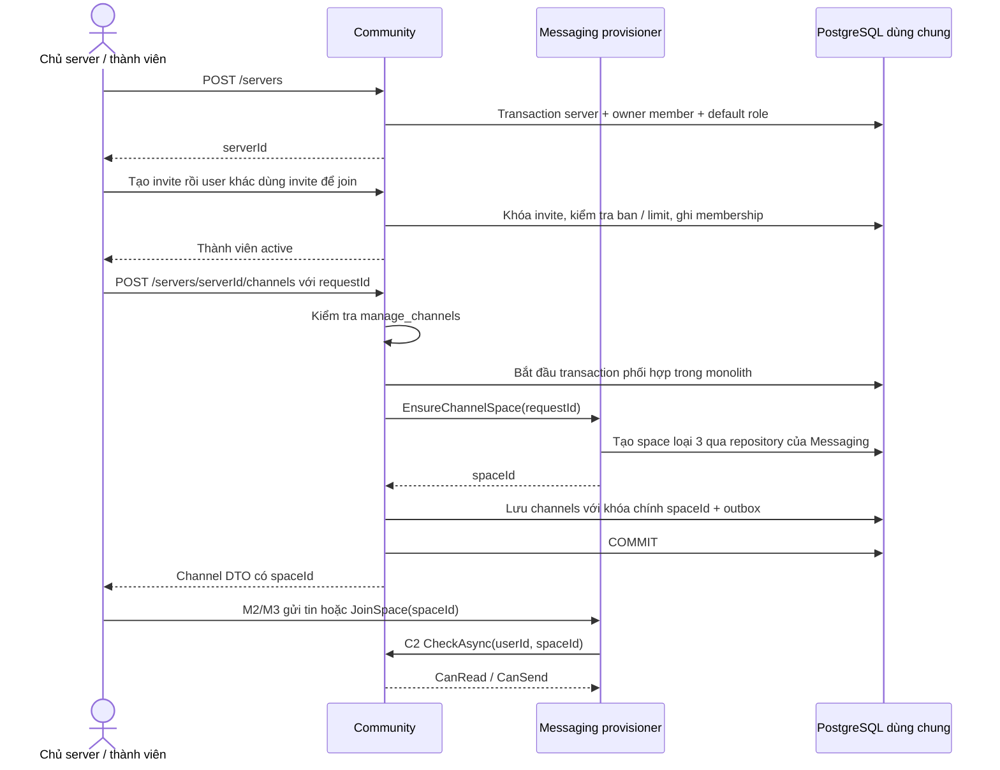

Hiện `community.channels.space_id` chính là ID channel và FK tới
`messaging.spaces`. Không phát minh một `channelId` khác rồi bỏ qua ánh xạ.
Trong monolith, transaction phối hợp cần dùng chung connection/transaction
qua lớp orchestration; business code không tự sửa DbContext của module khác.

Khi tách hai database, đổi bước tạo channel thành:
`pending → provision space idempotently → active`. Retry cùng `requestId` trả
cùng space; nếu bước sau thất bại thì retry hoặc dọn space mồ côi. Cần thêm
trạng thái/provisioning request và bỏ FK xuyên database bằng migration. Không
giả định hai HTTP request có thể nằm trong một SQL transaction.

**Nghiệm thu C1:** invite hết hạn/hết lượt/bị revoke không join được; hai lượt
join cuối tranh chấp không vượt max uses; owner có role đúng; tạo channel thất
bại không để channel active nhưng không có space; list không lộ private channel.

## 10. C2 — Community: tính quyền đọc/gửi và quyền voice

Đây là **thuật toán đề xuất**, cần thống nhất và kiểm thử; schema chỉ lưu dữ
liệu, chưa định nghĩa precedence. Dùng tập permission code đang có như
`read_messages`, `send_messages`, `attach_files`, `manage_channels`.

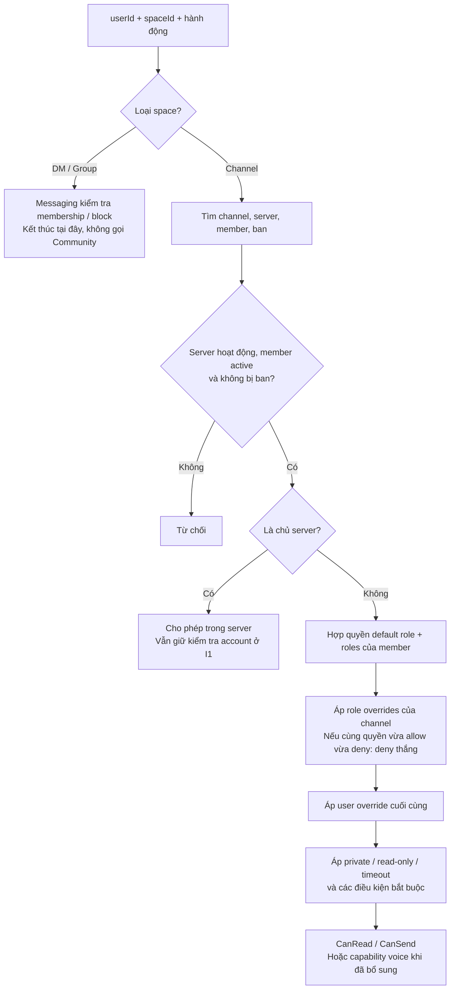

Chính sách MVP cần cố định: private channel chỉ đọc khi có grant channel rõ
ràng cho user/role; `read-only` chặn gửi của thành viên thường; người có quyền
quản lý thích hợp được phép theo chính sách đã chốt. Timeout chặn gửi/tham gia
voice nhưng có thể giữ quyền đọc. Ban hoặc rời server chặn truy cập channel.
Owner chỉ được bypass trong server của mình, không bypass account suspended/
disabled/deleted hoặc session đã bị thu hồi. Login lockout do nhập sai password
không đồng nghĩa tự hủy mọi session đang có trong Identity hiện tại.

`CanSend` phải kéo theo `CanRead`; user có grant gửi nhưng bị deny đọc thì vẫn
không được gửi. Kiểm tra space còn active trước mutation ở cả DM/group/channel;
space archived chỉ đọc nếu chính sách cho phép, space deleted không truy cập.

Interface hiện tại chỉ trả `CanRead, CanSend`. Khi thêm attachment cần kiểm
tra thêm `attach_files`; khi thêm voice cần migration cho `channel_kind`,
category nếu dùng, và các code đề xuất `connect_voice`, `speak`, `video`,
`share_screen`. Đưa các quyết định này vào contract riêng hoặc phiên bản mở
rộng, không suy ra `CanSend=true` nghĩa là được share màn hình.

Cache quyền chỉ thêm sau khi correctness ổn định: khóa theo user/channel và
version quyền, event invalidation + TTL. Với thu hồi, cập nhật DB nguồn trước,
gửi sự kiện R1, chặn các thao tác mới bằng trạng thái hiện hành. Test phải bao
gồm role vừa đổi khi connection vẫn đang ở group; cache không có quyền tự gia
hạn một quyết định cho phép cũ.

**Nghiệm thu C2:** bảng test tổ hợp base/allow/deny/user override; private,
read-only, timeout, owner và ban; gọi cùng quyết định cho list/history/send/
JoinSpace. Messaging từ chối channel khi checker chưa có implementation hoặc
Community không trả được kết quả, trong khi nhánh DM vẫn hoạt động.

## 11. F1 — File: upload, xác nhận, gắn tin nhắn và download

**Dữ liệu bổ sung:** `files.uploads`, `files.objects` và quan hệ tham chiếu
object–message. Upload record phải tồn tại **trước** message; không dùng
`messaging.attachments` làm upload session vì bảng hiện tại bắt buộc `message_id`.

**API đề xuất:** `POST /files/uploads`, `POST /files/uploads/{fileId}/complete`,
`GET /files/{fileId}`, `POST /files/{fileId}/download-url`.
Trạng thái đề xuất: `pending → processing → ready` hoặc `rejected/expired`.

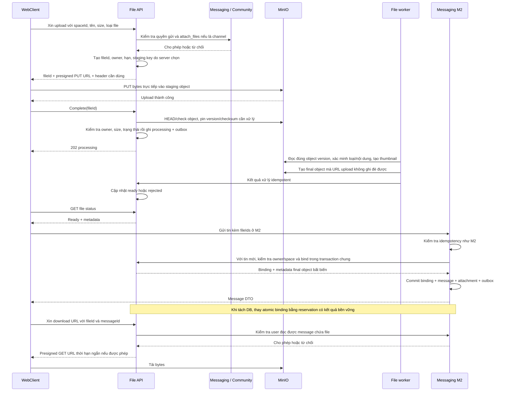

Presigned PUT có thể dùng lại trước khi hết hạn và có thể ghi đè cùng key.
Vì vậy không phát URL ghi vào final object. Pin phiên bản/checksum lúc complete,
xử lý đúng phiên bản, rồi seal sang key/version chỉ backend được ghi. Upload
lại staging không được thay nội dung attachment đã duyệt. Cần kiểm chứng thao
tác version/copy tương ứng với MinIO được chọn. [Nguồn: S3 presigned URLs](https://docs.aws.amazon.com/AmazonS3/latest/userguide/using-presigned-url.html).

Complete phải idempotent; MIME client khai báo chỉ là gợi ý. Object chưa ready
không được attach/download. Chính sách size/type và kiểm tra nội dung được đặt
trong File, lỗi hiển thị trên UI thay vì tạo tin có tệp hỏng. Gửi lại M2 cùng
`clientMessageId` không nhân đôi attachment hoặc tham chiếu file.

Schema attachment hiện unique `(storage_provider, bucket_name, object_key)`.
Vì vậy MVP chọn **một final object gắn vào một message**; retry cùng message
được phép, gửi cùng file trong message khác trả conflict. Forward/tái dùng file
cần object riêng hoặc migration, không mặc định là quan hệ nhiều-nhiều.

Trong monolith, `BindReadyFiles` khóa/cập nhật File record và ghi attachment
trong cùng transaction dùng chung connection, qua contract của File. GC chỉ
được chuyển object **chưa bind** sang `deleting` bằng cập nhật có điều kiện;
bind không nhận object ở trạng thái deleting. Thời gian chờ đơn thuần không đủ
ngăn race giữa gửi tin và dọn file.

Khi tách DB, File reserve object bằng operation ID ổn định trước khi Messaging
commit; kết quả commit/cancel được lưu bền vững để finalize/release reservation.
GC không xóa object đang reserved hoặc chưa rõ kết quả; timeout mạng không
được coi là rollback. Cần job đối soát operation qua contract và chặn writer
đã cancel trước khi release. Đây là protocol bổ sung bắt buộc ở D1.

Không thể transaction nguyên tử cả PostgreSQL lẫn object storage. Worker dọn
upload hết hạn và staging rác; với final object, GC đi qua trạng thái/binding
ở trên rồi đối soát tham chiếu trước khi xóa. Download URL đã cấp có thể dùng
tới lúc hết hạn; việc
ban user chặn cấp URL mới, không mặc định vô hiệu ngay mọi URL đã cấp.

**Nghiệm thu F1:** user khác không complete/attach file của Alice; không đọc
attachment ở DM của người khác; upload thiếu/hỏng/quá giới hạn không ready;
retry không tạo rác vô hạn; URL PUT cũ không thay được final object; quyền đọc bị thu hồi
thì không xin được URL download mới.

## 12. L1 — Calls: gọi DM, gọi nhóm và share màn hình

Calls sở hữu lời mời, người được tham gia, timeout và lịch sử trạng thái.
LiveKit sở hữu kết nối/phòng media thực tế. Một người đã nhấn “chấp nhận” chưa
có nghĩa media đã kết nối; L2 phân biệt hai việc này.

| API đề xuất | Trách nhiệm |
|---|---|
| `POST /calls { spaceId, clientRequestId }` | Kiểm tra quyền rồi tạo call; retry trả call cũ. |
| `GET /calls/{callId}`, `GET /calls?state=active` | Khôi phục UI sau reload hoặc bỏ lỡ thông báo. Chỉ trả call user được thấy. |
| `POST /calls/{callId}/accept`, `/decline` | Kiểm tra user nằm trong danh sách mời; chuyển trạng thái có version. |
| `POST /calls/{callId}/join-token` | Kiểm tra lại session, call state, membership/block/quyền voice rồi cấp token. |
| `POST /calls/{callId}/leave`, `/end` | Leave của chính user; end toàn cuộc gọi cần quyền tương ứng. |
| `POST /webhooks/livekit` | Nhận webhook có chữ ký LiveKit; không dùng JWT của người dùng cho endpoint này. |

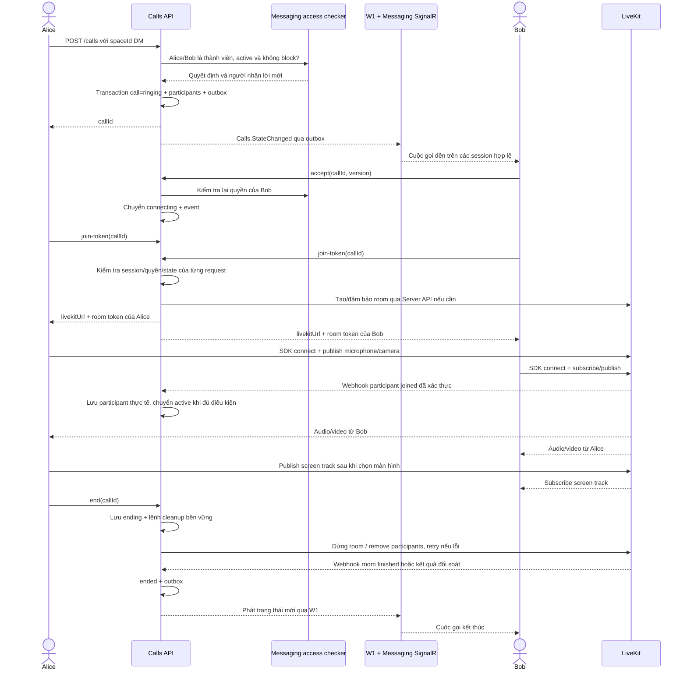

Token LiveKit do backend ký, giới hạn room, participant và quyền publish/
subscribe; SCDC JWT chỉ xác thực yêu cầu xin token. Room/participant dùng ID
opaque, không chứa email. Mapping đề xuất là `callId + userId + sid` tới một
participant identity; cho phép thu hồi đúng thiết bị. [Nguồn: LiveKit grants](https://docs.livekit.io/frontends/reference/tokens-grants/).

Screen share là media track riêng; quyền publish screen được cấp riêng với
camera/microphone. Browser yêu cầu người dùng chọn nội dung chia sẻ; có hay
không audio màn hình phụ thuộc nền tảng và lựa chọn của người dùng. UI phải
xử lý từ chối quyền, stop share và chuyển thiết bị. [Nguồn: LiveKit screen sharing](https://docs.livekit.io/transport/media/screenshare/).

**DM/group call:** ACL tới Messaging. **Voice channel:** ACL tới Community và
`IVoiceAccessChecker`; phòng có thể hoạt động như phòng luôn sẵn sàng tham gia,
không bắt buộc ringing/accept như DM. Dùng lại token, media, webhook và revoke,
nhưng không áp máy trạng thái lời mời DM một cách máy móc cho phòng cộng đồng.
Tính năng voice channel chờ migration/permission của C2; gọi DM không cần chờ.

### L2 — Trạng thái cuộc gọi DM và các trường hợp thất bại

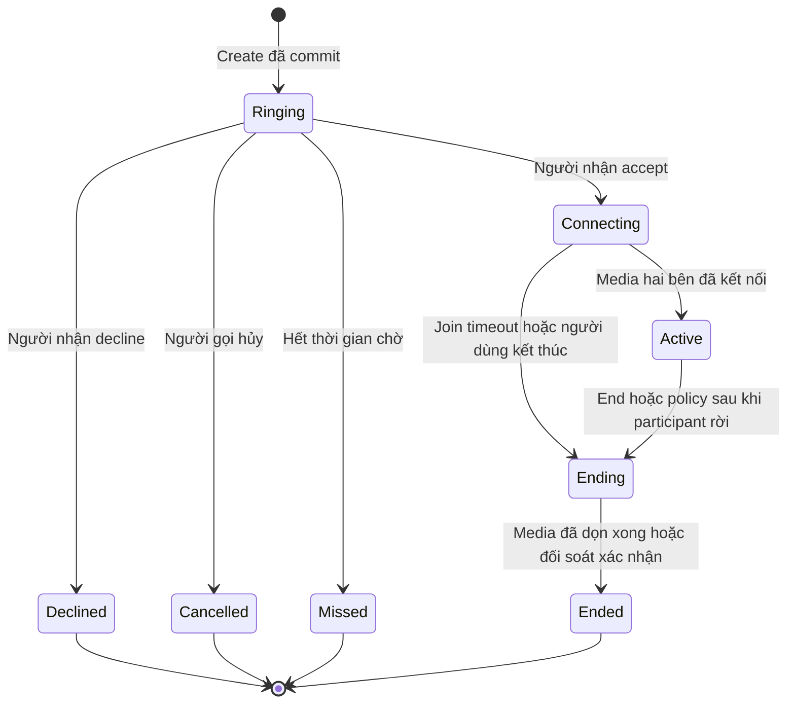

Mỗi transition kiểm tra version và quyền; hai thiết bị accept/decline đồng
thời chỉ có một kết quả thắng. Phân biệt participant rời với kết thúc call:
DM có thể end khi một bên rời sau grace period; group chỉ end khi trống hoặc
người có quyền kết thúc. Chốt số cuộc gọi đồng thời cho một user/space ở mốc L1.

Webhook phải xác thực JWT và hash trên raw body, dedup theo event ID; ACK sau
khi đã lưu bền vững vào inbox. LiveKit retry nhưng không bảo đảm mọi webhook
đều tới được. Vì vậy thêm job đối soát phòng/participants với Server API;
event đến trễ không được kéo `Ended` về `Active`. [Nguồn: LiveKit webhooks](https://docs.livekit.io/intro/basics/rooms-participants-tracks/webhooks-events/).

Không giữ SQL transaction khi gọi Server API. Khi LiveKit chưa sẵn sàng,
trả trạng thái/lỗi có thể retry và không hiển thị “đang kết nối thành công”.
Call ở `Ending` từ chối token mới; worker retry cleanup tới khi xác nhận room
đã đóng. Cả nút cancel lẫn join timeout cũng phải dọn room nếu đã tạo trước đó.

**Nghiệm thu L1/L2:** hai user nghe/gọi video/share screen; người ngoài không
xin token được; accept/decline đồng thời nhất quán; caller hủy/receiver offline
có trạng thái cuối; webhook trùng không nhân đôi event; mất webhook có job sửa
trạng thái; LiveKit lỗi không làm hỏng chat văn bản.

## 13. W1 — Workers: từ transaction đến event đã xử lý

**Bắt đầu nhỏ:** một hosted worker trong `SCDC.Api`, một replica, dispatcher
gọi handler in-process. RabbitMQ chưa cần cho demo DM. Khi worker/consumer tách
process mới thêm broker hoặc API nội bộ bền vững như phần D1.

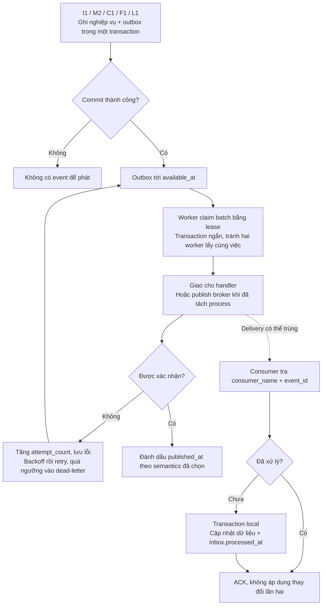

Bảng outbox hiện có `available_at`, `published_at`, `attempt_count`, `last_error`,
nhưng chưa có lease/dead-letter. Đề xuất bổ sung `locked_by`, `locked_until`,
claim token và trạng thái lỗi cuối; worker chết thì việc được lấy lại khi lease
hết hạn. Chỉ worker đang giữ claim được đánh dấu xong. Không giữ khóa SQL trong
suốt lần gọi SMTP/network; cần heartbeat lease cho tác vụ dài.

`published_at` ở MVP nghĩa là handler đã nhận/xử lý theo hợp đồng; khi dùng
broker nó nghĩa là broker đã confirm, không phải mọi consumer đã xong. Một
event có nhiều consumer cần delivery/inbox riêng theo consumer, không để một
handler email thành công khiến handler realtime chưa chạy bị bỏ qua.

Hai cửa sổ lỗi cần chấp nhận và xử lý: crash sau gửi nhưng trước đánh dấu xong
sẽ gửi lại; crash trước commit sẽ không có thay đổi. Đây là **at-least-once**,
không tuyên bố exactly-once cho hệ thống. Với consumer ghi DB, ghi inbox cùng
transaction side effect. Với SignalR/SMTP/LiveKit, không thể gộp external side
effect vào SQL transaction: dùng event/request ID ổn định, retry an toàn và
đối soát. Email có thể bị gửi lặp nếu provider không hỗ trợ idempotency.

W1 chuyển message event vào realtime handler của Messaging; handler resolve
recipients/quyền hiện hành trước khi phát. Outbox thành công không chứng minh
browser đã nhận. Redis Pub/Sub không phải durable queue; client khôi phục bằng
M2/M3. [Nguồn: Redis backplane](https://learn.microsoft.com/en-us/aspnet/core/signalr/redis-backplane?view=aspnetcore-10.0#redis-server-errors).

**Nghiệm thu W1:** dừng worker sau commit rồi bật lại vẫn phát event; crash
sau side effect không nhân đôi dữ liệu; event hỏng không chặn toàn hàng đợi;
có số liệu backlog, tuổi event lâu nhất, retry và dead-letter; có thao tác
replay được ghi audit. Inbox độc lập theo consumer.

### W2 — Email xác thực/reset: phần còn thiếu của Identity

Outbox hiện chứa `account_token_id`, còn `identity.account_tokens` chỉ lưu hash.
Worker **không thể khôi phục token gốc từ hash** để gửi link. Vì vậy triển khai
SMTP đơn thuần chưa đủ; cần bổ sung cơ chế bàn giao token.

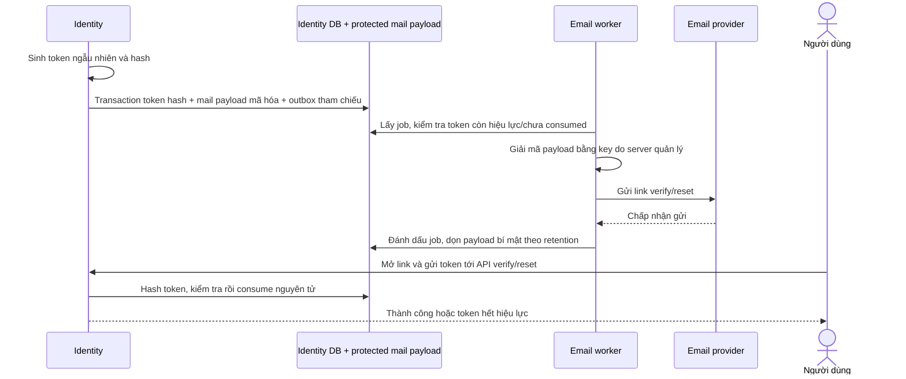

`protected mail payload` là **đề xuất cần migration**, không phải bảng hiện có.
Payload chứa token được mã hóa, có hạn dùng và key nằm ngoài DB; outbox/log/
broker chỉ mang tham chiếu. Worker bỏ job của token cũ đã consumed/hết hạn.
Retry email có thể gửi lại cùng link; tiêu thụ token vẫn chỉ thành công một lần.
Development có thể dùng token do API expose theo cấu hình hiện có để demo M1,
không dùng cơ chế đó làm email production.

## 14. R1 — Một thay đổi quyền tác động tới các service thế nào?

Các nguồn: user logout một session; đổi/reset mật khẩu; Community kick/ban/đổi
role; user block DM. Phải phân biệt `sid`, toàn user và danh sách `spaceId` bị
thu hồi, để ban ở một server không làm mất DM hoặc session ở nơi khác.

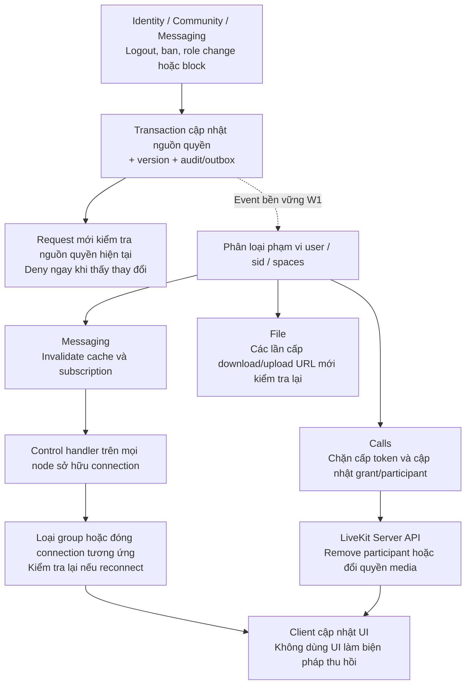

Identity hiện chưa phát `SessionRevoked` từ logout/logout-all/revoke-session;
phải bổ sung event và consumer. Event thay đổi password cần khiến toàn session
của user mất hiệu lực. `IRealtimeAccessRevoker` hiện chỉ có user+spaces; bổ sung
contract theo `sid` và mapping node/connection ở M3. `IHubContext` phát event
“logout” cho client không đủ: node phải thực sự loại connection khỏi routing
hoặc đóng kết nối bằng cơ chế phía server.

Join group và revoke có thể chạy đồng thời: cần kiểm tra version quyền trước
và sau khi đăng ký subscription, loại ngay subscription nếu version đã đổi.
Handler phát tin kiểm tra subscription/session còn hiệu lực, và các node
đối soát định kỳ để phục hồi khi bỏ lỡ control event. Quy định và đo độ trễ thu
hồi; không hứa tức thời tuyệt đối qua một đường event bất đồng bộ.

Với LiveKit self-hosted, `RemoveParticipant` không làm token cũ mất hiệu lực.
Phải chặn cấp token mới, dùng TTL ngắn và xử lý rejoin; vẫn có cửa sổ dùng lại
token. Nếu yêu cầu thu hồi tức thời tuyệt đối, phải chọn cơ chế triển khai hỗ
trợ revocation thích hợp trước khi nghiệm thu, không coi “đã kick” là đủ.
[Nguồn: LiveKit token revocation](https://docs.livekit.io/frontends/reference/tokens-grants/#token-revocation).

**Nghiệm thu R1:** revoke một thiết bị chỉ ngắt thiết bị đó; đổi password ngắt
mọi session; ban server không ngắt DM; role giảm quyền không còn nhận message
channel sau thời hạn thu hồi đã cam kết; kiểm tra cả token LiveKit cũ và URL
file cũ, ghi rõ giới hạn self-hosted/URL TTL.

## 15. D1 — Triển khai chức năng trước, tách process sau

### 15.1. Topology tối thiểu cho DM và cách mở rộng

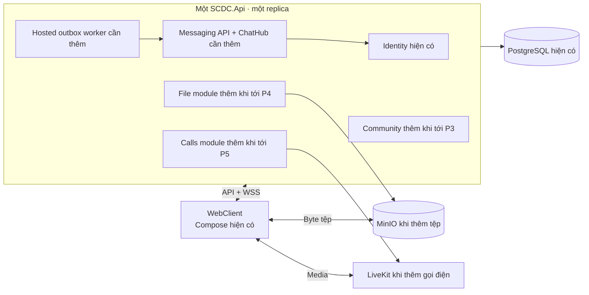

P1/P2 chỉ cần API, WebClient và PostgreSQL; thêm hub/worker vào API, không chờ
gateway, broker, Kubernetes hoặc Redis. Bật tính năng theo module/config để
thiếu MinIO/LiveKit không làm API chat không khởi động được.

| Khi nào thêm? | Thành phần | Điều kiện cấu hình/kiểm tra |
|---|---|---|
| Có nhiều Messaging replica | Redis App + routing affinity | Redis backplane, registry connection, control event tới từng node, TTL presence; một node chưa cần Redis. |
| Có upload | MinIO | Bucket private, staging/final, CORS đúng origin, endpoint ký URL phải tới được từ browser. |
| Có calls | LiveKit + TURN | URL WSS có TLS; media UDP/TCP/TURN và public IP đúng môi trường, test hai mạng khác nhau. |
| Nhiều LiveKit node | Redis LiveKit | Vai trò điều phối LiveKit riêng với backplane ứng dụng. |
| Tách worker/service | Broker, ví dụ RabbitMQ | Durable delivery, publisher confirm, consumer inbox, retry/DLQ; chọn khi thực sự tách process. |
| Nhiều API host | YARP/gateway | Route `/api/v1/*`, `/hubs/chat`, webhook; proxy WSS, CORS, timeout, rate limit. Backend vẫn kiểm tra auth/quyền. |

SignalR nhiều node thường cần sticky sessions kể cả có Redis; chỉ bỏ affinity
khi đáp ứng trường hợp hỗ trợ, chẳng hạn toàn client WebSocket-only và bỏ
negotiation. [Nguồn: SignalR scale-out](https://learn.microsoft.com/en-us/aspnet/core/signalr/scale?view=aspnetcore-10.0#sticky-sessions).

Media LiveKit đi trực tiếp từ client tới hạ tầng LiveKit/TURN, không qua route
HTTP của YARP. Mở đúng cổng theo cấu hình triển khai, không mặc định chỉ reverse
proxy HTTPS là đủ cho WebRTC. [Nguồn: triển khai LiveKit](https://docs.livekit.io/transport/self-hosting/deployment/).

### 15.2. Điều kiện thật sự để tách service/database

1. **Auth:** middleware hiện đọc `IdentityDbContext`; tạo adapter kiểm tra
   session hoặc bản sao trạng thái có thời hạn thu hồi rõ ràng. Với JWT hiện
   ký HS256, host biết signing key cũng có thể ký token; trước khi phân phối
   nhiều service nên chuyển mô hình khóa ký riêng/khóa verify công khai cùng
   cơ chế phân phối và xoay khóa. Đây là công việc mới, không có JWKS sẵn.
2. **Schema ownership:** có FK từ Messaging/Community tới Identity và từ
   Community tới Messaging. Nếu tách DB, bỏ FK xuyên DB bằng migration sau khi
   đã có contracts, projection và quy tắc xử lý reference mất hiệu lực.
3. **Transaction:** tạo channel ở C1 đổi sang orchestration có pending/retry/
   compensation; không dùng transaction xuyên hai connection khác DB.
4. **Outbox:** mỗi service có outbox trong **cùng database với business data**.
   Không chuyển tất cả outbox sang một DB integration riêng rồi vẫn gọi là
   atomic. Inbox cũng nằm cạnh side effect của consumer.
5. **Data migration:** backfill → kiểm tra đối chiếu → cutover writer duy nhất
   → theo dõi → rollback plan. Khi chưa cần tách DB, có thể tách host nhưng
   tiếp tục chung PostgreSQL theo schema; phải gọi đúng là bước chuyển tiếp.
6. **Vận hành:** readiness, timeout, retry có giới hạn, trace xuyên service,
   backup/restore và kiểm thử failure giữa service trước khi tăng replica.

`schema.sql` đang được Compose mount vào thư mục init của PostgreSQL. Database
đã có volume không tự nhận mọi chỉnh sửa từ file này; các thay đổi File/Calls/
permission/worker cần migration có version và kiểm tra nâng cấp từ DB hiện có.
Không dùng xóa volume làm quy trình nâng cấp dữ liệu.

### 15.3. Theo dõi một yêu cầu qua nhiều service

Truyền `correlationId/traceId` từ HTTP sang outbox/consumer; log thêm `spaceId`,
`messageId`, `callId` khi phù hợp. Theo dõi latency API, lỗi quyền/phụ thuộc,
tuổi outbox, consumer retry, kết nối/reconnect, thời gian setup call, webhook
lag và backlog xử lý tệp. Không log JWT, refresh token, mail token hoặc URL có
chữ ký. Health endpoint phân biệt host còn sống với dependency đã sẵn sàng.

## 16. P1 — Các phần có thể giao và nghiệm thu riêng

Mỗi mốc phải demo được trước khi mốc tiếp theo phụ thuộc vào nó. Các nhánh sau
P2 chạy song song; sơ đồ không yêu cầu hoàn thành Community trước khi gọi DM.

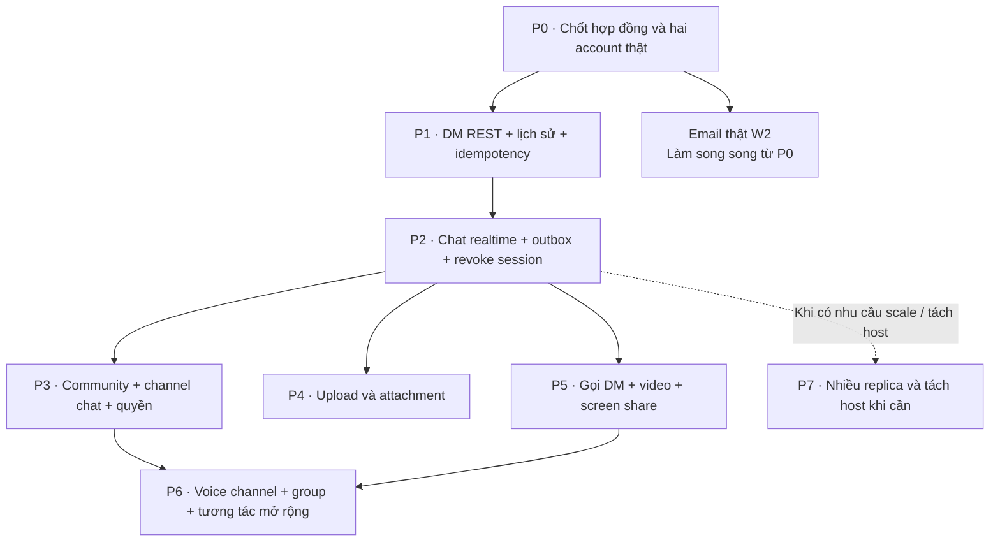

| Mốc | Gói việc bàn giao | Phụ thuộc | Demo/nghiệm thu bắt buộc |
|---|---|---|---|
| **P0 — nền tảng** | JWT/sub/sid; directory; ProblemDetails; DTO/API/event v1; hai account active; quyết định migration | Identity hiện có | Hai token gọi `/users/me` được; teammate dùng Swagger/fixture thật. Không dùng user seed làm mặc định có password đăng nhập. |
| **P1 — DM lưu được** | M1 + M2: create/list DM, send/history, membership/block, idempotency, transaction outbox | P0 | Hai user gửi và đọc tin qua HTTP; concurrent create/send, retry và rollback đúng; Community chưa cần. |
| **P2 — DM realtime** | M3 + W1 tối thiểu + R1 theo session; UI chat thật; history/reconnect | P1 | Hai browser nhận tin; worker restart phục hồi event; logout thiết bị không còn nhận tin; chưa cần Redis/broker. |
| **P3 — cộng đồng** | C1/C2, channel provisioning, role/override, invite/ban/kick, R1 theo space | P2, contract Community | Private channel không lộ; quyền đọc/gửi thống nhất; ban/kick loại realtime đúng phạm vi. |
| **P4 — tệp** | File schema/migration, F1, MinIO, thumbnail worker, attachment integration | P1 và UI P2 | Upload→ready→gửi→download hai user; sai owner/sai space bị từ chối; retry và cleanup đúng. |
| **P5 — gọi DM** | Calls schema/migration, L1/L2, LiveKit/TURN, signaling thông báo qua SignalR, webhook/reconcile | P2, không cần P3/P4 | Gọi 1-1/video/share screen qua hai mạng; offline/cancel/reject/rejoin/revoke có hành vi rõ. |
| **P6 — mở rộng** | Voice channel/capability; group chat/call; reaction/pin/thread/read receipt; report/moderation | P3 + P5 cho server voice; phần group làm sớm hơn nếu cần | Quyền media riêng với text; group membership thay đổi đúng; moderation gọi chủ sở hữu dữ liệu. |
| **P7 — phân tán** | Redis/backplane, nhiều API node, gateway, worker/broker; tách host/DB theo D1 | Các lát tính năng cần triển khai đã ổn định | Chat chéo node, node chết/reconnect, event retry, không bỏ sót revoke; migration và restore được kiểm chứng. |

Gói W2 có thể làm song song từ P0; cần hoàn thành trước khi mở đăng ký/quên mật
khẩu cho người dùng ngoài môi trường Development. Không đặt lịch cố định theo
tuần khi chưa ước lượng, dùng demo ở từng mốc làm điều kiện hoàn thành.
P7 có thể áp dụng riêng cho DM sau P2 nếu có nhu cầu tải; không bắt buộc chờ
đủ File, Calls và Community mới được tăng replica.

### Phần bạn và người làm chat có thể bắt đầu ngay

| Người phụ trách | Bàn giao ngay | Chưa cần chờ |
|---|---|---|
| **Bạn — Identity/Community** | Hai tài khoản/token dùng được; thống nhất `sub/sid`, directory, lỗi/API; user lookup cho UI; cùng chốt session revocation contract. Sau đó viết C1/C2. | Community đầy đủ, voice channel, gateway. |
| **Thành viên Messaging** | M1/M2, sau đó ChatHub + quyền join + registry/revoke + message handler W1. Dùng interface directory hiện có. | Role/permission Community ở nhánh DM, MinIO, LiveKit. |
| **Người làm frontend/tích hợp** | Login thật → chọn peer → mở DM → send/history → connect/reconnect. Sau P2 tách nhánh File hoặc Calls theo năng lực. | Sơ đồ microservices đã triển khai đủ container. |

Quyền sở hữu đề xuất: Messaging sở hữu code ChatHub và routing realtime; bạn
phụ trách tiêu chuẩn auth, hợp đồng Community và hạ tầng deploy. Hai bên chốt
contract một lần trước P1/P2, tránh cùng sửa một hub mà không có người chịu
trách nhiệm. File/Calls/Workers cần chỉ định owner cụ thể khi nhận mốc tương ứng.

### Một vòng demo nối toàn bộ sơ đồ

1. Alice và Bob đăng nhập qua **I1**, tạo DM qua **M1**.
2. Alice gửi tin qua **M2**; transaction tạo event, **W1** phát qua **M3** tới Bob.
3. Bob mất mạng rồi quay lại: **M3** xác thực/join lại, **M2** bù lịch sử.
4. Alice tạo server và invite Bob qua **C1**; chat channel dùng **C2** kiểm tra quyền.
5. Alice upload qua **F1**, tin nhắn **M2** tham chiếu final object; Bob tải khi có quyền đọc.
6. Alice gọi Bob qua **L1**, trạng thái theo **L2**; share màn hình đi qua LiveKit.
7. Bob logout thiết bị hoặc bị kick server: **R1** thu hồi đúng session/space,
   trong khi quyền ở các hội thoại khác được đánh giá độc lập.

Quay lại [bản đồ đọc tài liệu](#read-map) hoặc [kiến trúc tổng quan](overview.md).
