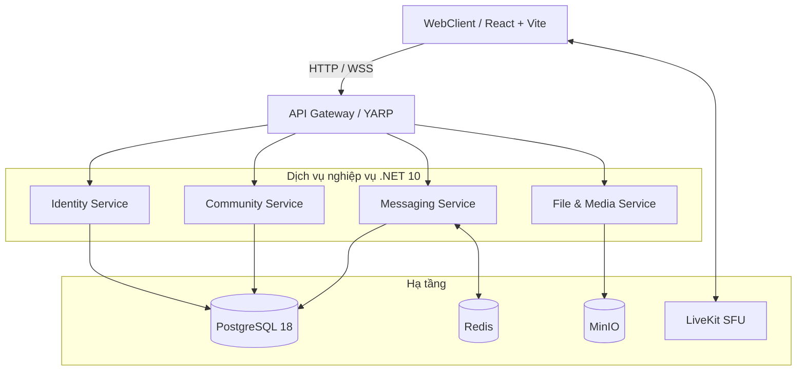

# Kiến trúc hệ thống SCDC

> Tài liệu gốc: [docs/architecture.md](../../architecture.md) · [Phác thảo giải pháp](../../archive/project-specs/05-architecture/01-solution-outline.md)

## Chiến lược: Monolith First

- **Giai đoạn 1 (Modular Monolith):** Các module được tách biệt bằng Class Library và schema PostgreSQL riêng. Giao tiếp qua `SCDC.Contracts`. Chạy chung trong `SCDC.Api` (cổng 5026).
- **Giai đoạn 2 (Microservices):** Bóc tách thành các dịch vụ độc lập (5001–5004), định tuyến qua YARP Gateway, giao tiếp qua gRPC/RabbitMQ.

## Sơ đồ kiến trúc

## Giải pháp kỹ thuật cốt lõi

| Giải pháp | Mô tả |
|---|---|
| **Bitwise RBAC** | Quyền mã hóa bằng mask 64-bit. DENY trước, ALLOW sau. |
| **Cursor Pagination** | Dùng cặp `(sequence_no, id)` thay OFFSET/LIMIT. Truy vấn <10ms. |
| **Idempotency** | `clientMessageId` + Unique Constraint chống trùng tin nhắn. |
| **SignalR + Redis Backplane** | Realtime qua WebSocket, mở rộng ngang với Redis. |
| **Result\<T\>** | Không dùng throw Exception cho lỗi nghiệp vụ. Chuẩn RFC 7807. |

---

📎 Chi tiết: [Kiến trúc gốc](../../architecture.md) · [Phác thảo giải pháp](../../archive/project-specs/05-architecture/01-solution-outline.md)
