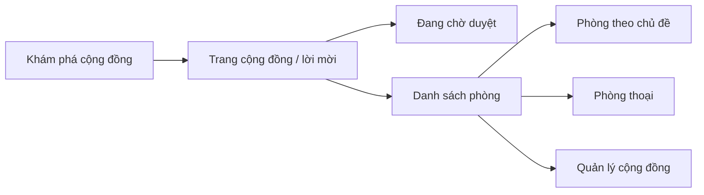

# Cộng đồng — Wireframes

> Tài liệu gốc: [SCDC-UX-COM-001](../../archive/project-specs/04-ux/03-community-wireframes.md) · [Luồng UX](../../archive/project-specs/04-ux/01-core-user-flows.md)

## Sơ đồ màn hình

## Các màn hình cần thiết kế

| Bước | Vùng giao diện | Phản hồi |
|---|---|---|
| Khám phá | Danh sách/tìm kiếm cộng đồng | Chỉ cộng đồng công khai |
| Tham gia tìm kiếm | Trang giới thiệu + thao tác | Vào ngay hoặc chờ duyệt |
| Tham gia lời mời | Xác nhận từ link mời | Hợp lệ → vào; hết hạn → thông báo |
| Xem phòng | Thanh điều hướng phòng | Chỉ hiện phòng có quyền xem |
| Nhắn tin phòng | Danh sách tin + vùng nhập | Sửa/xóa như DM |
| Quản lý | Tạo phòng, mời, duyệt | Chỉ hiện cho người có quyền |

---

📎 Chi tiết: [Wireframe cộng đồng](../../archive/project-specs/04-ux/03-community-wireframes.md)
