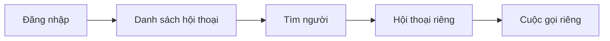

# Nhắn tin riêng (DM) — Wireframes

> Tài liệu gốc: [SCDC-UX-DM-001](../../archive/project-specs/04-ux/02-account-dm-wireframes.md) · [Luồng UX](../../archive/project-specs/04-ux/01-core-user-flows.md)

## Sơ đồ màn hình

## Các màn hình cần thiết kế

| Bước | Vùng giao diện | Phản hồi cần thể hiện |
|---|---|---|
| Tìm người | Ô tìm kiếm + danh sách kết quả | Khớp một phần tên; phân biệt trùng tên |
| Mở hội thoại | Khung chat | Tên người nhận + lịch sử tin nhắn |
| Gửi tin | Vùng nhập + danh sách tin | "Đã gửi" / lỗi + nút "Thử lại" |
| Sửa tin | Menu trên tin mình gửi | Nội dung mới + "Đã sửa" |
| Xóa tin | Menu trên tin mình gửi | "Tin nhắn đã bị xóa" |

**Trạng thái đặc biệt:** đang tìm, không có kết quả, chưa có tin, đang tải, lỗi tải, lỗi gửi, mất mạng.

---

📎 Wireframe chi tiết: [Tài khoản/DM](../../archive/project-specs/04-ux/02-account-dm-wireframes.md)
