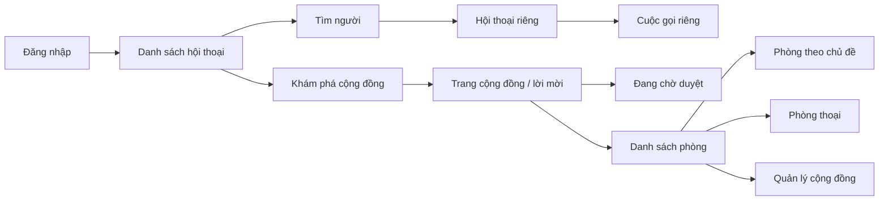

# SCDC — Luồng trải nghiệm cho nhắn tin, cộng đồng và cuộc gọi

| Thuộc tính | Giá trị |
|---|---|
| Mã tài liệu | SCDC-UX-001 |
| Phiên bản | 0.7 |
| Cập nhật | 2026-10-03 |
| Trạng thái | Bản nháp luồng và phác thảo màn hình — chưa đánh giá khả dụng |
| Căn cứ | [Đặc tả tài khoản](../03-requirements/03-accounts.md), [đặc tả DM](../03-requirements/01-direct-messaging.md), [đặc tả cộng đồng](../03-requirements/02-community-join-and-channels.md), [khung media](../03-requirements/04-voice-video-screen-sharing.md) |

## 1. Phạm vi

Tài liệu mô tả luồng và trạng thái giao diện dự kiến trên trình duyệt cho
hai hành trình ưu tiên, kèm luồng cuộc gọi ở mức khung. Đây là đầu vào để
Vg thiết kế màn hình và Thái triển khai, không phải bản thiết kế giao diện
đã xác nhận. Màn hình media cần bổ sung chi tiết sau khi chốt giới hạn và
quy tắc còn mở. Wireframe văn bản hiện có tại
[tài khoản/DM](02-account-dm-wireframes.md) và
[cộng đồng/quyền](03-community-wireframes.md); chưa có prototype tương tác
hoặc kết quả rà soát được xác nhận.

## 2. Nhắn tin riêng

Đăng nhập bằng email hoặc tên tài khoản với mật khẩu đã được xác nhận
(DEC-054). Trước xác minh email chỉ dùng xác minh/khôi phục, chưa vào
ứng dụng (DEC-051). DM chỉ giữ nội dung sửa mới nhất; mỗi tin tối đa
2.000 ký tự, cho xuống dòng/emoji và không nhận tin trống (DEC-052/053).
Chi tiết thời hạn liên kết và phiên còn ở SCDC-FR-ACC-001.

| Bước | Màn hình hoặc vùng giao diện dự kiến | Phản hồi cần thể hiện |
|---|---|---|
| Tìm người | Ô tìm kiếm người dùng và danh sách kết quả. | Kết quả khớp một phần tên tài khoản hoặc tên hiển thị; phân biệt các tài khoản trùng tên; thông báo khi không có kết quả. |
| Mở hội thoại | Khung hội thoại với người đã chọn. | Hiện đúng người nhận và lịch sử tin nhắn nếu đã có, gồm tin được lưu lúc người nhận vắng mặt. |
| Gửi tin | Vùng nhập văn bản và danh sách tin. | Tin được lưu hiện “Đã gửi”; tin không lưu được hiện lỗi và nút “Thử lại”; bấm lại cùng tin không tạo tin trùng. |
| Sửa tin | Thao tác trên tin do người dùng gửi. | Nội dung mới hiện cho hai bên với dấu “Đã sửa”. |
| Xóa tin | Thao tác trên tin do người dùng gửi. | Hai bên thấy dòng “Tin nhắn đã bị xóa” tại vị trí cũ. |

Trạng thái cần vẽ riêng: đang tìm, không có kết quả, chưa có tin nhắn, đang
tải lịch sử, lỗi tải, lỗi gửi, mất mạng và mở lại sau khi kết nối. Hành vi
với tin có kết quả gửi không rõ phải cho thấy quá trình thử lại, nhưng
chỉ một tin xuất hiện khi hệ thống đã lưu.

## 3. Tham gia cộng đồng

| Bước | Màn hình hoặc vùng giao diện dự kiến | Phản hồi cần thể hiện |
|---|---|---|
| Khám phá | Danh sách/tìm kiếm cộng đồng. | Chỉ cộng đồng công khai xuất hiện; có trạng thái không có kết quả. |
| Tham gia qua tìm kiếm | Trang giới thiệu cộng đồng và thao tác tham gia. | Vào ngay hoặc hiện yêu cầu đang chờ duyệt theo cấu hình của cộng đồng. |
| Tham gia qua lời mời | Màn hình xác nhận cộng đồng từ liên kết mời. | Liên kết còn hiệu lực cho vào ngay; liên kết hết hạn có thông báo rõ. |
| Cộng đồng riêng tư | Trang xác nhận từ lời mời hoặc thông báo được thêm trực tiếp. | Không xuất hiện trong tìm kiếm; phản hồi rõ khi lời mời đã bị thu hồi. |
| Xem phòng | Thanh điều hướng phòng sau khi vào cộng đồng. | Phòng mới hiện cho mọi thành viên theo mặc định; thành viên mới xem được lịch sử cũ của phòng có quyền xem; khi mất quyền, nội dung không còn truy cập được. |
| Nhắn tin trong phòng | Danh sách tin, vùng nhập và menu trên tin của mình. | Mọi thành viên có quyền xem đều gửi được; gửi, sửa, xóa và trạng thái tin theo quy tắc tin riêng. |
| Quản lý | Vùng tạo phòng, tạo liên kết mời, duyệt yêu cầu, đổi chế độ tham gia và quyền xem phòng. | Chỉ hiện thao tác cho chủ sở hữu hoặc người được cấp quyền; kết quả lưu và lỗi có phản hồi. |
| Rời cộng đồng | Thao tác tại khu vực cộng đồng của thành viên. | Thành viên thường tự rời được; điều hướng khỏi nội dung dành cho thành viên sau khi rời. |

Trạng thái cần vẽ riêng: chưa tham gia, đang chờ duyệt, lời mời không hợp
lệ/hết hạn/đã thu hồi, cộng đồng không còn tồn tại, phòng rỗng, bị mất
quyền truy cập và lỗi tải danh sách. Quy tắc từ chối yêu cầu, thiết kế cấu hình/thu hồi quyền và khả năng
tham gia lại sau khi rời còn mở tại đặc tả cộng đồng; thứ tự tính quyền
đã chốt tại DEC-055–058.

## 4. Cuộc gọi riêng và phòng thoại

| Bước | Vùng giao diện dự kiến | Phản hồi cần thể hiện |
|---|---|---|
| Gọi riêng | Thao tác gọi từ hội thoại và màn hình cuộc gọi đến. | Người nhận bấm chấp nhận trước khi bắt đầu; người gọi biết trạng thái chờ/đã nhận/không nhận. Cuộc gọi nhỡ chưa lưu vào hội thoại ở đợt đầu. |
| Vào phòng thoại | Danh sách phòng và màn hình cuộc gọi nhóm. | Thành viên có quyền xem phòng vào ngay; người không có quyền không thấy/không vào được. |
| Thiết bị và chia sẻ | Điều khiển micro, camera, chia sẻ màn hình và danh sách nguồn. | Phản hồi khi không được cấp quyền; nhiều người có thể chia sẻ đồng thời trong phòng, mỗi nguồn phân biệt được. |
| Mất mạng | Trạng thái cuộc gọi đang gián đoạn. | Báo đang kết nối lại; tự thử khi mạng trở lại; báo rõ nếu không khôi phục được. |

Giới hạn số người/luồng, thời gian chờ và bố cục khi nhiều nguồn chia sẻ
đang chờ OQ-006/OQ-007. Bản khung này chưa đủ để chốt wireframe media.

## 5. Sơ đồ màn hình và phác thảo bố cục

Sơ đồ sau thể hiện đường đi dự kiến; tên màn hình và bố cục có thể đổi
sau khi Vg rà soát với yêu cầu tài khoản và kích thước màn hình hỗ trợ.

**Hội thoại riêng, phác thảo cho màn hình rộng:** danh sách hội thoại và
ô tìm người ở vùng điều hướng; vùng chính có tên/định danh người nhận,
danh sách tin theo thời gian, và vùng nhập ở cuối. Trên tin do mình gửi
có thao tác sửa/xóa. Tin lỗi giữ nội dung và nút “Thử lại”. Khi chưa có
hội thoại, vùng chính hướng dẫn tìm người; khi lịch sử đang tải hoặc lỗi,
hiển thị trạng thái tương ứng trong vùng tin.

**Cộng đồng, phác thảo cho màn hình rộng:** vùng điều hướng hiển thị các
cộng đồng đã tham gia và danh sách phòng được phép xem; vùng chính hiển
thị tên/chủ đề phòng, lịch sử và vùng nhập tin. Khám phá cộng đồng và mở
liên kết mời là hai đường vào cùng trang giới thiệu. Nếu chờ duyệt, trang
này thể hiện trạng thái yêu cầu; nếu đã tham gia, chuyển sang phòng đầu
tiên được phép xem. Khu vực quản lý có các thao tác tạo phòng, tạo lời
mời, duyệt yêu cầu và đổi chế độ tham gia theo quyền.

DEC-059 xác nhận tài khoản/DM cần bố cục cho desktop và trình duyệt
điện thoại. Wireframe riêng đề xuất 1280 × 800 và 390 × 844, cùng thứ
tự điều hướng khi màn hình hẹp. Vẫn cần khóa trình duyệt/phiên bản,
kích thước tối thiểu và rà soát tương tác trước khi Thái triển khai.
Phạm vi thiết bị cộng đồng/media tiếp tục theo OQ-007.

## 6. Bản thiết kế cần bổ sung

| Đầu ra | Người phụ trách theo SCDC-ORG-001 | Điều kiện hoàn tất |
|---|---|---|
| Rà soát sơ đồ màn hình và luồng chuyển | Vg | Bao quát luồng chính và các trạng thái ở mục 2–5. |
| Wireframe và bản thiết kế tương tác | Vg | Đã có wireframe văn bản ở hai tài liệu liên kết; cần prototype và rà soát cách nhận biết người nhận, cộng đồng, phòng và trạng thái. |
| Rà soát khả năng triển khai và kiểm thử | Sáng, Thái phối hợp với Vg | Các trạng thái giao diện ánh xạ được tới hành vi và tiêu chí chấp nhận. |
| Ma trận trình duyệt và kích thước màn hình | Chưa phân công chi tiết | Xác định tại OQ-007 trước khi chốt giao diện. |

Khảo sát người dùng bên ngoài không thực hiện trong đợt hiện tại theo
[DEC-030](../01-initiation/03-discovery-and-decision-log.md); bản thiết kế
chỉ được xác nhận theo quy trình rà soát nội bộ và đại diện sản phẩm.

## 7. Lịch sử phiên bản

| Phiên bản | Ngày | Nội dung |
|---|---|---|
| 0.1 | 2026-09-30 | Lập luồng và danh sách trạng thái giao diện cho DM và cộng đồng. |
| 0.2 | 2026-09-30 | Bổ sung tin ngoại tuyến, quyền xem phòng mặc định, nhắn tin trong phòng và thao tác quản lý cộng đồng. |
| 0.3 | 2026-09-30 | Thêm sơ đồ màn hình và phác thảo bố cục cho hai hành trình ưu tiên. |
| 0.4 | 2026-09-30 | Bổ sung luồng tài khoản dự thảo, tránh tin trùng, lịch sử thành viên mới và quyền quản lý/xem/gửi phòng. |
| 0.5 | 2026-09-30 | Bổ sung trạng thái xác minh/đặt lại mật khẩu, cộng đồng riêng tư, lời mời bị thu hồi và rời cộng đồng. |
| 0.6 | 2026-09-30 | Bổ sung luồng giao diện cuộc gọi riêng, phòng thoại, chia sẻ đồng thời và tự kết nối lại ở mức khung. |
| 0.7 | 2026-10-03 | Liên kết wireframe tài khoản/DM và cộng đồng; đồng bộ quyết định tài khoản, nội dung tin và phạm vi desktop/điện thoại. |

[Mục lục hồ sơ](../README.md)
