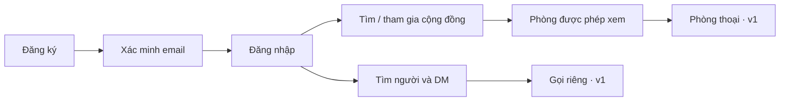

# SCDC — Trải nghiệm tổng thể

## Phạm vi

Nguồn cho hành trình xuyên tính năng, điều hướng và bố cục ứng dụng. Luồng chi tiết, validation, thông báo và trạng thái màn hình nằm tại từng chủ đề. Wireframe hiện có là mô tả văn bản; chưa có prototype toàn hệ thống đã được kiểm chứng.

## Hành trình

Sơ đồ gồm các chức năng mục tiêu. Phạm vi từng mốc tại [MVP](../releases/mvp.md) và [v1](../releases/v1.md); trạng thái thực thi nằm trong chủ đề tương ứng.

## Điều hướng và bố cục

| Vùng | Vai trò | Nguồn hiện tại |
|---|---|---|
| Xác thực | Đăng ký/đăng nhập và phản hồi trạng thái tài khoản | [AuthScreen](../../clients/WebClient/src/components/AuthScreen.jsx) |
| Thanh server | Chọn DM hoặc cộng đồng, tạo/tìm cộng đồng | [ServerRail](../../clients/WebClient/src/components/ServerRail.jsx) |
| Sidebar | Hội thoại hoặc danh sách phòng theo ngữ cảnh | [SubSidebar](../../clients/WebClient/src/components/SubSidebar.jsx) |
| Nội dung | Danh sách/tìm kiếm, quản lý hoặc hội thoại được chọn | [App](../../clients/WebClient/src/App.jsx) |
| Panel phụ/modal | Hồ sơ, thành viên và tác vụ cấu hình | [components](../../clients/WebClient/src/components) |

Giao diện chat còn dùng dữ liệu mẫu ở các phần chưa tích hợp. Bố cục hiện có không tự là kết quả nghiệm thu UX.

## Thiết kế theo chủ đề

- [Tài khoản](../features/accounts/README.md): đăng ký/xác minh, phiên, recovery và hồ sơ.
- [Community](../features/community/README.md): discovery/join, phòng và quyền.
- [Messaging](../features/messaging/README.md): DM, tin phòng, lịch sử và reconnect.
- [Media](../features/media/README.md): gọi riêng, phòng thoại, camera/share.

Mỗi chủ đề phải có trạng thái tải/rỗng/lỗi, mất kết nối/mất quyền và kết quả thao tác theo scope. Quy tắc UI dùng chung tại [design system](design-system.md); hỗ trợ browser/thiết bị tại [chất lượng](../system/quality.md#quality-targets).

## Nội dung cần bổ sung

Prototype và review bàn phím/focus/IME, responsive và thông báo cần được ghi theo chủ đề/build. Ngôn ngữ, nhóm người dùng đầu tiên và cách đánh giá giá trị còn [OQ-001/012](../project/open-questions.md#open-questions). Không ghi các đề xuất này là kết quả khảo sát.
