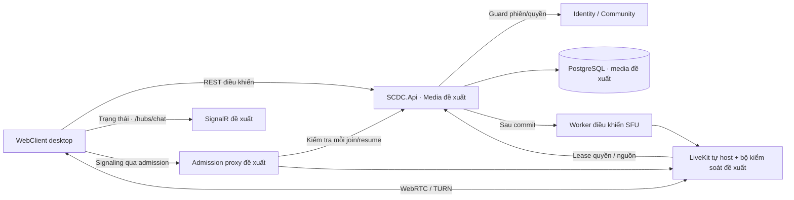

# SCDC — Participation, quota và kết nối media

Cơ chế Media dùng chung cho [gọi riêng](direct-calls.md), [phòng thoại](voice-rooms.md) và [nguồn thiết bị](video-screen-sharing.md). Thiết kế mục tiêu ngày 2026-10-04; provider/SFU và backend chưa triển khai. v1 chuyển nền một API host của MVP sang microservice theo DEC-116; shared transaction/guard dưới đây còn giả định một host, cần rà soát lại theo ranh giới service.

## Mục lục

- [Quyền, quota và luồng](#flows)
- [Giao diện và môi trường kiểm chứng](#ux)
- [Dữ liệu](#data)
- [Transaction và chống trùng](#transaction)
- [API và lỗi](#contracts)
- [Realtime và reconnect](#realtime)
- [Admission và thu hồi tại SFU](#admission)
- [Provider, restart và restore](#provider)
- [Tiêu chí và kiểm thử](#acceptance)
- [Hiện trạng và gói kiểm chứng](#status)

## Quyền, quota và luồng

### Phân công trách nhiệm và quyền

Media sở hữu trạng thái call/participation/nguồn và hạn mức. Identity xác nhận user active/verified, session còn hiệu lực/security stamp; Community xác nhận membership epoch, channel loại voice chưa deleted và quyền view hiện hành. Admission/renew gọi riêng kiểm tra cả hai account/session binding đã accept; một bên không còn hợp lệ thì không renew quyền của cả call. Không JOIN chéo schema hoặc suy `IUserDirectory` trả summary thành đủ quyền. REST/SignalR không truyền RTP; LiveKit không tự tạo thành viên hoặc bỏ qua quyền Community.

Mỗi user chỉ có một ngữ cảnh ringing/participation; room tối đa 10 (direct hai người), toàn hệ thống tối đa 20, gồm reserved/live/reconnect/draining. Ringing giữ user claim nhưng chưa tiêu hao tải media. DEC-080 chốt reconnect giữ chỗ tối đa 30 giây; nguồn share tối đa hai/room theo [điều khiển nguồn](video-screen-sharing.md#rules).

| Luồng/trạng thái | Trigger | Kết quả |
|---|---|---|
| Connecting | Provider xác nhận kết nối | Connected; điều khiển mic/camera/share theo trạng thái thực |
| Connected | Mất mạng | Reconnecting; giữ slot tối đa 30 giây, vẫn tính tải 10/20 |
| Reconnecting | Mạng trở lại trong hạn, phiên/quyền còn hợp lệ | Tái kết nối bằng đúng participation ID, không tạo thêm slot; đồng bộ thiết bị/danh sách |
| Reconnecting | Hết 30 giây hoặc mất phiên/quyền | Ended; giải phóng slot, không tự khôi phục participation cũ; có thể join/call mới |
| Connected/connecting/reconnecting | Rời/kết thúc, phòng deleted, session/quyền bị thu hồi | Kết thúc participation, thu hồi quyền provider và thông báo trạng thái; thu hồi ≤5 giây theo DEC-099, chưa đo |

Đề xuất coordinator kiểm tra atomically một participation mỗi user và hạn mức toàn hệ thống, không dùng riêng số kết nối trên một tab. Ringing chưa có luồng media không tính người đang gọi, nhưng cần khóa ngữ cảnh gọi để accept/cancel trên nhiều thiết bị chỉ có một kết quả. Slot giữ chỗ reconnect vẫn tính vào hạn mức. Khách gửi heartbeat/rejoin không kéo dài thời hạn 30 giây của cùng lần gián đoạn. Khi đạt 2 nguồn màn hình, yêu cầu chia sẻ thứ ba bị từ chối rõ; dừng một nguồn mới cho cấp slot khác. Gọi riêng có hai người, mỗi người một màn hình nên tối đa hai nguồn; không thêm người thứ ba.

DEC-099: từ commit thu hồi phiên/quyền hoặc xóa phòng, ngừng cả phát/nhận và chặn vào lại ≤5 giây; không xác nhận được quyền thì dừng media liên quan. Deadline và fail-close đã chốt, chưa có kết quả đo.

## Giao diện và môi trường kiểm chứng

| Bước | Vùng giao diện dự kiến | Phản hồi cần thể hiện |
|---|---|---|
| Mất mạng | Trạng thái cuộc gọi đang gián đoạn. | Báo đang kết nối lại; tự thử khi mạng trở lại; báo rõ nếu không khôi phục được. |

MEDIA-S03 hiển thị reconnect và thời gian còn lại trong 30 giây; hết hạn có nút gọi/vào lại. MEDIA-S04 báo hết chỗ/phòng đầy; không che thông báo ended/full/reconnecting khi thay layout. Không lấy danh sách client cache làm nguồn quyền.

Wireframe media dưới đây là thiết kế đề xuất; chưa có prototype/kết quả rà soát. Cần thiết kế các trạng thái chờ nhận, từ chối/bận, đang kết nối, trong cuộc gọi, mất mạng/reconnect, không cấp quyền thiết bị, nguồn chia sẻ dừng, phòng đầy và mất quyền. Trạng thái thiết bị phải phản ánh thực tế, không chỉ trạng thái nút bấm.

DEC-082 chốt media trên desktop Chrome/Edge/Firefox/Safari, 2 phiên bản ổn định gần nhất tại nghiệm thu; media điện thoại ở đợt sau. Không dùng phiên bản phát triển của trình duyệt thay phiên bản ổn định; ghi OS, thiết bị và phiên bản thực tế của từng ca.

### Dữ liệu sở hữu và đối chiếu migration

Đề xuất thêm schema `media`; SQL hiện tại chưa có các bảng này. ID nghiệp vụ server UUIDv7, clientOperationId/clientInstanceId UUIDv4; `version`, `connectionEpoch`, `sourceEpoch` là chuỗi số dương khi truyền JSON, kiểu bigint trong DB. Không đưa user name/email vào room name hoặc participant identity provider.

| Bảng đề xuất | Trường/ràng buộc cần review |
|---|---|
| `rooms` | id, kind `direct/channel`, callId hoặc channelId, generation, version, state; mỗi channel có tối đa một room generation còn mở, direct room chỉ có hai user đã accept |
| `participations` | room/user/session/instance, membership epoch nếu channel, state, connectDeadline, outageId/reconnectDeadline, connectionEpoch, version, endedAt/reason |
| `user_claims` | unique userId → ringing call hoặc participation; tránh cùng user nhận/gọi/join hai ngữ cảnh; ringing không tiêu hao hạn mức 20 |
| `capacity` / `room_capacity` | Một hàng global và một hàng mỗi room; số reserved/live/draining, giới hạn 20 và 10 (direct 2); kiểm tra và cấp hai chỗ direct trong một transaction |
| `connection_grants` | grant ID, participation/epoch, nonce đã băm, expiry, trạng thái dùng; không lưu JWT thô; resume transport có lease riêng, không tái dùng nonce mở kết nối mới |
| `operations` | actor/operationId, endpoint + canonical fingerprint, kết quả committed không chứa secret; unique actor + clientOperationId |
| `provider_commands` / `provider_inbox` | command/event ID, room generation, participation/connection/source epoch, payload không secret, retry/status; đồng bộ provider sau commit |

Bảng `calls` ở [direct-calls](direct-calls.md#contracts), `sources` ở [video-screen-sharing](video-screen-sharing.md#contracts); chúng dùng cùng transaction/guard/counter ở đây.

[Vòng đời dữ liệu](../../system/data-lifecycle.md#inventory) chốt log 14/audit 90 ngày và chi tiết media terminal/quiesced 7 ngày (DEC-106/107), giữ operation/deny marker cần thiết. Không dọn participation/draining chưa xác nhận SFU ngừng hoặc cho phép thao tác ended tạo lại. Không lưu âm thanh/hình ảnh hoặc bản ghi màn hình trong các bảng/outbox/log này. LiveKit recording/egress không được cấp trong grant v1.

Retention và restore tuân DEC-103–109 trong [vòng đời dữ liệu](../../system/data-lifecycle.md); không thêm tự xóa account hoặc lưu bản ghi media.

### Transaction, giữ chỗ và chống trùng

Thứ tự khóa đề xuất: Identity users theo thứ tự byte UUID → Community server/channel nếu phòng → global capacity → room capacity → Media user claims theo thứ tự byte UUID → call/participation/source/operation → outbox. Tất cả đường ghi Media dùng cùng thứ tự; lookup ID trước transaction chỉ là hint, đọc lại sau khóa. Guard Identity/Community giữ row lock tới commit qua shared unit of work đã đề xuất ở [kiến trúc](../../system/architecture.md#boundaries).

Nền [IAccountAccessGuard.AcquireAsync](../../../services/SCDC.Contracts/Identity/IAccountAccessGuard.cs) và [RelationalWorkScope](../../../services/SCDC.BuildingBlocks/Infrastructure/Persistence/RelationalWorkScope.cs) đã có trong source. Media chưa là consumer; thiết kế kiểm tra peer/Community, cấp quota và giữ guard đến commit vẫn cần tích hợp và proof riêng. Đây là đối chiếu source, chưa là kết quả chạy Media.

Các bước tạo/accept call ở [gọi riêng](direct-calls.md#contracts); join room và tích hợp Community ở [phòng thoại](voice-rooms.md#contracts).

1. Lần mất kết nối đầu tạo outageId + reconnectDeadline cố định 30 giây. Resume trong hạn giữ ID/chỗ; heartbeat/retry lặp không tăng deadline. `now >= deadline` kết thúc participation cũ, mọi grant cũ bị từ chối. Một outage mới chỉ bắt đầu sau khi provider xác nhận connected trở lại.
2. Timeout connecting đề xuất 30 giây từ cấp chỗ, không phải p95 5 giây; quá hạn kết thúc. Worker kiểm tra deadline tối đa mỗi giây, provider lease bị chặn ở deadline. Không kéo dài call ringing vì đang thiếu chỗ.

Capacity tính cả reservation chưa kết nối, connected, reconnect giữ chỗ và provider draining. Không xóa counters khi chỉ nhận HTTP leave hoặc websocket đóng: media cũ có thể còn truyền. Participation đã ended không được resume; nếu chưa chứng minh provider ngừng thì admission mới tạm trả 503 thay vì tái sử dụng chỗ và vượt 20. Deadline reconnect không được kéo dài vì tình trạng draining. Khi provider lỗi, chỉ giải phóng sau ack dừng hoặc bằng chứng node generation đã bị cách ly/dừng; health timeout đơn thuần không chứng minh node ngừng truyền.

Mỗi mutation (trừ heartbeat) mang clientOperationId; expectedVersion bắt buộc trên call/source/leave/grant. Fingerprint = HMAC-SHA256 trên canonical UTF-8 JSON theo [RFC 8785](https://www.rfc-editor.org/info/rfc8785/) gồm `method`, `path` chuẩn với prefix `/api/v1`, `actorId`, `sessionId` do server lấy và `body` trừ clientOperationId; clientInstanceId nằm trong body, UUID chuẩn lowercase, version giữ dạng chuỗi. Key ring riêng, không log canonical body/secret; JSON không có số thực. Cùng ID/cùng fingerprint đọc lại kết quả với kiểm tra quyền hiện hành; khác fingerprint trả `Media.OperationConflict`. Kiểm tra operation trước expectedVersion để retry kết quả cũ không thất bại chỉ vì version đã tăng. Không replay trạng thái cũ thành quyền join/publish mới; grant đã dùng/hết hạn phải xin grant mới với ID mới.

Start-source trả source snapshot và publishPermit chỉ cho binding sở hữu; permit ký ngắn hạn gắn source/connection epoch và publishDeadline. Adapter mang permit vào đường publish đã được bộ kiểm soát SFU kiểm tra; cách tích hợp với SDK/protocol là phần proof, không giả một track name do client đặt đủ bảo mật. Repeat cùng operation chỉ trả permit khi reservation cũ còn chưa dùng và còn hạn; sau đó trả snapshot với permit null. Connection grant chỉ tái dựng cùng grant nonce/expiry chưa dùng hoặc trả lỗi consumed/expired, không tự cấp nonce mới khi replay. Không lưu secret trong operation result; việc tái dựng grant/permit dùng protected key và dữ liệu đã commit, không thay deadline. Soft resume sau nonce initial đã dùng phải xác nhận đúng provider SID/connection lease trong hạn; không dùng lại nonce đó để mở một kết nối initial khác.

Network call tới LiveKit chạy sau commit; rollback DB không kèm side effect SFU. Mutation UI dùng `retry:false` với helper hiện tại; không tự replay create/accept/start-source sau refresh 401. Khi kết quả không rõ, đọc state và người dùng thử lại với cùng ID; reconnect kỹ thuật là luồng riêng được phép tự thử theo DEC-050. Fixture có 4 byte/HMAC kỳ vọng; triển khai còn cần proof canonicalization/key ring/dedup transaction.

### REST và lỗi mục tiêu

[media.openapi.json](../../contracts/media.openapi.json) là nguồn schema HTTP mục tiêu; 16 thao tác công khai và 3 thao tác nội bộ, chưa endpoint nào được map trong API. Prefix công khai `/api/v1`; prefix nội bộ `/internal/media` độc lập, không mở bằng Bearer người dùng. Version conflict trả snapshot hiện hành hoặc yêu cầu GET khi snapshot không còn được phép đọc.

| Endpoint công khai | Đầu vào/kết quả | Điều kiện |
|---|---|---|
| GET `/media/state` | clientInstanceId → incoming/outgoing call và participation của tài khoản | Phiên hợp lệ; đánh dấu instance sở hữu, không tự chiếm cuộc gọi đang ở tab khác |
| GET `/media/participations/{participationId}` | ParticipationSnapshot | Đúng user/session/instance sở hữu |
| POST cùng đường dẫn + `/leave` | operation/instance/version → ParticipationSnapshot | Đúng binding; ended idempotent, provider drain theo thiết kế |
| POST cùng đường dẫn + `/connection-grants` | mode initial/resume + operation/instance/version → ConnectionGrant | Trong connect/reconnect deadline và quyền còn hợp lệ; không cấp slot mới |
| POST cùng đường dẫn + `/heartbeats` | instance + connectionEpoch → ParticipationSnapshot | Tab liveness, không tự chứng minh media connected hoặc gia hạn quyền |

Call endpoints ở [gọi riêng](direct-calls.md#contracts); GET/join channel ở [phòng thoại](voice-rooms.md#contracts); source endpoints ở [thiết bị](video-screen-sharing.md#contracts).

Nội bộ: POST `/internal/media/admissions` xác nhận join/resume hoặc renew lease cho connection provider hiện hành; POST `/internal/media/provider-observations` nhận trạng thái có epoch từ bộ kiểm soát SFU; POST `/internal/media/livekit-webhook` nhận webhook đã xác thực. Hai endpoint đầu yêu cầu service credential/mTLS và chống replay, không dùng access token app. Renew không mở kết nối mới: phải khớp provider SID/node/epoch đã bind và luôn đọc lại quyền hiện hành. Webhook xác minh chữ ký provider từ raw body trước parse. Không cho client tự gửi provider observations hoặc tự xác nhận đã dừng luồng để giải phóng chỗ.

### Lỗi và phản hồi giao diện

| HTTP/errorCode | Tình huống và UI |
|---|---|
| 400 `Common.ValidationFailed` | UUID/body/version/kind sai; đưa lỗi tới trường tương ứng |
| 401 `Media.SessionInvalid` | Phiên hết hạn/thu hồi; dừng thiết bị cục bộ, không xin grant bằng phiên cũ |
| 403 `Media.AccountIneligible` | Tài khoản chưa đủ điều kiện; không bỏ qua verify/active |
| 404 `Media.NotFound` | Tài nguyên không tồn tại hoặc actor không được biết; gồm phòng bị ẩn/deleted |
| 409 `Media.Busy`, `Media.PeerBusy`, `Media.PeerUnavailable` | Có ngữ cảnh khác/người nhận không khả dụng; không tự chuyển thiết bị |
| 409 `Media.RoomFull`, `Media.SystemFull`, `Media.ScreenLimit`, `Media.SourceLimit` | Hiển thị lý do; không để source preview tiếp tục capture khi yêu cầu bị từ chối |
| 409 `Media.VersionConflict`, `Media.OperationConflict`, `Media.Expired`, `Media.GrantConsumed`, `Media.ConnectionInUse` | Đọc state; không tự accept hay hồi sinh phiên đã ended |
| 429 `Media.RateLimited` | Có Retry-After; ngưỡng limiter media còn đề xuất, không lấy DEC-089 làm xác nhận |
| 503 `Media.AuthorityUnavailable`, `Media.ProviderUnavailable`, `Media.Draining` | Chưa thể xác nhận quyền/provider; dừng hoặc chưa kết nối, báo thử lại |

### Realtime, presence và reconnect

[media-realtime.schema.json](../../contracts/media-realtime.schema.json) mô tả 8 loại thông điệp ứng dụng trên `/hubs/chat`, không là SignalR wire frame: `RegisterMediaClient`, `UnregisterMediaClient`, `MediaClientAcknowledgement`, `IncomingCall`, `CallChanged`, `ParticipationChanged`, `RoomMediaChanged`, `MediaAccessRevoked`. Schema không thay signaling LiveKit. Register chỉ công bố khả năng nhận cuộc gọi desktop của connection đã xác thực; không cho truyền userId/sessionId để đăng ký thay user khác.

Presence đề xuất gắn SignalR connection + user/session/clientInstanceId; hết session/connection thì bỏ đăng ký. Tab lặp RegisterMediaClient mỗi 5 giây để renew presence idempotent, TTL 15 giây, kể cả chưa tham gia cuộc gọi; heartbeat REST chỉ dùng khi có participation. Registry không chứa media token. Kiểm tra presence và claim khi tạo call; trạng thái có thể thay đổi ngay sau kiểm tra, vì vậy người vừa đóng máy có thể kết thúc no-answer sau 30 giây thay vì báo unavailable tức thời. Mobile chưa nằm trong tập nhận/gọi media v1. Presence/heartbeat không xác nhận RTP hoạt động; đó là trách nhiệm bộ kiểm soát provider.

IncomingCall/CallChanged chỉ gửi hai phía theo phiên đủ quyền; ParticipationChanged tới binding sở hữu; RoomMediaChanged tới người đang tham gia room còn view và lease hợp lệ. Người chưa tham gia GET snapshot khi chọn phòng và poll đề xuất 5 giây khi màn hình đó đang mở; catalogue chưa thêm subscribe room cho người ngoài cuộc gọi. Không broadcast global hoặc tới toàn server thiếu view. Sự kiện chỉ ID, version, trạng thái/reason; JWT/grant/permit không đi qua Hub. `MediaAccessRevoked` chỉ báo ID/reason cho binding cũ, không gửi metadata phòng sau thu hồi.

Mỗi aggregate có version; client bỏ bản thấp/trùng, thấy gap hoặc reconnect Hub thì GET state/snapshot. Outbox gửi lại có thể trùng/đến trễ, không được làm ringing hay nguồn ended hoạt động lại. Sự kiện không là bằng chứng quyền: grant/join/provider renew đều đọc quyền hiện hành. Mất Hub trong khi media còn hoạt động không tự coi RTP mất mạng; lease quyền provider vẫn độc lập. Tab mất heartbeat mà provider còn connected cần reconciliation, không tự nhả chỗ.

Reconnect kỹ thuật đề xuất thử ngay rồi backoff 1/2/4/8 giây, có jitter và bị cắt tại deadline cố định; SDK retries cũng phải dừng tại deadline, không chỉ đổi nhãn UI. SFU báo disconnect/connected bằng epoch; client báo mất mạng chỉ là hint để yêu cầu kiểm tra. Soft resume dùng đúng connection epoch; full reconnect chỉ cấp epoch mới sau khi kết nối cũ đã ngừng, không cho provider tự thay identity làm mất kiểm soát. Callback SID/epoch cũ không được kết thúc epoch mới.

## Admission và thu hồi tại SFU

Đề xuất tất cả signaling WebSocket/HTTP join đi qua admission proxy. Proxy xác thực JWT LiveKit và gọi endpoint nội bộ của monolith để kiểm tra participation ID, session/security stamp, room/call, quyền và hạn reconnect; reject khi đã ended/thu hồi. Participant identity của SFU ánh xạ tới participation gắn với session, không chỉ user ID. Token được SFU refresh vẫn phải chịu cùng kiểm tra participation khi join lại. Endpoint signaling trực tiếp của SFU không được công khai để bypass proxy; port WebRTC/TURN chỉ phục vụ media sau signaling hợp lệ.

Thu hồi dùng sự kiện sau commit để loại subscription và gọi RoomService remove participant, đồng thời admission từ chối mọi token của participation đã ended. Phải thử token cũ/token SFU refresh, URL SFU trực tiếp, reconnect trong/ngoài 30 giây, proxy/authorizer lỗi và nhiều thiết bị. Mục tiêu media ≤5 giây và fail-close đã chốt DEC-099; cần bộ kiểm soát lease ở node truyền media như thiết kế chi tiết, không chỉ đóng signaling. Chat và media có bằng chứng kiểm chứng riêng.

TLS/domain, reverse proxy, TURN/UDP, region, cấu hình server và secrets cần được thiết kế theo [hướng dẫn self-host LiveKit](https://docs.livekit.io/transport/self-hosting/). Không tự coi Docker Development là topology production. Nếu admission hoặc active revocation không chứng minh được thì phần media chưa đủ điều kiện phát hành; giữ DEC-084 và báo rủi ro, không tự đổi sang Cloud.

### Admission, nguồn phát và thu hồi thật tại SFU

Theo [LiveKit tokens/grants](https://docs.livekit.io/frontends/reference/tokens-grants/), self-host remove participant không vô hiệu JWT cũ; token được refresh trong phiên. Vì vậy mọi join/resume kiểm tra participation và phiên hiện hành, kể cả token SFU đã refresh. Token app không dùng thay LiveKit JWT. JWT ban đầu chỉ roomJoin/canSubscribe, canPublish=false và không cấp admin/record/data publish/update-own-metadata; publish chỉ được bật theo reservation/permit qua bộ kiểm soát, không cho SDK tự mở nguồn lúc join. TTL đề xuất 60 giây cho initial admission không dùng để chứng minh thu hồi.

Đề xuất admission route allowlist theo build được khóa. [RTC service LiveKit v1.13.7](https://github.com/livekit/livekit/blob/v1.13.7/pkg/service/rtcservice.go) có `/rtc`, `/rtc/validate`, `/rtc/v1`, `/rtc/v1/validate`; đây là nguồn tham khảo bất biến, chưa là phiên bản dependency được chọn. Phải chặn hoặc bảo vệ mọi route SDK thực tế dùng, request upgrade và full resume; cổng API/signaling SFU chỉ nội bộ, không có URL/IP trực tiếp bypass. Pin server/SDK/protocol và kiểm tra lại route trước thử nghiệm. TURN/WebRTC không được coi là lớp xác thực app.

Gate nguồn và reservation trước publish theo [video-screen-sharing](video-screen-sharing.md#contracts).

- Mỗi participation có authorization lease ngắn, kiểm tra ngay tại node chuyển tiếp cả publish và subscribe. Admission proxy đóng websocket hoặc RoomService lỗi không được để RTP tiếp tục không có lease.
- Không xác nhận được quyền hoặc lease hết hạn thì ngừng phát/nhận của participation liên quan; bộ kiểm soát lỗi cũng phải chặn chuyển tiếp. Không chỉ dựa sidecar gửi lệnh remove tới SFU rồi mặc định thành công.

Budget thời gian đề xuất để đạt DEC-099: authority read hiện hành trong guard, trả lease TTL tối đa 3 giây tính từ **lúc bắt đầu kiểm tra**, không phải lúc response đến; node áp dụng với giới hạn clock skew đã đo ≤250 ms và watchdog ≤1 giây. Response trễ/quá hạn bị bỏ; cache không kéo dài lease. Từ commit thu hồi, lease được xác nhận trước commit hết trong tối đa 3 giây, cộng watchdog/skew vẫn cần đo ≤5 giây. Nếu không đo được skew/bound xử lý thì dừng admission/media liên quan, không tiếp tục claim đạt ngưỡng. Renewal mỗi giây, khóa hết khi đọc xong; không gọi network SFU trong DB transaction.

Outbox/worker sau commit gọi RemoveParticipant, provider lease song song kiểm tra session stamp/current Community guard. Không chờ webhook mới ngừng quyền. Mất quyền một người dừng cả gửi và nhận; room deletion/đóng direct call dừng toàn room. Local expiry còn bị chặn bởi connect/reconnect deadline và room/source epoch; heartbeat từ browser không gia hạn. Khi SFU process/guard bị treo, cần bằng chứng local cutoff vẫn hoạt động hoặc cô lập/dừng node; không đạt bằng chứng này thì không phát hành media. Phương án fail-close có thể làm gián đoạn user còn quyền khi authority lỗi, đúng DEC-099; UI báo lý do quyền chưa xác nhận được.

### Provider observations và idempotency

Theo [webhooks LiveKit](https://docs.livekit.io/intro/basics/rooms-participants-tracks/webhooks-events/), callback có chữ ký và có retry nhưng không bảo đảm giao thành công. Adapter xác minh Authorization/raw payload, dedup event ID; không dùng webhook làm đồng hồ duy nhất cho thu hồi hoặc giải phóng chỗ.

Observations từ bộ kiểm soát có node generation, provider room/participant SID, participation/connection/source epoch và observation sequence dạng chuỗi. Chấp nhận chỉ khi đúng generation/epoch; thấp/trùng bỏ qua; trạng thái terminal không hồi sinh. `connected` cần bằng chứng transport media sẵn sàng, không chỉ HTTP upgrade; `source_live` phải đã qua quota gate; `quiesced` phải bảo đảm cả forward/subscribe ngừng. Provider webhook cũ/lệch epoch dùng cho reconciliation, không cập nhật counter mù.

Worker có commandId/idempotency và kiểm tra trạng thái desired mới nhất trước gọi SFU. Retry remove với backoff bị giới hạn bởi local lease, không kéo dài cutoff 5 giây. Không retry start/join/source cũ sau ended. Poll reconciliation mỗi giây là đề xuất cho v1 20 người; so sánh room/participant/track thực tế với state, xử lý ghost và cảnh báo counter lệch. DB restart/restore: fence room/node generation cũ và chứng minh media cũ ngừng trước mở admission; không để backup hồi sinh token/participation đã kết thúc.

Riêng restore backup, kết thúc mọi call/ringing/participation/grant/source phục hồi và vô hiệu command start/thông báo ringing chưa xử lý trước mở admission; không tiếp tục cuộc gọi từ snapshot backup. Cấp room/node generation mới sau khi dừng/cách ly node cũ đã được chứng minh, rồi giải phóng user claims và tính lại capacity từ trạng thái quiesced. Counter/epoch phục hồi từ backup không tự chứng minh an toàn. Người dùng gọi/vào lại bằng participation mới; quy trình áp lại các thu hồi Identity/Community vẫn theo OQ-011 và runbook dữ liệu.

## Tiêu chí chấp nhận và ca kiểm thử

| Mã | Tình huống | Kết quả mong đợi |
|---|---|---|
| AC-MEDIA-09 | Người tham gia đang gọi riêng hoặc ở phòng thoại bị mất mạng, sau đó mạng trở lại. | Ứng dụng tự thử kết nối lại; khi khôi phục thành công, giao diện và âm thanh/hình ảnh trở về đúng trạng thái. |
| AC-MEDIA-10 | Hai thiết bị của một người đồng thời join hai phòng/call | Chỉ một participation được cấp; UI còn lại nhận busy/conflict |
| AC-MEDIA-11 | Phòng đã có 10 người, request thứ 11; toàn hệ thống đã có 20 người, request mới | Từ chối vượt giới hạn, gồm slot reconnect đang giữ; không cấp token/slot dở dang |
| AC-MEDIA-13 | Mất mạng, reconnect ở giây 29 và sau giây 30 | Trong hạn giữ đúng participation/slot; quá hạn ended, giải phóng chỗ, chỉ join/call mới |
| AC-MEDIA-15 | Thu hồi phiên/quyền hoặc xóa phòng khi đang gửi/nhận RTP | Cả phát/nhận ngừng và token cũ/SFU refresh bị chặn vào lại ≤5 giây từ commit theo DEC-099 |
| AC-MEDIA-19 | Authority/worker/network điều khiển lỗi trong khi WebRTC vẫn chạy | Lease hết thì node ngừng media liên quan trong budget DEC-099; không dựa riêng websocket/remove ack |
| AC-MEDIA-20 | Client dùng URL SFU trực tiếp, token cũ, đường resume hoặc clone kết nối đang hoạt động | Không bypass admission/current guard; không thay kết nối đang hoạt động hoặc cấp thêm chỗ |
| AC-MEDIA-22 | Webhook/observation trùng, đến trễ hoặc dùng epoch cũ | Bỏ sự kiện lỗi thời, không hồi sinh ended hoặc sửa counter/connection mới |
| AC-MEDIA-23 | Restart/restore DB trong khi node SFU cũ còn sống | Admission dừng tới khi fence và chứng minh node/generation cũ không truyền; token cũ không phục hồi quyền |

Mọi AC-MEDIA/TC-MEDIA chưa có kết quả chạy được ghi nhận. Dùng tài khoản thử, provider/môi trường và thiết bị có phiên bản cụ thể; kết quả phải gắn commit/provider build/môi trường theo [phương pháp đo](../../system/quality.md#quality-targets).

| Mã | Thao tác | Kết quả cần quan sát | Dẫn chiếu |
|---|---|---|---|
| TC-MEDIA-05 | Một user trên hai thiết bị join/call đồng thời | Một participation/user, không gấp đôi tải | AC-MEDIA-10 |
| TC-MEDIA-06 | Biên 10/phòng, 20/toàn hệ thống, slot reconnect | Không vượt giới hạn khi request đồng thời/rollback | AC-MEDIA-11 |
| TC-MEDIA-07 | Ngắt mạng, trở lại ở 29 giây và sau 30 giây | Tự reconnect đúng hạn/ID, hết hạn giải phóng slot | AC-MEDIA-09/13 |
| TC-MEDIA-08 | Thu hồi phiên/quyền, xóa phòng khi đang phát/xem | Chặn API và cả phát/nhận provider ≤5 giây từ commit; không chỉ ẩn UI | AC-MEDIA-15, DEC-077/099 |
| TC-MEDIA-09 | Provider lỗi, callback lặp/đến trễ, accept/cancel đồng thời | Không hồi sinh participation/call đã kết thúc, không rò slot | AC-MEDIA-14; cần thiết kế provider |
| TC-MEDIA-10 | Chạy tải 20 người, 2 nguồn share/phòng trên cấu hình mạng được chốt | Đo mục tiêu DEC-085, tỷ lệ kết nối, CPU/băng thông/chi phí; ghi cấu hình/build và kết quả thực tế | OQ-007/010 |
| TC-MEDIA-14 | Giữ đường RTP nhưng chặn authorizer, RoomService/outbox; đo clock skew/lease | Cả gửi/nhận ngừng ≤5 giây, không renew bằng cache/response trễ | AC-MEDIA-19 |
| TC-MEDIA-15 | Token refresh/cũ, direct IP/routes, resume ngoài hạn, clone identity | Từ chối mọi bypass; không thay active connection | AC-MEDIA-20 |
| TC-MEDIA-17 | Lặp/out-of-order webhook/observation; replay SID/epoch cũ | Counter và trạng thái mới giữ đúng, signature sai bị từ chối | AC-MEDIA-22 |
| TC-MEDIA-18 | Restart/restore DB/SFU, remove chưa ack, thử join mới | Chỗ draining không tái cấp, fence node cũ trước mở admission | AC-MEDIA-23 |
| TC-MEDIA-19 | Fixture deadline/quota/HMAC, source expiry và repeat operation | Đúng bytes/kết quả, transaction không cấp thêm secret/chỗ/nguồn; không kéo dài deadline | AC-MEDIA-24, MEDIA-GAP-01/02 |

Chuẩn bị hai người gọi riêng, phòng nhiều thành viên, người không có quyền, hai nguồn share, khả năng ngắt mạng/từ chối thiết bị và backend/provider lỗi. Ghi kết quả thực tế theo từng AC/TC, không suy fixture/counter JSON thành proof DB lock/SFU.

## Hiện trạng và gói kiểm chứng

Đối chiếu tài liệu ngày 2026-10-06: chưa có module Media, schema `media`, LiveKit service/manifest, admission proxy hoặc SFU worker. OpenAPI, realtime catalogue và fixture là thiết kế mục tiêu; chưa có hồ sơ nghiệm thu media/provider. Media thuộc v1 theo DEC-114, không là điều kiện hoàn thành MVP mới.

| Nhóm | Cần quyết định | Liên quan |
|---|---|---|
| Chất lượng | Đã chốt DEC-085; còn môi trường, thiết bị/version, hiệu chỉnh đồng hồ và kết quả đo. | OQ-007 |
| Kỹ thuật/chi phí | LiveKit tự host DEC-084; có admission/lease/nguồn design, chưa chọn extension/fork hoặc pin server/SDK. Host/domain/TURN, key store, mức dùng, chi phí và công sức duy trì cần review. | OQ-008/010, MEDIA-GAP-03/06/07 |

Theo [phân công DEC-117](../../project/planning.md#team), Vg giữ chính sách quyền/admission/quota/thu hồi; Sáng sở hữu backend và UI điều khiển lifecycle cuộc gọi; Thái sở hữu adapter provider/SDK, thiết bị/hiển thị nguồn và bộ chạy. Mỗi người chứng minh phần sở hữu theo kịch bản đã chốt trước khi xác nhận lịch, chi phí và nghiệm thu; [gói v1](../../releases/v1.md) ghi phụ thuộc và công suất theo giai đoạn.

### Fixture và gói kiểm chứng

[media-lifecycle.json](../../fixtures/media-lifecycle.json) chứa 16 vector quota, 14 vector admission, 8 kịch bản transition và 4 byte/HMAC kỳ vọng: có chỗ global nhưng room đầy, direct cần hai chỗ, ringing/reconnect/draining, stale epoch, biên deadline và token đã thu hồi. Vector là kết quả kỳ vọng của mô hình thiết kế; kiểm tra JSON/counter không chứng minh DB lock hoặc SFU thật.

| Gói | Bằng chứng cần có trước triển khai/phát hành |
|---|---|
| MEDIA-GAP-01 | Review OpenAPI/catalogue/UX theo DEC-099–102; kiểm tra uuid/version, lỗi và fingerprint byte độc lập |
| MEDIA-GAP-02 | Migration Media + shared guard/counter; race call accept/cancel/timeout, hai join, hai publish, rollback và restart; không vượt 10/20/2 |
| MEDIA-GAP-03 | Pin server/SDK/protocol; proof mọi join/resume/direct route, JWT cũ/SFU refresh, clone identity, RTP/SDP publish ngoài reservation đều bị chặn |
| MEDIA-GAP-04 | Proof cutoff publish/subscribe ≤5 giây kể cả authorizer/worker/network lỗi; clock skew, node treo và fail-close; đo từ commit, không từ lúc worker nhận |
| MEDIA-GAP-05 | Mock/prototype trên matrix desktop; thiết bị bị từ chối/ended/change, nhiều tab, first accept, reconnect 29/30 giây và trạng thái source thật |
| MEDIA-GAP-06 | Load/chất lượng DEC-085 tại 20 người, nguồn share/camera đủ, topology/TURN đã chọn; ghi version/hash/cấu hình/băng thông/chi phí |
| MEDIA-GAP-07 | Runbook node fence/restart/restore, secrets/key rotation, provider callback retry và release/rollback; người phụ trách còn OQ-011 |

Gói V1-MEDIA-01–05, scope và người phụ trách ở [hồ sơ v1](../../releases/v1.md#gói-media-sau-nền-mvp). Mỗi kết quả cần commit/provider build/môi trường và được dẫn từ đúng chủ đề. Provider version, extension/fork, topology/TURN, host/domain, key store và công sức duy trì còn phải review trước khóa lịch/chi phí.
