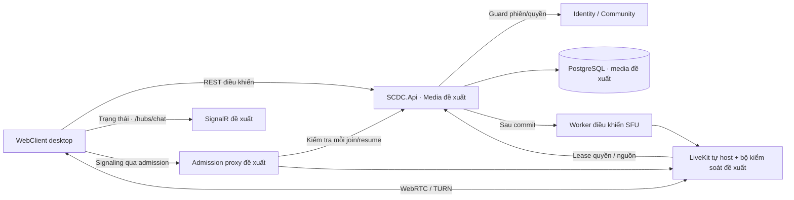

# SCDC — Thoại, video và chia sẻ màn hình

Cập nhật: 2026-10-04. Phạm vi: REQ-007/008/009, SCP-006/007, DEC-046–050/078–085/099–102 và AC-MEDIA.

Media thuộc MVP. Điều kiện gọi, giới hạn 10/20/2 và reconnect 30 giây đã chốt DEC-078–080; thu hồi 5 giây, nhận đầu tiên thắng, thiết bị mặc định tắt và không truyền âm thanh màn hình đã chốt DEC-099–102. Có thiết kế chi tiết, OpenAPI, catalogue realtime và fixture; LiveKit tự host/media desktop/chất lượng theo DEC-082/084/085. Provider/backend/API chưa triển khai; bộ kiểm soát tại SFU và các mục tiêu cần thử nghiệm.

## Mục lục

- [Phạm vi và yêu cầu](#requirements)
- [Giao diện và trạng thái](#ux)
- [Dữ liệu và tích hợp](#contracts)
- [Thiết kế chi tiết media](#detailed-design)
- [Tiêu chí và kiểm thử](#acceptance)
- [Quyết định còn thiếu](#gaps)

<a id="requirements"></a>

## 1. Phạm vi, hành trình và yêu cầu

### Phạm vi đã thống nhất

Phiên bản đầu có phòng thoại nhiều thành viên trong server và cuộc gọi
riêng giữa hai người. Cả hai ngữ cảnh có video và chia sẻ màn hình.
Cuộc gọi trong nhóm chat riêng ngoài server không thuộc phiên bản đầu.
Sản phẩm chạy trên trình duyệt web; ma trận trình duyệt desktop đã chốt DEC-082; phiên bản/OS/thiết bị thực tế phải ghi ở lần nghiệm thu. Ngày 2026-10-04, người dùng chốt 20 người tham gia gọi đồng thời toàn hệ thống là giới hạn MVP (DEC-079). Đây là thay đổi từ giả định dự toán AS-006 sang quy tắc cần kiểm chứng, chưa phải kết quả đo.

### Hành trình cần đặc tả

| Hành trình | Luồng chính cần quyết định | Ngoại lệ bắt buộc xem xét |
|---|---|---|
| Gọi riêng | Một người gọi, người nhận phải chấp nhận trước khi bắt đầu; hai bên bật/tắt micro/camera/chia sẻ và kết thúc. | Người nhận vắng mặt, bận cuộc gọi, từ chối, không cấp quyền thiết bị, mất mạng. |
| Phòng thoại | Thành viên thấy phòng được phép xem thì vào ngay, vào/rời, biết ai đang trong phòng, điều khiển thiết bị. | Mất quyền/phòng bị xóa, phòng đầy, lỗi kết nối, nhiều người vào/ra đồng thời. |
| Video và chia sẻ màn hình | Bật/tắt nguồn video hoặc màn hình trong cuộc gọi/phòng, người khác xem và nhận biết nguồn đang chia sẻ. | Không có thiết bị/quyền truy cập, ngừng chia sẻ từ trình duyệt, đổi nguồn, mạng yếu. |

Quy tắc đã được đại diện sản phẩm xác định: nhận cuộc gọi riêng cần thao
tác chấp nhận (DEC-046); cuộc gọi nhỡ không lưu vào hội thoại ở đợt đầu
(DEC-047); quyền xem phòng thoại cho phép vào ngay (DEC-048); nhiều người
có thể chia sẻ màn hình đồng thời trong phòng thoại (DEC-049); ứng dụng
tự kết nối lại khi mạng trở lại (DEC-050). Giới hạn và thời gian chờ đã chốt DEC-078–080; chất lượng đã chốt DEC-085, chưa đo.

<a id="ux"></a>

## 2. Giao diện và trạng thái

| Bước | Vùng giao diện dự kiến | Phản hồi cần thể hiện |
|---|---|---|
| Gọi riêng | Thao tác gọi từ hội thoại và màn hình cuộc gọi đến. | Người nhận bấm chấp nhận trước khi bắt đầu; người gọi biết trạng thái chờ/đã nhận/không nhận. Cuộc gọi nhỡ chưa lưu vào hội thoại ở đợt đầu. |
| Vào phòng thoại | Danh sách phòng và màn hình cuộc gọi nhóm. | Thành viên có quyền xem phòng vào ngay; người không có quyền không thấy/không vào được. |
| Thiết bị và chia sẻ | Điều khiển micro, camera, chia sẻ màn hình và danh sách nguồn. | Phản hồi khi không được cấp quyền; nhiều người có thể chia sẻ đồng thời trong phòng, mỗi nguồn phân biệt được. |
| Mất mạng | Trạng thái cuộc gọi đang gián đoạn. | Báo đang kết nối lại; tự thử khi mạng trở lại; báo rõ nếu không khôi phục được. |

Phòng tối đa 10, toàn hệ thống tối đa 20 người (gồm gọi riêng), 2 màn hình/phòng; mỗi người một camera/màn hình. Đổ chuông/reconnect tối đa 30 giây. Bố cục nhiều nguồn và ngưỡng theo DEC-085; kết quả và thiết bị cụ thể còn OQ-007.

Wireframe media dưới đây là thiết kế đề xuất; chưa có prototype/kết quả rà soát. Cần thiết kế các trạng thái chờ nhận, từ chối/bận, đang kết nối, trong cuộc gọi, mất mạng/reconnect, không cấp quyền thiết bị, nguồn chia sẻ dừng, phòng đầy và mất quyền. Trạng thái thiết bị phải phản ánh thực tế, không chỉ trạng thái nút bấm.

DEC-082 chốt media trên desktop Chrome/Edge/Firefox/Safari, 2 phiên bản ổn định gần nhất tại nghiệm thu; media điện thoại ở đợt sau. Không dùng phiên bản phát triển của trình duyệt thay phiên bản ổn định; ghi OS, thiết bị và phiên bản thực tế của từng ca.

### Màn hình đề xuất

```text
MEDIA-S01 · Gọi đến               MEDIA-S02 · Cuộc gọi / phòng thoại
┌────────────────────────────┐   ┌────────────────────────────────────┐
│ Tên hiển thị · @username   │   │ Phòng / tên người · Đang kết nối  │
│ Đang gọi đến               │   │ [Nguồn màn hình 1] [Nguồn 2]       │
│ [Từ chối]       [Nhận]     │   │ [Camera / tên các thành viên]     │
└────────────────────────────┘   │ Mic · Camera · Chia sẻ · [Rời]    │
                                 └────────────────────────────────────┘
```

MEDIA-S03 thể hiện mất mạng/đang reconnect và thời gian còn lại trong 30 giây; hết hạn có nút gọi/vào lại. MEDIA-S04 báo người nhận bận/vắng mặt, phòng đầy hoặc toàn hệ thống hết chỗ. MEDIA-S05 báo thiết bị/quyền chia sẻ không dùng được hoặc hai nguồn màn hình đã đầy. Không hiển thị mic/camera/share là đang phát trước khi thiết bị/provider thực sự xác nhận. Hai nguồn màn hình có nhãn tác giả và thao tác chọn xem; không tự dừng nguồn người khác.

<a id="contracts"></a>

## 3. Dữ liệu, API và tích hợp cần thiết kế

MVP vẫn chạy Modular Monolith theo DEC-060; một nhà cung cấp media bên ngoài có thể được tích hợp nếu thử nghiệm phù hợp. LiveKit tự host đã được chọn tại DEC-084; chưa có service/manifest hoặc kết quả tích hợp trong repo.

| Hợp đồng cần có | Hành vi cần xác định |
|---|---|
| Gọi riêng | Tạo lời gọi, thông báo đến, nhận/từ chối/hủy/kết thúc, điều kiện ai gọi ai, timeout/bận |
| Phòng thoại | Quyền vào/rời, danh sách người, giới hạn, mất quyền và vòng đời phòng |
| Thiết bị/chia sẻ | Micro/camera, chọn nguồn, nhiều nguồn cùng lúc, nguồn bị thu hồi hoặc dừng |
| Cấp quyền media | Kiểm tra phiên và quyền trước khi cấp thông tin kết nối; ngăn truy cập bằng token/phiên đã thu hồi |
| Khôi phục | Retry/reconnect, thời gian chờ, đồng bộ danh sách và trạng thái thiết bị |
| Quan sát/chi phí | Số người/luồng, băng thông, chất lượng, lỗi kết nối và chi phí theo mức dùng |

Bảng contract/state là thiết kế đề xuất. [OpenAPI media](../contracts/media.openapi.json) và [catalogue realtime](../contracts/media-realtime.schema.json) bổ sung hợp đồng máy đọc được; mọi endpoint media chưa triển khai. `calls` từng xuất hiện trong docs kỹ thuật cũ nhưng không phải schema hiện tại trong SQL. Trạng thái gọi nhỡ không lưu vào hội thoại ở đợt đầu theo DEC-047; không tự đưa log lịch sử cuộc gọi vào scope.

API tương lai áp dụng [ProblemDetails chung](../architecture.md#contracts). Media phải kiểm tra phiên, quyền Community khi dùng phòng và điều kiện DM khi gọi riêng; thời hạn thu hồi trên kết nối phải được thiết kế và thử nghiệm.

### Luồng trạng thái và giữ chỗ

Đây là thiết kế đề xuất cho các quy tắc đã chốt; bảng không xác nhận backend/provider đã có.

| Luồng/trạng thái | Trigger | Kết quả |
|---|---|---|
| Gọi riêng / requested | Kiểm tra hai tài khoản, phiên và điều kiện DM | Ringing nếu người nhận khả dụng; busy/unavailable nếu không; không cấp quyền nghe media trước accept |
| Ringing | Người nhận accept trong 30 giây | Kiểm tra lại phiên/trạng thái/busy, cấp đủ hai slot trong một giao dịch rồi connecting |
| Ringing | Reject, caller cancel hoặc hết 30 giây | Rejected/cancelled/no-answer; không tạo lịch sử cuộc gọi nhỡ trong DM |
| Phòng thoại / chưa tham gia | Join với quyền xem | Kiểm tra member/phòng còn tồn tại, giới hạn 10/20 và một phiên tham gia/người; allocate slot rồi connecting |
| Connecting | Provider xác nhận kết nối | Connected; điều khiển mic/camera/share theo trạng thái thực |
| Connected | Mất mạng | Reconnecting; giữ slot tối đa 30 giây, vẫn tính tải 10/20 |
| Reconnecting | Mạng trở lại trong hạn, phiên/quyền còn hợp lệ | Tái kết nối bằng đúng participation ID, không tạo thêm slot; đồng bộ thiết bị/danh sách |
| Reconnecting | Hết 30 giây hoặc mất phiên/quyền | Ended; giải phóng slot, không tự khôi phục participation cũ; có thể join/call mới |
| Connected/connecting/reconnecting | Rời/kết thúc, phòng deleted, session/quyền bị thu hồi | Kết thúc participation, thu hồi quyền provider và thông báo trạng thái; thu hồi ≤5 giây theo DEC-099, chưa đo |

Đề xuất coordinator kiểm tra atomically một participation mỗi user và hạn mức toàn hệ thống, không dùng riêng số kết nối trên một tab. Ringing chưa có luồng media không tính người đang gọi, nhưng cần khóa ngữ cảnh gọi để accept/cancel trên nhiều thiết bị chỉ có một kết quả. Slot giữ chỗ reconnect vẫn tính vào hạn mức. Khách gửi heartbeat/rejoin không kéo dài thời hạn 30 giây của cùng lần gián đoạn. Khi đạt 2 nguồn màn hình, yêu cầu chia sẻ thứ ba bị từ chối rõ; dừng một nguồn mới cho cấp slot khác. Gọi riêng có hai người, mỗi người một màn hình nên tối đa hai nguồn; không thêm người thứ ba.

### Hợp đồng điều khiển đề xuất

Prefix `/api/v1`; schema HTTP/sự kiện ở phần thiết kế chi tiết có nhãn draft, còn cần review. Actor lấy từ phiên, API trả ProblemDetails chung; ID cuộc gọi, participation và lease ổn định. Media provider không được tự quyết định bỏ qua Identity/Community.

| Thao tác | Đầu vào/đầu ra tối thiểu | Quyền và đồng thời |
|---|---|---|
| Tạo lời gọi riêng | peerUserId, clientOperationId → callId, ringing/busy/unavailable, expiresAt | Điều kiện DM; không phát token media trước accept |
| Accept/reject/cancel | callId, expectedVersion → trạng thái hiện hành | Đúng người nhận/người gọi theo thao tác; chỉ một transition thắng |
| Join phòng thoại | channelId, clientOperationId → participationId, trạng thái, connection grant | Phiên/member/view, room chưa deleted, giới hạn 10/20, một participation/user |
| Rời/kết thúc | participationId/callId → ended | Chính người tham gia rời, một bên kết thúc gọi riêng kết thúc cả hai; lặp an toàn |
| Bật camera/share | participationId, loại nguồn → sourceId/trạng thái hoặc lỗi đầy | Đúng participation còn hợp lệ, một camera/màn hình/người, tối đa 2 share/phòng |
| Reconnect | participationId → grant mới/trạng thái hết hạn | Trong 30 giây; kiểm tra lại phiên/quyền; không nhân đôi slot |
| State snapshot | callId/channelId → trạng thái và participants/source list theo quyền | Khôi phục sau mất sự kiện; không dùng client cached list làm nguồn quyền |

Grant có thời hạn gắn với phiên/participation; source provider phải ngừng khi participation ended. Lifecycle grant, thu hồi active publisher/subscriber, callback provider và idempotency của thao tác cần thử nghiệm; việc xóa token phía UI không tự chứng minh thu hồi media. Log chỉ ID/trạng thái/lỗi/chỉ số, không token hoặc nội dung âm thanh/hình ảnh.

### LiveKit tự host: admission và thu hồi

Lựa chọn provider đã chốt, giải pháp dưới đây là thiết kế cần thử nghiệm. Theo [tài liệu token/grant LiveKit](https://docs.livekit.io/frontends/reference/tokens-grants/), self-host không vô hiệu token cũ chỉ bằng remove participant. Không dùng TTL ngắn hoặc xóa token phía client làm bằng chứng chặn rejoin.

Đề xuất tất cả signaling WebSocket/HTTP join đi qua admission proxy. Proxy xác thực JWT LiveKit và gọi endpoint nội bộ của monolith để kiểm tra participation ID, session/security stamp, room/call, quyền và hạn reconnect; reject khi đã ended/thu hồi. Participant identity của SFU ánh xạ tới participation gắn với session, không chỉ user ID. Token được SFU refresh vẫn phải chịu cùng kiểm tra participation khi join lại. Endpoint signaling trực tiếp của SFU không được công khai để bypass proxy; port WebRTC/TURN chỉ phục vụ media sau signaling hợp lệ.

Thu hồi dùng sự kiện sau commit để loại subscription và gọi RoomService remove participant, đồng thời admission từ chối mọi token của participation đã ended. Phải thử token cũ/token SFU refresh, URL SFU trực tiếp, reconnect trong/ngoài 30 giây, proxy/authorizer lỗi và nhiều thiết bị. Mục tiêu media ≤5 giây và fail-close đã chốt DEC-099; cần bộ kiểm soát lease ở node truyền media như thiết kế chi tiết, không chỉ đóng signaling. Chat và media có bằng chứng kiểm chứng riêng.

TLS/domain, reverse proxy, TURN/UDP, region, cấu hình server và secrets cần được thiết kế theo [hướng dẫn self-host LiveKit](https://docs.livekit.io/transport/self-hosting/). Không tự coi Docker Development là topology production. Nếu admission hoặc active revocation không chứng minh được thì phần media chưa đủ điều kiện phát hành; giữ DEC-084 và báo rủi ro, không tự đổi sang Cloud.

<a id="detailed-design"></a>

## 4. Thiết kế chi tiết media — bản nháp để rà soát

Phần này cụ thể hóa DEC-078–085 và DEC-099–102. Các thuật toán, timeout kỹ thuật, schema và thành phần bên dưới là thiết kế đề xuất; không phải code đang chạy. Repo chưa có module Media, schema `media`, LiveKit, admission proxy hoặc worker điều khiển SFU. Không coi nút micro/camera ở UI mẫu là nguồn đang phát thực tế.

### 4.1. Quyết định mới đã chốt

| Nội dung | Trạng thái |
|---|---|
| Thu hồi media | DEC-099: ngừng phát/nhận và chặn vào lại ≤5 giây từ commit đăng xuất/thu hồi phiên, mất quyền hoặc xóa phòng; không xác nhận được quyền thì dừng media liên quan. Chưa có kết quả đo. |
| Nhiều tab/thiết bị | DEC-100: báo cuộc gọi đến cho các phiên desktop khả dụng, lần accept đầu thắng; các phiên khác ngừng đổ chuông, không tự chuyển/chiếm participation. |
| Thiết bị ban đầu | DEC-101: mic/camera tắt, chưa share; cho vào chỉ để nghe dù chưa cấp quyền mic/camera. |
| Âm thanh màn hình | DEC-102: MVP chỉ hình màn hình, tiếng nói qua micro; âm thanh tab/ứng dụng để sau. |

Các lựa chọn này đã ghi vào [sổ quyết định](../decisions.md#dec-099) ngày 2026-10-04. Limiter media, topology/provider version và người vận hành vẫn chưa khóa; retention chính theo DEC-103–109; không biến các timeout kỹ thuật đề xuất thành quyết định sản phẩm mới.

### 4.2. Phân công trách nhiệm và quyền



Media sở hữu trạng thái call/participation/nguồn và hạn mức. Identity xác nhận user active/verified, session còn hiệu lực/security stamp; Community xác nhận membership epoch, channel loại voice chưa deleted và quyền view hiện hành. Admission/renew gọi riêng kiểm tra cả hai account/session binding đã accept; một bên không còn hợp lệ thì không renew quyền của cả call. Không JOIN chéo schema hoặc suy `IUserDirectory` trả summary thành đủ quyền. REST/SignalR không truyền RTP; LiveKit không tự tạo thành viên hoặc bỏ qua quyền Community.

Gọi riêng kiểm tra cả hai user đủ điều kiện DM, không gọi chính mình và không đòi kết bạn/cùng cộng đồng. User/session phía gọi phải còn hợp lệ khi accept; accept gắn phiên phía nhận. Nếu một bên mất phiên/quyền tài khoản hoặc rời sau accept, kết thúc cả cuộc gọi hai người. Trong phòng thoại chỉ kết thúc participation bị ảnh hưởng; xóa phòng kết thúc tất cả. Quyền quản lý phòng không cấp quyền tắt/bật thiết bị người khác; MVP không thêm kick/mute/ghi âm cuộc gọi từ quyền quản lý.

`clientInstanceId` là UUIDv4 trong RAM tab, không dùng ID session chung nhiều tab thay nó. Participation gắn user, session, client instance và connection epoch. Các ID này phục vụ phân biệt phiên, không thay Bearer hoặc kiểm tra quyền. Mỗi participation có một kết nối provider hợp lệ; sao chép token sang tab khác không được thay kết nối đang hoạt động. Grant chỉ trả cho phiên/tab sở hữu; snapshot chung không chứa grant, token, session ID hoặc security stamp.

### 4.3. Dữ liệu sở hữu và đối chiếu migration

Đề xuất thêm schema `media`; SQL hiện tại chưa có các bảng này. ID nghiệp vụ server UUIDv7, clientOperationId/clientInstanceId UUIDv4; `version`, `connectionEpoch`, `sourceEpoch` là chuỗi số dương khi truyền JSON, kiểu bigint trong DB. Không đưa user name/email vào room name hoặc participant identity provider.

| Bảng đề xuất | Trường/ràng buộc cần review |
|---|---|
| `rooms` | id, kind `direct/channel`, callId hoặc channelId, generation, version, state; mỗi channel có tối đa một room generation còn mở, direct room chỉ có hai user đã accept |
| `calls` | caller/callee, caller session/instance, callee binding sau accept, state, reason, ringExpiresAt, version, roomId; không lưu thành tin DM/lịch sử cuộc gọi nhỡ |
| `participations` | room/user/session/instance, membership epoch nếu channel, state, connectDeadline, outageId/reconnectDeadline, connectionEpoch, version, endedAt/reason |
| `user_claims` | unique userId → ringing call hoặc participation; tránh cùng user nhận/gọi/join hai ngữ cảnh; ringing không tiêu hao hạn mức 20 |
| `capacity` / `room_capacity` | Một hàng global và một hàng mỗi room; số reserved/live/draining, giới hạn 20 và 10 (direct 2); kiểm tra và cấp hai chỗ direct trong một transaction |
| `sources` | id, participation, kind, epoch, state, publishDeadline, providerTrackSid; một nguồn mic/camera/screen mỗi participation; screen reserved/live/draining tính vào tối đa 2/room |
| `connection_grants` | grant ID, participation/epoch, nonce đã băm, expiry, trạng thái dùng; không lưu JWT thô; resume transport có lease riêng, không tái dùng nonce mở kết nối mới |
| `operations` | actor/operationId, endpoint + canonical fingerprint, kết quả committed không chứa secret; unique actor + clientOperationId |
| `provider_commands` / `provider_inbox` | command/event ID, room generation, participation/connection/source epoch, payload không secret, retry/status; đồng bộ provider sau commit |

[Vòng đời dữ liệu](../data-lifecycle.md#inventory) chốt log 14/audit 90 ngày và chi tiết media terminal/quiesced 7 ngày (DEC-106/107), giữ operation/deny marker cần thiết. Không dọn participation/draining chưa xác nhận SFU ngừng hoặc cho phép thao tác ended tạo lại. Không lưu âm thanh/hình ảnh hoặc bản ghi màn hình trong các bảng/outbox/log này. LiveKit recording/egress không được cấp trong grant MVP.

Đề xuất thêm `IMediaRoomLifecycle` trong Contracts: tạo room DB rỗng cho voice channel cùng transaction Community create, đánh dấu closing khi xóa; chưa provision SFU khi room rỗng. Nhờ vậy GET phòng thoại chưa có người vẫn trả snapshot rỗng, không giả 404 phòng không tồn tại. Migration backfill room cho voice channel hiện có; vòng đời Media/Community qua shared scope, không tham chiếu implementation hoặc gọi SFU trong transaction. Interface/schema/source hiện chưa có.

### 4.4. Transaction, giữ chỗ và chống trùng

Thứ tự khóa đề xuất: Identity users theo thứ tự byte UUID → Community server/channel nếu phòng → global capacity → room capacity → Media user claims theo thứ tự byte UUID → call/participation/source/operation → outbox. Tất cả đường ghi Media dùng cùng thứ tự; lookup ID trước transaction chỉ là hint, đọc lại sau khóa. Guard Identity/Community giữ row lock tới commit qua shared unit of work đã đề xuất ở [kiến trúc](../architecture.md#boundaries).

1. Tạo call kiểm tra hai user và presence desktop; khóa hai user claims rồi tạo `ringing` với ringExpiresAt = thời điểm server +30 giây. Nếu bận/vắng mặt trả lỗi tương ứng, không cấp participation/token. Ringing chiếm ngữ cảnh hai user để tránh lời gọi chồng; quy tắc này còn cần review cùng lựa chọn nhiều thiết bị.
2. Accept kiểm tra người nhận, phiên gọi vẫn hoạt động và `now < ringExpiresAt`. Khóa call, kiểm tra expectedVersion; nếu toàn hệ thống còn dưới hai chỗ thì cả call giữ ringing, trả `Media.SystemFull`, không tạo một participation lẻ. Đủ chỗ thì cấp hai participation, chuyển hai claim và call/room sang connecting trong cùng commit. Caller lấy participation/grant qua state, không đính JWT vào sự kiện gửi nhiều tab.
3. Join phòng kiểm tra guard view, loại voice và epoch; cấp đúng một chỗ khi global <20, room <10 và user không có claim. Rời/kết thúc chuyển participation sang ended và chỗ provider sang draining; hết quyền ngay, chỗ chỉ tái cấp sau bằng chứng provider đã ngừng.
4. Lần mất kết nối đầu tạo outageId + reconnectDeadline cố định 30 giây. Resume trong hạn giữ ID/chỗ; heartbeat/retry lặp không tăng deadline. `now >= deadline` kết thúc participation cũ, mọi grant cũ bị từ chối. Một outage mới chỉ bắt đầu sau khi provider xác nhận connected trở lại.
5. Timeout connecting đề xuất 30 giây từ cấp chỗ, không phải p95 5 giây; quá hạn kết thúc. Worker kiểm tra deadline tối đa mỗi giây, provider lease bị chặn ở deadline. Không kéo dài call ringing vì đang thiếu chỗ.

Capacity tính cả reservation chưa kết nối, connected, reconnect giữ chỗ và provider draining. Không xóa counters khi chỉ nhận HTTP leave hoặc websocket đóng: media cũ có thể còn truyền. Participation đã ended không được resume; nếu chưa chứng minh provider ngừng thì admission mới tạm trả 503 thay vì tái sử dụng chỗ và vượt 20. Deadline reconnect không được kéo dài vì tình trạng draining. Khi provider lỗi, chỉ giải phóng sau ack dừng hoặc bằng chứng node generation đã bị cách ly/dừng; health timeout đơn thuần không chứng minh node ngừng truyền.

Mỗi mutation (trừ heartbeat) mang clientOperationId; expectedVersion bắt buộc trên call/source/leave/grant. Fingerprint = HMAC-SHA256 trên canonical UTF-8 JSON theo [RFC 8785](https://www.rfc-editor.org/info/rfc8785/) gồm `method`, `path` chuẩn với prefix `/api/v1`, `actorId`, `sessionId` do server lấy và `body` trừ clientOperationId; clientInstanceId nằm trong body, UUID chuẩn lowercase, version giữ dạng chuỗi. Key ring riêng, không log canonical body/secret; JSON không có số thực. Cùng ID/cùng fingerprint đọc lại kết quả với kiểm tra quyền hiện hành; khác fingerprint trả `Media.OperationConflict`. Kiểm tra operation trước expectedVersion để retry kết quả cũ không thất bại chỉ vì version đã tăng. Không replay trạng thái cũ thành quyền join/publish mới; grant đã dùng/hết hạn phải xin grant mới với ID mới.

Start-source trả source snapshot và publishPermit chỉ cho binding sở hữu; permit ký ngắn hạn gắn source/connection epoch và publishDeadline. Adapter mang permit vào đường publish đã được bộ kiểm soát SFU kiểm tra; cách tích hợp với SDK/protocol là phần proof, không giả một track name do client đặt đủ bảo mật. Repeat cùng operation chỉ trả permit khi reservation cũ còn chưa dùng và còn hạn; sau đó trả snapshot với permit null. Connection grant chỉ tái dựng cùng grant nonce/expiry chưa dùng hoặc trả lỗi consumed/expired, không tự cấp nonce mới khi replay. Không lưu secret trong operation result; việc tái dựng grant/permit dùng protected key và dữ liệu đã commit, không thay deadline. Soft resume sau nonce initial đã dùng phải xác nhận đúng provider SID/connection lease trong hạn; không dùng lại nonce đó để mở một kết nối initial khác.

Network call tới LiveKit chạy sau commit; rollback DB không kèm side effect SFU. Mutation UI dùng `retry:false` với helper hiện tại; không tự replay create/accept/start-source sau refresh 401. Khi kết quả không rõ, đọc state và người dùng thử lại với cùng ID; reconnect kỹ thuật là luồng riêng được phép tự thử theo DEC-050. Fixture có 4 byte/HMAC kỳ vọng; triển khai còn cần proof canonicalization/key ring/dedup transaction.

### 4.5. REST và lỗi mục tiêu

[media.openapi.json](../contracts/media.openapi.json) là nguồn schema HTTP mục tiêu; 16 thao tác công khai và 3 thao tác nội bộ, chưa endpoint nào được map trong API. Prefix công khai `/api/v1`; prefix nội bộ `/internal/media` độc lập, không mở bằng Bearer người dùng. Version conflict trả snapshot hiện hành hoặc yêu cầu GET khi snapshot không còn được phép đọc.

| Endpoint công khai | Đầu vào/kết quả | Điều kiện |
|---|---|---|
| GET `/media/state` | clientInstanceId → incoming/outgoing call và participation của tài khoản | Phiên hợp lệ; đánh dấu instance sở hữu, không tự chiếm cuộc gọi đang ở tab khác |
| POST `/media/calls` | peerUserId + operation/instance → CallSnapshot | Hai user đủ điều kiện, presence desktop, claims trống |
| GET `/media/calls/{callId}` | CallSnapshot | Chỉ hai user, kiểm tra phiên/quyền trước trả metadata |
| POST `/media/calls/{callId}/accept`, `/reject`, `/cancel`, `/end` | operation/instance/expectedVersion → CallSnapshot | Accept/reject phía nhận; cancel phía gọi khi ringing; end một trong hai binding khi đã accept |
| GET `/servers/{serverId}/channels/{channelId}/media` | RoomSnapshot | Member có view; không trả danh sách nguồn/provider secret cho người mất quyền |
| POST cùng đường dẫn + `/join` | operation/instance → ParticipationSnapshot | Channel voice, guard view, capacity và một ngữ cảnh/user |
| GET `/media/participations/{participationId}` | ParticipationSnapshot | Đúng user/session/instance sở hữu |
| POST cùng đường dẫn + `/leave` | operation/instance/version → ParticipationSnapshot | Đúng binding; ended idempotent, provider drain theo thiết kế |
| POST cùng đường dẫn + `/connection-grants` | mode initial/resume + operation/instance/version → ConnectionGrant | Trong connect/reconnect deadline và quyền còn hợp lệ; không cấp slot mới |
| POST cùng đường dẫn + `/heartbeats` | instance + connectionEpoch → ParticipationSnapshot | Tab liveness, không tự chứng minh media connected hoặc gia hạn quyền |
| POST cùng đường dẫn + `/sources` | kind + operation/instance/version → SourceSnapshot | Participation hợp lệ, reservation quota; không tự mở thiết bị |
| POST cùng đường dẫn + `/sources/{sourceId}/stop` | operation/instance/sourceVersion → SourceSnapshot | Chỉ nguồn của chính participation; không cấp quyền unmute người khác |
| POST cùng đường dẫn + `/sources/{sourceId}/mute` | muted + operation/instance/sourceVersion → SourceSnapshot | Mic/camera; phản ánh cả desired và provider-confirmed state, screen dùng stop |

Nội bộ: POST `/internal/media/admissions` xác nhận join/resume hoặc renew lease cho connection provider hiện hành; POST `/internal/media/provider-observations` nhận trạng thái có epoch từ bộ kiểm soát SFU; POST `/internal/media/livekit-webhook` nhận webhook đã xác thực. Hai endpoint đầu yêu cầu service credential/mTLS và chống replay, không dùng access token app. Renew không mở kết nối mới: phải khớp provider SID/node/epoch đã bind và luôn đọc lại quyền hiện hành. Webhook xác minh chữ ký provider từ raw body trước parse. Không cho client tự gửi provider observations hoặc tự xác nhận đã dừng luồng để giải phóng chỗ.

| HTTP/errorCode | Tình huống và UI |
|---|---|
| 400 `Common.ValidationFailed` | UUID/body/version/kind sai; đưa lỗi tới trường tương ứng |
| 401 `Media.SessionInvalid` | Phiên hết hạn/thu hồi; dừng thiết bị cục bộ, không xin grant bằng phiên cũ |
| 403 `Media.AccountIneligible` | Tài khoản chưa đủ điều kiện; không bỏ qua verify/active |
| 404 `Media.NotFound` | Tài nguyên không tồn tại hoặc actor không được biết; gồm phòng bị ẩn/deleted |
| 409 `Media.Busy`, `Media.PeerBusy`, `Media.PeerUnavailable` | Có ngữ cảnh khác/người nhận không khả dụng; không tự chuyển thiết bị |
| 409 `Media.RoomFull`, `Media.SystemFull`, `Media.ScreenLimit`, `Media.SourceLimit` | Hiển thị lý do; không để source preview tiếp tục capture khi yêu cầu bị từ chối |
| 409 `Media.VersionConflict`, `Media.OperationConflict`, `Media.Expired`, `Media.GrantConsumed`, `Media.ConnectionInUse` | Đọc state; không tự accept hay hồi sinh phiên đã ended |
| 429 `Media.RateLimited` | Có Retry-After; ngưỡng limiter media còn đề xuất, không lấy DEC-089 làm xác nhận |
| 503 `Media.AuthorityUnavailable`, `Media.ProviderUnavailable`, `Media.Draining` | Chưa thể xác nhận quyền/provider; dừng hoặc chưa kết nối, báo thử lại |

### 4.6. Realtime, presence và reconnect

[media-realtime.schema.json](../contracts/media-realtime.schema.json) mô tả 8 loại thông điệp ứng dụng trên `/hubs/chat`, không là SignalR wire frame: `RegisterMediaClient`, `UnregisterMediaClient`, `MediaClientAcknowledgement`, `IncomingCall`, `CallChanged`, `ParticipationChanged`, `RoomMediaChanged`, `MediaAccessRevoked`. Schema không thay signaling LiveKit. Register chỉ công bố khả năng nhận cuộc gọi desktop của connection đã xác thực; không cho truyền userId/sessionId để đăng ký thay user khác.

Presence đề xuất gắn SignalR connection + user/session/clientInstanceId; hết session/connection thì bỏ đăng ký. Tab lặp RegisterMediaClient mỗi 5 giây để renew presence idempotent, TTL 15 giây, kể cả chưa tham gia cuộc gọi; heartbeat REST chỉ dùng khi có participation. Registry không chứa media token. Kiểm tra presence và claim khi tạo call; trạng thái có thể thay đổi ngay sau kiểm tra, vì vậy người vừa đóng máy có thể kết thúc no-answer sau 30 giây thay vì báo unavailable tức thời. Mobile chưa nằm trong tập nhận/gọi media MVP. Presence/heartbeat không xác nhận RTP hoạt động; đó là trách nhiệm bộ kiểm soát provider.

IncomingCall/CallChanged chỉ gửi hai phía theo phiên đủ quyền; ParticipationChanged tới binding sở hữu; RoomMediaChanged tới người đang tham gia room còn view và lease hợp lệ. Người chưa tham gia GET snapshot khi chọn phòng và poll đề xuất 5 giây khi màn hình đó đang mở; catalogue chưa thêm subscribe room cho người ngoài cuộc gọi. Không broadcast global hoặc tới toàn server thiếu view. Sự kiện chỉ ID, version, trạng thái/reason; JWT/grant/permit không đi qua Hub. `MediaAccessRevoked` chỉ báo ID/reason cho binding cũ, không gửi metadata phòng sau thu hồi.

Mỗi aggregate có version; client bỏ bản thấp/trùng, thấy gap hoặc reconnect Hub thì GET state/snapshot. Outbox gửi lại có thể trùng/đến trễ, không được làm ringing hay nguồn ended hoạt động lại. Sự kiện không là bằng chứng quyền: grant/join/provider renew đều đọc quyền hiện hành. Mất Hub trong khi media còn hoạt động không tự coi RTP mất mạng; lease quyền provider vẫn độc lập. Tab mất heartbeat mà provider còn connected cần reconciliation, không tự nhả chỗ.

Reconnect kỹ thuật đề xuất thử ngay rồi backoff 1/2/4/8 giây, có jitter và bị cắt tại deadline cố định; SDK retries cũng phải dừng tại deadline, không chỉ đổi nhãn UI. SFU báo disconnect/connected bằng epoch; client báo mất mạng chỉ là hint để yêu cầu kiểm tra. Soft resume dùng đúng connection epoch; full reconnect chỉ cấp epoch mới sau khi kết nối cũ đã ngừng, không cho provider tự thay identity làm mất kiểm soát. Callback SID/epoch cũ không được kết thúc epoch mới.

### 4.7. Admission, nguồn phát và thu hồi thật tại SFU

Theo [LiveKit tokens/grants](https://docs.livekit.io/frontends/reference/tokens-grants/), self-host remove participant không vô hiệu JWT cũ; token được refresh trong phiên. Vì vậy mọi join/resume kiểm tra participation và phiên hiện hành, kể cả token SFU đã refresh. Token app không dùng thay LiveKit JWT. JWT ban đầu chỉ roomJoin/canSubscribe, canPublish=false và không cấp admin/record/data publish/update-own-metadata; publish chỉ được bật theo reservation/permit qua bộ kiểm soát, không cho SDK tự mở nguồn lúc join. TTL đề xuất 60 giây cho initial admission không dùng để chứng minh thu hồi.

Đề xuất admission route allowlist theo build được khóa. [RTC service LiveKit v1.13.7](https://github.com/livekit/livekit/blob/v1.13.7/pkg/service/rtcservice.go) có `/rtc`, `/rtc/validate`, `/rtc/v1`, `/rtc/v1/validate`; đây là nguồn tham khảo bất biến, chưa là phiên bản dependency được chọn. Phải chặn hoặc bảo vệ mọi route SDK thực tế dùng, request upgrade và full resume; cổng API/signaling SFU chỉ nội bộ, không có URL/IP trực tiếp bypass. Pin server/SDK/protocol và kiểm tra lại route trước thử nghiệm. TURN/WebRTC không được coi là lớp xác thực app.

`canPublishSources` là giới hạn loại nguồn, không bằng chứng mỗi người chỉ có một track mỗi loại. [Đường xử lý participant của LiveKit v1.13.7](https://github.com/livekit/livekit/blob/v1.13.7/pkg/rtc/participant.go) là điểm tham khảo cho publish; thiết kế SCDC còn cần kiểm soát reservation trước khi track được truyền. Webhook sau publish rồi xóa nguồn thừa có thể đã làm vượt hạn trước lúc xử lý, không đủ chứng minh DEC-079.

**Phương án thử nghiệm đề xuất:** bộ kiểm soát nằm trong đường join/resume/publish và chuyển tiếp của SFU, có thể cần extension/fork LiveKit. Đây không phải tính năng stock đã xác nhận. Chưa chọn hoặc triển khai fork; phải đánh giá công sức duy trì và tác động lịch trước khóa build. Bộ kiểm soát bắt buộc:

- Đối chiếu room generation, participation, connection epoch, grant nonce và binding khi mở kết nối; từ chối identity đã connected ở kết nối khác, không tự kick để thay thế.
- Trước publish, đòi source reservation + source epoch còn hiệu lực, bind track client ID → SID đúng loại và loại track audio/video; chặn nguồn unknown, SID giả, nhiều track cùng loại và đường RTP/SDP không có reservation. Một camera nhiều lớp simulcast vẫn là một nguồn, không mở thêm camera vì đổi codec/RID.
- Screen chỉ có tối đa hai reservation/live/draining mỗi room; pending reservation hết sau 10 giây nếu chưa publish. Hết reservation không tự release nguồn đã live; phải ngừng truyền/ack rồi mới tái cấp. Không tin label nguồn từ browser là bằng chứng quyền.
- Mỗi participation có authorization lease ngắn, kiểm tra ngay tại node chuyển tiếp cả publish và subscribe. Admission proxy đóng websocket hoặc RoomService lỗi không được để RTP tiếp tục không có lease.
- Không xác nhận được quyền hoặc lease hết hạn thì ngừng phát/nhận của participation liên quan; bộ kiểm soát lỗi cũng phải chặn chuyển tiếp. Không chỉ dựa sidecar gửi lệnh remove tới SFU rồi mặc định thành công.

Budget thời gian đề xuất để đạt DEC-099: authority read hiện hành trong guard, trả lease TTL tối đa 3 giây tính từ **lúc bắt đầu kiểm tra**, không phải lúc response đến; node áp dụng với giới hạn clock skew đã đo ≤250 ms và watchdog ≤1 giây. Response trễ/quá hạn bị bỏ; cache không kéo dài lease. Từ commit thu hồi, lease được xác nhận trước commit hết trong tối đa 3 giây, cộng watchdog/skew vẫn cần đo ≤5 giây. Nếu không đo được skew/bound xử lý thì dừng admission/media liên quan, không tiếp tục claim đạt ngưỡng. Renewal mỗi giây, khóa hết khi đọc xong; không gọi network SFU trong DB transaction.

Outbox/worker sau commit gọi RemoveParticipant, provider lease song song kiểm tra session stamp/current Community guard. Không chờ webhook mới ngừng quyền. Mất quyền một người dừng cả gửi và nhận; room deletion/đóng direct call dừng toàn room. Local expiry còn bị chặn bởi connect/reconnect deadline và room/source epoch; heartbeat từ browser không gia hạn. Khi SFU process/guard bị treo, cần bằng chứng local cutoff vẫn hoạt động hoặc cô lập/dừng node; không đạt bằng chứng này thì không phát hành media. Phương án fail-close có thể làm gián đoạn user còn quyền khi authority lỗi, đúng DEC-099; UI báo lý do quyền chưa xác nhận được.

### 4.8. Provider observations và idempotency

Theo [webhooks LiveKit](https://docs.livekit.io/intro/basics/rooms-participants-tracks/webhooks-events/), callback có chữ ký và có retry nhưng không bảo đảm giao thành công. Adapter xác minh Authorization/raw payload, dedup event ID; không dùng webhook làm đồng hồ duy nhất cho thu hồi hoặc giải phóng chỗ.

Observations từ bộ kiểm soát có node generation, provider room/participant SID, participation/connection/source epoch và observation sequence dạng chuỗi. Chấp nhận chỉ khi đúng generation/epoch; thấp/trùng bỏ qua; trạng thái terminal không hồi sinh. `connected` cần bằng chứng transport media sẵn sàng, không chỉ HTTP upgrade; `source_live` phải đã qua quota gate; `quiesced` phải bảo đảm cả forward/subscribe ngừng. Provider webhook cũ/lệch epoch dùng cho reconciliation, không cập nhật counter mù.

Worker có commandId/idempotency và kiểm tra trạng thái desired mới nhất trước gọi SFU. Retry remove với backoff bị giới hạn bởi local lease, không kéo dài cutoff 5 giây. Không retry start/join/source cũ sau ended. Poll reconciliation mỗi giây là đề xuất cho MVP 20 người; so sánh room/participant/track thực tế với state, xử lý ghost và cảnh báo counter lệch. DB restart/restore: fence room/node generation cũ và chứng minh media cũ ngừng trước mở admission; không để backup hồi sinh token/participation đã kết thúc.

Riêng restore backup, kết thúc mọi call/ringing/participation/grant/source phục hồi và vô hiệu command start/thông báo ringing chưa xử lý trước mở admission; không tiếp tục cuộc gọi từ snapshot backup. Cấp room/node generation mới sau khi dừng/cách ly node cũ đã được chứng minh, rồi giải phóng user claims và tính lại capacity từ trạng thái quiesced. Counter/epoch phục hồi từ backup không tự chứng minh an toàn. Người dùng gọi/vào lại bằng participation mới; quy trình áp lại các thu hồi Identity/Community vẫn theo OQ-011 và runbook dữ liệu.

### 4.9. Điều khiển thiết bị và bố cục

Luồng bật nguồn: người dùng bấm → capture cục bộ/preview → xin reservation → SDK publish qua quota gate → provider xác nhận live → UI hiển thị đang phát. Không được xin quyền capture trong background. Mic/camera mặc định tắt theo DEC-101; nếu không có/quyền bị từ chối vẫn giữ trạng thái tắt, báo thao tác thử lại, không buộc rời chỉ vì thiếu thiết bị đầu vào. Chia sẻ chỉ hình theo DEC-102; mọi audio track do screen capture trả về phải dừng, grant/gate không nhận screen_share_audio.

Chia sẻ gọi `getDisplayMedia` trực tiếp trong thao tác bấm trước await network, người dùng chọn màn hình/cửa sổ/tab. [Bản nháp Screen Capture W3C](https://www.w3.org/TR/2026/WD-screen-capture-20260827/) yêu cầu chọn/cấp quyền mỗi lần và không bảo đảm trả audio; khả năng browser thực tế phải kiểm thử. Sau capture mới xin quota; lỗi đầy/cancel/expiry thì stop mọi local track vừa mở, không để preview giữ capture ngầm. Khi browser phát `ended`, ngừng publish và gửi stop; quota chỉ nhả sau provider xác nhận ngừng.

Mic mute/camera off phải tác động track thực tế, không chỉ đổi icon; thay camera/mic ngừng track cũ trước tạo nguồn mới, không vượt quota. Mute là trạng thái desired và confirmed riêng; nếu mất phản hồi, UI hiện đang xử lý/chưa xác nhận. Không cho server remote unmute người khác; quyền bật thiết bị thuộc người sở hữu. Rời/đăng xuất/thu hồi dừng local capture ngay và server cutoff độc lập, kể cả tab không hợp tác.

Reconnect giữ lựa chọn mic/camera trong RAM nhưng chỉ phát lại khi đúng participation/lease/source epoch; nguồn local đã ended phải bấm cấp lại. Soft resume có thể giữ share còn sống trong hạn; full reconnect hoặc đã ended thì không tự mở picker/chọn lại màn hình. Bố cục đề xuất: tối đa hai màn hình có tên tác giả, chọn nguồn chính xem lớn, nguồn còn lại thumbnail; danh sách tối đa 10 người/camera với nhãn thiết bị; không tự ẩn thông báo ended/full/reconnecting khi đổi layout. Không lưu token, source/participation hoặc lựa chọn thiết bị media vào localStorage/IndexedDB trong thiết kế này.

### 4.10. Fixture và gói kiểm chứng

[media-lifecycle.json](../fixtures/media-lifecycle.json) chứa 16 vector quota, 14 vector admission, 8 kịch bản transition và 4 byte/HMAC kỳ vọng: có chỗ global nhưng room đầy, direct cần hai chỗ, ringing/reconnect/draining, stale epoch, biên deadline và token đã thu hồi. Vector là kết quả kỳ vọng của mô hình thiết kế; kiểm tra JSON/counter không chứng minh DB lock hoặc SFU thật.

| Gói | Bằng chứng cần có trước triển khai/phát hành |
|---|---|
| MEDIA-GAP-01 | Review OpenAPI/catalogue/UX theo DEC-099–102; kiểm tra uuid/version, lỗi và fingerprint byte độc lập |
| MEDIA-GAP-02 | Migration Media + shared guard/counter; race call accept/cancel/timeout, hai join, hai publish, rollback và restart; không vượt 10/20/2 |
| MEDIA-GAP-03 | Pin server/SDK/protocol; proof mọi join/resume/direct route, JWT cũ/SFU refresh, clone identity, RTP/SDP publish ngoài reservation đều bị chặn |
| MEDIA-GAP-04 | Proof cutoff publish/subscribe ≤5 giây kể cả authorizer/worker/network lỗi; clock skew, node treo và fail-close; đo từ commit, không từ lúc worker nhận |
| MEDIA-GAP-05 | Mock/prototype trên matrix desktop; thiết bị bị từ chối/ended/change, nhiều tab, first accept, reconnect 29/30 giây và trạng thái source thật |
| MEDIA-GAP-06 | Load/chất lượng DEC-085 tại 20 người, nguồn share/camera đủ, topology/TURN đã chọn; ghi version/hash/cấu hình/băng thông/chi phí |
| MEDIA-GAP-07 | Runbook node fence/restart/restore, secrets/key rotation, provider callback retry và release/rollback; người phụ trách còn OQ-011 |

<a id="acceptance"></a>

## 5. Tiêu chí chấp nhận và kiểm thử

Các tiêu chí chức năng và ngưỡng DEC-079/082/085 là mục tiêu đã chốt. Để kết luận đạt cần môi trường/thiết bị cụ thể và bằng chứng theo [phương pháp đo](../release-operations.md#quality-targets).

| Mã | Tình huống | Kết quả mong đợi ở mức khung |
|---|---|---|
| AC-MEDIA-01 | Hai người đã đăng nhập thực hiện cuộc gọi riêng rồi bật micro. | Người nhận có thể nhận hoặc từ chối; sau nhận và bật micro, hai bên nghe được nhau; ban đầu thiết bị tắt theo DEC-101. |
| AC-MEDIA-02 | Thành viên có quyền xem phòng thoại trong cộng đồng chọn vào phòng. | Vào ngay và rời được; thành viên không có quyền xem bị từ chối. |
| AC-MEDIA-03 | Người tham gia bật/tắt camera trong cuộc gọi riêng hoặc phòng thoại. | Người khác thấy/ngừng thấy hình theo trạng thái thực tế. |
| AC-MEDIA-04 | Người tham gia bắt đầu/dừng chia sẻ màn hình trong cuộc gọi riêng hoặc phòng thoại. | Người khác thấy nguồn chia sẻ khi đang bật và biết khi nguồn dừng. |
| AC-MEDIA-05 | Trình duyệt từ chối quyền micro/camera/màn hình hoặc nguồn chia sẻ kết thúc. | Giao diện báo trạng thái rõ; không hiển thị sai rằng nguồn vẫn đang hoạt động. |
| AC-MEDIA-06 | A gọi riêng cho B; B chưa bấm nhận, sau đó bấm chấp nhận. | Trước khi B chấp nhận, cuộc gọi chưa bắt đầu; sau khi B chấp nhận, hai bên vào cuộc gọi. |
| AC-MEDIA-07 | A gọi riêng cho B nhưng B không nhận trong đợt đầu. | Cuộc gọi không bắt đầu; không tạo mục cuộc gọi nhỡ trong lịch sử hội thoại. |
| AC-MEDIA-08 | Hai thành viên cùng bắt đầu chia sẻ màn hình trong một phòng thoại. | Cả hai nguồn chia sẻ cùng hoạt động và người trong phòng có thể nhận biết, xem từng nguồn. |
| AC-MEDIA-09 | Người tham gia đang gọi riêng hoặc ở phòng thoại bị mất mạng, sau đó mạng trở lại. | Ứng dụng tự thử kết nối lại; khi khôi phục thành công, giao diện và âm thanh/hình ảnh trở về đúng trạng thái. |
| AC-MEDIA-10 | Hai thiết bị của một người đồng thời join hai phòng/call | Chỉ một participation được cấp; UI còn lại nhận busy/conflict |
| AC-MEDIA-11 | Phòng đã có 10 người, request thứ 11; toàn hệ thống đã có 20 người, request mới | Từ chối vượt giới hạn, gồm slot reconnect đang giữ; không cấp token/slot dở dang |
| AC-MEDIA-12 | Hai nguồn màn hình đang phát; người thứ ba chia sẻ; một nguồn dừng rồi thử lại | Từ chối khi đầy; sau giải phóng nguồn có thể chia sẻ; mỗi người tối đa một nguồn |
| AC-MEDIA-13 | Mất mạng, reconnect ở giây 29 và sau giây 30 | Trong hạn giữ đúng participation/slot; quá hạn ended, giải phóng chỗ, chỉ join/call mới |
| AC-MEDIA-14 | Accept/reject/cancel/timeout xảy ra đồng thời hoặc trên nhiều thiết bị | Chỉ một trạng thái cuối; không có cuộc gọi bắt đầu sau cancel/timeout; không tạo cuộc gọi nhỡ trong lịch sử DM |
| AC-MEDIA-15 | Thu hồi phiên/quyền hoặc xóa phòng khi đang gửi/nhận RTP | Cả phát/nhận ngừng và token cũ/SFU refresh bị chặn vào lại ≤5 giây từ commit theo DEC-099 |
| AC-MEDIA-16 | Người nhận online ở hai thiết bị, cả hai bấm nhận | Lần accept đầu thắng; thiết bị còn lại ngừng đổ chuông/báo bận, không chiếm hoặc chuyển phiên theo DEC-100 |
| AC-MEDIA-17 | Join/accept mà không cấp quyền mic/camera | Vào được để nghe; mic/camera/share tắt, không tự xin quyền/mở capture theo DEC-101 |
| AC-MEDIA-18 | Browser trả audio track khi chia sẻ màn hình | Không truyền audio màn hình, track đó được dừng; mic độc lập theo DEC-102 |
| AC-MEDIA-19 | Authority/worker/network điều khiển lỗi trong khi WebRTC vẫn chạy | Lease hết thì node ngừng media liên quan trong budget DEC-099; không dựa riêng websocket/remove ack |
| AC-MEDIA-20 | Client dùng URL SFU trực tiếp, token cũ, đường resume hoặc clone kết nối đang hoạt động | Không bypass admission/current guard; không thay kết nối đang hoạt động hoặc cấp thêm chỗ |
| AC-MEDIA-21 | Client sửa yêu cầu publish để thêm camera/screen/nguồn unknown | Gate chặn trước truyền; không vượt nguồn/người hoặc 2 share/room, kể cả reservation/draining |
| AC-MEDIA-22 | Webhook/observation trùng, đến trễ hoặc dùng epoch cũ | Bỏ sự kiện lỗi thời, không hồi sinh ended hoặc sửa counter/connection mới |
| AC-MEDIA-23 | Restart/restore DB trong khi node SFU cũ còn sống | Admission dừng tới khi fence và chứng minh node/generation cũ không truyền; token cũ không phục hồi quyền |
| AC-MEDIA-24 | Publish reservation hết hạn, UI hủy capture hoặc phản hồi API không rõ | Không rò quota/local track; lặp operation không cấp source/grant mới hoặc kéo dài deadline |

Mọi ca AC-MEDIA chưa có kết quả chạy được ghi nhận. Chuẩn bị hai người gọi riêng, phòng nhiều thành viên, người không có quyền, hai nguồn chia sẻ, trình duyệt/thiết bị đã chọn và khả năng ngắt mạng/từ chối quyền thiết bị. Với mỗi AC, ghi thao tác, kết quả thực tế và chỉ số theo ngưỡng đã chốt.

Thử phòng đầy, mất quyền khi đang gọi, người nhận bận, nguồn chia sẻ tự dừng và lỗi nhà cung cấp sau khi quy tắc được xác nhận. Các tình huống này là đầu vào kiểm thử, chưa tự đặt kết quả nghiệp vụ chưa có quyết định.

### Ca kiểm thử media

Mọi TC-MEDIA ở trạng thái Chưa chạy. Cần provider/môi trường, ma trận thiết bị và ngưỡng chất lượng DEC-085; dữ liệu dùng tài khoản thử.

| Mã | Thao tác | Kết quả cần quan sát | Dẫn chiếu |
|---|---|---|---|
| TC-MEDIA-01 | Gọi người khả dụng/vắng mặt/bận; accept/reject/cancel/timeout 30 giây | Đúng trạng thái, chưa accept chưa nghe; không lưu missed call | AC-MEDIA-01/06/07/14 |
| TC-MEDIA-02 | Join/rời phòng với member có/không quyền xem | Chỉ đúng quyền tham gia; rời giải phóng slot | AC-MEDIA-02 |
| TC-MEDIA-03 | Bật/tắt mic/camera, từ chối quyền thiết bị, mất thiết bị | UI và media phản ánh trạng thái thực; lỗi có đường thử lại | AC-MEDIA-03/05 |
| TC-MEDIA-04 | Hai người share, người thứ ba thử; dừng share từ UI/trình duyệt | Đúng nguồn/trạng thái/giới hạn; nguồn dừng giải phóng slot | AC-MEDIA-04/08/12 |
| TC-MEDIA-05 | Một user trên hai thiết bị join/call đồng thời | Một participation/user, không gấp đôi tải | AC-MEDIA-10 |
| TC-MEDIA-06 | Biên 10/phòng, 20/toàn hệ thống, slot reconnect | Không vượt giới hạn khi request đồng thời/rollback | AC-MEDIA-11 |
| TC-MEDIA-07 | Ngắt mạng, trở lại ở 29 giây và sau 30 giây | Tự reconnect đúng hạn/ID, hết hạn giải phóng slot | AC-MEDIA-09/13 |
| TC-MEDIA-08 | Thu hồi phiên/quyền, xóa phòng khi đang phát/xem | Chặn API và cả phát/nhận provider ≤5 giây từ commit; không chỉ ẩn UI | AC-MEDIA-15, DEC-077/099 |
| TC-MEDIA-09 | Provider lỗi, callback lặp/đến trễ, accept/cancel đồng thời | Không hồi sinh participation/call đã kết thúc, không rò slot | AC-MEDIA-14; cần thiết kế provider |
| TC-MEDIA-10 | Chạy tải 20 người, 2 nguồn share/phòng trên cấu hình mạng được chốt | Đo mục tiêu DEC-085, tỷ lệ kết nối, CPU/băng thông/chi phí; ghi cấu hình/build và kết quả thực tế | OQ-007/010 |
| TC-MEDIA-11 | Accept hai thiết bị cùng version, rồi tab thứ ba join | Một bên thắng, nơi khác ngừng ring/busy; không tự handoff | AC-MEDIA-16 |
| TC-MEDIA-12 | Không có mic/camera; chưa cấp quyền; join rồi bật từng nguồn | Ban đầu chỉ nghe, capture chỉ mở theo thao tác; UI khớp provider | AC-MEDIA-17 |
| TC-MEDIA-13 | Capture screen có audio, hai share rồi yêu cầu thứ ba | Dừng audio screen, giữ tiếng mic độc lập, không vượt 2 share | AC-MEDIA-18/21 |
| TC-MEDIA-14 | Giữ đường RTP nhưng chặn authorizer, RoomService/outbox; đo clock skew/lease | Cả gửi/nhận ngừng ≤5 giây, không renew bằng cache/response trễ | AC-MEDIA-19 |
| TC-MEDIA-15 | Token refresh/cũ, direct IP/routes, resume ngoài hạn, clone identity | Từ chối mọi bypass; không thay active connection | AC-MEDIA-20 |
| TC-MEDIA-16 | Client tự sửa SDP/AddTrack/source label, publish nhiều camera hoặc screen_audio | Chặn trước chuyển tiếp bằng gate, không dùng webhook hậu kiểm làm bằng chứng | AC-MEDIA-21 |
| TC-MEDIA-17 | Lặp/out-of-order webhook/observation; replay SID/epoch cũ | Counter và trạng thái mới giữ đúng, signature sai bị từ chối | AC-MEDIA-22 |
| TC-MEDIA-18 | Restart/restore DB/SFU, remove chưa ack, thử join mới | Chỗ draining không tái cấp, fence node cũ trước mở admission | AC-MEDIA-23 |
| TC-MEDIA-19 | Fixture deadline/quota/HMAC, source expiry và repeat operation | Đúng bytes/kết quả, transaction không cấp thêm secret/chỗ/nguồn; không kéo dài deadline | AC-MEDIA-24, MEDIA-GAP-01/02 |

<a id="gaps"></a>

## 6. Quyết định còn thiếu

| Nhóm | Cần quyết định | Liên quan |
|---|---|---|
| Bắt đầu cuộc gọi | DEC-078/100/101 chốt điều kiện/30 giây/multi-device/thiết bị; có OpenAPI/coordinator/UX. Còn review/limiter và proof race. | OQ-006, MEDIA-GAP-01/02/05 |
| Phòng thoại | View cho vào; giới hạn 10/20 theo DEC-079 và cutoff/fail-close DEC-099. Có room lifecycle/reservation/draining; còn migration/guard và bằng chứng SFU. | OQ-004/006, MEDIA-GAP-02/03/04 |
| Video/chia sẻ | Một camera/share/người, 2 share/room; chỉ hình screen DEC-102. Có nguồn/permit/gate/layout; còn SDK/quota gate/capture matrix thực tế. | OQ-006, MEDIA-GAP-03/05 |
| Mất kết nối | Tự reconnect/giữ chỗ 30 giây DEC-080; đã có retry/heartbeat/epoch/deadline design. Còn proof resume, drain và stale callback. | OQ-006, MEDIA-GAP-02/03/04 |
| Chất lượng | Đã chốt DEC-085; còn môi trường, thiết bị/version, hiệu chỉnh đồng hồ và kết quả đo. | OQ-007 |
| Kỹ thuật/chi phí | LiveKit tự host DEC-084; có admission/lease/nguồn design, chưa chọn extension/fork hoặc pin server/SDK. Host/domain/TURN, key store, mức dùng, chi phí và công sức duy trì cần review. | OQ-008/010, MEDIA-GAP-03/06/07 |

Vg và Sáng cần thử nghiệm giải pháp media theo kịch bản đã chốt trước
khi xác nhận lịch, chi phí và điều kiện nghiệm thu. Thái chuẩn bị giao
diện/trạng thái và kịch bản kiểm thử cùng nhóm.
