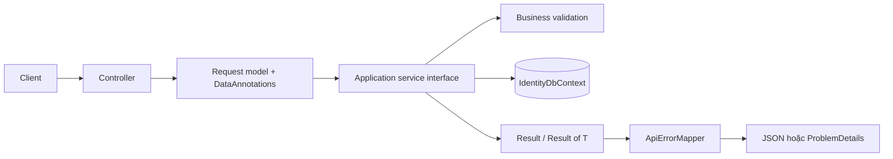
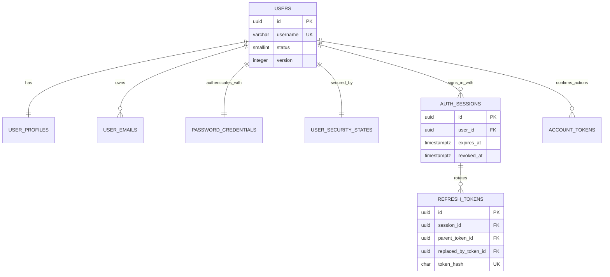
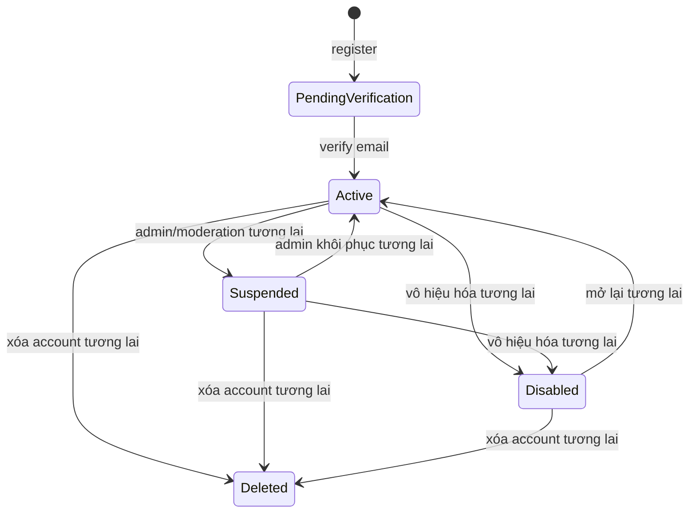
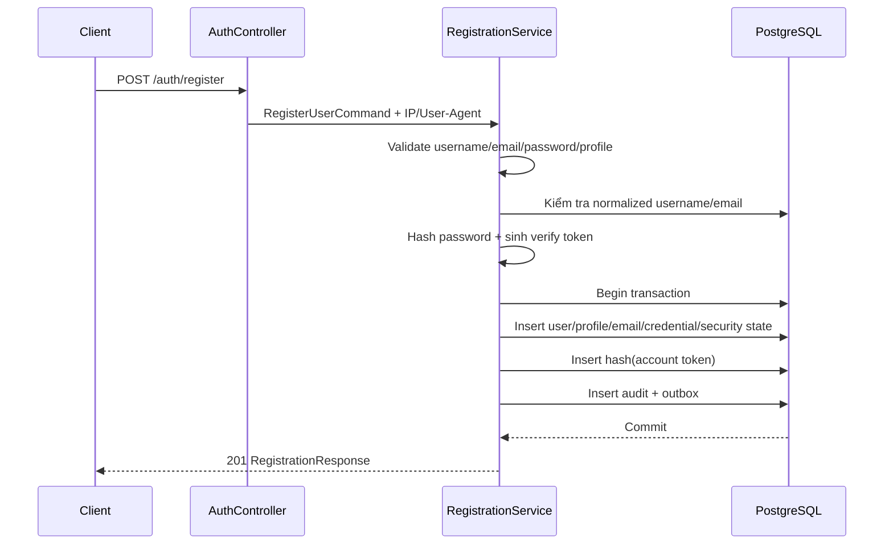
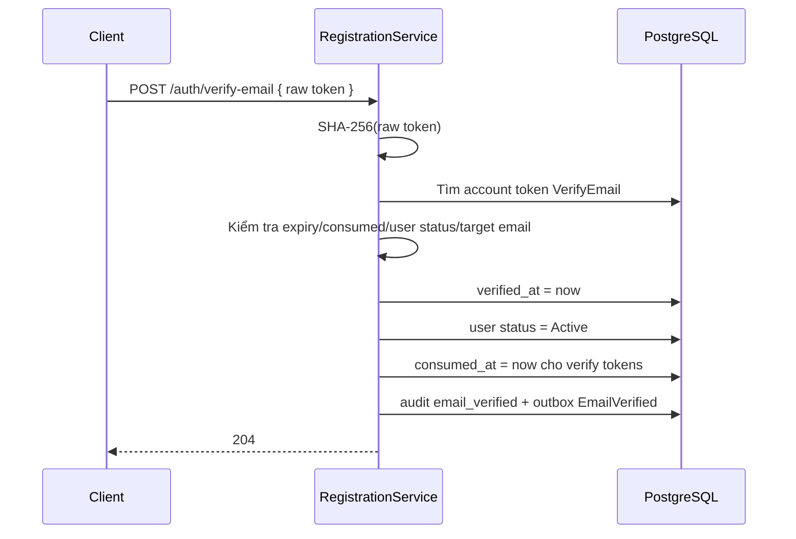
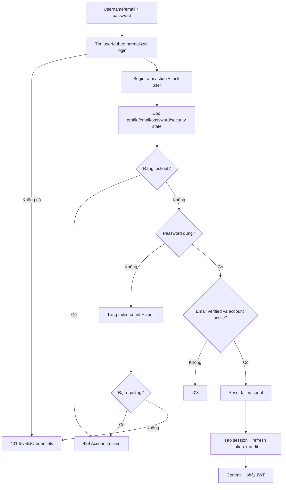
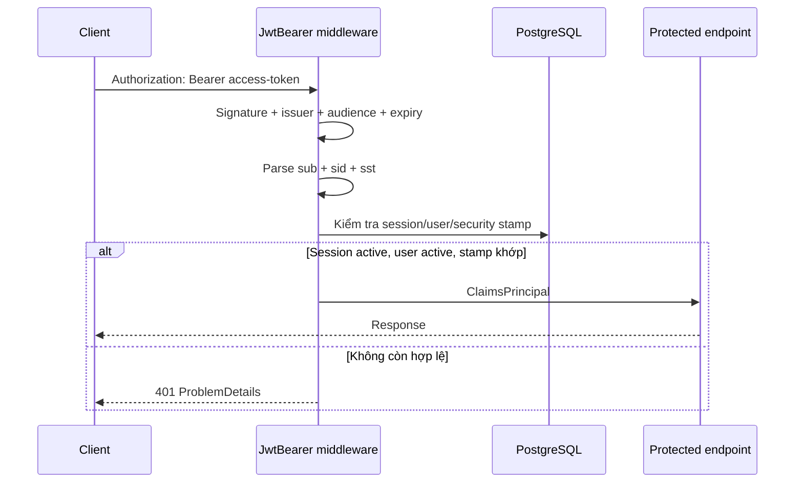
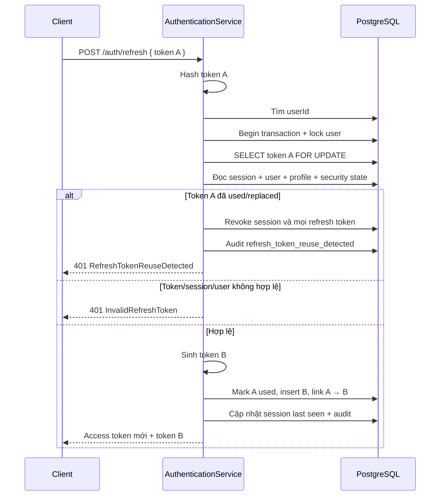
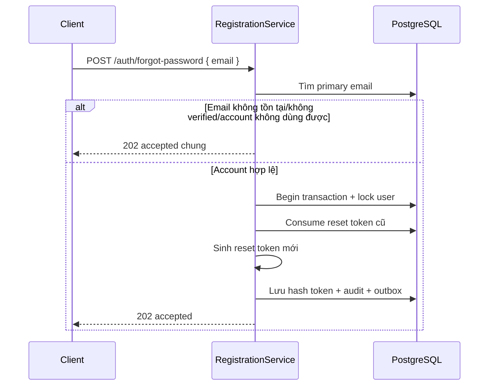
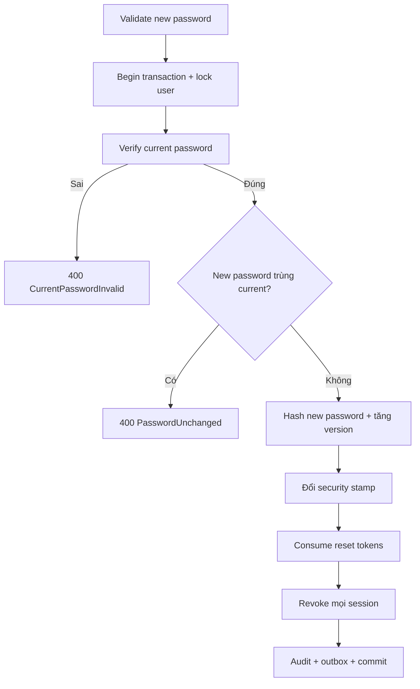

# Identity — trách nhiệm và các luồng nghiệp vụ

Tài liệu này là bản đồ đọc module Identity của SCDC. Mục tiêu là giúp người mới
đọc dự án hiểu được Identity sở hữu dữ liệu nào, một request đi qua những lớp
nào, trạng thái nào thay đổi, cơ chế bảo mật nào được áp dụng và phần việc nào
vẫn chưa được triển khai.

Tài liệu mô tả **hành vi thực tế của mã nguồn hiện tại**. Những phần mới chỉ có
schema hoặc thuộc kế hoạch tương lai được đánh dấu rõ để tránh hiểu nhầm là đã
có thể sử dụng.

Đường đọc nhanh:

- Người mới vào dự án: đọc mục 1–6, sau đó lần lượt các flow ở mục 7–17.
- Review bảo mật: tập trung mục 5, 9–12, 14–16 và 19–20.
- Lập kế hoạch phát triển: đọc mục 2, 18 và 23–24.

## 1. Phạm vi của Identity

Identity chịu trách nhiệm trả lời bốn nhóm câu hỏi:

1. **Người dùng là ai?**
   - Tài khoản, username, email chính và profile.
   - Trạng thái tài khoản: chờ xác thực, active, suspended, disabled, deleted.
2. **Người dùng đã chứng minh danh tính bằng cách nào?**
   - Password hash.
   - Xác thực email và reset password bằng account token.
   - MFA và external identity thuộc giai đoạn sau.
3. **Request hiện tại thuộc phiên đăng nhập nào?**
   - JWT access token.
   - Auth session theo thiết bị.
   - Refresh-token rotation và security stamp.
4. **Một thay đổi bảo mật ảnh hưởng tới hệ thống ra sao?**
   - Thu hồi session và token.
   - Ghi security audit.
   - Ghi transactional outbox để worker/module khác xử lý sau.

Identity **không** quyết định quyền trong server/channel và không sở hữu nội
dung chat. Community quyết định quyền cộng đồng; Messaging quyết định thành
viên hội thoại và dữ liệu tin nhắn. Các module khác chỉ tra thông tin user qua
`IUserDirectory`, không truy vấn trực tiếp bảng Identity trong application code.

## 2. Trạng thái triển khai

| Năng lực | Trạng thái | Ghi chú |
|---|---|---|
| Password account | Đã có | Register, verify email, login |
| JWT access token | Đã có | Có `sub`, `sid`, `sst`, `jti` |
| Session đa thiết bị | Đã có | Liệt kê, thu hồi một phiên, logout toàn bộ |
| Refresh-token rotation | Đã có | Phát hiện reuse và revoke session |
| Profile hiện tại | Đã có | Đọc/cập nhật display name, bio, locale, timezone |
| Password lifecycle | Đã có | Change password, forgot/reset password |
| Account lockout | Đã có | Khóa tạm thời sau nhiều lần đăng nhập sai |
| Security audit | Đã có phần ghi | Chưa có trang/API truy vấn audit |
| Transactional outbox | Đã có phần ghi | Chưa có dispatcher/consumer/email worker |
| Email thật | Chưa có | Development trả raw token trực tiếp cho client |
| Resend verification | Chưa có | Chưa có endpoint/use case |
| Change email/username | Chưa có | `ChangeEmail` mới chỉ có enum/schema token purpose |
| MFA/TOTP/WebAuthn | Chỉ có schema | Chưa có domain flow, service hoặc endpoint |
| Recovery code | Chỉ có schema | Chưa có domain flow, service hoặc endpoint |
| External OAuth/OIDC | Chỉ có schema | Chưa có service hoặc endpoint |
| Admin suspend/unlock/delete | Chưa có | Status đã định nghĩa nhưng chưa có use case quản trị |
| Rate limiting theo IP/client | Chưa có | Lockout hiện chỉ theo account |

## 3. Cấu trúc module

```text
Identity/
├── Domain/
│   ├── User.cs
│   ├── UserProfile.cs
│   ├── UserEmail.cs
│   ├── PasswordCredential.cs
│   ├── UserSecurityState.cs
│   ├── AuthSession.cs
│   ├── RefreshToken.cs
│   ├── AccountToken.cs
│   ├── SecurityEvent.cs
│   └── OutboxEvent.cs
├── Application/
│   ├── IRegistrationService.cs
│   ├── IAuthenticationService.cs
│   ├── IUserAccountService.cs
│   ├── IdentityModels.cs
│   ├── IdentityValidation.cs
│   └── IdentityErrors.cs
├── Infrastructure/
│   ├── Persistence/IdentityDbContext.cs
│   ├── Security/TokenService.cs
│   ├── Services/RegistrationService.cs
│   ├── Services/AuthenticationService.cs
│   ├── Services/UserAccountService.cs
│   ├── Services/UserDirectory.cs
│   ├── IdentityData.cs
│   └── IdentityOptions.cs
└── IdentityModule.cs
```

HTTP request/response nằm tại
[`SCDC.Api/Controllers/Identity`](../../SCDC.Api/Controllers/Identity). Module
đăng ký EF Core, service, JWT authentication và contract liên module trong
[`IdentityModule.cs`](IdentityModule.cs).

Một request Identity thông thường đi theo đường sau:



Controller không chứa nghiệp vụ. Service trả `Result` cho lỗi dự kiến; lỗi bất
thường được `GlobalExceptionHandler` chuyển thành `500 ProblemDetails` mà không
lộ stack trace cho client.

## 4. Mô hình dữ liệu

### 4.1. Aggregate tài khoản

`identity.users` là aggregate root. Các bản ghi profile, email, credential và
security state có vòng đời gắn với user.



### 4.2. Vai trò của từng bảng đang dùng

| Bảng | Vai trò |
|---|---|
| `identity.users` | Username, trạng thái account, aggregate version |
| `identity.user_profiles` | Display name, bio, avatar key, locale, timezone |
| `identity.user_emails` | Email, primary flag, thời điểm verify |
| `identity.password_credentials` | Password hash, algorithm, version và thời điểm đổi |
| `identity.user_security_states` | Security stamp, failed count, lockout, MFA flag |
| `identity.auth_sessions` | Một phiên đăng nhập trên một thiết bị |
| `identity.refresh_tokens` | Chuỗi rotation token của một session |
| `identity.account_tokens` | Verify-email/reset-password token đã hash |
| `audit.security_events` | Dấu vết bảo mật append-only |
| `integration.outbox_events` | Event cần xử lý sau khi transaction commit |

Schema còn có `mfa_methods`, `mfa_recovery_codes` và `auth_identities`, nhưng
module hiện tại không ánh xạ chúng trong `IdentityDbContext` và chưa sử dụng.

### 4.3. Trạng thái tài khoản



Code hiện tại chỉ tạo `PendingVerification` và chuyển sang `Active`. Các chuyển
trạng thái còn lại chưa có endpoint.

## 5. Các bất biến bảo mật

Những quy tắc dưới đây phải được giữ nguyên khi thêm hoặc sửa flow:

- Username được chuẩn hóa bằng `lower(btrim(username))`; email tương tự.
- Username và email là duy nhất ở database, không chỉ được kiểm tra ở service.
- Password dài 8–128 ký tự, có ít nhất một chữ cái và một chữ số.
- Password dùng `Microsoft.AspNetCore.Identity.PasswordHasher` v3; không tự lưu salt.
- Opaque token được sinh từ 48 byte ngẫu nhiên mật mã.
- Database chỉ lưu SHA-256 hash của refresh/account token, không lưu raw token.
- Access token sống ngắn; session và refresh token có vòng đời dài hơn.
- Mỗi JWT phải chứa `sub` (user), `sid` (session), `sst` (security stamp).
- Mỗi request `[Authorize]` kiểm tra lại account, session và security stamp trong DB.
- Logout/đổi/reset password phải vô hiệu hóa access token đang lưu ở client ngay
  tại request bảo vệ kế tiếp.
- Các mutation liên quan credential/token/session khóa cùng một dòng user trước
  khi đưa ra quyết định, tránh race condition.
- Lỗi forgot-password không được tiết lộ email có tồn tại hay không.
- Security event và outbox event liên quan phải được ghi trong cùng transaction
  với thay đổi nghiệp vụ tương ứng.

## 6. Danh sách API hiện tại

| Method | Endpoint | Auth | Kết quả thành công |
|---|---|---|---:|
| POST | `/api/v1/auth/register` | Anonymous | `201` |
| POST | `/api/v1/auth/verify-email` | Anonymous | `204` |
| POST | `/api/v1/auth/login` | Anonymous | `200` |
| POST | `/api/v1/auth/refresh` | Anonymous | `200` |
| POST | `/api/v1/auth/logout` | Anonymous + refresh token | `204` |
| POST | `/api/v1/auth/logout-all` | Bearer | `204` |
| POST | `/api/v1/auth/forgot-password` | Anonymous | `202` |
| POST | `/api/v1/auth/reset-password` | Anonymous | `204` |
| POST | `/api/v1/auth/change-password` | Bearer | `204` |
| GET | `/api/v1/auth/sessions` | Bearer | `200` |
| DELETE | `/api/v1/auth/sessions/{sessionId}` | Bearer | `204` |
| GET | `/api/v1/users/me` | Bearer | `200` |
| PATCH | `/api/v1/users/me` | Bearer | `200` |

## 7. Luồng đăng ký

### Mục tiêu

Tạo toàn bộ aggregate tài khoản ở trạng thái chờ xác thực và phát sinh yêu cầu
gửi email verification.



Trong một transaction, service tạo:

1. `users` với status `PendingVerification`.
2. `user_profiles` với locale `vi-VN`, timezone `Asia/Ho_Chi_Minh`.
3. Primary `user_emails` chưa verify.
4. `password_credentials`.
5. `user_security_states` với security stamp mới.
6. Account token purpose `VerifyEmail`.
7. Audit `registration_succeeded`.
8. Outbox `Identity.EmailVerificationRequested`.

Service kiểm tra trùng trước để trả lỗi rõ ràng, đồng thời vẫn bắt unique
constraint violation để xử lý hai đăng ký chạy đồng thời.

Trong Development, response có `developmentVerificationToken`. Production phải
để giá trị này là `null` và gửi link qua email worker.

### Kết quả lỗi chính

- Dữ liệu không hợp lệ: `400 Identity.RegistrationInvalid`.
- Username đã dùng: `409 Identity.UsernameAlreadyExists`.
- Email đã dùng: `409 Identity.EmailAlreadyExists`.

## 8. Luồng xác thực email



Token sai, hết hạn, đã dùng hoặc thuộc account disabled/deleted trả
`400 Identity.InvalidOrExpiredToken`.

Lưu ý hiện tại: flow này chưa lấy user lock như reset-password. Khi hoàn thiện
hardening, cần thêm test verify đồng thời và bảo đảm request thua cuộc trả lỗi
nghiệp vụ ổn định thay vì `DbUpdateConcurrencyException`.

## 9. Luồng đăng nhập



### Thành công

- Password hash cũ có thể được rehash tự động.
- Tạo một `auth_session` mới theo thiết bị.
- Tạo refresh token đầu tiên của session.
- Ghi audit `login_succeeded`.
- Trả access token, refresh token, expiry và thông tin user.

### Thất bại

- Login không tồn tại hoặc sai password đều dùng `401 Identity.InvalidCredentials`.
- Đủ số lần sai trả `429 Identity.AccountLocked`.
- Password đúng nhưng email chưa verify trả `403 Identity.EmailNotVerified`.
- Account không active trả `403 Identity.AccountUnavailable`.

## 10. Luồng xác thực JWT trên mỗi request

JWT hợp lệ về chữ ký chưa đủ để gọi API bảo vệ.



Hệ quả:

- Logout có hiệu lực với HTTP request kế tiếp.
- Revoke một session không ảnh hưởng session khác.
- Đổi/reset password đổi security stamp và revoke session, nên mọi access token
  cũ đều bị từ chối.
- Cách làm hiện tại phát sinh một DB query cho mỗi request được bảo vệ. Khi tách
  service hoặc scale lớn cần cache/revocation event nhưng không được làm yếu
  semantics thu hồi hiện tại.

## 11. Luồng refresh-token rotation

```text
Token A (active)
    └── refresh thành công
        ├── A.used_at = now
        ├── A.replaced_by_token_id = B.id
        └── Token B.parent_token_id = A.id
                └── refresh tiếp → Token C
```



Client phải thay refresh token cũ ngay sau mỗi lần refresh. Nếu response đã đến
nhưng client tiếp tục dùng token cũ, backend xem đó là dấu hiệu replay và revoke
toàn bộ session.

## 12. Các luồng logout và quản lý session

### Logout một session bằng refresh token

`POST /auth/logout` nhận refresh token, tìm session sở hữu token và revoke:

- Session.
- Tất cả refresh token thuộc session.
- Ghi audit `logout`.

Endpoint có tính idempotent: token không tồn tại vẫn trả `204`.

### Logout toàn bộ

`POST /auth/logout-all` cần bearer token, khóa user rồi revoke mọi session chưa
bị revoke. Bao gồm cả session đang gọi endpoint. Sau response, access token hiện
tại không còn hợp lệ.

### Liệt kê session

`GET /auth/sessions` chỉ trả session:

- Thuộc user đang đăng nhập.
- Chưa revoke.
- Chưa hết hạn.

Mỗi item có `isCurrent` dựa trên claim `sid`.

### Thu hồi một session

`DELETE /auth/sessions/{sessionId}` chỉ tìm session vừa thuộc user hiện tại vừa
có đúng ID được yêu cầu. User không thể revoke session của account khác.

## 13. Các luồng profile

### Đọc profile hiện tại

`GET /users/me` dùng `sub` trong JWT để tải user, primary email và profile, sau
đó trả `UserAccountResponse`.

### Cập nhật profile

`PATCH /users/me` cập nhật:

- `displayName`: 1–64 ký tự.
- `bio`: tối đa 500 ký tự.
- `locale`: 1–16 ký tự.
- `timezone`: 1–64 ký tự.

Username, email, avatar upload và account status không thay đổi qua endpoint
này vì cần lifecycle riêng.

## 14. Luồng forgot password



Response luôn có ý nghĩa “đã tiếp nhận”, không cho biết email có tồn tại. Trong
Development, `developmentResetToken` có thể được trả để test khi chưa có email
worker.

## 15. Luồng reset password

1. Validate password mới.
2. Hash raw reset token và tìm user sở hữu.
3. Begin transaction, khóa user.
4. Đọc lại token cùng credential, security state, session và refresh token.
5. Kiểm tra token chưa dùng/chưa hết hạn và account còn hợp lệ.
6. Hash password mới, tăng password version.
7. Tạo security stamp mới.
8. Reset failed-login state và lockout.
9. Consume token hiện tại cùng mọi reset token còn active.
10. Revoke toàn bộ session và refresh token.
11. Ghi audit `password_reset_succeeded` và outbox `Identity.PasswordChanged`.
12. Commit và trả `204`.

Reset token chỉ được dùng một lần. Các request reset đồng thời được tuần tự hóa
qua user lock.

## 16. Luồng change password

`POST /auth/change-password` yêu cầu bearer token, current password và new
password.



Flow này revoke cả session hiện tại. Client phải coi thành công là yêu cầu đăng
nhập lại, không tiếp tục xem access token cũ là hợp lệ.

## 17. Tra cứu user cho module khác

[`IUserDirectory`](../../SCDC.Contracts/Identity/IUserDirectory.cs) là public
contract Identity cung cấp cho Community/Messaging:

- Tìm active user theo ID.
- Tìm active user theo username.
- Tìm nhiều active user theo tập ID.

Contract chỉ trả `Id`, `Username`, `DisplayName`. Nó không làm lộ email,
password, session hoặc security state. Khi module còn nằm chung process,
`UserDirectory` gọi EF Core trực tiếp. Khi tách service, contract này có thể được
thay adapter transport nhưng semantics phải giữ nguyên.

## 18. Audit và outbox

### Security event đang ghi

| Flow | Event |
|---|---|
| Register | `registration_succeeded` |
| Verify email | `email_verified` |
| Login sai | `login_failed` |
| Login thành công | `login_succeeded` |
| Refresh thành công | `refresh_token_rotated` |
| Phát hiện reuse | `refresh_token_reuse_detected` |
| Logout | `logout` |
| Logout all | `logout_all` |
| Revoke session | `session_revoked` |
| Forgot password | `password_reset_requested` |
| Reset password | `password_reset_succeeded` |
| Change password | `password_changed` |

Audit có IP, user-agent, metadata JSON và thời điểm xảy ra. Không ghi raw token
hoặc password vào audit/log.

### Outbox event đang ghi

| Flow | Event type |
|---|---|
| Register | `Identity.EmailVerificationRequested` |
| Verify email | `Identity.EmailVerified` |
| Forgot password | `Identity.PasswordResetRequested` |
| Change/reset password | `Identity.PasswordChanged` |

Hiện chưa có worker đọc `integration.outbox_events`. Một khoảng trống cần giải
quyết trước production: event yêu cầu email chỉ chứa `account_token_id`, trong
khi DB chỉ lưu token hash. Email worker không thể tái tạo raw token từ hash.
Thiết kế email production phải chọn cách truyền token an toàn, ví dụ tạo nội
dung email/link trước khi bỏ raw token, hoặc mã hóa payload dành riêng cho
worker. Không được lưu raw token dạng plaintext lâu dài.

Khi Messaging có kết nối realtime, logout/revoke/password change còn cần event
thu hồi connection theo `sid` hoặc theo user. HTTP token đã bị chặn ngay bởi DB,
nhưng một SignalR connection đã xác thực cần cơ chế chủ động disconnect.

## 19. Concurrency và transaction

Các flow login, refresh, logout, logout-all, revoke session, forgot/reset và
change password lấy cùng một user lock:

```sql
SELECT id
FROM identity.users
WHERE id = @userId
FOR NO KEY UPDATE;
```

Quy tắc lock order là:

1. Begin transaction.
2. Lock user.
3. Đọc credential/token/session cần quyết định.
4. Thay đổi dữ liệu, audit và outbox.
5. Commit.

Refresh còn khóa riêng refresh token bằng `FOR UPDATE`. Không thêm một flow bảo
mật mới đọc credential/session trước khi lấy user lock vì có thể phá vỡ các đảm
bảo concurrency đang được test.

`users.version` là concurrency token do trigger database tăng khi update. Lỗi
concurrency dự kiến nên được ánh xạ thành lỗi nghiệp vụ phù hợp thay vì để rơi
vào global `500`.

## 20. Frontend session lifecycle

WebClient triển khai client Identity tại
[`clients/WebClient/src/api.js`](../../../clients/WebClient/src/api.js):

1. Login lưu access token, refresh token, expiry và user thành một session.
2. Trước request bảo vệ, access token gần hết hạn được refresh.
3. Response `401` có thể kích hoạt một lần refresh rồi retry request đúng một lần.
4. Trình duyệt có Web Locks dùng một lock chung để nhiều tab không rotate cùng
   một refresh token.
5. Storage event đồng bộ token mới và logout giữa các tab.
6. Response refresh đến trễ không được khôi phục session đã logout hoặc ghi đè
   một lần login mới.
7. Trình duyệt không có Web Locks giữ session trong memory từng tab để tránh hai
   tab dùng chung một refresh token.

Hiện session được lưu trong `localStorage` khi Web Locks khả dụng. Đây là điểm
cần đánh giá lại cho production do rủi ro XSS; một phương án khác là refresh
token trong cookie `HttpOnly`, `Secure`, `SameSite` và access token trong memory.

UI hiện có login/register/forgot-password, profile, change password và session
management. Chưa có trang nhận verification link hoặc reset-password link thật.

## 21. Cấu hình

```json
{
  "Modules": {
    "Identity": {
      "Issuer": "SCDC",
      "Audience": "SCDC.WebClient",
      "SigningKey": "set-by-secret-provider",
      "AccessTokenMinutes": 15,
      "SessionDays": 30,
      "EmailVerificationTokenMinutes": 30,
      "PasswordResetTokenMinutes": 30,
      "MaxFailedLoginAttempts": 5,
      "LockoutMinutes": 15,
      "ExposeDevelopmentTokens": false
    }
  }
}
```

Production phải cấp signing key qua secret manager/environment variable và giữ
`ExposeDevelopmentTokens=false`.

Startup hiện kiểm tra signing key, access-token lifetime, session lifetime và
lockout threshold. Nên bổ sung validation dương cho email token lifetime,
password-reset token lifetime và lockout duration.

## 22. Kiểm thử hiện có

[`IdentityV1FlowTests`](../../../tests/SCDC.Api.Tests/Identity/IdentityV1FlowTests.cs)
chạy lifecycle đầy đủ trên PostgreSQL thật:

```text
register → login bị chặn → verify → login → me/profile
→ refresh → reuse detection → login lại → sessions
→ forgot/reset → change password → revoke session
→ logout-all → logout
```

[`IdentityConcurrencyTests`](../../../tests/SCDC.Api.Tests/Identity/IdentityConcurrencyTests.cs)
kiểm tra:

- Reset token cũ bị vô hiệu sau change password.
- Login đồng thời không sống sót qua change/reset password.
- Nhiều lần nhập sai song song vẫn được đếm đủ và kích hoạt lockout.
- Một reset token chỉ có thể được dùng thành công một lần.
- Login đang chờ password change phải kiểm tra lại password sau khi lấy lock.

Frontend có test riêng cho refresh token giữa nhiều tab tại
[`clients/WebClient/tests/api.test.js`](../../../clients/WebClient/tests/api.test.js).

## 23. Công việc cần làm trước production

Ưu tiên đề xuất:

1. Hoàn thiện email verification/reset pipeline và cách chuyển raw token an toàn.
2. Thêm outbox dispatcher, retry, lease/dead-letter và email provider.
3. Thêm trang frontend cho verification link và reset-password link.
4. Thêm resend-verification với cooldown và invalidation token cũ.
5. Thêm rate limiting theo IP/client cho register/login/forgot/verify/refresh.
6. Bổ sung test/hardening cho verify-email đồng thời.
7. Bổ sung cleanup job cho session/token hết hạn và outbox đã publish.
8. Phát event revoke session để ngắt SignalR connection đang hoạt động.
9. Quyết định chiến lược lưu refresh token trên browser.
10. Bổ sung observability: metric login failure, lockout, refresh reuse, outbox lag.

Sau khi v1 production-ready, Identity v2 có thể triển khai theo thứ tự:

1. Change email và verify địa chỉ mới.
2. MFA TOTP + recovery code.
3. WebAuthn/passkey.
4. External OAuth/OIDC account linking.
5. Admin suspend/disable/unlock và audit query.
6. Account deletion/anonymization và data-retention workflow.

## 24. Checklist khi thêm một flow Identity mới

Trước khi coi một flow là hoàn thành, kiểm tra:

- Request DTO và DataAnnotations đã có chưa?
- Business validation và error code ổn định đã có chưa?
- Có cần xác thực JWT/session hay phải anonymous?
- Có cần user lock hoặc token lock không?
- Mọi quyết định bảo mật có được đọc lại sau khi lấy lock không?
- Database constraint/index có bảo vệ invariant không?
- Raw secret/token có bị ghi vào DB, log, audit hoặc outbox không?
- Có cần revoke session hoặc đổi security stamp không?
- Audit event nào phải ghi?
- Outbox event nào phải ghi cùng transaction?
- Response có làm lộ user/email tồn tại không?
- ProblemDetails trả đúng status/error code không?
- Có test happy path, invalid input, expired/reused token và concurrency chưa?
- Frontend có xử lý logout/refresh/session invalidation đúng không?

## 25. Mô hình ghi nhớ ngắn

```text
User chứng minh danh tính bằng credential
    → Identity tạo session
    → session phát JWT ngắn hạn + refresh token xoay vòng
    → mỗi request kiểm tra lại session/security stamp
    → mọi thay đổi nhạy cảm khóa user
    → logout/password change/reset thu hồi session
    → audit lưu dấu vết
    → outbox thông báo tác động ra ngoài transaction
```

Nếu giữ được chuỗi trên, các tính năng Identity mới sẽ nhất quán với thiết kế
hiện tại và không làm yếu cơ chế thu hồi phiên hoặc bảo vệ concurrency.
