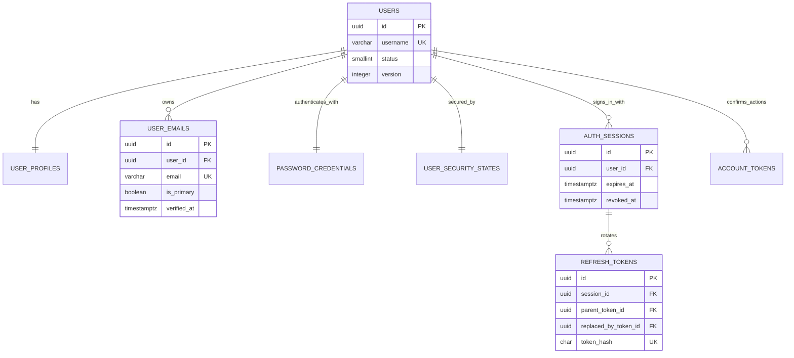
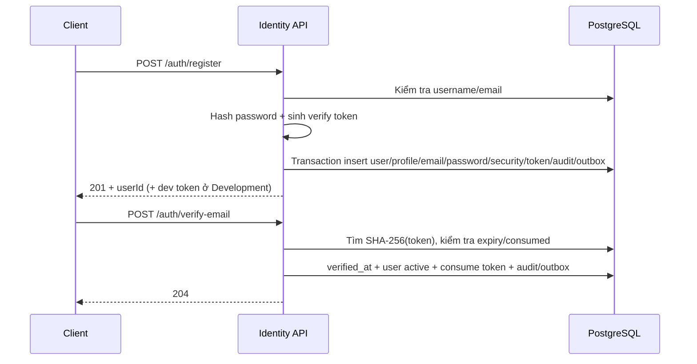

# Định hướng và luồng dữ liệu Identity v1

Tài liệu này giải thích phạm vi Identity v1, vai trò của từng bảng trong schema
`identity`, các luồng API và cách token/session thay đổi theo thời gian.

## 1. Phạm vi

Identity v1 bao gồm:

- Đăng ký bằng username, email và password.
- Xác thực email.
- Đăng nhập bằng username hoặc email.
- Access token JWT và refresh-token rotation.
- Logout một session, logout tất cả và quản lý session.
- Đọc/cập nhật profile hiện tại.
- Đổi mật khẩu khi đang đăng nhập.
- Forgot/reset password.
- Lockout tạm thời khi đăng nhập sai nhiều lần.
- Audit security event và ghi transactional outbox.

Chưa thuộc v1:

- MFA/TOTP/WebAuthn.
- Recovery code.
- Google, GitHub hoặc external OAuth/OIDC.
- Gửi email thật và worker xử lý outbox.
- Trang quản trị khóa/mở khóa account.

Ba bảng `mfa_methods`, `mfa_recovery_codes` và `auth_identities` được giữ trong
database cho Identity v2 nhưng code v1 không ánh xạ hoặc sử dụng chúng.

## 2. Các bảng Identity v1

| Bảng | Dữ liệu chính | Khi nào thay đổi |
|---|---|---|
| `identity.users` | Username, account status, version | Register, verify email, cập nhật aggregate |
| `identity.user_profiles` | Display name, bio, avatar, locale, timezone | Register, update profile |
| `identity.user_emails` | Email, primary flag, verified time | Register, verify email |
| `identity.password_credentials` | Password hash, algorithm, version | Register, login rehash, change/reset password |
| `identity.user_security_states` | Security stamp, failed count, lockout | Login, change/reset password |
| `identity.auth_sessions` | Một phiên đăng nhập trên một thiết bị | Login, refresh, logout/revoke |
| `identity.refresh_tokens` | Chuỗi refresh-token rotation | Login, refresh, logout/revoke |
| `identity.account_tokens` | Token xác thực email/reset password | Register, verify, forgot/reset password |

Identity còn ghi hai bảng hạ tầng chéo:

| Bảng | Mục đích |
|---|---|
| `audit.security_events` | Nhật ký append-only cho sự kiện bảo mật |
| `integration.outbox_events` | Ghi event cùng transaction để worker xử lý sau |

## 3. Quan hệ dữ liệu



`users` là aggregate root. Các bảng profile, email, password và security state
có vòng đời gắn với user. Session có thể tồn tại nhiều bản ghi cho một user; mỗi
session có một chuỗi refresh token riêng.

## 4. Trạng thái account

Giá trị `identity.users.status`:

| Giá trị | Tên | Ý nghĩa |
|---:|---|---|
| `0` | `pending_verification` | Đã đăng ký nhưng chưa xác thực email |
| `1` | `active` | Được phép đăng nhập và dùng API bảo vệ |
| `2` | `suspended` | Bị tạm ngưng bởi moderation/admin |
| `3` | `disabled` | Tài khoản bị vô hiệu hóa |
| `4` | `deleted` | Tài khoản đã bước vào trạng thái xóa |

Register tạo user ở trạng thái `0`. Verify email chuyển user sang trạng thái
`1`. JWT chỉ hợp lệ khi user vẫn active và session chưa bị revoke/hết hạn.

## 5. Account token

Giá trị `identity.account_tokens.purpose`:

| Giá trị | Purpose | Phiên bản sử dụng |
|---:|---|---|
| `1` | Verify email | v1 |
| `2` | Reset password | v1 |
| `3` | Change email | Sau v1 |
| `4` | Unlock account | Sau v1 |

API sinh token ngẫu nhiên và chỉ lưu SHA-256 hash vào database. Token thô chỉ
được client gửi một lần để verify/reset. Token đã dùng có `consumed_at`; token
hết hạn hoặc đã dùng không thể sử dụng lại.

Trong Development, `developmentVerificationToken` và `developmentResetToken`
được trả trong response để có thể test bằng Swagger khi chưa có email worker.
`ExposeDevelopmentTokens` mặc định là `false` và không được bật ở production.

## 6. Luồng đăng ký và xác thực email



Transaction register tạo đồng thời:

1. `users` ở trạng thái pending.
2. `user_profiles` với locale/timezone mặc định.
3. Primary `user_emails` chưa verify.
4. `password_credentials` dùng ASP.NET Core Identity PasswordHasher v3.
5. `user_security_states` với security stamp mới.
6. `account_tokens` purpose verify email.
7. `audit.security_events`.
8. `integration.outbox_events`.

Nếu username hoặc email trùng, toàn bộ transaction không ghi dữ liệu và API trả
`409 Conflict`.

## 7. Luồng đăng nhập

```text
Username/email + password
        ↓
Tìm user và security state
        ↓
Kiểm tra lockout
        ↓
Verify password hash
        ↓
Kiểm tra email verified + user active
        ↓
Tạo auth_session + refresh_token
        ↓
Phát JWT access token
```

Đăng nhập sai tăng `failed_login_count`. Khi đạt
`Modules:Identity:MaxFailedLoginAttempts`, account bị khóa tạm thời tới
`locked_until` và API trả `429`. Đăng nhập thành công reset failed count.

Response đăng nhập:

```json
{
  "accessToken": "eyJ...",
  "accessTokenExpiresAt": "2026-09-01T12:30:00Z",
  "refreshToken": "opaque-token",
  "refreshTokenExpiresAt": "2026-10-01T12:15:00Z",
  "user": {
    "id": "019...",
    "username": "alice",
    "displayName": "Alice",
    "email": "alice@example.com",
    "emailVerified": true,
    "status": "active"
  }
}
```

Access token chứa các claim quan trọng:

| Claim | Ý nghĩa |
|---|---|
| `sub` | User ID |
| `sid` | Session ID |
| `sst` | Security stamp tại thời điểm phát token |
| `jti` | ID duy nhất của access token |
| `unique_name` | Username |
| `name` | Display name |

Mỗi request `[Authorize]` kiểm tra signature, issuer, audience, expiry, trạng thái
session, account status và security stamp trong database. Vì vậy logout hoặc đổi
mật khẩu vô hiệu hóa access token ngay, không phải chờ JWT hết hạn.

## 8. Refresh-token rotation

```text
Token A (active)
    ↓ refresh
Token A.used_at = now
Token A.replaced_by_token_id = Token B
Token B.parent_token_id = Token A
    ↓ refresh
Token B → Token C
```

Refresh thực hiện `SELECT ... FOR UPDATE` trên token hiện tại. Việc insert token
kế tiếp và cập nhật token cũ nằm trong cùng transaction.

Nếu Token A đã dùng nhưng xuất hiện lại, hệ thống xem đây là token reuse:

1. Revoke toàn bộ session.
2. Revoke mọi refresh token thuộc session.
3. Ghi `refresh_token_reuse_detected` vào audit.
4. Trả `401 Identity.RefreshTokenReuseDetected`.

Client phải thay refresh token cũ bằng token mới sau mỗi lần refresh.

## 9. Logout và session

- `logout`: refresh token xác định session cần revoke; endpoint có tính
  idempotent.
- `logout-all`: revoke mọi session active của user.
- `GET /auth/sessions`: liệt kê thiết bị/session còn active.
- `DELETE /auth/sessions/{id}`: user chỉ được revoke session thuộc chính mình.

Revoke session đặt `revoked_at`, `revoke_reason` và revoke toàn bộ refresh token
liên quan. JWT validator kiểm tra session ở mỗi request nên access token của
session bị từ chối ngay.

## 10. Profile

`GET /api/v1/users/me` trả account, primary email và profile của user trong JWT.

`PATCH /api/v1/users/me` cho phép cập nhật:

- `displayName`: 1-64 ký tự.
- `bio`: tối đa 500 ký tự.
- `locale`: tối đa 16 ký tự.
- `timezone`: tối đa 64 ký tự.

Username và email không được thay đổi qua endpoint profile vì chúng có lifecycle
xác thực riêng.

## 11. Password lifecycle

### Change password

User phải gửi current password và new password. Thành công sẽ:

- Cập nhật hash và tăng `password_version`.
- Tạo security stamp mới.
- Revoke toàn bộ session.
- Ghi audit và outbox event.

Client phải đăng nhập lại sau khi đổi mật khẩu.

### Forgot/reset password

Forgot-password luôn trả `202 Accepted`, kể cả email không tồn tại, để tránh lộ
danh sách tài khoản. Với user hợp lệ, hệ thống tạo account token purpose `2` và
ghi outbox event.

Reset-password kiểm tra hash, expiry và consumed state của token, sau đó đổi
password, đổi security stamp và revoke mọi session. Token reset chỉ dùng một lần.

Password v1 có độ dài 8-128 ký tự và phải chứa ít nhất một chữ cái, một chữ số.

## 12. Danh sách endpoint

| Method | Endpoint | Auth | Success |
|---|---|---|---:|
| POST | `/api/v1/auth/register` | Không | `201` |
| POST | `/api/v1/auth/verify-email` | Không | `204` |
| POST | `/api/v1/auth/login` | Không | `200` |
| POST | `/api/v1/auth/refresh` | Không | `200` |
| POST | `/api/v1/auth/logout` | Không | `204` |
| POST | `/api/v1/auth/logout-all` | Bearer | `204` |
| GET | `/api/v1/auth/sessions` | Bearer | `200` |
| DELETE | `/api/v1/auth/sessions/{id}` | Bearer | `204` |
| POST | `/api/v1/auth/forgot-password` | Không | `202` |
| POST | `/api/v1/auth/reset-password` | Không | `204` |
| POST | `/api/v1/auth/change-password` | Bearer | `204` |
| GET | `/api/v1/users/me` | Bearer | `200` |
| PATCH | `/api/v1/users/me` | Bearer | `200` |

Tất cả lỗi dùng `ProblemDetails` theo
[`docs/api/error-handling.md`](../api/error-handling.md).

## 13. Cấu hình

```json
{
  "Modules": {
    "Identity": {
      "Issuer": "SCDC",
      "Audience": "SCDC.WebClient",
      "SigningKey": "set-by-secret-provider",
      "AccessTokenMinutes": 15,
      "SessionDays": 30,
      "EmailVerificationTokenMinutes": 30,
      "PasswordResetTokenMinutes": 30,
      "MaxFailedLoginAttempts": 5,
      "LockoutMinutes": 15,
      "ExposeDevelopmentTokens": false
    }
  }
}
```

Production phải cung cấp SigningKey bằng secret manager/environment variable.
Không dùng development key được commit trong source cho môi trường thật.

## 14. Quan sát bằng DBeaver

```sql
SELECT *
FROM identity.v_user_accounts
ORDER BY created_at DESC;

SELECT *
FROM identity.v_active_sessions
ORDER BY last_seen_at DESC;

SELECT id, session_id, parent_token_id, replaced_by_token_id,
       created_at, expires_at, used_at, revoked_at, revoke_reason
FROM identity.refresh_tokens
ORDER BY session_id, created_at;

SELECT id, user_id, purpose, target_value,
       created_at, expires_at, consumed_at
FROM identity.account_tokens
ORDER BY created_at DESC;

SELECT event_type, user_id, occurred_at, metadata
FROM audit.security_events
ORDER BY occurred_at DESC;
```

Không query hoặc hiển thị `password_hash`, `token_hash` trong log ứng dụng.

## 15. Kiểm thử

Integration test tạo một user ngẫu nhiên và chạy toàn bộ lifecycle trên
PostgreSQL thật:

```text
register → login bị chặn → verify → login → me/profile
→ refresh → reuse detection → login lại
→ sessions → forgot/reset password → login lại → logout
```

Test dọn audit, outbox và user sau khi kết thúc. Chạy bằng:

```bash
dotnet test SCDC.slnx --configuration Release
```
