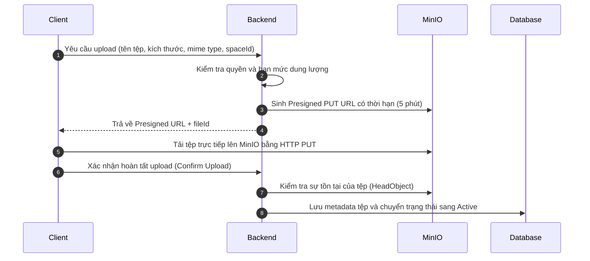

# Đặc tả Dịch vụ Tệp và Đa phương tiện (File & Media Storage)

## 1. Trách nhiệm nghiệp vụ

Dịch vụ File Storage phụ trách quản lý việc tải lên, lưu trữ an toàn và phân phối tệp đính kèm, ảnh đại diện (avatar), biểu ngữ (banner) của người dùng và cộng đồng.

Hệ thống sử dụng hạ tầng **MinIO Object Storage** tương thích API AWS S3.

---

## 2. Cơ chế Upload trực tiếp qua Presigned URL

Nhằm giảm tải băng thông và bộ nhớ cho Backend API chính, luồng tải lên áp dụng kỹ thuật **Presigned URL**:

---

## 3. Xử lý ảnh và sinh Thumbnail (Worker)

- Khi người dùng tải lên ảnh có định dạng `image/jpeg`, `image/png`, `image/webp`:
  - Background Worker nhận sự kiện qua hàng đợi (hoặc outbox).
  - Sử dụng thư viện `SixLabors.ImageSharp` để nén và tạo các phiên bản thu nhỏ (thumbnail 128x128 cho avatar, 640x360 cho ảnh xem trước tin nhắn).
  - Lưu ảnh thumbnail trở lại MinIO với định dạng WebP để tối ưu dung lượng mạng.

---

## 4. Trạng thái phát triển hiện tại

- Trạng thái: Kế hoạch triển khai (Giai đoạn tiếp theo).
- Hạ tầng MinIO: Đã sẵn sàng cấu hình trong `compose.yaml`.
