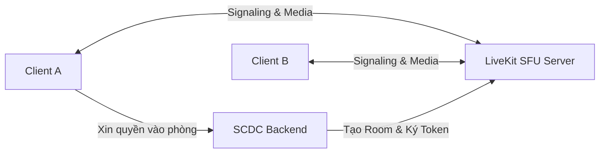

# Đặc tả Dịch vụ Thoại, Video và Chia sẻ màn hình (Calls & WebRTC)

## 1. Trách nhiệm nghiệp vụ

Dịch vụ Calls chịu trách nhiệm quản lý phiên kết nối truyền thông thời gian thực, bao gồm cuộc gọi thoại/video trực tiếp giữa hai người (1-1 DM Call) và phòng thoại trong kênh cộng đồng (Channel Voice Room), kết hợp tính năng chia sẻ màn hình (Screen Sharing).

---

## 2. Kiến trúc giải pháp (LiveKit SFU)

Hệ thống sử dụng **LiveKit SFU (Selective Forwarding Unit)** làm hạ tầng xử lý WebRTC tập trung:
- Không sử dụng mô hình ngang hàng (P2P Mesh) do giới hạn băng thông phía client khi số người tham gia tăng lên.
- LiveKit SFU nhận luồng media từ mỗi người tham gia và chuyển tiếp có chọn lọc tới các người nhận khác dựa trên chất lượng mạng và người đang nói (Active Speaker).
- Backend SCDC đóng vai trò **Room Coordinator**: Kiểm tra quyền truy cập của người dùng và sinh JWT Token của LiveKit cho phép client kết nối vào phòng.

---

## 3. Quy trình tham gia cuộc gọi (Call Flow)

1. Client gửi yêu cầu kết nối phòng thoại tới endpoint của Backend kèm `channelId` hoặc `dmSpaceId`.
2. Backend kiểm tra quyền qua `IChannelAccessChecker`:
   - Nếu là phòng cộng đồng: Người dùng phải có quyền `ConnectVoice`.
   - Nếu là DM: Người dùng phải là thành viên của cuộc hội thoại.
3. Backend sinh chuỗi `LiveKit Access Token` có thời hạn và chứa các quyền (cho phép phát micro, bật camera, chia sẻ màn hình).
4. Client nhận Token và kết nối trực tiếp tới LiveKit Server qua giao thức WebSocket và WebRTC PeerConnection.

---

## 4. Trạng thái phát triển hiện tại

- Trạng thái: Kế hoạch triển khai (Giai đoạn tiếp theo).
- Đã hoàn thành: Khung đặc tả yêu cầu chức năng tại hồ sơ dự án.
