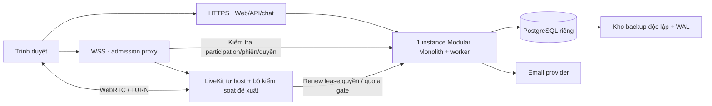

# SCDC — Kiểm thử nghiệm thu, phát hành và vận hành

Cập nhật: 2026-10-04. Phạm vi: SCP-008, SUC-006 và yêu cầu chất lượng xuyên tính năng.

Kế hoạch chuẩn bị; chưa có kết quả nghiệm thu/phát hành được ghi nhận. Compose hiện tại là cấu hình Development. DEC-110 chốt điều kiện lỗi tồn; DEC-111 ghi người duyệt chưa được chọn; DEC-112 chốt phạm vi quản trị kỹ thuật có audit. Công cụ, người trực và cấu hình triển khai còn OQ-007/OQ-008/OQ-010/OQ-011.

## Mục lục

- [Kiểm thử và nghiệm thu](#testing)
- [Quy trình và hồ sơ nghiệm thu](#acceptance-process)
- [Phân loại lỗi và điều kiện phát hành](#release-gates)
- [Kiểm tra nhanh sau triển khai](#smoke)
- [Chuẩn bị phát hành](#release)
- [Vận hành và khôi phục](#operations)
- [Gói việc còn thiếu](#implementation-gaps)
- [Thông tin cần chốt](#gaps)

Tài liệu thực hành: [runbook vận hành](operations-runbook.md), [mẫu hồ sơ nghiệm thu/phát hành](templates/release-record.md) và [mẫu hồ sơ sự cố](templates/incident-record.md). Các mẫu để trống kết quả; checklist là điều kiện cần kiểm chứng, không là việc đã thực hiện.

## 1. Kiểm thử và nghiệm thu

### Phạm vi kiểm chứng

Thái chuẩn bị và điều phối kiểm thử, Vg và Sáng rà soát tình huống liên
quan đến UX, backend và kiến trúc. Kết quả kiểm thử phải nối tới mã tiêu
chí chấp nhận, môi trường, dữ liệu thử, phiên bản sản phẩm và lỗi phát hiện.
Không coi tiêu chí dự thảo là đã đạt khi chưa có kết quả thực thi.
Bộ ca và dữ liệu chuẩn bị cho tài khoản/DM/quyền phòng tại
[SCDC-QA-DM-001](features/direct-messaging.md#tests); các ca TC trong đặc tả chưa có kết quả chạy được ghi nhận; repo có bộ test tự động được mô tả trong hướng dẫn phát triển.

| Nhóm | Tình huống cần kiểm chứng | Căn cứ |
|---|---|---|
| DM chức năng | Tìm theo hai trường, chọn đúng người, gửi/lưu/xem lại, sửa/xóa, lỗi gửi và chủ động thử lại; validation Unicode, bản nháp trong tab và bù tin nhiều trang; từ chối gửi khi email chưa xác minh. | AC-DM-01 đến AC-DM-21 |
| DM kết nối | A gửi khi B chưa mở ứng dụng; B thấy tin đã lưu khi mở lại. Kết quả lần đầu không rõ, thử lại cùng thao tác chỉ một tin. | AC-DM-07, AC-DM-08 |
| Cộng đồng | Tìm công khai, join/request/invite, chuyển owner/rời/rejoin, private switch; tên Unicode, @everyone/giới hạn role, quyền quản lý cộng dồn và issuer lifetime. | AC-COM-01 đến AC-COM-42; TC-COM/TC-ACL ở đặc tả Community |
| Phòng/tin | Quyền xem mặc định, lịch sử, gửi/sửa/xóa/thử lại, ACL snapshot và epoch; manager cần view, guard tranh revoke/send; xóa phòng chặn HTTP/realtime/media theo phạm vi. | AC-COM-06/07, AC-COM-11 đến AC-COM-18, AC-COM-22 đến AC-COM-28, AC-COM-34/42 |
| Tài khoản | Đăng ký, xác minh, đăng nhập, hồ sơ, phiên và đặt lại mật khẩu qua email; consume/resend đồng thời, trạng thái liên kết và email worker. Chính sách DEC-063–068 đã chốt; limiter bổ sung hoãn DEC-089; thiết kế recovery còn cần triển khai và kiểm chứng ACC-GAP. | AC-ACC-01 đến AC-ACC-21, OQ-002 |
| Media | Gọi riêng/phòng thoại, 10/20/2, ring/reconnect 30 giây; DEC-099–102 chốt cutoff/fail-close, nhiều thiết bị, ban đầu tắt và không audio screen. Có OpenAPI/realtime/fixture/coordinator/admission/quota gate design; chưa có kết quả provider. | AC-MEDIA-01 đến AC-MEDIA-24; MEDIA-GAP-01–07 |
| Dữ liệu | Account lock/no self-delete, room deleted giữ nội dung, retention, dedup marker, restore xóa/thu hồi và placeholder; sổ bảo vệ có hai kho cần proof. | AC-DATA-01–16; TC-DATA-01–12; DATA-GAP-01–06 |
| Vận hành | Cài đặt/triển khai, giám sát, sao lưu/khôi phục, rollback, hỗ trợ và mở đăng ký công khai. | SCP-008, RLS-GATE-01–10; [runbook](operations-runbook.md) |

### Quy trình nghiệm thu và trạng thái kết quả

Phân biệt **bàn giao nội bộ theo đợt** với **nghiệm thu toàn MVP để phát hành**. Một đợt Accounts/DM có thể được rà soát riêng khi đủ phụ thuộc; không suy đã nghiệm thu media hoặc đã cho phép mở công khai. Mọi hồ sơ ghi phạm vi SCP, tiêu chí AC, build và phần chưa có implementation.

| Bước | Công việc | Đầu ra / đầu mối |
|---|---|---|
| 1. Khóa đợt | Phạm vi, build/artefact, schema/config, browser/thiết bị, dataset và tiêu chí đã chốt | Định danh trong [mẫu hồ sơ](templates/release-record.md); Vg/Sáng rà soát kỹ thuật, Thái chuẩn bị kiểm thử |
| 2. Chuẩn bị | Tài khoản giả, email thử, quyền/thiết bị, quan sát trace/clock, khả năng fault injection và rollback | Ca chưa đủ đầu vào ghi Bị chặn; không dùng user/DM thật |
| 3. Thực thi | Chạy AC/TC chức năng, quyền, đồng thời, tải/media và dữ liệu/vận hành theo phạm vi | Mỗi lần chạy có thực tế, evidence, người và thời điểm; Thái tổng hợp |
| 4. Xử lý lỗi | Ghi ảnh hưởng/tái hiện, người/hạn sửa; sửa rồi kiểm tra lại trên build xác định | Lỗi đóng khi có bằng chứng kiểm tra lại; chạy hồi quy các phần chịu tác động |
| 5. Tổng hợp | Đối chiếu tất cả gate, lỗi tồn, coverage và hạn chế | Kết luận kỹ thuật và hồ sơ cho người có thẩm quyền, chưa tự ký thay |
| 6. Quyết định | Người được chọn xác nhận nghiệm thu; cho phép deploy/mở đăng ký là các quyết định có phạm vi riêng | Người duyệt còn mở DEC-111; thiếu người xác nhận thì chưa được ghi đã nghiệm thu/phát hành |

| Trạng thái ca | Cách sử dụng |
|---|---|
| Chưa chạy | Có ca nhưng chưa thực thi trên build/môi trường xác định |
| Bị chặn | Không thể chạy vì thiếu implementation, môi trường, quyết định hoặc công cụ; ghi phụ thuộc/người xử lý |
| Đạt | Kết quả thực tế đúng toàn bộ kỳ vọng, có bằng chứng và build/lần chạy |
| Chưa đạt | Có kết quả không đáp ứng kỳ vọng; nối tới lỗi và lần kiểm tra lại |
| Không áp dụng | Ngoài phạm vi đã chốt, có căn cứ DEC/SCP; ví dụ media điện thoại DEC-082. Không dùng cho ca MVP chưa có code hoặc chưa đo |

Kết luận hồ sơ là Chưa đánh giá / Chưa đạt / Đạt trong phạm vi ghi nhận, kèm người xác nhận. Bằng chứng từ mock, fixture, kiểm tra schema hoặc test local ghi đúng loại, không thay API/UI/DB/SFU thật. Thay build/schema/config ảnh hưởng kết quả phải đánh giá và chạy lại phần liên quan; không tự dùng kết quả build cũ cho bản mới.

### Phân loại lỗi và chính sách lỗi tồn

DEC-110 đã chốt: không phát hành khi còn lỗi bảo mật, sai quyền, mất/trùng dữ liệu, lỗi hành trình chính hoặc chỉ tiêu bắt buộc chưa đạt/chưa kiểm chứng. Chỉ lỗi giao diện nhỏ có thể để lại khi ghi ảnh hưởng, người phụ trách và hạn sửa. Người chấp nhận lỗi tồn vẫn cần được chọn theo DEC-111.

| Mức | Ví dụ / ảnh hưởng | Xử lý trước phát hành |
|---|---|---|
| M1 — Nghiêm trọng | Truy cập trái quyền, token/secrets lộ, mất/trùng/hồi sinh dữ liệu, dịch vụ chính ngừng | Chặn phát hành; cô lập phần ảnh hưởng khi là sự cố, sửa và kiểm chứng lại |
| M2 — Hành trình/chất lượng | Không đăng ký/khôi phục/gửi/đọc/quản lý quyền/gọi theo scope; thu hồi, tải hoặc restore không đạt ngưỡng | Chặn phát hành; cách tiếp tục tạm thời không thay ca bắt buộc phải đạt |
| M3 — Giao diện nhỏ | Lệch khoảng cách/icon hoặc lỗi trình bày nhẹ, vẫn hiểu/dùng đầy đủ hành trình, không ảnh hưởng quyền/dữ liệu/chỉ tiêu | Có thể để lại với mã lỗi, ảnh hưởng, người/hạn sửa và xác nhận trong hồ sơ |

Phân loại theo tác động, không theo công sửa hoặc tên component. Lỗi giao diện làm người dùng không thao tác được hành trình bắt buộc thuộc M2. Lỗi chưa phân loại phải được đánh giá; không tự xếp M3 để mở phát hành. Không có giới hạn số M3 đã chốt; mỗi lỗi vẫn cần hồ sơ chấp nhận và xem xét tác động cộng dồn.

### Điều kiện phát hành và bằng chứng bắt buộc

Các gate cụ thể hóa phạm vi/ngưỡng đã chọn và DEC-110; chưa gate nào có kết quả nghiệm thu trong đợt chỉnh tài liệu này. Gate thiếu bằng chứng giữ Chưa đánh giá/Bị chặn, không được coi là đạt.

| Gate | Điều kiện | Bằng chứng cần có |
|---|---|---|
| RLS-GATE-01 | Phạm vi/build/config/schema/browser đã khóa, thay đổi được rà soát | Commit/digest, version cấu hình không secrets, migration và ma trận thiết bị |
| RLS-GATE-02 | AC/TC chức năng trong phạm vi đạt | Accounts/DM/Community/Media/data theo build và browser được hỗ trợ |
| RLS-GATE-03 | Quyền/phiên, chống trùng, đồng thời, thu hồi và deny rejoin đúng | Ca âm tính/race/lost response/reconnect, commit→cutoff; media có bằng chứng RTP thật |
| RLS-GATE-04 | Tải và chất lượng đạt DEC-083/085 | Dataset/workload/network, tổng mẫu/percentile/tỷ lệ lỗi, tài nguyên và raw aggregate đã lọc |
| RLS-GATE-05 | Migration/retention/restore giữ toàn vẹn và DEC-086/108/109 | Diễn tập RPO/RTO, chuỗi base/WAL, floor/placeholder, auth/media cũ bị chặn, cleanup đúng |
| RLS-GATE-06 | Cấu hình production và các dependency hoạt động đúng | HTTPS/CORS/domain, token Development tắt, email thật đến account thử, key ring/proxy/admission đúng |
| RLS-GATE-07 | Deploy/rollback và smoke đã diễn tập | Artefact/schema tương thích, lệnh đã chạy, mốc thời gian, không hạ quyền/marker/generation |
| RLS-GATE-08 | Có giám sát/cảnh báo, hỗ trợ và người nhận vận hành | Cảnh báo thử tới người nhận, người chính/thay thế, lịch/phạm vi trực, quyền và bàn giao runbook |
| RLS-GATE-09 | Lỗi tồn theo DEC-110, các ca bắt buộc không bị bỏ qua | Không M1/M2 chưa giải quyết; M3 có người/hạn sửa và chấp nhận; không tiêu chí bắt buộc chưa kiểm chứng |
| RLS-GATE-10 | Có người có thẩm quyền xác nhận và quyết định | Xác nhận nghiệm thu, deploy/mở công khai, phạm vi/build/thời điểm; DEC-111 còn mở |

Limiting bổ sung DEC-089 vẫn là đề xuất hoãn chọn, không tự biến ngưỡng chưa chọn thành tiêu chí nghiệm thu. Thay hoặc bỏ một gate bắt buộc cần quyết định phạm vi/ngưỡng mới được ghi nhận, không chỉ đánh dấu Không áp dụng. Bản MVP chưa có một tính năng trong scope vẫn chưa đủ nghiệm thu toàn MVP.

### Ma trận hỗ trợ và mục tiêu đo đã xác nhận

DEC-082: desktop Chrome/Edge/Firefox/Safari, hai phiên bản ổn định gần nhất tại lúc khóa build nghiệm thu; điện thoại Chrome Android/Safari iOS cho Accounts/DM/Community; media MVP chỉ cam kết desktop. Thái ghi OS, thiết bị, kích thước viewport, phiên bản browser, build và ngày khóa ma trận. Kiểm tra bàn phím/IME, focus, thông báo lỗi, cuộn và trạng thái thiết bị; hai kích thước wireframe không thay thế ca trên thiết bị thật.

| Chỉ số | Mục tiêu | Điều kiện/cách ghi nhận |
|---|---|---|
| API / gửi→lưu | p95 ≤500 ms | DEC-083; đo API client request→response; gửi→lưu từ thao tác gửi đến commit theo trace được hiệu chỉnh đồng hồ, không dùng createdAt làm commit time |
| Lưu→hiển thị online | p95 ≤1 giây | Commit timestamp→UI merge/render; người nhận online và subscribe hợp lệ; tin nhận offline đo riêng hành vi lịch sử |
| Lỗi dịch vụ chat | <1% | Unexpected 5xx/timeout trên request hợp lệ; 4xx của ca cố ý sai tách riêng, không che bằng loại mọi request lỗi |
| Thu hồi chat đang mở | ≤5 giây | Từ commit thu hồi phiên/quyền đến lúc connection không nhận nội dung mới; request HTTP mới kiểm tra trạng thái hiện hành |
| Thu hồi media đang mở | ≤5 giây; không xác nhận quyền thì dừng | DEC-099; từ commit tới cả phát/nhận RTP ngừng và token cũ/SFU refresh không vào lại; đo khi authority/outbox/RoomService lỗi, không lấy websocket đóng làm bằng chứng |
| Tính đúng | Không mất/trùng tin, không truy cập trái quyền | Lost response, concurrent commit, replay, worker dừng, sửa/xóa/reconnect và third-party access; một lỗi làm ca không đạt |
| Vào cuộc gọi | p95 ≤5 giây; thành công ≥99% | DEC-085/101; từ bấm join/accept tới connected/khả năng nhận luồng, không bắt cấp mic/camera ban đầu; ≥100 lần hợp lệ, busy/full đo riêng; bật nguồn và cấp quyền capture đo riêng |
| Độ trễ media | Audio p95 ≤300 ms; video/share p95 ≤500 ms | Dùng tín hiệu âm thanh và frame timestamp thử, không nội dung người dùng; ghi độ lệch đồng hồ/phương pháp đo |
| Hình ảnh | Camera mục tiêu 720p/30fps; share 720p/15fps | Mạng mỗi máy upload ≥10/download ≥20 Mbps, RTT ≤100 ms, loss ≤1%; ghi resolution/FPS thực tế và tỷ lệ thời gian đạt, không suy từ cấu hình capture |
| Khôi phục DB | RPO ≤15 phút; RTO ≤4 giờ; tuổi artefact backup/WAL ≤30 ngày | DEC-086/109; đo actual earliest/latest recovery point, không hứa PITR mọi mốc tròn 30 ngày; restore áp lại bảo vệ DEC-108 |

Kịch bản chat theo DEC-083: 100 người online liên tục 60 phút sau warm-up 5 phút; riêng các ca chức năng âm tính/fault injection có nhãn. Workload kỹ thuật đề xuất: 1.000 tài khoản, 500 DM, 20 cộng đồng/50 phòng text và 100.000 tin preload, trong đó hai hội thoại/phòng có ít nhất 10.000 tin để thử nhiều trang. Trong 100 người online, 80 người ở 40 DM và 20 người ở các phòng có đúng quyền; mỗi người gửi một tin/10 giây, khoảng 10 tin/giây và 36.000 tin mới trong 60 phút. Mỗi client tải trang lịch sử/30 giây; chèn sửa/xóa một tin của chính mình/5 phút. Ghi độ dài nội dung/thời điểm, không dùng tài khoản/DM thật.

Test correctness/fault tách các mốc mất response, transaction rollback, worker dừng 30 giây, reconnect, concurrent send/edit/delete và revoke trong khi stream; không loại lỗi bất thường do hệ thống gây ra khỏi báo cáo. Đối soát toàn bộ operation ID/message ID, nội dung hiện hành, tombstone và quyền với số thao tác hợp lệ đã commit. Ghi CPU/RAM/DB/NIC, region, số connection và concurrency từng bước; báo p50/p95/p99/số mẫu/tỷ lệ lỗi/backlog. Đồng hồ test phải được hiệu chỉnh và độ lệch ghi trong báo cáo. Workload này là baseline để nhóm rà soát, không suy 100 online là mọi hình thức tải đều đã thử.

Kịch bản media đề xuất: phòng A 10, phòng B 8 và một DM hai người, tổng 20; thử mic/camera toàn bộ, hai màn hình/phòng và hai màn hình cuộc gọi riêng. Chạy 60 phút và thử join đầy/reconnect riêng. Mạng yếu ngoài điều kiện DEC-085 vẫn phải có trạng thái giảm chất lượng/lỗi/reconnect rõ, không suy ngưỡng good-network thành cam kết mọi mạng. Chưa có kết quả đo cho các mục tiêu này.

Mỗi phép đo ghi điểm bắt đầu/kết thúc, số mẫu thành công/thất bại, mẫu số tỷ lệ, thời gian warm-up và phần loại trừ có lý do. Báo kết quả theo hành trình và nhóm browser/thiết bị bên cạnh tổng thể; không trộn offline hoặc máy ngoài điều kiện mạng để che kết quả người nhận online/good-network. Timeout và 4xx bất thường của request hợp lệ vẫn phải được giải thích/ghi lỗi, không tự loại vì không phải 5xx. Độ lệch clock hoặc instrumentation chưa đủ tin cậy thì kết quả chưa được xác nhận; không lấy createdAt hoặc cấu hình capture làm phép đo thay thế.

Proof quyền media tách khỏi tải good-network: phát tín hiệu thử có timestamp, thu hồi giữa lúc RTP chạy; ghi commit/cutoff ở cả sender và receiver, thử SFU refresh token/direct route/clone epoch. Cắt kết nối authority/worker/RoomService nhưng giữ WebRTC, đo lease TTL/clock skew/watchdog theo [thiết kế media](features/voice-video.md#detailed-design). Thử publish dư camera/screen hoặc screen_audio từ client đã sửa; không được truyền trước lúc hậu kiểm. Giữ reservation/reconnect/draining trong phép đếm; không coi remove request thành ack dừng. Tất cả ca chưa chạy.

### Các cấp kiểm thử

| Cấp | Mục đích | Điều kiện ghi kết quả |
|---|---|---|
| Thành phần | Quy tắc quyền theo vai trò/ngoại lệ cá nhân, nội dung 2.000 ký tự, chuyển trạng thái tin, xử lý mời/yêu cầu và ngoại lệ dữ liệu. | Có trường hợp đúng/sai, dữ liệu biên và kết quả rõ. |
| Tích hợp | Web–API–dịch vụ–dữ liệu; cập nhật thời gian thực và tải lại lịch sử; quyền đổi trong phiên. | Có môi trường tích hợp và định danh bản chạy. |
| Hệ thống | Hành trình người dùng đầu đến cuối trên trình duyệt được hỗ trợ. | Tài khoản/DM cần desktop và trình duyệt điện thoại theo DEC-059; ma trận đã chốt DEC-082; ghi phiên bản/thiết bị/build thực tế của lần chạy. |
| Chất lượng/vận hành | Tải, lỗi mạng, sao lưu/khôi phục, giám sát và chất lượng cuộc gọi. | Có ngưỡng đo và mức tải được xác nhận, không dùng giả định quy mô làm tiêu chí đạt. |
| Nghiệm thu | Đại diện khách hàng thực hiện hoặc xác nhận kịch bản trọng yếu. | Ghi rõ đạt/chưa đạt, lỗi tồn, người và ngày xác nhận. |

### Bộ tình huống ưu tiên để chuẩn bị dữ liệu

1. Hai tài khoản không cùng cộng đồng: tìm người, mở DM, gửi tin, đăng
   xuất người nhận, gửi tiếp, đăng nhập lại và đọc lịch sử.
2. Gửi thất bại, người gửi bấm thử lại; xác nhận không có hai bản tin khi
   kết quả lần gửi đầu không rõ, cả trong DM và phòng.
3. Sửa/xóa tin của mình trong DM và trong phòng; tài khoản khác thử cùng
   thao tác bằng API. Kiểm tra nội dung hiển thị trên hai phiên.
4. Hai cộng đồng có chế độ tham gia khác nhau; liên kết mời hợp lệ, hết
   hạn; chủ sở hữu, người có quyền và thành viên thường thử tạo mời/duyệt.
5. Phòng mới hiện cho mọi thành viên; thành viên mới đọc được lịch sử cũ;
   người có quyền xem gửi được tin. Sau khi giới hạn quyền, thành viên
   mất quyền không đọc được lịch sử hay nhận cập nhật qua kết nối mở.
6. Khi có bản media để kiểm thử, thử quyền micro/camera, cuộc gọi riêng, phòng
   nhiều người, chia sẻ màn hình, ngắt mạng và khôi phục.

### Điều kiện nghiệm thu dự kiến

Trước mỗi đợt bàn giao cần có: tiêu chí chấp nhận đã được xác nhận, môi
trường và dữ liệu thử, kết quả chạy, danh sách lỗi với mức độ và quyết
định xử lý. Trước phát hành công khai cần thêm kết quả phân quyền, kiểm
thử tải/media theo ngưỡng đã chốt, khôi phục dữ liệu, tài liệu vận hành
và người nhận hỗ trợ. Chất lượng và trình duyệt đã chốt DEC-082/083/085; mức lỗi tồn theo DEC-110 đã chốt, người ký nghiệm thu chưa được chọn DEC-111; chưa thể tuyên bố
đạt điều kiện phát hành.

Đợt hiện tại không khảo sát người dùng bên ngoài theo DEC-030. Việc đó
không thay thế kiểm thử khả dụng nội bộ, kiểm thử hệ thống hoặc nghiệm
thu của đại diện khách hàng.

### Mẫu ghi nhận kết quả

| Trường | Nội dung phải ghi |
|---|---|
| Mã tình huống và yêu cầu | AC-*, SCP-* hoặc OQ-* đã được giải quyết. |
| Bản chạy/môi trường | Phiên bản triển khai, trình duyệt, thiết bị và dữ liệu thử. |
| Kết quả | Đạt/chưa đạt/chưa chạy; bằng chứng và thời điểm. |
| Lỗi và xử lý | Mã lỗi, mức ảnh hưởng, người phụ trách và kết quả kiểm tra lại. |
| Xác nhận | Người thực hiện và người xác nhận theo cấp kiểm thử. |

Ca chi tiết được quản lý tại [Accounts](features/accounts.md#tests), [DM](features/direct-messaging.md#tests), [Community](features/community.md#tests) và [Media](features/voice-video.md#acceptance). Một ca phụ thuộc quy tắc chưa chốt phải ghi “Chờ chốt quy tắc”. Các trạng thái Đạt/Chưa đạt/Chưa chạy gắn với build và lần thực thi, không chỉ với sự tồn tại của file test.

[Vòng đời dữ liệu](data-lifecycle.md#acceptance) bổ sung AC-DATA/TC-DATA. [Mẫu hồ sơ đầy đủ](templates/release-record.md) có lần chạy/coverage/đo chất lượng/lỗi tồn/gate/restore/deploy/bàn giao và quyết định; [mẫu sự cố](templates/incident-record.md) dùng sau phát hành hoặc trong diễn tập. Nơi lưu hồ sơ thực tế sẽ được chọn khi triển khai, không đưa secrets/dữ liệu người dùng thật vào Git.

Đầu vào thiết kế Accounts/DM gồm [OpenAPI recovery](contracts/account-recovery.openapi.json), [OpenAPI DM](contracts/direct-messaging.openapi.json), [schema thông điệp Hub](contracts/chat-realtime.schema.json), [fixture nội dung](fixtures/text-validation.json), [bảng Unicode](fixtures/text-policy.json) và [fixture HMAC/UUID](fixtures/dm-fingerprint.json). Kiểm tra JSON, tham chiếu và giá trị fixture chỉ xác nhận tính nhất quán tài liệu; chưa là kết quả kiểm thử API/UI/SignalR.

Community bổ sung [OpenAPI 45 thao tác](contracts/community.openapi.json), [schema realtime](contracts/community-realtime.schema.json), [fixture quyền/transition](fixtures/community-permissions.json) và [fixture canonical HMAC](fixtures/community-operations.json). Dùng cho TC-ACL-08–12/TC-COM-18–27; proof transaction/epoch/Unicode migration/thu hồi cần build và dữ liệu thử thực tế, không lấy fixture transition làm kết quả giao dịch đã chạy.

Media có [OpenAPI](contracts/media.openapi.json), [schema realtime](contracts/media-realtime.schema.json) và [fixture](fixtures/media-lifecycle.json); dữ liệu có [schema sổ bảo vệ](contracts/data-protection.schema.json) và [fixture vòng đời](fixtures/data-lifecycle.json). Các hash/signature giả trong record mẫu chỉ minh họa, không bằng chứng kho sổ được xác thực.

### Bộ kiểm tra nhanh sau triển khai

Smoke nhằm phát hiện hỏng cấu hình/tích hợp sau deploy, rollback hoặc restore; không thay toàn bộ regression, tải, race hoặc media cutoff. Các ca dưới đây **chưa chạy**; ca chưa có backend phải ghi Bị chặn, không dùng dữ liệu UI mẫu thay. Dùng account giả đủ điều kiện, email thử và trình duyệt desktop; các hành trình Accounts/DM/Community có lượt kiểm tra trên mobile theo ma trận đã khóa.

| Ca | Thao tác | Kết quả và căn cứ |
|---|---|---|
| RLS-SM-01 | Mở Web/API qua domain đích, kiểm tra dependency và build/config | Đúng artefact; DB có phép kiểm tra thật, token Development tắt; health tĩnh không đủ — GATE-01/06 |
| RLS-SM-02 | Register→nhận email→verify→login bằng email/username | Cùng account, trước verify bị chặn app; email không lộ token response — AC-ACC-01/02/07/19 |
| RLS-SM-03 | Forgot→email→reset, dùng lại link/phiên cũ rồi login mới | Link một lần, mật khẩu/thu hồi đúng — AC-ACC-06/16/19/20 |
| RLS-SM-04 | Hai user tìm/mở DM, gửi, tải lại; gửi khi peer offline rồi peer vào lại | Đúng người/ID/nội dung/lịch sử — AC-DM-01–03/07 |
| RLS-SM-05 | Làm mất response gửi, manual retry cùng key; sửa/xóa rồi retry send | Một tin, trạng thái mới nhất/tombstone; không hồi sinh body — AC-DM-08/10/14 |
| RLS-SM-06 | Tạo cộng đồng/phòng; join/invite/request theo mode, transfer/rời/rejoin | Tư cách/quyền hiện hành, không phục hồi role cũ — AC-COM theo đặc tả |
| RLS-SM-07 | Member/outside user thử đọc/gửi/sửa tin, đổi ACL và rời trong khi kết nối mở | Chặn sai scope/tác giả; cutoff ≤5 giây — AC-COM-11/18/21/42, DEC-083 |
| RLS-SM-08 | Gọi DM/vào voice, nghe trước rồi bật mic/camera/share và kết thúc | Ban đầu tắt, nguồn đúng, screen không audio, slot nhả đúng — AC-MEDIA/DEC-101/102 |
| RLS-SM-09 | Revoke session/view hoặc delete channel khi chat/media đang chạy | Không nhận chat/RTP sau cutoff, token/epoch cũ không vào lại — DEC-083/099, AC-DATA-04 |
| RLS-SM-10 | Khóa peer thử lịch sử/gửi/gọi; mở khóa và thử phiên cũ qua công cụ được phép | Lịch sử giữ, tương tác mới bị chặn, phiên cũ không sống lại — AC-DATA-02/03 |
| RLS-SM-11 | Sau restore, thử tombstone/placeholder/deny marker, auth/link/media cũ và retry key | Đúng DEC-108, không email/ringing cũ, không mất khóa chống trùng — AC-DATA-05/11/13/15 |
| RLS-SM-12 | Kích hoạt cảnh báo thử, kiểm tra backup/WAL/cleanup và bàn giao | Đúng người nhận, có bằng chứng dependency/cutoff/retention — GATE-05/08 |

SM-11 chạy trong diễn tập/restore với dữ liệu tương ứng; deploy bình thường kiểm tra trạng thái floor/tombstone hiện hành, không tự tạo một restore production để chạy smoke. SM-10 cần công cụ quản trị theo DEC-112 chưa có trong repo; không dùng SQL tay bỏ qua audit/guard để làm ca đạt.

## 2. Chuẩn bị phát hành

MVP triển khai Modular Monolith theo DEC-060. Nơi host, topology, domain, tài nguyên và người vận hành chưa được chốt. Các mục dưới đây là đầu ra cần chuẩn bị, không phải hướng dẫn deployment production đã được kiểm chứng.

### Topology MVP đề xuất

Phương án ban đầu dùng một API instance để giữ thu hồi/định tuyến chat trong một tiến trình; frontend static cùng lớp HTTPS. PostgreSQL và LiveKit dùng tài nguyên tách khỏi API; TURN có thể cùng node media khi kiểm thử đủ tải. DB và API điều khiển nội bộ không mở công khai; signaling SFU chỉ nhận qua admission proxy, cấu hình WebRTC/TURN theo [ports/firewall LiveKit](https://docs.livekit.io/transport/self-hosting/ports-firewall/). Staging tách DB/secrets/domain và dữ liệu khỏi production; bản backup nằm ở kho độc lập với node DB.

Bộ kiểm soát media/quota/fail-close ở SFU có thể cần extension/fork; chưa lựa chọn hoặc có build. Phải đánh giá duy trì, pin server/SDK, proof cutoff và node fencing trước khóa topology/lịch. Sau restart/restore, admission dừng tới khi chứng minh room/node generation cũ không còn truyền, rồi mới tái cấp capacity. Restore phải kết thúc participation/grant/source và command start được phục hồi từ backup; gọi/vào lại bằng ID mới, không hồi sinh cuộc gọi cũ. Runbook/rollback phải tương thích epoch/lease; không để rollback mở lại signaling trực tiếp hoặc bỏ gate.

Topology này ưu tiên ít thành phần cho MVP, chưa đáp ứng HA khi một node lỗi. Chọn region gần nhóm thử, định cỡ CPU/RAM/đĩa/băng thông qua workload dưới đây, rồi mới khóa nhà cung cấp, domain, email và báo giá. Key ring cursor/envelope và cấu hình phục hồi phải tồn tại qua deploy/restart; không ghi khóa/token trong repo. Không có thay đổi compose hoặc hạ tầng được thực hiện trong lần cập nhật tài liệu này.

### Trình tự phát hành để diễn tập

Thao tác chi tiết, đầu vào, điểm dừng và bằng chứng kết thúc ở [RB-DEPLOY](operations-runbook.md#deploy) và [RB-ROLLBACK](operations-runbook.md#rollback). Người duyệt chưa được chọn DEC-111; không có phát hành production thực hiện trong đợt soạn này.

1. Khóa commit/build, các phiên bản môi trường và cấu hình không chứa secrets; lập danh sách migration và compatibility với bản ứng dụng trước.
2. Kiểm tra backup/WAL mới nhất, restore evidence và quyền người thực hiện. Migration theo cơ chế được chọn, không chạy script tạo lại toàn schema trên dữ liệu thật.
3. Triển khai staging, chạy smoke Accounts/DM/Community/Media đúng scope và các ca quyền; kiểm tra key ring qua restart, email thật tới tài khoản thử và đường signaling không bypass admission.
4. Người có thẩm quyền xem kết quả/lỗi tồn, xác nhận thời điểm phát hành. Trong cửa sổ phát hành, áp migration rồi triển khai artefact; tạm ngừng ghi nếu migration yêu cầu, theo plan đã diễn tập.
5. Chạy smoke production bằng tài khoản thử, xem lỗi/độ trễ/outbox/thu hồi/backup. Mở đăng ký công khai sau khi các điều kiện bàn giao đạt và đầu mối hỗ trợ đã nhận việc.
6. Nếu smoke trọng yếu thất bại hoặc có truy cập trái quyền, ngừng mở đăng ký/ghi ảnh hưởng, rollback ứng dụng khi schema tương thích. Migration không đảo được cần forward fix hoặc restore có kế hoạch; restore mất các thay đổi sau recovery point phải được người có thẩm quyền chấp nhận.

Mỗi lần diễn tập ghi người thực hiện, mốc thời gian, commit/schema trước/sau, lệnh thực tế và bằng chứng. Trình tự này là runbook thiết kế; thiếu provider/manifest/migration thì chưa phải hướng dẫn production có thể chạy nguyên văn.

| Đầu ra | Điều kiện cần có |
|---|---|
| Bản phát hành | Commit/build, artefact, cấu hình môi trường và phạm vi bàn giao |
| Cấu hình production | Connection string, signing key, CORS, HTTPS và token Development tắt; cách quản lý cấu hình/quyền truy cập |
| Database | Quy trình migration, sao lưu trước thay đổi, kiểm tra tương thích và cách phục hồi |
| Email | Provider/worker, token/liên kết gửi được, retry và trạng thái giao; kiểm thử verify/reset thật |
| Media | Kết quả thử, giới hạn/chất lượng/chi phí và ma trận trình duyệt đã xác nhận |
| Kiểm tra sau triển khai | Health, kết nối DB, đăng ký/xác minh/login, hành trình tin/quyền và media theo scope |
| Rollback | Điều kiện kích hoạt, người quyết định, phiên bản ứng dụng/dữ liệu có thể quay lại và bằng chứng thử |
| Bàn giao | Kết quả nghiệm thu, lỗi tồn được xử lý, hướng dẫn, người trực và quyết định mở công khai |

Không chạy production bằng cấu hình Development của compose hiện tại hoặc dùng script tạo lại schema như migration dữ liệu thật. Hướng dẫn local ở [development.md](development.md#setup).

## 3. Vận hành và khôi phục

| Phạm vi | Nội dung cần thiết kế và thử |
|---|---|
| Quan sát | Độ trễ/tỷ lệ lỗi API, số kết nối, backlog outbox/email, lỗi media, tải và chi phí |
| Log | Request/trace ID, mã lỗi, thời lượng; không ghi mật khẩu/token/liên kết email/nội dung chat |
| Thu hồi | Phiên/quyền thay đổi chặn HTTP và kết nối cập nhật theo thời hạn được chốt |
| Sao lưu | Lịch, thời hạn giữ, quyền truy cập, bảo vệ bản sao và chính sách xóa |
| Khôi phục | Thử restore, đo mức mất dữ liệu/thời gian phục hồi; ghi môi trường, build, thao tác và bằng chứng |
| Sự cố | Đầu mối nhận, mức độ, ngưỡng cảnh báo, cách xử lý và ghi nhận nguyên nhân/hành động |
| Hỗ trợ/quản trị | Ai hỗ trợ tài khoản, xử lý vi phạm, xem dữ liệu vận hành và xác nhận thay đổi |

Health hiện tại không kiểm tra DB. Cần phép kiểm tra thực sự cho phụ thuộc và hành trình sau deploy. Độ trễ hoặc khả năng khôi phục chỉ được ghi thành kết quả khi có cấu hình đo và bằng chứng.

Các tình huống thao tác ở [runbook](operations-runbook.md): deploy, rollback, API/DB/chat, email, media/thu hồi, restore, cleanup và hỗ trợ tài khoản. Lịch kiểm tra/bàn giao và đầu vào quyền ở cùng file; có đầu ra cần đạt và cách ghi hồ sơ, chưa có manifest/lệnh production được diễn tập.

### Quy trình backup/restore cần triển khai

Mục tiêu đã chốt DEC-086; công cụ/kho lưu trữ chưa chọn. Phương án kỹ thuật: base backup hằng ngày, WAL liên tục, cưỡng bức chuyển segment tối đa mỗi 5 phút để cả tải ít cũng tạo bản lưu, cộng cảnh báo trễ để đáp ứng RPO 15 phút. Theo [PostgreSQL 18 về continuous archiving](https://www.postgresql.org/docs/18/continuous-archiving.html), phục hồi cần base backup và chuỗi WAL đầy đủ; dump logic không thay thế base backup cho PITR. Các bước dưới đây chưa được chạy trên production.

1. Lập base backup định kỳ cộng WAL archiving liên tục tới kho riêng với quyền tối thiểu và mã hóa. Theo dõi thời điểm WAL đã lưu thành công, backlog và lỗi; cadence đáp ứng RPO 15 phút. DEC-109 giới hạn tuổi gốc mỗi artefact backup/WAL 30 ngày; giữ base hợp lệ mới và chuỗi dependency trong giới hạn đó, đo cửa sổ PITR thực tế thay vì hứa đủ mọi mốc tròn 30 ngày. Không reset tuổi khi copy hoặc xóa WAL còn cần bởi base hợp lệ khác.
2. Backup chứa dữ liệu tài khoản/tin hiện tại và có thể còn bản nội dung trước sửa/xóa. DEC-070 không tự giữ backup vô hạn; DEC-052 và DM-005 về nội dung đang phục vụ không tự xóa mọi bản backup. Khi restore phải áp lại các yêu cầu xóa/thu hồi sau mốc restore trước khi mở truy cập; [thiết kế sổ bảo vệ độc lập](data-lifecycle.md#restore) có prepared/committed/aborted/checkpoint và DATA-GAP proof. Mất bản sửa mới nhất trả placeholder DEC-108, không đưa body cũ trở lại; intent chưa rõ không tự replay hoặc coi aborted.
3. Diễn tập trên môi trường riêng: ghi build/schema và dữ liệu marker, chọn recovery time, restore base rồi replay WAL, kiểm tra consistency/unique key, Identity, lịch sử, outbox và quyền. Không phát lại email/thông báo cũ cho người dùng thật trong diễn tập. Trước mở ingress, áp lại floor/xóa/thu hồi/TTL theo timestamp gốc, thu hồi session/link đã phục hồi và fence mọi media cũ; scope chưa xác nhận giữ chưa mở.
4. Đo RPO từ thời điểm sự cố đến marker mới nhất khôi phục được; ghi mốc đầu tiên có ảnh hưởng, phát hiện, xác nhận, bắt đầu restore và lúc hành trình sau restore đạt kiểm tra. Báo cả thời gian phục hồi end-to-end và từng bước, không bỏ thời gian chờ người/keys/tool để ký đạt RTO 4 giờ. Mốc sự cố hoặc phép đo chưa đủ tin cậy thì ghi chưa xác nhận đạt. Ghi dữ liệu thiếu, ảnh hưởng cấu hình/secrets/key ring và người xác nhận.
5. Khi sự cố thật, người vận hành cô lập ghi mới, chọn recovery point, ghi quyết định, restore và kiểm tra trước mở lại; nếu schema/build không tương thích phải dùng cặp phù hợp. Không dùng `schema.sql` tạo lại toàn bộ thay quy trình khôi phục.

Thử restore trước phát hành và sau thay đổi lớn về schema/topology; lịch định kỳ và người phụ trách cần chốt trong vận hành. Không tuyên bố đạt RPO/RTO chỉ từ RPO cấu hình hoặc backup tồn tại.

### Quan sát và xử lý sự cố đề xuất

Ngưỡng cảnh báo dưới đây là cấu hình vận hành để thử, không thay mục tiêu nghiệm thu đã chốt:

| Tín hiệu | Cảnh báo đề xuất | Hành động đầu tiên |
|---|---|---|
| API/chat | p95 vượt 500 ms hoặc lỗi bất thường ≥1% trong 5 phút | Kiểm tra dependency, trace, DB lock và backlog; tách lỗi validation khỏi 5xx |
| Thu hồi | Connection còn nhận nội dung quá 5 giây sau commit | Ngừng định tuyến phần ảnh hưởng, cô lập nguyên nhân, ghi sự cố truy cập |
| Outbox chat/email | Sự kiện cũ nhất chưa xử lý >60 giây / delivery sắp hết hạn | Kiểm tra lease/worker/provider; không phát lại mutation gửi tin |
| WAL/backup | Điểm dữ liệu đã lưu trễ >10 phút hoặc backup ngày thất bại | Kiểm tra kho lưu, network và dung lượng; khôi phục archiving trước khi vượt RPO |
| Dung lượng | Đĩa DB/backup dùng >80%, >90% là khẩn | Dự báo tốc độ tăng, mở rộng/dọn theo retention; không xóa WAL đang cần |
| Media | Kết nối hợp lệ thất bại >1% hoặc slot không được giải phóng | Kiểm tra SFU/TURN/admission/coordinator; dừng cấp mới nếu không xác nhận được quyền |

Sự cố dùng [mẫu hồ sơ](templates/incident-record.md), ghi thời điểm đầu tiên có ảnh hưởng/phát hiện/xác nhận, phạm vi, người xử lý, hành động/quyết định và bằng chứng phục hồi. M1/M2/M3 dùng cùng [phân loại tác động](#defects); số liệu thực tế phải thể hiện cả thời gian chờ. Tên người trực, giờ trực và thời hạn phản hồi chưa được chốt; không coi đây là SLA hỗ trợ 24/7.

Quy trình: xác nhận/cô lập ảnh hưởng → kiểm tra trace và dependency → giảm ảnh hưởng hoặc rollback/restore theo runbook → kiểm tra hành trình và toàn vẹn → ghi nguyên nhân/hành động ngăn lặp. Không thu thập nội dung DM/âm thanh/hình ảnh để làm log điều tra mặc định. Thu hồi session đang bị ảnh hưởng và dừng email/thông báo cũ khi restore theo chính sách đã chốt.

### Vòng đời và cảnh báo retention

Policy online: log kỹ thuật 14 ngày, audit 90 ngày, IP/user-agent audit 7 ngày; chi tiết kỹ thuật terminal/ack/quiesced 7 ngày, giữ dedup/deny marker và active refresh family theo [ma trận dữ liệu](data-lifecycle.md#inventory). Chưa có worker thực thi hoặc số liệu dung lượng. Cảnh báo đề xuất: oldest eligible payload quá retain_until >24 giờ; email envelope invalid còn >60 giây; journal prepared/receipt chưa kết luận; backup set hết hạn mà chưa có base mới verified. Job trễ không gia hạn quyền/token hoặc cho phép dữ liệu cũ được phục vụ.

### Phạm vi quản trị đã chốt, phân công còn mở

DEC-112 chốt MVP chưa có UI quản trị riêng; khóa/mở khóa qua quy trình kỹ thuật có phân quyền/audit, không cấp quyền đọc DM/sửa/xóa tin thay tác giả. Quy trình [RB-ACCOUNT](operations-runbook.md#account-support) chưa có công cụ triển khai. Người dùng chưa xác nhận đề xuất Vg hỗ trợ, Sáng hạ tầng/sự cố/backup, Thái kiểm tra phát hành; không ghi các thành viên đã nhận trách nhiệm vận hành. DEC-111 giữ người duyệt nghiệm thu/phát hành chưa được chọn.

Khi xử lý khóa tài khoản, runbook dự kiến ghi actor, user ID, lý do, thời điểm, trạng thái trước/sau và thu hồi mọi phiên/chat/media; mở khóa không tự khôi phục phiên cũ. Không mở quyền đọc DM/sửa hoặc xóa tin thay tác giả từ việc có quyền vận hành. Khôi phục tài khoản chỉ qua email đã đăng ký theo DEC-067; vấn đề mất email không có quy trình khôi phục thủ công trong MVP.

### Gói việc còn thiếu để chạy nghiệm thu/vận hành

| Gói | Đầu ra cần tạo khi triển khai | Điều kiện hoàn thành |
|---|---|---|
| RLS-GAP-01 | Người duyệt/người thực hiện/người trực và thay thế, lịch/kênh trực | Người được chọn nhận việc và quyền; DEC-111 vẫn chưa chọn người duyệt |
| RLS-GAP-02 | Provider/domain/topology/tài nguyên, manifest production, artefact và secrets/key store | Staging/production tách biệt, cấu hình thực nạp đúng, runbook có lệnh đã diễn tập |
| RLS-GAP-03 | Ma trận browser/thiết bị/dataset, bộ chạy và phép đo | Chạy AC/TC trong scope, trace/clock/sample tin cậy; hồ sơ có bằng chứng, không chỉ fixture |
| RLS-GAP-04 | Dependency readiness, metrics/log lọc, cảnh báo và đường nhận | Lỗi DB/worker/archive/media được phát hiện, cảnh báo thử tới người nhận; health tĩnh không dùng thay |
| RLS-GAP-05 | Migration/compatibility/rollback, backup/WAL, sổ bảo vệ và cleanup | DATA-GAP và diễn tập fault/restore đạt, quyền/nội dung cũ không hồi sinh |
| RLS-GAP-06 | Đường admission/quota/fencing và bản media được pin | MEDIA-GAP có proof RTP/cutoff/quota/rejoin; rollback vẫn giữ gate |
| RLS-GAP-07 | Công cụ kỹ thuật khóa/mở khóa có guard/audit/receipt | Thực hiện đúng DEC-104/112; không có quyền đọc DM hoặc sửa/xóa thay tác giả |
| RLS-GAP-08 | Hồ sơ lần chạy/lỗi tồn/deploy/restore và bàn giao | Mỗi gate có evidence/build/người; lỗi theo DEC-110 và quyết định theo người được chọn |

Các gói có thể đi cùng đợt phát triển phụ thuộc; chưa có kết quả thực thi trong lần chỉnh tài liệu này. Checklist/runbook/mẫu hồ sơ đã được soạn, không cần triển khai hạ tầng ngay để đọc và rà soát chúng.

## 4. Thông tin cần chốt

- OQ-007: chất lượng/trình duyệt/thu hồi chat và media đã chốt; chính sách lỗi tồn DEC-110 đã chốt. Còn OS/thiết bị/build, khóa phép đo/workload và bằng chứng cutoff/tải.
- OQ-010: có [mô hình chi phí minh họa](project.md#budget); còn nơi triển khai, tài nguyên, mức dùng thực tế, báo giá và hạn mức.
- OQ-011: [vòng đời dữ liệu](data-lifecycle.md) và DEC-103–109 chốt phạm vi/TTL/restore/tuổi backup; DEC-112 chốt quản trị kỹ thuật/no admin UI. Còn kho sổ/key/tool/topology/worker proof, phân công/người trực/lịch trực và người duyệt DEC-111.
- OQ-008: có thiết kế Accounts/DM/Community/Media; còn review/migration/email worker, lựa chọn extension/SDK/version LiveKit, key store và proof guards/realtime/SFU.

Vg/Sáng rà soát sản phẩm/kỹ thuật/triển khai, Thái chuẩn bị và tổng hợp kiểm thử theo phân công phát triển hiện tại. Người trực vận hành, người ký nghiệm thu và thẩm quyền mở công khai cần được chọn trước phát hành; DEC-111 không giao quyền duyệt cho Vg hoặc cho người dùng trong đợt này.
