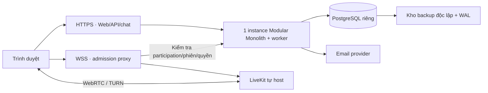

# SCDC — Kiểm thử nghiệm thu, phát hành và vận hành

Cập nhật: 2026-10-04. Phạm vi: SCP-008, SUC-006 và yêu cầu chất lượng xuyên tính năng.

Kế hoạch chuẩn bị; chưa có kết quả nghiệm thu/phát hành được ghi nhận. Compose hiện tại là cấu hình Development. Các điều kiện vận hành còn phải chốt tại OQ-007/OQ-010/OQ-011.

## Mục lục

- [Kiểm thử và nghiệm thu](#testing)
- [Chuẩn bị phát hành](#release)
- [Vận hành và khôi phục](#operations)
- [Thông tin cần chốt](#gaps)

## 1. Kiểm thử và nghiệm thu

### Phạm vi kiểm chứng

Thái chuẩn bị và điều phối kiểm thử, Vg và Sáng rà soát tình huống liên
quan đến UX, backend và kiến trúc. Kết quả kiểm thử phải nối tới mã tiêu
chí chấp nhận, môi trường, dữ liệu thử, phiên bản sản phẩm và lỗi phát hiện.
Không coi tiêu chí dự thảo là đã đạt khi chưa có kết quả thực thi.
Bộ ca và dữ liệu chuẩn bị cho tài khoản/DM/quyền phòng tại
[SCDC-QA-DM-001](features/direct-messaging.md#tests); các ca TC trong đặc tả chưa có kết quả chạy được ghi nhận; repo có bộ test tự động được mô tả trong hướng dẫn phát triển.

| Nhóm | Tình huống cần kiểm chứng | Căn cứ |
|---|---|---|
| DM chức năng | Tìm theo hai trường, chọn đúng người, gửi/lưu/xem lại, sửa/xóa, lỗi gửi và chủ động thử lại; từ chối gửi khi email chưa xác minh. | AC-DM-01 đến AC-DM-18 |
| DM kết nối | A gửi khi B chưa mở ứng dụng; B thấy tin đã lưu khi mở lại. Kết quả lần đầu không rõ, thử lại cùng thao tác chỉ một tin. | AC-DM-07, AC-DM-08 |
| Cộng đồng | Chỉ tìm được cộng đồng công khai; vào ngay/chờ duyệt; mời hợp lệ/hết hạn/thu hồi; quyền tạo mời, duyệt, tạo phòng; vào cộng đồng riêng tư và tự rời. | AC-COM-01 đến AC-COM-11, AC-COM-19 đến AC-COM-21, AC-COM-29 đến AC-COM-31 |
| Phòng/tin | Quyền xem mặc định, thành viên mới thấy lịch sử, người có quyền xem được gửi sau xác minh email, chủ sở hữu/người được cấp quyền đổi danh sách xem, gửi lại không trùng và từ chối thao tác trái quyền ở API. | AC-COM-11 đến AC-COM-18, AC-COM-22 đến AC-COM-28 |
| Tài khoản | Đăng ký với email/tên tài khoản/tên hiển thị/mật khẩu, đăng nhập bằng email hoặc tên tài khoản; chưa xác minh bị từ chối gửi, đặt lại mật khẩu qua email. Chính sách phiên/mật khẩu/gửi lại đã chốt DEC-063–067; còn email/resend/rate limit và ACC-GAP cần kiểm chứng. | AC-ACC-01 đến AC-ACC-19, OQ-002 |
| Media | Gọi riêng cần chấp nhận, phòng thoại vào theo quyền xem, nhiều nguồn chia sẻ đồng thời, tự kết nối lại; quyền thiết bị và tải dự kiến. Đã có trạng thái, giới hạn 10/20/2, timeout/reconnect 30 giây và TC-MEDIA; đã chọn LiveKit tự host và ngưỡng DEC-084/085; chưa có kết quả thử. | AC-MEDIA-01 đến AC-MEDIA-14; chờ OQ-006/OQ-007 |
| Vận hành | Cài đặt/triển khai, giám sát, sao lưu/khôi phục, lỗi dịch vụ và mở đăng ký công khai. | Chờ OQ-007/OQ-010/OQ-011 và SCP-008 |

### Ma trận hỗ trợ và mục tiêu đo đã xác nhận

DEC-082: desktop Chrome/Edge/Firefox/Safari, hai phiên bản ổn định gần nhất tại lúc khóa build nghiệm thu; điện thoại Chrome Android/Safari iOS cho Accounts/DM/Community; media MVP chỉ cam kết desktop. Thái ghi OS, thiết bị, kích thước viewport, phiên bản browser, build và ngày khóa ma trận. Kiểm tra bàn phím/IME, focus, thông báo lỗi, cuộn và trạng thái thiết bị; hai kích thước wireframe không thay thế ca trên thiết bị thật.

| Chỉ số | Mục tiêu | Điều kiện/cách ghi nhận |
|---|---|---|
| API / gửi→lưu | p95 ≤500 ms | DEC-083; đo API client request→response; gửi→lưu từ thao tác gửi đến commit theo trace được hiệu chỉnh đồng hồ, không dùng createdAt làm commit time |
| Lưu→hiển thị online | p95 ≤1 giây | Commit timestamp→UI merge/render; người nhận online và subscribe hợp lệ; tin nhận offline đo riêng hành vi lịch sử |
| Lỗi dịch vụ chat | <1% | Unexpected 5xx/timeout trên request hợp lệ; 4xx của ca cố ý sai tách riêng, không che bằng loại mọi request lỗi |
| Thu hồi chat đang mở | ≤5 giây | Từ commit thu hồi phiên/quyền đến lúc connection không nhận nội dung mới; request HTTP mới kiểm tra trạng thái hiện hành |
| Tính đúng | Không mất/trùng tin, không truy cập trái quyền | Lost response, concurrent commit, replay, worker dừng, sửa/xóa/reconnect và third-party access; một lỗi làm ca không đạt |
| Vào cuộc gọi | p95 ≤5 giây; thành công ≥99% | DEC-085; từ join/accept sau quyền thiết bị đến connected/nhận luồng; ≥100 lần hợp lệ, ca busy/full/cố ý từ chối quyền đo riêng |
| Độ trễ media | Audio p95 ≤300 ms; video/share p95 ≤500 ms | Dùng tín hiệu âm thanh và frame timestamp thử, không nội dung người dùng; ghi độ lệch đồng hồ/phương pháp đo |
| Hình ảnh | Camera mục tiêu 720p/30fps; share 720p/15fps | Mạng mỗi máy upload ≥10/download ≥20 Mbps, RTT ≤100 ms, loss ≤1%; ghi resolution/FPS thực tế và tỷ lệ thời gian đạt, không suy từ cấu hình capture |
| Khôi phục DB | RPO ≤15 phút; RTO ≤4 giờ; backup 30 ngày | DEC-086; đo trên restore thực tế và dữ liệu marker, không chỉ trạng thái job backup |

Kịch bản chat theo DEC-083: 100 người online liên tục 60 phút sau warm-up 5 phút; riêng các ca chức năng âm tính/fault injection có nhãn. Workload kỹ thuật đề xuất: 1.000 tài khoản, 500 DM, 20 cộng đồng/50 phòng text và 100.000 tin preload, trong đó hai hội thoại/phòng có ít nhất 10.000 tin để thử nhiều trang. Trong 100 người online, 80 người ở 40 DM và 20 người ở các phòng có đúng quyền; mỗi người gửi một tin/10 giây, khoảng 10 tin/giây và 36.000 tin mới trong 60 phút. Mỗi client tải trang lịch sử/30 giây; chèn sửa/xóa một tin của chính mình/5 phút. Ghi độ dài nội dung/thời điểm, không dùng tài khoản/DM thật.

Test correctness/fault tách các mốc mất response, transaction rollback, worker dừng 30 giây, reconnect, concurrent send/edit/delete và revoke trong khi stream; không loại lỗi bất thường do hệ thống gây ra khỏi báo cáo. Đối soát toàn bộ operation ID/message ID, nội dung hiện hành, tombstone và quyền với số thao tác hợp lệ đã commit. Ghi CPU/RAM/DB/NIC, region, số connection và concurrency từng bước; báo p50/p95/p99/số mẫu/tỷ lệ lỗi/backlog. Đồng hồ test phải được hiệu chỉnh và độ lệch ghi trong báo cáo. Workload này là baseline để nhóm rà soát, không suy 100 online là mọi hình thức tải đều đã thử.

Kịch bản media đề xuất: phòng A 10, phòng B 8 và một DM hai người, tổng 20; thử mic/camera toàn bộ, hai màn hình/phòng và hai màn hình cuộc gọi riêng. Chạy 60 phút và thử join đầy/reconnect riêng. Mạng yếu ngoài điều kiện DEC-085 vẫn phải có trạng thái giảm chất lượng/lỗi/reconnect rõ, không suy ngưỡng good-network thành cam kết mọi mạng. Chưa có kết quả đo cho các mục tiêu này.

### Các cấp kiểm thử

| Cấp | Mục đích | Điều kiện ghi kết quả |
|---|---|---|
| Thành phần | Quy tắc quyền theo vai trò/ngoại lệ cá nhân, nội dung 2.000 ký tự, chuyển trạng thái tin, xử lý mời/yêu cầu và ngoại lệ dữ liệu. | Có trường hợp đúng/sai, dữ liệu biên và kết quả rõ. |
| Tích hợp | Web–API–dịch vụ–dữ liệu; cập nhật thời gian thực và tải lại lịch sử; quyền đổi trong phiên. | Có môi trường tích hợp và định danh bản chạy. |
| Hệ thống | Hành trình người dùng đầu đến cuối trên trình duyệt được hỗ trợ. | Tài khoản/DM cần desktop và trình duyệt điện thoại theo DEC-059; ma trận đã chốt DEC-082; ghi phiên bản/thiết bị/build thực tế của lần chạy. |
| Chất lượng/vận hành | Tải, lỗi mạng, sao lưu/khôi phục, giám sát và chất lượng cuộc gọi. | Có ngưỡng đo và mức tải được xác nhận, không dùng giả định quy mô làm tiêu chí đạt. |
| Nghiệm thu | Đại diện khách hàng thực hiện hoặc xác nhận kịch bản trọng yếu. | Ghi rõ đạt/chưa đạt, lỗi tồn, người và ngày xác nhận. |

### Bộ tình huống ưu tiên để chuẩn bị dữ liệu

1. Hai tài khoản không cùng cộng đồng: tìm người, mở DM, gửi tin, đăng
   xuất người nhận, gửi tiếp, đăng nhập lại và đọc lịch sử.
2. Gửi thất bại, người gửi bấm thử lại; xác nhận không có hai bản tin khi
   kết quả lần gửi đầu không rõ, cả trong DM và phòng.
3. Sửa/xóa tin của mình trong DM và trong phòng; tài khoản khác thử cùng
   thao tác bằng API. Kiểm tra nội dung hiển thị trên hai phiên.
4. Hai cộng đồng có chế độ tham gia khác nhau; liên kết mời hợp lệ, hết
   hạn; chủ sở hữu, người có quyền và thành viên thường thử tạo mời/duyệt.
5. Phòng mới hiện cho mọi thành viên; thành viên mới đọc được lịch sử cũ;
   người có quyền xem gửi được tin. Sau khi giới hạn quyền, thành viên
   mất quyền không đọc được lịch sử hay nhận cập nhật qua kết nối mở.
6. Khi media được đặc tả, thử quyền micro/camera, cuộc gọi riêng, phòng
   nhiều người, chia sẻ màn hình, ngắt mạng và khôi phục.

### Điều kiện nghiệm thu dự kiến

Trước mỗi đợt bàn giao cần có: tiêu chí chấp nhận đã được xác nhận, môi
trường và dữ liệu thử, kết quả chạy, danh sách lỗi với mức độ và quyết
định xử lý. Trước phát hành công khai cần thêm kết quả phân quyền, kiểm
thử tải/media theo ngưỡng đã chốt, khôi phục dữ liệu, tài liệu vận hành
và người nhận hỗ trợ. Chất lượng và trình duyệt đã chốt DEC-082/083/085; mức lỗi tồn được phép và người ký nghiệm thu còn phải xác định; chưa thể tuyên bố
đạt điều kiện phát hành.

Đợt hiện tại không khảo sát người dùng bên ngoài theo DEC-030. Việc đó
không thay thế kiểm thử khả dụng nội bộ, kiểm thử hệ thống hoặc nghiệm
thu của đại diện khách hàng.

### Mẫu ghi nhận kết quả

| Trường | Nội dung phải ghi |
|---|---|
| Mã tình huống và yêu cầu | AC-*, SCP-* hoặc OQ-* đã được giải quyết. |
| Bản chạy/môi trường | Phiên bản triển khai, trình duyệt, thiết bị và dữ liệu thử. |
| Kết quả | Đạt/chưa đạt/chưa chạy; bằng chứng và thời điểm. |
| Lỗi và xử lý | Mã lỗi, mức ảnh hưởng, người phụ trách và kết quả kiểm tra lại. |
| Xác nhận | Người thực hiện và người xác nhận theo cấp kiểm thử. |

Ca chi tiết được quản lý tại [Accounts](features/accounts.md#tests), [DM](features/direct-messaging.md#tests), [Community](features/community.md#tests) và [Media](features/voice-video.md#acceptance). Một ca phụ thuộc quy tắc chưa chốt phải ghi “Chờ chốt quy tắc”. Các trạng thái Đạt/Chưa đạt/Chưa chạy gắn với build và lần thực thi, không chỉ với sự tồn tại của file test.

## 2. Chuẩn bị phát hành

MVP triển khai Modular Monolith theo DEC-060. Nơi host, topology, domain, tài nguyên và người vận hành chưa được chốt. Các mục dưới đây là đầu ra cần chuẩn bị, không phải hướng dẫn deployment production đã được kiểm chứng.

### Topology MVP đề xuất

Phương án ban đầu dùng một API instance để giữ thu hồi/định tuyến chat trong một tiến trình; frontend static cùng lớp HTTPS. PostgreSQL và LiveKit dùng tài nguyên tách khỏi API; TURN có thể cùng node media khi kiểm thử đủ tải. DB và API điều khiển nội bộ không mở công khai; signaling SFU chỉ nhận qua admission proxy, cấu hình WebRTC/TURN theo [ports/firewall LiveKit](https://docs.livekit.io/transport/self-hosting/ports-firewall/). Staging tách DB/secrets/domain và dữ liệu khỏi production; bản backup nằm ở kho độc lập với node DB.

Topology này ưu tiên ít thành phần cho MVP, chưa đáp ứng HA khi một node lỗi. Chọn region gần nhóm thử, định cỡ CPU/RAM/đĩa/băng thông qua workload dưới đây, rồi mới khóa nhà cung cấp, domain, email và báo giá. Key ring cursor/envelope và cấu hình phục hồi phải tồn tại qua deploy/restart; không ghi khóa/token trong repo. Không có thay đổi compose hoặc hạ tầng được thực hiện trong lần cập nhật tài liệu này.

### Trình tự phát hành để diễn tập

1. Khóa commit/build, các phiên bản môi trường và cấu hình không chứa secrets; lập danh sách migration và compatibility với bản ứng dụng trước.
2. Kiểm tra backup/WAL mới nhất, restore evidence và quyền người thực hiện. Migration theo cơ chế được chọn, không chạy script tạo lại toàn schema trên dữ liệu thật.
3. Triển khai staging, chạy smoke Accounts/DM/Community/Media đúng scope và các ca quyền; kiểm tra key ring qua restart, email thật tới tài khoản thử và đường signaling không bypass admission.
4. Người có thẩm quyền xem kết quả/lỗi tồn, xác nhận thời điểm phát hành. Trong cửa sổ phát hành, áp migration rồi triển khai artefact; tạm ngừng ghi nếu migration yêu cầu, theo plan đã diễn tập.
5. Chạy smoke production bằng tài khoản thử, xem lỗi/độ trễ/outbox/thu hồi/backup. Mở đăng ký công khai sau khi các điều kiện bàn giao đạt và đầu mối hỗ trợ đã nhận việc.
6. Nếu smoke trọng yếu thất bại hoặc có truy cập trái quyền, ngừng mở đăng ký/ghi ảnh hưởng, rollback ứng dụng khi schema tương thích. Migration không đảo được cần forward fix hoặc restore có kế hoạch; restore mất các thay đổi sau recovery point phải được người có thẩm quyền chấp nhận.

Mỗi lần diễn tập ghi người thực hiện, mốc thời gian, commit/schema trước/sau, lệnh thực tế và bằng chứng. Trình tự này là runbook thiết kế; thiếu provider/manifest/migration thì chưa phải hướng dẫn production có thể chạy nguyên văn.

| Đầu ra | Điều kiện cần có |
|---|---|
| Bản phát hành | Commit/build, artefact, cấu hình môi trường và phạm vi bàn giao |
| Cấu hình production | Connection string, signing key, CORS, HTTPS và token Development tắt; cách quản lý cấu hình/quyền truy cập |
| Database | Quy trình migration, sao lưu trước thay đổi, kiểm tra tương thích và cách phục hồi |
| Email | Provider/worker, token/liên kết gửi được, retry và trạng thái giao; kiểm thử verify/reset thật |
| Media | Kết quả thử, giới hạn/chất lượng/chi phí và ma trận trình duyệt đã xác nhận |
| Kiểm tra sau triển khai | Health, kết nối DB, đăng ký/xác minh/login, hành trình tin/quyền và media theo scope |
| Rollback | Điều kiện kích hoạt, người quyết định, phiên bản ứng dụng/dữ liệu có thể quay lại và bằng chứng thử |
| Bàn giao | Kết quả nghiệm thu, lỗi tồn được xử lý, hướng dẫn, người trực và quyết định mở công khai |

Không chạy production bằng cấu hình Development của compose hiện tại hoặc dùng script tạo lại schema như migration dữ liệu thật. Hướng dẫn local ở [development.md](development.md#setup).

## 3. Vận hành và khôi phục

| Phạm vi | Nội dung cần thiết kế và thử |
|---|---|
| Quan sát | Độ trễ/tỷ lệ lỗi API, số kết nối, backlog outbox/email, lỗi media, tải và chi phí |
| Log | Request/trace ID, mã lỗi, thời lượng; không ghi mật khẩu/token/liên kết email/nội dung chat |
| Thu hồi | Phiên/quyền thay đổi chặn HTTP và kết nối cập nhật theo thời hạn được chốt |
| Sao lưu | Lịch, thời hạn giữ, quyền truy cập, bảo vệ bản sao và chính sách xóa |
| Khôi phục | Thử restore, đo mức mất dữ liệu/thời gian phục hồi; ghi môi trường, build, thao tác và bằng chứng |
| Sự cố | Đầu mối nhận, mức độ, ngưỡng cảnh báo, cách xử lý và ghi nhận nguyên nhân/hành động |
| Hỗ trợ/quản trị | Ai hỗ trợ tài khoản, xử lý vi phạm, xem dữ liệu vận hành và xác nhận thay đổi |

Health hiện tại không kiểm tra DB. Cần phép kiểm tra thực sự cho phụ thuộc và hành trình sau deploy. Độ trễ hoặc khả năng khôi phục chỉ được ghi thành kết quả khi có cấu hình đo và bằng chứng.

### Quy trình backup/restore cần triển khai

Mục tiêu đã chốt DEC-086; công cụ/kho lưu trữ chưa chọn. Phương án kỹ thuật: base backup hằng ngày, WAL liên tục, cưỡng bức chuyển segment tối đa mỗi 5 phút để cả tải ít cũng tạo bản lưu, cộng cảnh báo trễ để đáp ứng RPO 15 phút. Theo [PostgreSQL 18 về continuous archiving](https://www.postgresql.org/docs/18/continuous-archiving.html), phục hồi cần base backup và chuỗi WAL đầy đủ; dump logic không thay thế base backup cho PITR. Các bước dưới đây chưa được chạy trên production.

1. Lập base backup định kỳ cộng WAL archiving liên tục tới kho riêng với quyền tối thiểu và mã hóa. Theo dõi thời điểm WAL đã lưu thành công, backlog và lỗi; cấu hình cadence để RPO không vượt 15 phút. Giữ chuỗi base/WAL đủ khôi phục mọi mốc trong cửa sổ 30 ngày, không xóa WAL mà một base backup còn cần.
2. Backup chứa dữ liệu tài khoản/tin hiện tại và có thể còn bản nội dung trước sửa/xóa. DEC-070 không tự giữ backup vô hạn; DEC-052 và DM-005 về nội dung đang phục vụ không tự xóa mọi bản backup. Khi restore phải áp lại các yêu cầu xóa/thu hồi sau mốc restore trước khi mở truy cập; cách lưu sổ yêu cầu độc lập còn cần thiết kế.
3. Diễn tập trên môi trường riêng: ghi build/schema và dữ liệu marker, chọn recovery time, restore base rồi replay WAL, kiểm tra consistency/unique key, Identity, lịch sử, outbox và quyền. Không phát lại email/thông báo cũ cho người dùng thật trong diễn tập.
4. Đo RPO từ thời điểm sự cố đến marker mới nhất khôi phục được; đo RTO từ lúc xác nhận sự cố đến khi các hành trình sau restore đạt kiểm tra. Ghi dữ liệu thiếu, thời gian mỗi bước, ảnh hưởng cấu hình/secrets/key ring và người xác nhận.
5. Khi sự cố thật, người vận hành cô lập ghi mới, chọn recovery point, ghi quyết định, restore và kiểm tra trước mở lại; nếu schema/build không tương thích phải dùng cặp phù hợp. Không dùng `schema.sql` tạo lại toàn bộ thay quy trình khôi phục.

Thử restore trước phát hành và sau thay đổi lớn về schema/topology; lịch định kỳ và người phụ trách cần chốt trong vận hành. Không tuyên bố đạt RPO/RTO chỉ từ RPO cấu hình hoặc backup tồn tại.

### Quan sát và xử lý sự cố đề xuất

Ngưỡng cảnh báo dưới đây là cấu hình vận hành để thử, không thay mục tiêu nghiệm thu đã chốt:

| Tín hiệu | Cảnh báo đề xuất | Hành động đầu tiên |
|---|---|---|
| API/chat | p95 vượt 500 ms hoặc lỗi bất thường ≥1% trong 5 phút | Kiểm tra dependency, trace, DB lock và backlog; tách lỗi validation khỏi 5xx |
| Thu hồi | Connection còn nhận nội dung quá 5 giây sau commit | Ngừng định tuyến phần ảnh hưởng, cô lập nguyên nhân, ghi sự cố truy cập |
| Outbox chat/email | Sự kiện cũ nhất chưa xử lý >60 giây / delivery sắp hết hạn | Kiểm tra lease/worker/provider; không phát lại mutation gửi tin |
| WAL/backup | Điểm dữ liệu đã lưu trễ >10 phút hoặc backup ngày thất bại | Kiểm tra kho lưu, network và dung lượng; khôi phục archiving trước khi vượt RPO |
| Dung lượng | Đĩa DB/backup dùng >80%, >90% là khẩn | Dự báo tốc độ tăng, mở rộng/dọn theo retention; không xóa WAL đang cần |
| Media | Kết nối hợp lệ thất bại >1% hoặc slot không được giải phóng | Kiểm tra SFU/TURN/admission/coordinator; dừng cấp mới nếu không xác nhận được quyền |

Sự cố cần một hồ sơ gồm thời điểm phát hiện, phạm vi/người bị ảnh hưởng, mức độ, người đang xử lý, hành động/các quyết định và bằng chứng phục hồi. Mức 1: truy cập trái quyền/mất dữ liệu/dịch vụ chính ngừng; mức 2: hành trình chính lỗi trên một phần tải/thiết bị; mức 3: lỗi nhẹ có cách tiếp tục. Tên người trực, giờ trực và thời hạn phản hồi chưa được chốt; không coi đây là SLA hỗ trợ 24/7.

Quy trình: xác nhận/cô lập ảnh hưởng → kiểm tra trace và dependency → giảm ảnh hưởng hoặc rollback/restore theo runbook → kiểm tra hành trình và toàn vẹn → ghi nguyên nhân/hành động ngăn lặp. Không thu thập nội dung DM/âm thanh/hình ảnh để làm log điều tra mặc định. Thu hồi session đang bị ảnh hưởng và dừng email/thông báo cũ khi restore theo chính sách đã chốt.

### Phạm vi quản trị và hỗ trợ đang chờ quyết định

Ngày 2026-10-04 người dùng chưa chắc về đề xuất Vg nhận hỗ trợ sản phẩm, Sáng nhận hạ tầng/sự cố/backup, Thái kiểm tra phát hành. Chưa ghi các thành viên là đã nhận trách nhiệm vận hành. Đề xuất chưa có UI quản trị riêng và khóa tài khoản qua thao tác kỹ thuật có audit cũng đang chờ xác nhận phạm vi.

Khi xử lý khóa tài khoản, runbook dự kiến ghi actor, user ID, lý do, thời điểm, trạng thái trước/sau và thu hồi mọi phiên/chat/media; mở khóa không tự khôi phục phiên cũ. Không mở quyền đọc DM/sửa hoặc xóa tin thay tác giả từ việc có quyền vận hành. Khôi phục tài khoản chỉ qua email đã đăng ký theo DEC-067; vấn đề mất email không có quy trình khôi phục thủ công trong MVP.

## 4. Thông tin cần chốt

- OQ-007: mục tiêu chất lượng/trình duyệt/thu hồi chat đã chốt; còn OS/thiết bị/build, workload, mức lỗi tồn, thu hồi media và bằng chứng.
- OQ-010: có [mô hình chi phí minh họa](project.md#budget); còn nơi triển khai, tài nguyên, mức dùng thực tế, báo giá và hạn mức.
- OQ-011: RPO/RTO/backup 30 ngày đã chốt; còn công cụ/topology, yêu cầu xóa sau restore, quản trị/hỗ trợ và bằng chứng.
- OQ-008: migration, email worker, tích hợp LiveKit tự host và cơ chế realtime/thu hồi cần thiết kế.

Vg chủ trì xác nhận sản phẩm/kỹ thuật, Sáng đánh giá triển khai, Thái điều phối kiểm thử theo phân công hiện tại. Người trực vận hành, người ký nghiệm thu và thẩm quyền mở công khai cần xác định cụ thể trước phát hành; không tự coi phân công dự kiến là đã nhận việc.
