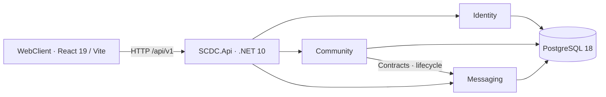

# SCDC — Kiến trúc hệ thống

Đối chiếu source `main` sau khi hợp nhất Community ngày 2026-10-08. MVP dùng một API host Modular Monolith; microservice thuộc v1 theo DEC-116. Phương án mục tiêu chưa được triển khai.

## Mục lục

- [Hệ thống hiện tại](#current)
- [Ranh giới dữ liệu](#boundaries)
- [Kiến trúc mục tiêu](#target)

## Hệ thống hiện tại

Compose có WebClient, API và PostgreSQL. Worker email, Hub và Media chưa có runtime trong stack này. Health endpoint hiện không kiểm tra DB.

Nguồn: [Program.cs](../../services/SCDC.Api/Program.cs), [Compose](../../compose.yaml), [HealthController](../../services/SCDC.Api/Controllers/HealthController.cs). Cấu hình và topology tại [môi trường](environments.md); thao tác tại [hướng dẫn phát triển](../guides/development.md).

## Ranh giới dữ liệu

| Module | Trách nhiệm | Schema / hợp đồng |
|---|---|---|
| Identity | Danh tính, hồ sơ, mật khẩu, xác minh và phiên | `identity`; `IUserDirectory`, `IAccountAccessGuard` |
| Community | Server, membership, invitation, channel và quyền | `community`; `IChannelAccessGuard` |
| Messaging | DM, tin phòng, lịch sử, chống trùng và realtime | `messaging`; `IChatSpaceLifecycle`, `IRealtimeAccessRevoker` |
| Media — mục tiêu v1 | Call, room, participation, nguồn phát và quota | Schema/interface còn đề xuất; xem [Media](../features/media/README.md) |

Các interface được đối chiếu tại [SCDC.Contracts](../../services/SCDC.Contracts). Có interface không chứng minh consumer hoặc runtime đầy đủ đã tồn tại; trạng thái theo khả năng nằm trong từng chủ đề.

Mỗi module chỉ đọc/ghi dữ liệu mình sở hữu. Lời gọi liên module qua Contracts; không tham chiếu implementation hoặc JOIN trực tiếp bảng module khác trong mã ứng dụng. Các view quan sát SQL không thay hợp đồng nghiệp vụ. Prefix API và vị trí tài liệu không quyết định module sở hữu dữ liệu.

MVP có thể dùng transaction trong cùng host theo hợp đồng đã chốt. Khi tách service phải thay giả định shared transaction/row lock bằng hợp đồng mạng và chính sách nhất quán phù hợp. Chi tiết tại [backend](backend.md), [database](database.md), [tích hợp Community](community.md) và [thu hồi truy cập](access-revocation.md).

## 5. Mục tiêu microservice và định hướng

DEC-116 chốt MVP một API host và chuyển microservice ở v1; DEC-115 giữ lịch sử thời điểm đã thay thế. Môn học không bắt buộc số service, Gateway, broker hoặc Kubernetes. Ranh giới dưới đây là **đề xuất cho v1 để rà soát**, chưa phải kiến trúc đã được Vg chọn hoặc code đã triển khai. MVP giữ module/dữ liệu/hợp đồng rõ để giảm công sức chuyển đổi, không cần tách API hoặc DB trước bàn giao.

| Thành phần đề xuất | Phạm vi | Dữ liệu/triển khai |
|---|---|---|
| Identity API | Tài khoản, xác thực, phiên, thông tin user | Sở hữu Identity DB; API ở tiến trình và artefact riêng |
| Chat API | Hai module Community và Messaging | Sở hữu Chat DB; API ở tiến trình và artefact riêng; giữ giao dịch Community–Messaging trong cùng ranh giới |
| Email Worker | Gửi email theo job/policy của Identity | Tiến trình backend thuộc ranh giới Identity, không tự tính thành microservice nghiệp vụ thứ ba |
| WebClient và lớp định tuyến | Frontend dùng chung; HTTP và realtime tới API tương ứng | Có thể tận dụng Nginx và Docker Compose hiện có |

Đề xuất dùng một PostgreSQL instance với hai database/tài khoản DB riêng cho hai API. Service khác dùng API/hợp đồng, không đọc trực tiếp DB. Chưa tạo database, host hoặc sửa compose trong lần tổ chức tài liệu này.

Trước khi chọn và triển khai, cần:

- Tách bootstrap/controllers/build/config của Identity khỏi Chat; chốt xác thực giữa service và thông tin user cần trao đổi.
- Rà soát FK/JOIN giữa Identity với Community/Messaging trong SQL hiện tại; chốt dữ liệu tham chiếu và migration cho từng service.
- Thay thiết kế shared transaction/row lock xuyên Identity với Chat bằng chính sách/hợp đồng phù hợp, gồm thu hồi phiên/quyền và hành vi khi service không liên lạc được. Một lần kiểm tra HTTP không tự bảo đảm quyền còn đúng tới commit.
- Kiểm chứng chạy/build/restart API độc lập, luồng người dùng, lỗi mạng, dữ liệu và scope quyền trên bản tích hợp.

v1 chuyển nền một host của MVP theo ranh giới được chọn, giữ hồi quy Identity/Community/DM, rồi hoàn thiện tính năng và media. [Các gói V1-ARCH](../releases/v1.md) chia Vg thiết kế/Identity/Community, Sáng Messaging, Thái môi trường/định tuyến/CI; không dồn toàn bộ chuyển đổi cho trưởng nhóm. Việc tách thêm service cần quyết định và công sức riêng.

| Phương án từng được nêu | Tình trạng |
|---|---|
| YARP Gateway, gRPC/HTTP và RabbitMQ | Định hướng tách dịch vụ; chưa có triển khai hoặc lịch được xác nhận |
| SignalR | Đã chọn cho DM/tin phòng theo DEC-081; chưa có Hub trong backend hiện tại |
| Redis Backplane | Dành cho scale-out realtime khi có quyết định; tách Identity và Chat không tự yêu cầu nhiều instance Hub hoặc Redis |
| MinIO / presigned upload | Phương án file ở đợt sau; chưa có lựa chọn triển khai được duyệt |
| LiveKit SFU tự host | Đã chọn DEC-084; có Media contract/lease/quota-gate design, còn extension/proof/build pin; chưa có service/manifest |
| Kubernetes và k6 | Công cụ từng được đề xuất; chưa có manifest hoặc kịch bản tải trong repo |

Không dùng cổng 5000–5004 hoặc các schema `files`/`calls` trong sơ đồ hiện tại như hạ tầng đã tồn tại. LiveKit tự host và giới hạn media đã chọn DEC-079/084; admission, chi phí và chất lượng vẫn cần thử nghiệm. Mở rộng ngang và ngưỡng hiệu năng phải có phép đo cụ thể.
