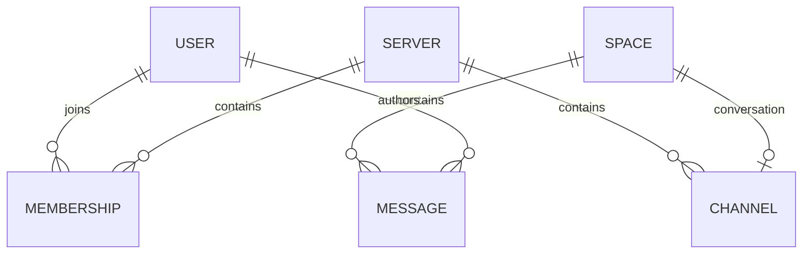

# SCDC — Thiết kế database

## Phạm vi và nguồn

MVP dùng PostgreSQL 18, một database chia schema theo module. [schema.sql](../../database/postgres/schema.sql) là nguồn DDL bootstrap; [migrations](../../database/postgres/migrations) và [DbMigrator](../../tools/SCDC.DbMigrator) giữ thay đổi explicit. Có bảng SQL không chứng minh tính năng tương ứng đã triển khai.

| Schema | Chủ sở hữu / mục đích |
|---|---|
| `identity` | Identity: user, profile, credential, phiên và token |
| `community` | Community: server, membership, channel, role/ACL và invitation |
| `messaging` | Messaging: space, participant, message và operation |
| `integration` | Outbox/inbox theo module phát sinh sự kiện |
| `audit` | Sự kiện bảo mật và quản lý |
| `moderation` | Bảng nền trong SQL; nghiệp vụ chưa tự thuộc scope v1 |
| `common` | Hàm/trigger SQL dùng chung |

## Quan hệ nghiệp vụ

Sơ đồ biểu diễn quan hệ nghiệp vụ, không thay DDL/FK hoặc áp dụng cho mọi loại space. DM có participant riêng. Quyền sở hữu và lời gọi liên module tại [architecture](architecture.md#boundaries); sơ đồ không cấp quyền đọc trực tiếp schema khác.

## Quy ước

- ID, timestamp UTC, version/CAS và khóa chống trùng phải thống nhất với [API](api-conventions.md) và hợp đồng máy đọc.
- Tài liệu chủ đề giữ model, bất biến, quan hệ, constraint/index cần thiết và ý nghĩa migration. SQL giữ kiểu dữ liệu và DDL thực thi; không duy trì bản DDL thứ hai trong Markdown.
- Mutation nhiều bảng xác định transaction và thứ tự khóa trước triển khai. Sự kiện outbox và dữ liệu nghiệp vụ phải giữ tính nguyên tử theo chủ đề.
- Bootstrap, migration và seed là các mục đích riêng. `schema.sql` có DROP SCHEMA; chỉ dùng khi tạo môi trường không cần giữ dữ liệu.
- Mapping Unicode/key chuẩn và nâng cấp dữ liệu legacy thuộc thiết kế của chủ đề; không suy tương đương giữa chuẩn hóa .NET và SQL khi chưa có bằng chứng.

## Migration và dữ liệu mẫu

DB mới dùng schema/seed theo Compose. DB cũ áp migration explicit; thay SQL bootstrap không tự cập nhật volume có sẵn. Runner Community giữ ledger/checksum và mapping legacy theo [hướng dẫn Community](../guides/community-development.md#migration).

`seed.sql` dùng dữ liệu minh họa; password/token mẫu không dùng đăng nhập. Test tích hợp dùng DB riêng và fixture theo bộ chạy. Hướng dẫn kết nối/quan sát tại [PostgreSQL README](../../database/postgres/README.md).

## Vòng đời và mục tiêu v1

Retention, xóa/restore và DATA-GAP tại [vòng đời dữ liệu](data-lifecycle.md). Khi chuyển service phải rà soát FK/JOIN xuyên schema, dữ liệu tham chiếu và cơ chế nhất quán. Phương án DB riêng theo service chưa triển khai; xem [kiến trúc mục tiêu](architecture.md#target).
